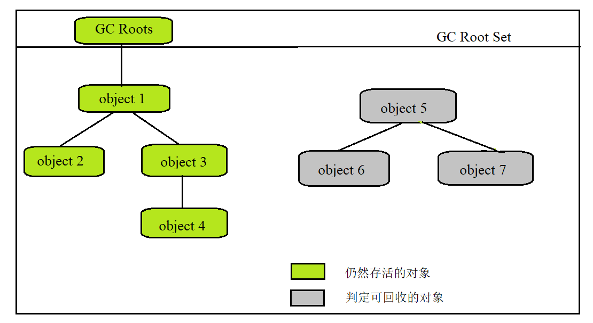

[toc]

# 一、判断对象是否存活的算法

## 1、引用计数算法

特点：判断对象存活，在对象中添加一个引用计数器，每当有一处引用它，计数加一，引用失效则计数减一。计数为0，则表示该对象不能被使用。

优点：虽然占用一些额外的内存空间进行计数，但原理简单，判定效率较高。

缺点：单纯的引用计数很难解决对象之间相互循环引用的问题，往往需要配合大量额外的处理。 

## 2、可达性算法分析

特点：通过一系列名为GC Roots的根对象作为起始节点集，从这些节点开始，根据引用关系向下搜索，如果某个对象到GC Roots间没有任何引用链（不可达）时，证明此对象是可回收的。

## 3、再谈引用

>  引用计数算法和可达性算法，判断对象是否存活的两种方法都与**引用**离不开关系。

JDK1.2之前对引用的定义是：如果reference类型的数据中存储的数值代表的是另外一块内存的起始地址，就称该reference数据代表的是某块内存、某个对象的引用。

JDK1.2之后对原先较为狭隘的概念进行了扩充：将引用分为以下四种，强度由高到低逐渐减弱。

- 强引用（Strongly Reference）：即通常说的引用定义，`Object o = new Object();`
- 软引用（Soft Reference）：描述还有用，但不是必须的对象，**系统将要发生内存溢出异常前，将会把软引用关联的对象列入回收范围进行二次回收**，可以通过SoftReference实现软引用。
- 弱引用（Weak Reference）：描述非必须的对象，强度较软引用要弱。弱引用关联的对象只能生存到下一次垃圾收集发生为止，也就是说，**只要垃圾收集器开始工作，不管你内存是不是足够，弱引用关联的对象都会被回收**，可以通过WeakReference实现。
- 虚引用（Phantom Reference）：最弱的引用，无法通过该引用获取一个对象实例，**设置该引用指示为了能在这个对象被回收时受到一个系统通知**，可以通过PhantomReference实现。

## 4、对象啥时候死亡

对象在进行可达性分析后发现没有与GC Roots相连接的引用链，将会被第一次标记，随后进行依次筛选，筛选的条件是此对象是**否有必要执行finalize()方法**，以下两种情况都是判定为没有必要执行finalize方法：

- 对象没有覆盖finalize()方法。
- finalize()方法已经被虚拟机调用过。

如果说有必要执行finalize方法，该对象将被置如F-Queue队列中，并由虚拟机建立的低调度优先级的Finalizer线程去执行对象们的finalize方法。

finalize方法中，如果对象重新与引用链上的任意一个对象建立联系，则可以拯救自己，逃脱回收。

稍后收集器将对队列中的对象进行第二次小规模的标记，此时解救自己的对象将会被移除即将回收的集合。

# 二、垃圾回收算法

从如何判定对象消亡的角度出发，垃圾收集算法可以划分为：

- 引用计数式垃圾收集，被称为直接垃圾收集。
- 追踪式垃圾收集，被称为间接垃圾收集。

主流的Java虚拟机运用的是追踪式的垃圾收集算法，以下算法皆属于该算法大类。

## 1、分代收集理论

**分代收集**理论建立在两个分代假说之上：

- **弱分代假说**：绝大多数对象都是朝生夕灭的。
- **强分代假说**：熬过越多次垃圾收集过程的对象就越难消亡。

两个分代假说奠定的多款常用垃圾收集器的**设计原则**： 收集器应该将Java堆划分出不同的区域，然后将回收对象根据其年龄分配到不同的区域中存储。

划分出不同的区域，可以每次只回收部分区域，因此也产生了针对不同区域安排与里面存储对象存亡特征相匹配的垃圾收集算法，如标记-清除、标记-复制、标记整理等算法。

但按照以上的假说和推论，分代收集其实不仅仅是划分区域那么简单，因为**对象不是孤立的，之间甚至可能存在跨代引用的情况**，并且在垃圾收集的时候，除了固定的GC Roots之外，还需要遍历整个老年代的所有对象，才能保证可达性的完全正确，这与老年代中大多数的对象都是不需要被回收的是有矛盾的。

为了解决该问题，需要引入第三条假说，即**跨代引用假说**：跨代引用相对于同代引用来说仅占极少数。

因此，只需要在新生代上建立一个全局的数据结构（记忆集），记忆集将老年代划分成若干的小块，标识出老年代的哪一块内存会存在跨代引用，之后发生Minor GC（新生代收集）时，只有包含了跨代引用的小块内存里的对象才会被加入到GC Roots进行扫描。

## 2、标记-清除算法

最早出现、最基础的算法，Mark-Sweep。

【标记】+【清除】：首先标记出所有需要回收的对象，之后统一回收掉所有被标记的对象，或者反一下，标记存活对象，回收没被标记对象。

【缺点】：

- **执行效率不稳定**，如果Java堆中包含大量对象需要标记或清除，这个过程的执行效率会大大下降。
- **内存空间的碎片化问题**，标记或清除之后将会产生大量的不连续的内存碎片，将会导致之后在分配较大对象的时候，无法找到足够的连续内存空间而提前触发垃圾收集。

## 3、标记-复制算法

半区复制的思想，**解决标记-清除算法面对大量可回收对象时，执行效率低的问题**。

特点：将可用内存按容量划分为**大小相等**的两块，每次只使用其中一块。当这块内存用完之后，就将存活的对象复制到另外一块上面，然后将已使用过的内存空间一次性清理。

【优点】：每次都是针对整个半区进行内存回收，分配内存时不用考虑有空间碎片的复杂情况，只需要移动堆顶指针，按顺序分配即可。实现简单，运行高效。

【缺点】：将可用内存缩小为原来的一半，**空间浪费较大**；对象存活率较高时，需要进行较多的复制操作，效率降低。

### Appel式回收

**将新生代分为一块较大的Eden空间和两块较小的Survivor空间**【8：1：1】，每次分配内存只使用Eden和其中一块Survivor。大多数情况下，HotSpot虚拟机默认的Eden和Survivor的大小比例为8：1，每次新生代中可用内存空间为整个新生代容量的90%，此时只会浪费10%的空间。

当然，如果出现超过10%的对象存活，Survivor空间不足以容纳依次Minor GC之后存活的对象时，需要其他的内存区域的进行**分配担保**。

## 4、标记-整理算法

标记-整理与标记-清除算法的本质差异：前者是移动式的，后者是非移动式的。

如何体现呢，标记-整理的标记过程和标记-清除算法中的标记过程相同，但后续的操作略有不同：让所有存活的对象都向内存空间的一端移动，然后直接清理掉边界以外的内存。

【缺点】：移动大量存活对象时，操作负重。

【优点】：移动并整理对象，相较于标记-清除来说，**解决空间碎片化问题**。

# 三、HotSpot的算法细节实现

根节点枚举

安全点

安全区域

记忆集与卡表

写屏障

并发的可达性分析

# 四、经典垃圾收集器

**如果说收集算法是内存回收的方法论，那么垃圾收集器就是内存回收的具体实现。**

## Serial收集器

最基本的垃圾收集器，**针对新生代采用复制算法**。

**单线程收集器**，只使用一个CPU或一个线程去垃圾收集，**必须暂停其他所有工作线程**。【stop the world】

但**简单高效**，没有线程交互的开销。

仍是Java虚拟机运行在Client模式下默认的新生代垃圾收集器。

## ParNew收集器

Serial收集器的**多线程版本**，**针对新生代采用复制算法**。

垃圾收集过程中，需要暂停所有其他的工作线程，区别在于，**支持多个垃圾收集线程的并行收集**操作。

默认开启和CPU数目相同的线程数，但可以通过`-XX:ParallelGCThreads`来改变。

是Java虚拟机运行在Server模式下默认的新生代垃圾收集器。

## Parallel Scavenge收集器

同样是基于标记复制算法的多线程收集器，与ParNew几乎一样，区别在于关注点不同：【可控制的吞吐量】

## Serial Old收集器

**单线程标记整理算法，是Serial的老年代版本**。

是运行在 客户端模式下 默认的 java 虚拟机默认的年老代垃圾收集器。

如果在服务断，它也有另外两种用途：

1. 在 JDK1.5 以及以前的版本中与 Parallel Scavenge 收集器搭配使用
2. 作为 CMS 收集器的后备方案

## Parallel Old 收集器

JDK1.6之后提供，**是Parallel Scavenge的年老代版本，使用多线程 的标记整理算法。**

在此之前，Parallel Scavenge需要配合Serial Old收集器进行垃圾收集【没办法，那时候这哥们还没出来呢，老年代只能交给单线程的SerialOld】，只能保证新生代的吞吐量，而无法保证整体吞吐量。而Parallel Old的出现正好解决了这个问题。

> 建议：在注重吞吐量或者处理器资源较为稀缺的场合，可以优先考虑【PS和PO】

## CMS收集器！

**CMS（Concurrent Mark Sweep）收集器是一种以获取最短回收停顿时间为目标的收集器。它非常符合在注重用户体验的应用上使用。**

**CMS（Concurrent Mark Sweep）收集器是 HotSpot 虚拟机第一款真正意义上的并发收集器，它第一次实现了让垃圾收集线程与用户线程（基本上）同时工作。**

多线程的标记清除，是老年代的垃圾收集器。

主要目标是获取最短垃圾回收停顿时间。

**工作机制**：

1. **初始标记**：标记GC Roots能够直接关联的对象，需要stop the world，也就是暂停所有工作线程，但这个过程速度很快。
2. **并发标记**：进行GC Roots跟踪，和用户线程一起工作。
3. **重新标记**：在并发标记期间，用户程序可能会产生那一部分对象的变动，仍需要暂停所有的线程，但这个过程仍旧很快。
4. **并发清除**：清除GC Roots不可达对象，和用户线程一起工作。

并发标记和并发清除两个操作耗时长，且能够并发，总体来看，**CMS收集器的内存回收和用户线程是并发执行的**。

**优点**：

1. 并发收集
2. 低停顿

**缺点**：

1. 对CPU资源敏感
2. 无法处理浮动垃圾
3. 导致收集结束时会有大量空间碎片产生

## Garbage First收集器

**G1 (Garbage-First) 是一款面向服务器的垃圾收集器,主要针对配备多颗处理器及大容量内存的机器. 以极高概率满足 GC 停顿时间要求的同时,还具备高吞吐量性能特征.**

相比CMS，改进之处：

1. **基于标记-整理算法**，不产生内存碎片。
2. 可精确控制停顿时间，在不牺牲吞吐量的前提下，实现**低停顿**的垃圾回收。

避免全区域垃圾收集的具体实现：

- 将堆内存划分为大小固定的几个独立区域，并跟踪这些区域的垃圾收集进度。
- 在后台维护一个优先级列表，每次根据所允许的收集时间，优先回收垃圾最多的区域。

G1 收集器的运作大致分为以下几个步骤：

- **初始标记**
- **并发标记**
- **最终标记**
- **筛选回收**

# 五、低延迟垃圾收集器

Shenandoah收集器

ZGC收集器

# 参考

- 《深入理解 Java 虚拟机：JVM 高级特性与最佳实践（第三版》

- [https://snailclimb.gitee.io/javaguide/#/docs/java/jvm/](https://snailclimb.gitee.io/javaguide/#/docs/java/jvm/JVM%E5%9E%83%E5%9C%BE%E5%9B%9E%E6%94%B6?id=_24-%e4%b8%8d%e5%8f%af%e8%be%be%e7%9a%84%e5%af%b9%e8%b1%a1%e5%b9%b6%e9%9d%9e%e9%9d%9e%e6%ad%bb%e4%b8%8d%e5%8f%af)

  

