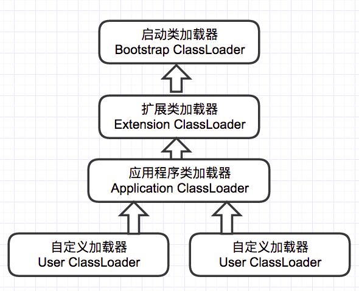

[toc]

类加载机制：Java虚拟机将描述类的数据从Class文件加载到内存，并对数据进行校验，转换解析和初始化，最终形成可以被虚拟机直接使用的Java类型。

# 类加载的时机

加载阶段合适开始，《Java虚拟机规范》并没有强制约束，交由虚拟机自己实现。

而初始化阶段，严格规定有且只有以下六种情况，如果类型没有进行过初始化，必须对类进行初始化：

- 遇到以下字节码指令：
  - new：实例化对象的时候
  - getstatic和putstatic，读取或设置一个类型的静态字段（被final修饰、已在编译期把结果放入常量池的静态字段除外）。
  - invokestatic：调用一个类型的静态方法的时候。

- 使用`java.lang.reflect`包对类型进行反射调用的时候。
- 当初始化类的时候，发现父类还没有进行初始化，则先初始化父类。
- 虚拟机启动时，会先初始化用户指定执行的主类，main方法所在类。
- 当使用JDK 7新加入的动态语言支持时，如果一个java.lang.invoke.MethodHandle实例最后的解 析结果为`REF_getStatic`、`REF_putStatic`、`REF_invokeStatic`、`REF_newInvokeSpecial`四种类型的方法句柄，并且这个方法句柄对应的类没有进行过初始化，则需要先触发其初始化。
- 当一个接口中定义了JDK 8新加入的默认方法（被default关键字修饰的接口方法）时，如果有 这个接口的实现类发生了初始化，那该接口要在其之前被初始化。 

# 类加载的过程

加载，验证，准备，解析，初始化。

## 加载

在加载阶段Java虚拟机需要完成的三件事情：

1. 通过一个类的全限定名来获取定义此类的二进制字节流。
2. 将这个字节流所代表的静态存储结构转化为**方法区的运行时数据结构**。
3. <u>在内存中生成一个代表这个类的java.lang.Class对象</u>，作为**方法区**这个类的各种数据的访问入口。

## 验证

确保Class文件的字节流中包含的信息符合《Java虚拟机规范》的全部约束要求，保证这些信息被当作代码运行后不会危害虚拟机自身的安全。

- 文件格式验证
- 元数据验证
- 字节码验证
- 符号引用验证

## 准备 

为类中定义的变量，**分配内存**并**设置类变量初始值**的阶段。

- **仅仅进行包括类变量的内存分配**【static】，不包括实例变量，实例变量将会在对象实例化时随着对象一起分配在Java堆中。
- 初始值通常情况下时数据类型的零值（int类型为0，boolean类型为false等），特殊情况如类字段的字段中属性表中存在ConstantValue属性时：`public static final int value = 123`，在准备阶段就会赋值123。

> tips：public static int value = 123;该语句在准备阶段过后为value值为0，给value赋值123的操作在类初始化才进行。

## 解析

**Java虚拟机将常量池内的符号引用替换为直接引用的过程**。

解析动作主要针对7类符号引用：类或接口、字段、类方法、接口方法、方法类型、方法句柄和调用限定符。

## 初始化

类加载的最后一个过程，前面的几个阶段中，除了加载阶段用户可以自定义加载器参与控制外，其余动作完全 由JVM主导，直到初始化阶段，JVM才真正开始执行类中编写的Java代码，主导权交由应用程序。

初始化阶段是执行类构造器`<clinit>()`方法的过程。

> `<clinit>()`方法是由编译器自动收集类中的所有类变量的赋值动作和静态语句块（`static{}`块）中的 语句合并产生的，编译器收集的顺序是由语句在源文件中出现的顺序决定的，静态语句块中只能访问 到定义在静态语句块之前的变量，定义在它之后的变量，在前面的静态语句块可以赋值，但是不能访问。

JVM会保证子类的`<clinit>()`方法执行前，父类的`<clinit>()`方法也已经执行完毕，因此第一个被执行的`<clinit>()`方法一定在`java.lang.Object`中。

Java虚拟机必须保证一个类的`<clinit>()`方法在多线程环境中被正确地加锁同步，如果多个线程同 时去初始化一个类，那么只会有其中一个线程去执行这个类的`<clinit>()`方法，其他线程都需要阻塞等 待，直到活动线程执行完毕`<clinit>()`方法。如果在一个类的`<clinit>()`方法中有耗时很长的操作，那就 可能造成多个进程阻塞。

且其他线程唤醒之后就不会再进入该方法，从而保证再同一个类加载器之下，一个类型只会被初始化一次。

# 类加载器

对于任意一个类，都必须由加载它的类加载器和这个类本身一起共同确立其在Java虚拟机中的唯一性，每一个类加载器，都拥有一个独立的类名称空间。

## 启动类加载器 Bootstrap ClassLoader

负责加载`<JAVA_HOME>\lib`目录中，或通过`-Xbootclasspath`参数指定路径中，且被虚拟机认可的类。

## 扩展类加载器 Extension ClassLoader

负责加载`<JAVA_HOME>\lib\ext`目录中，或者被`java.ext.dirs`系统变量所指定路径中的所有的类库。

## 应用程序类加载器 Application ClassLoader

它负责加载用户类路径 `(ClassPath)`上所有的类库。

如果应用程序中没有自定义过类加载器，默认为该类加载器。

# 双亲委派模型

## 双亲委派模型的要求

除了顶层的启动类加载器外，其余的类加载器都应有自己的父类加载器，只不过这里的父子关系一般不是以继承的关系实现，而是以组合来复用父加载器的代码。

## 双亲委派模型的工作过程

- 如果一个类加载器收到了类加载的请求，它首先不会自己去尝试加 载这个类，而是把这个请求委派给父类加载器去完成。
- 每一个层次的类加载器都是如此，因此所有的 加载请求最终都应该传送到最顶层的启动类加载器中。
- 只有当父加载器反馈自己无法完成这个加载请 求（它的搜索范围中没有找到所需的类）时，子加载器才会尝试自己去完成加载。 

## 双亲委派模型的优点

- 使用双亲委派模型来组织类加载器间的关系，使得Java中的类随着它的类加载器一起具备了一种带有优先级的层次关系。
- 比如加载位于 rt.jar 包中的类 java.lang.Object，不管是哪个加载器加载这个类，最终都是委托给顶层的启动类加载器进行加载，这样就保证了使用不同的类加载器最终得到的都是同样一个 Object 对象。

