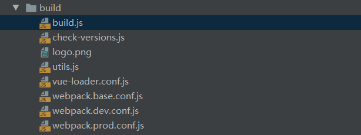
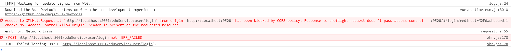

前端页面环境说明

1. 前端框架入口
   - /index.html
   - /src/main.js

2. 前端页面基于两种框架
   - vue：`import Vue from 'vue'`
   - element-ui：`import ElementUI from 'element-ui'`

3. build目录：项目构建的脚本文件

4. config目录：配置
   - index.js
   - dev.env.js的BASE_API

5. src目录结构
   - api：定义调用的方法
   - asserts：静态资源
   - components：组件
   - icons：图标
   - router：路由
   - store：相关脚本文件
   - styles：样式文件
   - utils：工具类相关
   - views：具体页面

# 跨域问题

通过一个地址去访问另外一个地址，这个过程中有三处，任何一处不同，就产生跨域。

- 协议
- ip地址
- 端口号

解决：

在controller层上增加@CrossOrigin注解

