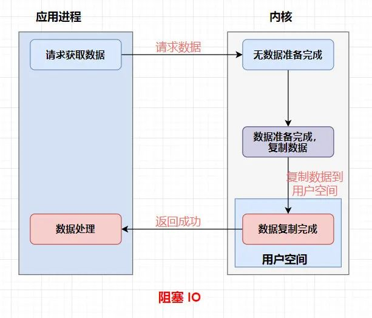
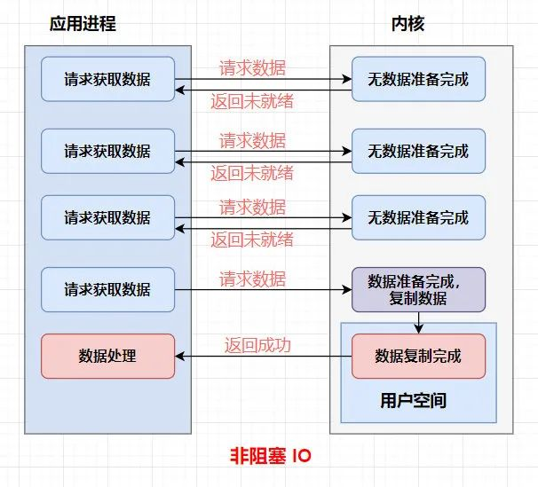
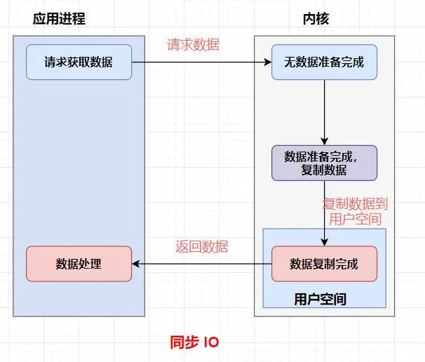
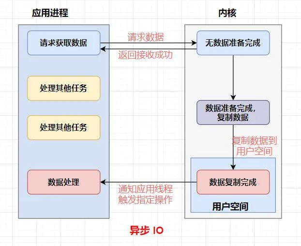
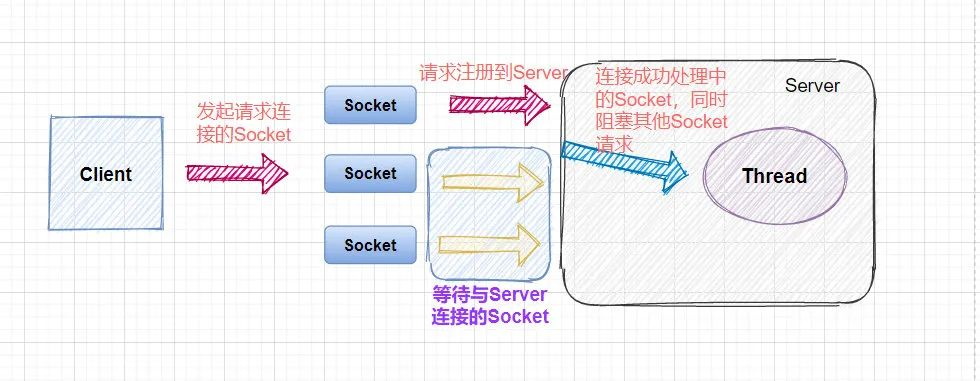
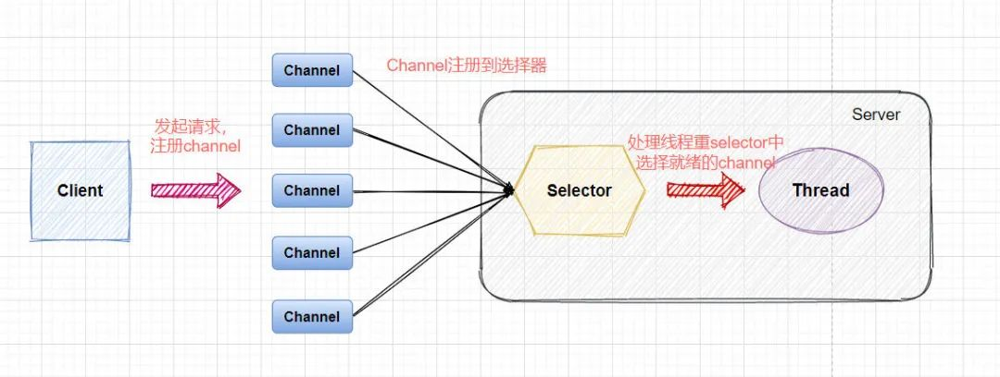

[toc]

> 以下内容摘自：[敖丙肝了一个月的Netty知识点](https://my.oschina.net/javaFamily/blog/4865168)

## 阻塞与非阻塞

阻塞和非阻塞操作是针对发起的IO请求操作后**是否立刻返回一个标志信息而不让请求线程等待**，当数据准备未完成时，请求线程的状态：

**阻塞**：往往需要等待缓冲区中的数据准备好过后才处理其他的事情，否则一直等待在那里。

**非阻塞**：无论数据是否准备好，都会直接返回。

### 阻塞IO

### 非阻塞IO

## 同步与异步

同步与异步是基于应用程序和操作系统处理IO事件所采用的方式：

**同步**：应用程序要直接参与IO读写的操作。

**异步**：所有的IO操作交给操作系统去处理，应用程序只需要等待通知。

异步相比较于同步带来的直接好处就是在我们处理IO数据的时候，异步的方式我们可以把这部分等待所消耗的资源用于处理其他事务，提升我们服务自身的性能。

### 同步IO

### 异步IO

## NIO与BIO的区别总结

| NIO                  | BIO              |
| :------------------- | :--------------- |
| 基于缓冲区( Buffer ) | 基于流( Stream ) |
| 非阻塞 IO            | 阻塞 IO          |
| 选择器( Selector )   | 无               |

### BIO

Blocking IO，是**同步阻塞的IO模型**，传统的IO【java.io包】就是这种模型。

BIO面向字节流或字符流，以流的方式顺序地处理一个或多个字节。

BIO的IO操作是阻塞式的：当一个线程调用read()或write()时，该线程被阻塞，直到有一些数据被读取，或数据完全写入。该线程在此期间不能再干任何事情了。

采用BIO形式的网络通信，服务器端启动一个ServerSocket，客户端需要启动Socket来进行**一对一连接**，如果客户端有多个客户端请求，**当其中一个客户端线程连接成功后，其他的将会阻塞**。如果需要实现服务端同时处理多个客户端线程，必然需要服务器端开启多线程与之对应，这样就会导致如果客户端请求过多，服务器线程开辟过多导致系统崩溃。

### NIO

NIO是Java1.4引入的，相对于传统的IO来说，N可以代表New的意思，表示新IO，但更为具体的理解是Non-blocking的意思，是一种**同步非阻塞**的IO模型。它提供了Buffer，Channel，Selector三大组件。

> 同步与非阻塞怎么理解，是否矛盾？
>
> 非阻塞体现在：用户程序发起IO操作请求后不等待数据，而是调用会立即返回一个标志信息告知条件不满足，数据未准备好，用户请求程序继续执行其他任务。执行完其他任务，用户程序会主动轮询查看IO操作条件是否满足，如果满足，则**用户程序亲自参与拷贝数据动作**，这是同步的过程。

NIO支持面向Buffer，基于Channel的IO操作，任何数据在Buffer中进行处理，且能够任意改变操作位置，处理灵活。

NIO的IO操作可以是非阻塞的：当一个线程执行从Channel读取数据的IO操作时，如果有数据，则返回数据；如果没数据，不需要阻塞，而是可以直接返回。

NIO实现非阻塞IO的其中关键组件之一就是Selector，可以注册多个Channel到一个Selector中。Selector可以不断执行select操作，判断这些注册的Channel是否有已就绪的IO事件，如可读，可写，网络连接已完成等。一个线程通过使用一个Selector管理多个Channel。

NIO就是一个线程负责所有请求连接但不处理IO操作，该线程只负责把连接注册到多路复用器上，多用复用器轮询到连接有IO请求时候再启动其它线程处理IO请求操作，实现一个线程或少量线程就可以对应众多的客户端线程。

## AIO是啥？

JDK1.7中，`java.nio.channels`包下增加了多个异步通道，是NIO的升级版本，实现AIO AsynchronousIO的异步非阻塞IO模型。

非阻塞前面已经解释过了，异步指的就是数据拷贝阶段完全由操作系统处理，而应用程序只需要等待通知即可。

## 总结

- 同步与异步的区别在于数据拷贝阶段是否需要完全由操作系统处理。
- 阻塞和非阻塞操作是针对发起的IO请求操作后是否立刻返回一个标志信息而不让请求线程等待。
- BIO是同步阻塞式的IO模型，面向流操作，保证顺序，如JDK1.4之前的传统IO操作。
- NIO是同步非阻塞式的IO模型，面向缓冲区，提供Channel，Buffer，Selector等抽象，如JDK1.4引入的IO操作。
- AIO是异步非阻塞式的IO模型，如JDK1.7引入的IO操作。

## 参考阅读

- [BIO NIO AIO区别](https://zhuanlan.zhihu.com/p/112810033)
- [芋道源码 Netty实现原理与源码解析系统 NIO基础](http://www.iocoder.cn/Netty/Netty-collection/)

- [异步和非阻塞一样吗? (内容涉及BIO,NIO,AIO,Netty)](https://blog.csdn.net/matthew_zhang/article/details/71328697)

- [敖丙肝了一个月的Netty知识点](https://my.oschina.net/javaFamily/blog/4865168)