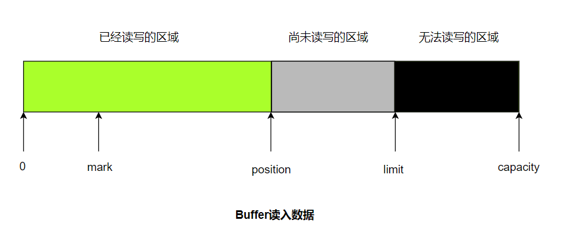

[TOC]

## NIO概述

NIO是什么？ 

- NIO是Java从JDK1.4开始引入的一系列改进版输入输出处理手段，也就是New IO，简称NIO。

传统IO的缺点？

- 传统IO是**阻塞式**的输入输出方式，举个例子：在读取输入流中的数据时，如果没有读到数据，将阻塞该线程的执行。
- 传统IO通过字节的移动来处理输入输出，一次只能处理一个字节，效率不高。

NIO的特点？

- 采用**内存映射文件**的方式处理输入输出，将文件或文件的一段区域映射到内存中，可以像访问内存一样访问文件，效率快得多。
- 相关的API存在于`java.nio`包下，有两个核心对象：Channel通道和Buffer缓冲。
- 除此之外，还提供了用于将Unicode字符串映射成字节序列以及逆映操作的Charset类。
- 提供了支持非阻塞式输入输出的Selector类。

Channel是啥？

- 对传统输入输出系统的模拟，**在NIO系统中所有的数据都需要通过Channel传输**。
- Channel提供了map()方法，可以直接将**一块数据**映射到内存中。
- 让NIO成为**面向块处理**的方式。

Buffer是啥？

- 可以理解为是一个容器，本质是个数组，无论是发送还是读取Channel中的数据，都必须先置入Buffer。

## Buffer

`java.nio.Buffer`是一个抽象类，子类包括有除boolean外其他所有基本类型的XxBuffer，最常用的是ByteBuffer。Buffer本质是个数组，无论是发送还是读取Channel中的数据，都必须先置入Buffer。

### Buffer中的重要概念

capacity：缓冲区的容量，表示该Buffer的最大数据容量，即最多可以存储多少数据。

limit：界限，位于limit后的数据不可读写。

position：指下一个可以被读出或写入的缓冲区位置索引。

mark：可选标记，Buffer允许直接将position定位到mark处。

> 他们满足的关系：0 <= mark <= position <= limit <= capacity

以`ByteBuffer.allocate(capacity)`为例，说明几个重要的过程：

- 初始化创建HeapByteBuffer，mark = -1，position = 0，limit = cap。
- 通过put方法向Buffer中加入数据，position++。
- 装入数据结束后，调用flip方法，将limit设置为position所在位置，position置为0，表示[position，limit]这段需要开始进行输出了。
- 输出结束后，调用clear方法，将position置为0，limit置为cap，为下一次读取数据做好准备。

其实Buffer操作的逻辑比较简单，每个方法操作的字段也不外乎上面介绍的几个，下面是一些常用的方法：

- Buffer position(newPosition)： 将pos设置为newPosition。
- Buffer limit(newLimit)：将limit设置为newLimit。
- boolean hasRemaining ：判断pos和limit之间是否还有可处理元素。

- Buffer reset：将pos置为mark的位置。
- Buffer rewind：将pos置为0，取消设置的mark。

Buffer的所有子类都提供了put和get方法，对应向Buffer存入数据和从Buffe中取出数据，方式分为以下两种：

- 相对：从Buffer的当前pos处开始读取或写入数据，然后将pos的值按处理元素的个数增加。
- 绝对：直接根据索引向Buffer中读取或写入数据，不会影响pos位置本身的值。

## Channel

## 参考阅读

- [http://ifeve.com/overview/](http://ifeve.com/overview/)
- 《疯狂Java讲义》