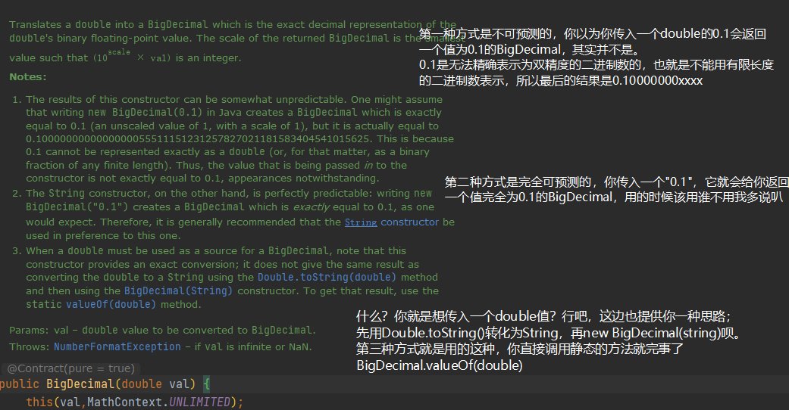

[toc]

## 本篇要点

- 简单描述浮点数十进制转二进制精度丢失的原因。
- 介绍几种创建BigDecimal方式的区别。
- 整理了高精度计算的工具类。
- 学习了阿里巴巴Java开发手册关于BigDecimal比较相等的规定。

## 经典问题：浮点数精度丢失

精度丢失的问题是在其他计算机语言中也都会出现，float和double类型的数据在执行二进制浮点运算的时候，并没有提供完全精确的结果。产生误差不在于数的大小，而是因为数的精度。

关于浮点数存储精度丢失的问题，话题过于庞大，感兴趣的同学可以自行搜索一下：[【解惑】剖析float型的内存存储和精度丢失问题](https://www.iteye.com/blog/hxraid-504293)

这里简单讨论一下十进制数转二进制为什么会出现精度丢失的现象，十进制数分为整数部分和小数部分，我们分开来看看就知道原因为何：

###  十进制整数如何转化为二进制整数？

将被除数每次都除以2，只要除到商为0就可以停止这个过程。

```java
5 / 2 = 2 余 1
2 / 2 = 1 余 0
1 / 2 = 0 余 1 
    
// 结果为 101
```

这个算法永远都不会无限循环，整数永远都可以使用二进制数精确表示，但小数呢？

### 十进制小数如何转化为二进制数？

每次将小数部分乘2，取出整数部分，如果小数部分为0，就可以停止这个过程。

```java
0.1 * 2 = 0.2 取整数部分0
0.2 * 2 = 0.4 取整数部分0
0.4 * 2 = 0.8 取整数部分0
0.8 * 2 = 1.6 取整数部分1
0.6 * 2 = 1.2 取整数部分1
0.2 * 2 = 0.4 取整数部分0 

//... 我想写到这就不必再写了，你应该也已经发现，上面的过程已经开始循环，小数部分永远不能为0
```

这个算法有一定概率会存在无限循环，即无法用有限长度的二进制数表示十进制的小数，这就是精度丢失问题产生的原因。

## 如何用BigDecimal解决double精度问题？

我们已经明白为什么精度会存在丢失现象，那么我们就应该知道，当某个业务场景对double数据的精度要求非常高时，就必须采取某种手段来处理这个问题，这也是BigDecimal为什么会被广泛应用于金额支付场景中的原因啦。

> BigDecimal类位于`java.math`包下，用于对超过16位有效位的数进行精确的运算。一般来说，double类型的变量可以处理16位有效数，但实际应用中，如果超过16位，就需要BigDecimal类来操作。

既然这样，那用BigDecimal就能够很好解决这个问题咯？

```java
    public static void main(String[] args) {
		// 方法1
        BigDecimal a = new BigDecimal(0.1);
        System.out.println("a --> " + a);
		// 方法2
        BigDecimal b = new BigDecimal("0.1");
        System.out.println("b --> " + b);
		// 方法3
        BigDecimal c = BigDecimal.valueOf(0.1);
        System.out.println("c --> " + c);
    }
```

你可以思考一下，控制台输出会是啥。

```java
a --> 0.1000000000000000055511151231257827021181583404541015625
b --> 0.1
c --> 0.1
```

可以看到，使用方法一的构造函数仍然出现了精度丢失的问题，而方法二和方法三符合我们的预期，为什么会这样呢？

这三个方法其实对应着三种不同的构造函数：

```java
    // 传入double
	public BigDecimal(double val) {
        this(val,MathContext.UNLIMITED);
    }
	// 传入string
    public BigDecimal(String val) {
        this(val.toCharArray(), 0, val.length());
    }

    public static BigDecimal valueOf(double val) {
        // Reminder: a zero double returns '0.0', so we cannot fastpath
        // to use the constant ZERO.  This might be important enough to
        // justify a factory approach, a cache, or a few private
        // constants, later.
        // 可以看到实际上就是第二种
        return new BigDecimal(Double.toString(val));
    }
```

关于这三个构造函数，JDK已经给出了解释，并用Notes标注：




为了防止以后图片可能会存在显示问题，这里再记录一下：

### new BigDecimal(double val)

该方法是不可预测的，以0.1为例，你以为你传了一个double类型的0.1，最后会返回一个值为0.1的BigDecimal吗？不会的，原因在于，0.1无法用有限长度的二进制数表示，无法精确地表示为双精度数，最后的结果会是0.100000xxx。

### new BigDecimal(String val)

该方法是完全可预测的，也就是说你传入一个字符串"0.1"，他就会给你返回一个值完全为0，1的BigDecimal，官方也表示，能用这个构造函数就用这个构造函数叭。

### BigDecimal.valueOf(double val)

第二种构造方式已经足够优秀，可你还是想传入一个double值，怎么办呢？官方其实提供给你思路并且实现了它，可以使用`Double.toString(double val)`先将double值转为String，再调用第二种构造方式，你可以直接使用静态方法：`valueOf(double val)`。

## Double的加减乘除运算工具类

BigDecimal所创建的是对象，故我们不能使用传统的`+、-、*、/`等算术运算符直接对其对象进行数学运算，而必须调用其相对应的方法。方法中的参数也必须是BigDecimal的对象。网上有很多这样的工具类，这边直接贴一下，逻辑不难，主要为了简化项目中频繁互相转化的问题。

```java
/**
 * 用于高精确处理常用的数学运算
 */
public class ArithmeticUtils {
    //默认除法运算精度
    private static final int DEF_DIV_SCALE = 10;

    /**
     * 提供精确的加法运算
     *
     * @param v1 被加数
     * @param v2 加数
     * @return 两个参数的和
     */

    public static double add(double v1, double v2) {
        BigDecimal b1 = new BigDecimal(Double.toString(v1));
        BigDecimal b2 = new BigDecimal(Double.toString(v2));
        return b1.add(b2).doubleValue();
    }

    /**
     * 提供精确的加法运算
     *
     * @param v1 被加数
     * @param v2 加数
     * @return 两个参数的和
     */
    public static BigDecimal add(String v1, String v2) {
        BigDecimal b1 = new BigDecimal(v1);
        BigDecimal b2 = new BigDecimal(v2);
        return b1.add(b2);
    }

    /**
     * 提供精确的加法运算
     *
     * @param v1    被加数
     * @param v2    加数
     * @param scale 保留scale 位小数
     * @return 两个参数的和
     */
    public static String add(String v1, String v2, int scale) {
        if (scale < 0) {
            throw new IllegalArgumentException(
                    "The scale must be a positive integer or zero");
        }
        BigDecimal b1 = new BigDecimal(v1);
        BigDecimal b2 = new BigDecimal(v2);
        return b1.add(b2).setScale(scale, BigDecimal.ROUND_HALF_UP).toString();
    }

    /**
     * 提供精确的减法运算
     *
     * @param v1 被减数
     * @param v2 减数
     * @return 两个参数的差
     */
    public static double sub(double v1, double v2) {
        BigDecimal b1 = new BigDecimal(Double.toString(v1));
        BigDecimal b2 = new BigDecimal(Double.toString(v2));
        return b1.subtract(b2).doubleValue();
    }

    /**
     * 提供精确的减法运算。
     *
     * @param v1 被减数
     * @param v2 减数
     * @return 两个参数的差
     */
    public static BigDecimal sub(String v1, String v2) {
        BigDecimal b1 = new BigDecimal(v1);
        BigDecimal b2 = new BigDecimal(v2);
        return b1.subtract(b2);
    }

    /**
     * 提供精确的减法运算
     *
     * @param v1    被减数
     * @param v2    减数
     * @param scale 保留scale 位小数
     * @return 两个参数的差
     */
    public static String sub(String v1, String v2, int scale) {
        if (scale < 0) {
            throw new IllegalArgumentException(
                    "The scale must be a positive integer or zero");
        }
        BigDecimal b1 = new BigDecimal(v1);
        BigDecimal b2 = new BigDecimal(v2);
        return b1.subtract(b2).setScale(scale, BigDecimal.ROUND_HALF_UP).toString();
    }

    /**
     * 提供精确的乘法运算
     *
     * @param v1 被乘数
     * @param v2 乘数
     * @return 两个参数的积
     */
    public static double mul(double v1, double v2) {
        BigDecimal b1 = new BigDecimal(Double.toString(v1));
        BigDecimal b2 = new BigDecimal(Double.toString(v2));
        return b1.multiply(b2).doubleValue();
    }

    /**
     * 提供精确的乘法运算
     *
     * @param v1 被乘数
     * @param v2 乘数
     * @return 两个参数的积
     */
    public static BigDecimal mul(String v1, String v2) {
        BigDecimal b1 = new BigDecimal(v1);
        BigDecimal b2 = new BigDecimal(v2);
        return b1.multiply(b2);
    }

    /**
     * 提供精确的乘法运算
     *
     * @param v1    被乘数
     * @param v2    乘数
     * @param scale 保留scale 位小数
     * @return 两个参数的积
     */
    public static double mul(double v1, double v2, int scale) {
        BigDecimal b1 = new BigDecimal(Double.toString(v1));
        BigDecimal b2 = new BigDecimal(Double.toString(v2));
        return round(b1.multiply(b2).doubleValue(), scale);
    }

    /**
     * 提供精确的乘法运算
     *
     * @param v1    被乘数
     * @param v2    乘数
     * @param scale 保留scale 位小数
     * @return 两个参数的积
     */
    public static String mul(String v1, String v2, int scale) {
        if (scale < 0) {
            throw new IllegalArgumentException(
                    "The scale must be a positive integer or zero");
        }
        BigDecimal b1 = new BigDecimal(v1);
        BigDecimal b2 = new BigDecimal(v2);
        return b1.multiply(b2).setScale(scale, BigDecimal.ROUND_HALF_UP).toString();
    }

    /**
     * 提供（相对）精确的除法运算，当发生除不尽的情况时，精确到
     * 小数点以后10位，以后的数字四舍五入
     *
     * @param v1 被除数
     * @param v2 除数
     * @return 两个参数的商
     */

    public static double div(double v1, double v2) {
        return div(v1, v2, DEF_DIV_SCALE);
    }

    /**
     * 提供（相对）精确的除法运算。当发生除不尽的情况时，由scale参数指
     * 定精度，以后的数字四舍五入
     *
     * @param v1    被除数
     * @param v2    除数
     * @param scale 表示表示需要精确到小数点以后几位。
     * @return 两个参数的商
     */
    public static double div(double v1, double v2, int scale) {
        if (scale < 0) {
            throw new IllegalArgumentException("The scale must be a positive integer or zero");
        }
        BigDecimal b1 = new BigDecimal(Double.toString(v1));
        BigDecimal b2 = new BigDecimal(Double.toString(v2));
        return b1.divide(b2, scale, BigDecimal.ROUND_HALF_UP).doubleValue();
    }

    /**
     * 提供（相对）精确的除法运算。当发生除不尽的情况时，由scale参数指
     * 定精度，以后的数字四舍五入
     *
     * @param v1    被除数
     * @param v2    除数
     * @param scale 表示需要精确到小数点以后几位
     * @return 两个参数的商
     */
    public static String div(String v1, String v2, int scale) {
        if (scale < 0) {
            throw new IllegalArgumentException("The scale must be a positive integer or zero");
        }
        BigDecimal b1 = new BigDecimal(v1);
        BigDecimal b2 = new BigDecimal(v1);
        return b1.divide(b2, scale, BigDecimal.ROUND_HALF_UP).toString();
    }

    /**
     * 提供精确的小数位四舍五入处理
     *
     * @param v     需要四舍五入的数字
     * @param scale 小数点后保留几位
     * @return 四舍五入后的结果
     */
    public static double round(double v, int scale) {
        if (scale < 0) {
            throw new IllegalArgumentException("The scale must be a positive integer or zero");
        }
        BigDecimal b = new BigDecimal(Double.toString(v));
        return b.setScale(scale, BigDecimal.ROUND_HALF_UP).doubleValue();
    }

    /**
     * 提供精确的小数位四舍五入处理
     *
     * @param v     需要四舍五入的数字
     * @param scale 小数点后保留几位
     * @return 四舍五入后的结果
     */
    public static String round(String v, int scale) {
        if (scale < 0) {
            throw new IllegalArgumentException(
                    "The scale must be a positive integer or zero");
        }
        BigDecimal b = new BigDecimal(v);
        return b.setScale(scale, BigDecimal.ROUND_HALF_UP).toString();
    }

    /**
     * 取余数
     *
     * @param v1    被除数
     * @param v2    除数
     * @param scale 小数点后保留几位
     * @return 余数
     */
    public static String remainder(String v1, String v2, int scale) {
        if (scale < 0) {
            throw new IllegalArgumentException(
                    "The scale must be a positive integer or zero");
        }
        BigDecimal b1 = new BigDecimal(v1);
        BigDecimal b2 = new BigDecimal(v2);
        return b1.remainder(b2).setScale(scale, BigDecimal.ROUND_HALF_UP).toString();
    }

    /**
     * 取余数  BigDecimal
     *
     * @param v1    被除数
     * @param v2    除数
     * @param scale 小数点后保留几位
     * @return 余数
     */
    public static BigDecimal remainder(BigDecimal v1, BigDecimal v2, int scale) {
        if (scale < 0) {
            throw new IllegalArgumentException(
                    "The scale must be a positive integer or zero");
        }
        return v1.remainder(v2).setScale(scale, BigDecimal.ROUND_HALF_UP);
    }

    /**
     * 比较大小
     * 阿里巴巴开发规范明确：比较BigDecimal的等值需要使用compareTo，不可用equals
     * equals会比较值和精度，compareTo会忽略精度
     * @param v1 被比较数
     * @param v2 比较数
     * @return 如果v1 大于v2 则 返回true 否则false
     */
    public static boolean compare(String v1, String v2) {
        BigDecimal b1 = new BigDecimal(v1);
        BigDecimal b2 = new BigDecimal(v2);
        int bj = b1.compareTo(b2);
        boolean res;
        if (bj > 0)
            res = true;
        else
            res = false;
        return res;
    }
}
```

## 阿里巴巴Java开发手册关于BigDecimal的规定

> 【强制】如上所示BigDecimal的等值比较应使用compareTo()方法，而不是equals()方法。
>
> 说明：equals()方法会比较值和精度(1.0和1.00返回结果为false),而compareTo()则会忽略精度。

关于这一点，我们来看一个例子就明白了：

```java
    public static void main(String[] args) {
        BigDecimal a = new BigDecimal("1");
        BigDecimal b = new BigDecimal("1.0");
        System.out.println(a.equals(b)); // false
        System.out.println(a.compareTo(b)); //0 表示相等
    }
```

JDK中对这两个方法的解释是这样的：

- 使用compareTo方法，两个值相等但是精度不同的BigDecimal对象会被认为是相等的，比如2.0和2.00。建议使用`x.compareTo(y) <op> 0`来表示`(<, == , > , >= , != , <=)`中的其中一个关系，<op>就表示运算符。
- equals方法与compareTo方法不同，此方法仅在两个BigDecimal对象的值和精度都相等时才被认为是相等的，如2.0和2.00就是不相等的。

## 参考阅读

- [LanceToBigData:Java之BigDecimal详解](https://www.cnblogs.com/zhangyinhua/p/11545305.html)
- [为什么阿里巴巴禁止使用BigDecimal的equals方法做等值比较？](https://www.hollischuang.com/archives/5559)
- [java中double和float精度丢失问题](https://www.cnblogs.com/xujishou/p/7491932.html)

- [深讨Java中double在计算时精度丢失的问题](https://www.jianshu.com/p/353834bbe7da)