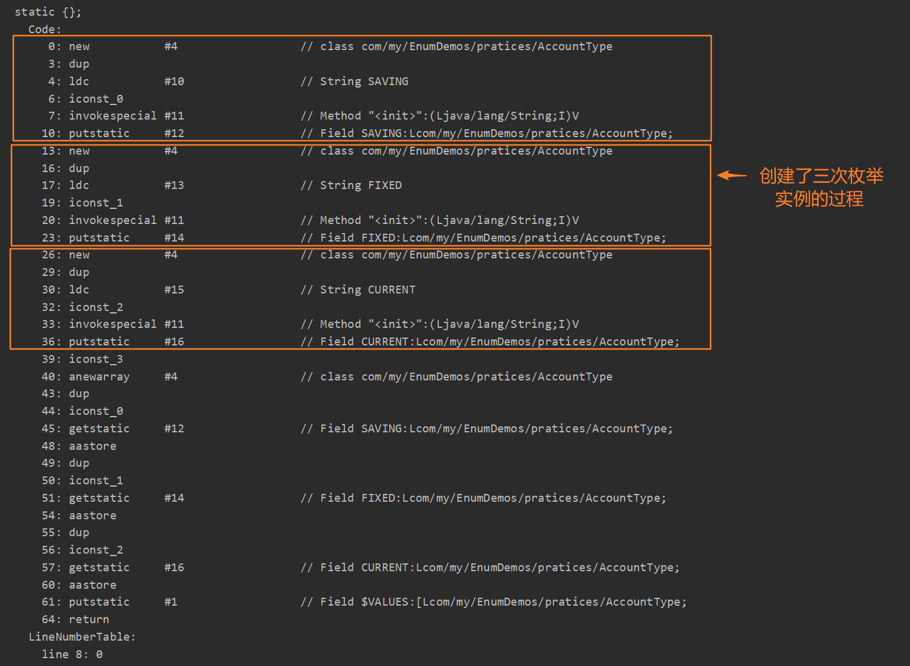

[toc]
# 一、前言

本篇博客是对**JDK1.5的新特性枚举**的一波小小的总结，主要是昨天在看一部分面试题的时候，遇到了枚举类型的题目，发现自己有许多细节还需要加强，做起来都模棱两可，是时候总结一波了。


# 二、源自一道面试题

不多bb，直接开门见山，我遇到这样一道也许很简单的题目：

```java
enum AccountType
{
    SAVING, FIXED, CURRENT;
    private AccountType()
    {
        System.out.println(“It is a account type”);
    }
}
class EnumOne
{
    public static void main(String[]args)
    {
        System.out.println(AccountType.FIXED);
    }
}
```

问打印的结果是啥？正确答案如下：

```java
It is a account type
It is a account type
It is a account type
FIXED
```
至于结果为啥是这个，且看我慢慢总结。
# 三、枚举的由来
> 存在即合理。

我贼喜欢这句圣经，每次我一解释不了它为什么出现的时候，就不自觉地用上这句话。

枚举一定有他存在的价值，在一些时候，我们需要定义一个类，这个类中的**对象是有限且固定的**，比如我们一年有四个季节，春夏秋冬。

在枚举被支持之前，我们该如何定义这个Season类呢？可能会像下面这样：
```java
public class Season {
    //private修饰构造器，无法随意创建对象
    private Season(){}
    //final修饰提供的对象在类外不能改变
    public static final Season SPRING = new Season();
    public static final Season SUMMER = new Season();
    public static final Season AUTUMN = new Season();
    public static final Season WINTER = new Season();
}
```
在定义上，这个Season类可以完成我们的预期，它们各自代表一个实例，且不能被改变，外部也不能随便创建实例。

但，通过自定义类实现枚举的效果有个显著的问题：**代码量**非常大。

于是，JDK1.5，**枚举类**应运而生。

# 四、枚举的定义形式

`enum`关键字用以定义枚举类，这是一个和`class`，`interface`关键字地位相当的关键字。也就是说，枚举类和我们之前使用的类差不太多，且enum和class修饰的类如果同名，会出错。

有一部分规则，类需要遵循的，枚举类也遵循：

- 枚举类也可以定义成员变量、构造器、普通和抽象方法等。
- 一个Java源文件最多只能定义一个public的枚举类，且类名与文件名相同。
- 枚举类可以实现一个或多个接口。

也有一部分规则，枚举类显得与众不同：

- 枚举类的实例**必须在枚举类的第一行显式列出**，以逗号分隔，列出的实例系统默认添加`public static final`修饰。
- 枚举类的构造器默认私有，且**只能是私有**，可以重载。
- 枚举类默认**final**修饰，无法被继承。
- 枚举类都继承了**java.lang.Enum**类，所以无法继承其他的类。
- 一般情况下，枚举常量需要用`枚举类.枚举常量`的方式调用。

知道这些之后，我们可以用enum关键字重新定义枚举类：


```java
public enum Season{
    //定义四个实例
    SPRING,SUMMER,AUTUMN,WINTER;
}
```
> 需要注意的是，在JDK1.5枚举类加入之后，**switch-case语句**进行了扩展，其控制表达式可以是任意枚举类型，且可以直接使用枚举值的名称，无需添加枚举类作为限定。


# 五、Enum类里有啥？
Enum类是所有enum关键字修饰的枚举类的顶级父类，里头定义的方法默认情况下，是通用的，我们来瞅它一瞅：

```java
public abstract class Enum<E extends Enum<E>> extends Object implements Comparable<E>, Serializable
```

我们可以发现，Enum其实是一个继承自Object类的抽象类（Object类果然是顶级父类，不可撼动），并实现了两个接口：

- Comparable：支持枚举对象的比较。
- Serializable：支持枚举对象的序列化。


## 1、唯一的构造器
```java
    protected Enum(String name, int ordinal) {
        this.name = name;
        this.ordinal = ordinal;
    }
```
官方文档这样说的：程序员不能去调用这个构造器，它用于编译器响应enum类型声明发出的代码，关于这一点，我们后面体会会更加深刻一些。


## 2、重要的方法们
关于Object类中的方法，这边就不赘述了，主要提一提特殊的方法。

> public final String name()


**返回这个枚举常量的名称**。官方建议：大多数情况，最好使用toString()方法，因为可以返回一个友好的名字。而name()方法以final修饰，无法被重写。

> public String toString()

源码上看，toString()方法和name()方法是相同的，但是建议：如果有更友好的常量名称显示，可以重写toString()方法。

> public final int ordinal()

**返回此枚举常量的序号**(其在enum声明中的位置，其中初始常量的序号为零)。

大多数程序员将不需要这种方法。它被用于复杂的基于枚举的数据结构中，如EnumSet和EnumMap。

> public final int compareTo(E o)

这个方法用于指定枚举对象比较顺序，同一个枚举实例只能与相同类型的枚举实例进行比较。
```java
    public final int compareTo(E o) {
        Enum<?> other = (Enum<?>)o;
        Enum<E> self = this;
        if (self.getClass() != other.getClass() && // optimization
            //getDeclaringClass()方法返回该枚举常量对应Enum类的类对象
            self.getDeclaringClass() != other.getDeclaringClass())
            throw new ClassCastException();
        //该枚举常量顺序在o常量之前，返回负整数
        return self.ordinal - other.ordinal;
    }
```

> public static <T extends Enum<T>> T valueOf(Class<T> enumType,
>                                        String name)

该静态方法返回指定枚举类中指定名称的枚举常量。
## 3、凭空出现的values()方法

为什么会想到总结这个方法呢？其实也是有一定心路历程的，官方文档特别强调了一句话：

> Note that when using an enumeration type as the type of a set or as the type of the keys in a map, specialized and efficient set and map implementations are available.

一般Note开头的玩意儿，还是比较重要的。大致意思如下：

> 当使用枚举类型作为集合的类型或映射中的键的类型时，可以使用专门化且有效的集合和映射实现。

看完非常不理解，于是开始查找资料，发现有一种用法：

```java
Arrays.asList(AccountType.values())
```
很明显调用了这个枚举类的values()方法，但是刚才对枚举类的方法一通分析，也没看到有values()方法啊。但是编译器确实提示，有，确实有！


这是怎么回事呢？JDK文档是这么说的：
> The compiler automatically adds some special methods when it creates an enum. For example, they have a static values method that returns an array containing all of the values of the enum in the order they are declared.

编译器会在创建一个枚举类的时候，自动在里面加入一些特殊的方法，例如静态的values()方法，它将返回一个数组，按照枚举常量声明的顺序存放它们。

这样一来，枚举类就可以和集合等玩意儿很好地配合在一起了，具体咋配合，以后遇到了就知道了。


关于这一点，待会反编译之后会更加印象深刻。
# 六、反编译枚举类

> 注：由于学识尚浅，这部分内容总结起来虚虚的，但是总归查找了许多的资料，如有说的不对的地方，还望评论区批评指正。

那么，回到我们文章开头提到的那到面试题，我们根据结果来推测程序运行之后发生的情况：

- 其中的构造器被调用了三次，说明定义的枚举常量确实是三个活生生的实例，也就是说，每次创建实例就会调用一次构造器。
- 然后，`System.out.println(AccountType.FIXED);`将会调用toString()方法，由于子类没有重写，那么将会返回name值，也就是`"FIXED"`。

至此，我们的猜测结束，其实确实也大差不差了，大致就是这个过程。在一番查阅资料之后，我又尝试着去反编译这个枚举类文件：

我们先用`javap -p AccountType.class`命令试着反编译之后查看所有类和成员。


为了看看static中发生的情况，我试着用更加详细的指令，`javap -c -l AccountType.class`，试图获取本地变量信息表和行号，虽然我大概率还是看不太懂的。


我们以其中一个为例，参看虚拟机字节码指令表，大致过程如下：

```java
  static {};
    Code:
       0: new           #4                  //创建一个对象，将其引用值压入栈
       3: dup                               //复制栈顶数值并将复制值压入栈顶
       4: ldc           #10                 //将String常量值SAVING从常量池推送至栈顶
       6: iconst_0                          //将int型0推送至栈顶
       7: invokespecial #11                 //调用超类构造器
      10: putstatic     #12                 //为指定的静态域赋值
```


以下为由个人理解简化的编译结构：
```java
public final class AccountType extends java.lang.Enum<AccountType> {
    //静态枚举常量
    public static final AccountType SAVING;

    public static final AccountType FIXED;

    public static final AccountType CURRENT;

    //存储静态枚举常量的私有静态域
    private static final AccountType[] $VALUES;

    //编译器新加入的静态方法
    public static AccountType[] values();

    //调用实例方法获取指定名称的枚举常量
    public static AccountType valueOf(java.lang.String);

    static {
        //创建对象，传入枚举常量名和顺序
        SAVING = new AccountType("SAVING",0);
        FIXED = new AccountType("FIXED",1);
        CURRENT = new AccountType("CURRENT",2);
        //给静态域赋值
        $VALUES = new AccountType[]{
            SAVING,FIXED,CURRENT
        }
    };     
}
```

Enum类的构造器，在感应到enum关键字修饰的类之后，将会被调用，传入枚举常量的字符串字面量值（name）和索引（ordinal），创建的实例存在私有静态域`&VALUES`中。

而且编译器确实会添加静态的values()方法，用以返回存放枚举常量的数组。

# 七、枚举类实现单例
```java

public enum  EnumSingleton {
    INSTANCE;
    public EnumSingleton getInstance(){
        return INSTANCE;
    }
}
```
这部分等到以后总结单例模式再侃，先在文末贴个地址。


# 八、参考资料

[通过javap命令分析java汇编指令](https://www.jianshu.com/p/6a8997560b05)
[Java中的枚举与values()方法](https://blog.csdn.net/ucxiii/article/details/48708455)