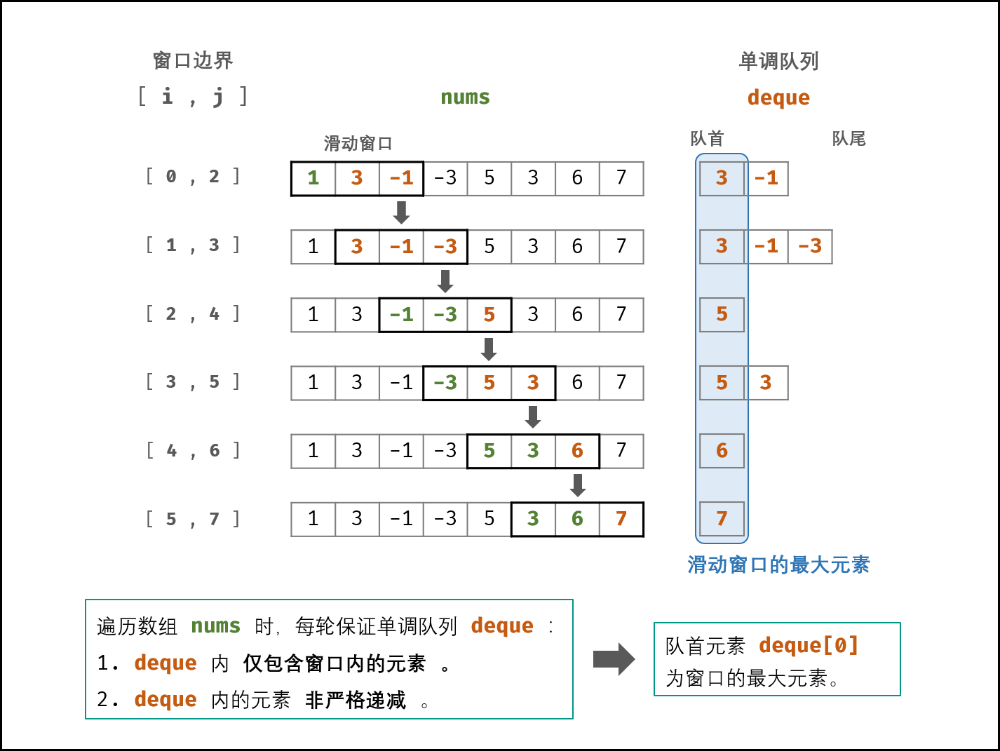

[toc]

# 滑动窗口的最大值

## 题目描述

来源：[https://leetcode-cn.com/problems/sliding-window-maximum/](https://leetcode-cn.com/problems/sliding-window-maximum/)

给定一个数组 *nums*，有一个大小为 *k* 的滑动窗口从数组的最左侧移动到数组的最右侧。你只可以看到在滑动窗口内的 *k* 个数字。滑动窗口每次只向右移动一位。

返回滑动窗口中的最大值。

**示例:**

```
输入: nums = [1,3,-1,-3,5,3,6,7], 和 k = 3
输出: [3,3,5,5,6,7] 
解释: 

  滑动窗口的位置                最大值
---------------               -----
[1  3  -1] -3  5  3  6  7       3
 1 [3  -1  -3] 5  3  6  7       3
 1  3 [-1  -3  5] 3  6  7       5
 1  3  -1 [-3  5  3] 6  7       5
 1  3  -1  -3 [5  3  6] 7       6
 1  3  -1  -3  5 [3  6  7]      7
```

**提示：**

- `1 <= nums.length <= 10^5`
- `-10^4 <= nums[i] <= 10^4`
- `1 <= k <= nums.length`

## 思路分析

 一、暴力求解，一层循环遍历`n-k+1`次，二层循环遍历k的长度，时间复杂度为O(NK)，存在的问题就是在窗口移动的过程中，存在元素重复的情况，k很大的时候非常明显效率很低。

二、使用单调的双向队列，维护的队列支持双端操作，元素在入队出队的时候保证O(1)的时间操作，并且我们需要淘汰掉永远不可能是当前的答案的元素。

## 具体代码

### 暴力求解

```java
    //暴力解 时间复杂度上面   (n-k+1) * k  存在问题,大量的重复比较
    public int[] maxSlidingWindow(int[] nums, int k) {
        int n = nums.length;
        if (n * k == 0) return new int[0];

        int[] res = new int[n - k + 1];

        for (int i = 0; i < n - k + 1; i++) {
            int max = Integer.MIN_VALUE;
            for (int j = i; j <= i + k - 1; j++)
                max = Math.max(max, nums[j]);
            res[i] = max;
        }
        return res;
    }
```

时间复杂度：$O((n-k+1)k)\approx O(nk)$

- 数组长度为n，共有$n-k+1$个窗口。
- 获取每个窗口的最大值需要线性遍历，$O(K)$。

### 双向队列

参考：[https://leetcode-cn.com/problems/hua-dong-chuang-kou-de-zui-da-zhi-lcof/solution/mian-shi-ti-59-i-hua-dong-chuang-kou-de-zui-da-1-6/](https://leetcode-cn.com/problems/hua-dong-chuang-kou-de-zui-da-zhi-lcof/solution/mian-shi-ti-59-i-hua-dong-chuang-kou-de-zui-da-1-6/)

如何使在每次窗口滑动之后，将获取最大值的操作的时间复杂度从$O(k)$降到$O(1)$是这道问题优化的关键。



每次移动滑动窗口的时候，保证队首都是最大值，将时间复杂度降至$O(1)$。

- deque内仅包含窗口内的元素，举个例子，[4,3,2,1]，窗口移动至[3,2,1]的时候，要保证4已经移除，不然4会成为答案。
- 每次添加一个元素进deque之前，需要将deque中所有小于这个元素的数删除。

```java
public int[] maxSlidingWindow(int[] nums, int k) {
    if(nums.length == 0 || k == 0) return new int[0];
    Deque<Integer> deque = new LinkedList<>();
    int[] res = new int[nums.length - k + 1];
    for(int i = 0; i < k; i++) { // 未形成窗口
        while(!deque.isEmpty() && deque.peekLast() < nums[i])
            deque.removeLast();
        deque.addLast(nums[i]);
    }
    res[0] = deque.peekFirst();
    for(int i = k; i < nums.length; i++) { // 形成窗口后
        if(deque.peekFirst() == nums[i - k]) //deque内仅包含窗口内的元素
            deque.removeFirst();
        while(!deque.isEmpty() && deque.peekLast() < nums[i])//移除比当前元素小的数
            deque.removeLast();
        deque.addLast(nums[i]);
        res[i - k + 1] = deque.peekFirst(); //更新最大值
    }
    return res;
}
```

时间复杂度 $O(n)$ ： 其中 $n$ 为数组 nums长度；线性遍历 nums 占用 $O(N) $；每个元素最多仅入队和出队一次，因此单调队列 deque 占用 $O(2N)$ 。
空间复杂度 $O(k)$ ： 双端队列 deque 中最多同时存储 k 个元素（即窗口大小）。