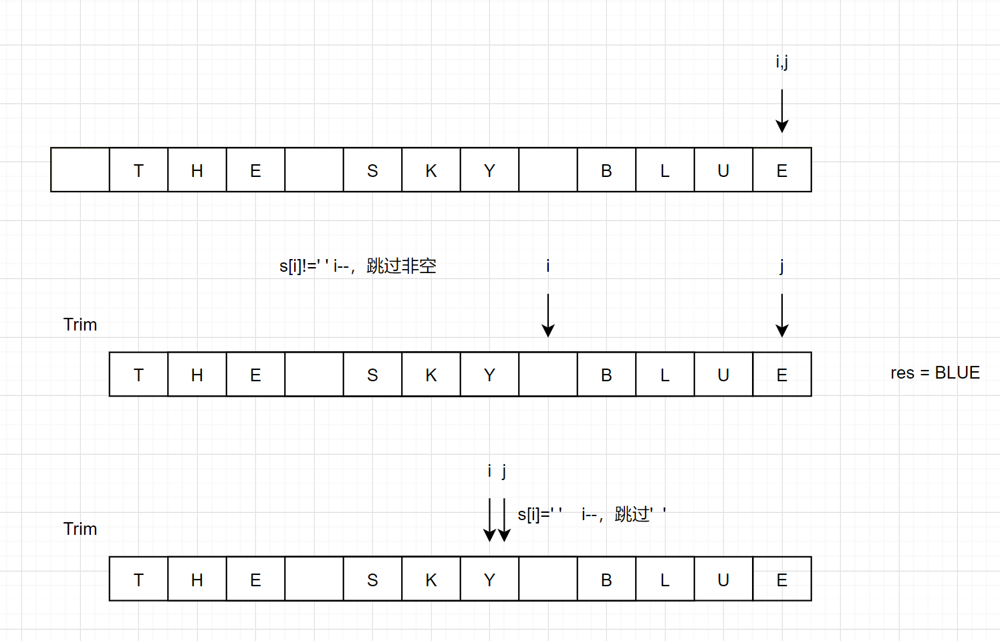

[toc]

# 字符串的翻转问题

## 344 反转字符串 

双指针做法，反转问题的经典的解决方案，利用两个指针，每次相对移动，移动过程中交换，直到指针相遇。

```java
    public void reverseString(char[] s) {
        if(s.length == 0) return;
        int l = 0, r = s.length - 1;
        while(l < r){
            char temp = s[l];
            s[l++] = s[r];
            s[r--] = temp;
        }
    }
```

## 541 反转字符串Ⅱ

给定一个字符串 s 和一个整数 k，你需要对从字符串开头算起的每隔 2k 个字符的前 k 个字符进行反转。

如果剩余字符少于 k 个，则将剩余字符全部反转。
如果剩余字符小于 2k 但大于或等于 k 个，则反转前 k 个字符，其余字符保持原样。

**示例:**

```
输入: s = "abcdefg", k = 2
输出: "bacdfeg"
```

**提示：**

1. 该字符串只包含小写英文字母。
2. 给定字符串的长度和 `k` 在 `[1, 10000]` 范围内。

思考：

- 每次找到需要反转的那一段的起始和终点位置l和r。
- `l = 0, 2k, 4k ... `,`r = k - 1, 3k -1...`
- 如果r的索引位置越界了，那么让r等于数组最后一个索引，如果没有，则`i + k -1`。

```java
    public String reverseStr(String s, int k) {

        char[] chs = s.toCharArray();
        int len = chs.length;

        for(int i = 0; i < len ; i += 2 * k)
        {
            int l = i;//每次需要反转段的左边界
            int r = (i + k - 1 < len) ? i + k - 1 : len - 1; //反转的右边界
            //min(i + k -1 , len -1);
            while(l < r){ //交换
                swap(chs, l ,r);
                l ++;
                r --;
            }
        }
        String str = new String(chs);
        return str;
    }

    void swap(char[] chs, int i , int j){
        char temp = chs[i];
        chs[i] = chs[j];
        chs[j] = temp;
    }
```


## 345 反转字符串中的元音字母

编写一个函数，以字符串作为输入，反转该字符串中的元音字母。

**示例 1：**

```
输入："hello"
输出："holle"
```

**示例 2：**

```
输入："leetcode"
输出："leotcede"
```

**提示：**

- 元音字母不包含字母 "y" 。


```java
class Solution {
    public String reverseVowels(String s) {
        if(s == null || s.length() == 0) return s;
        char[] chs = s.toCharArray();
        int i = 0, j = chs.length -1;

        while( i < j ){
            while( i < j && !check(chs[i])) i++; //找到不为元音的指针
            while( i < j && !check(chs[j])) j--;
            swap( chs , i , j);
            i++; //左指针向右移
            j--; //右指针向左移
        }
        return new String(chs);
    }

    void swap(char[] chs , int i ,int j){ //交换两个字符
        char temp = chs[i];
        chs[i] = chs[j];
        chs[j] = temp;
    }

    boolean check(char c){ //判断是否为元音字母
        return c == 'a' || c == 'e' || c == 'i' || c == 'o' || c == 'u' 
            || c == 'A' || c == 'E' || c == 'I' || c == 'O' || c == 'U';
    }
}
```


## 151 反转字符串里的单词

> 在解题的时候，经常会遇到一类问题，就是你在遍历一串字符串的时候，你有时候需要跳过一段不满足条件的字符，这时就需要建立临时的一个指针，去动态的选择索引位置。
>
> 比如，我想从i开始，找到一段连续的非空字符串：
>
> ```java
> String str = "abc efg hijk"; 
> int i = 0;
> int k = i;
> while(k < str.length() && str.charAt(k)!=' ') k++;
> //此时 [i,k-1]就是满足条件的非空字符串
> ```
>
> 

给定一个字符串，逐个翻转字符串中的每个单词。

**示例 1：**

```
输入: "the sky is blue"
输出: "blue is sky the"
```

思考：字符串中，除了原地反转源字符串，其实还可以创建额外字符串长度的空间重建字符串，这题就可以采用这样的思路解决。



```java
    public String reverseWords(String s) {
        s = s.trim();
        int j = s.length() - 1, i = j;
        StringBuilder res = new StringBuilder();
        while(i >= 0){
            while( i >= 0 && s.charAt(i) != ' ') i--;// 搜索首个空格
            for(int k = i+1; k <= j; k++) res.append(s.charAt(k)); //从i+1的位置添加
            if(i != -1){
                res.append(" "); //如果是第一个单词，不需要加' '
            }
            while( i >= 0 && s.charAt(i) == ' ') i--;// 跳过单词间空格
            j = i; // j 指向下个单词的尾字符
        }
        return res.toString(); // 转化为字符串并返回
    }
```

## 557 反转字符串中的单词Ⅱ

给定一个字符串，你需要反转字符串中每个单词的字符顺序，同时仍保留空格和单词的初始顺序。

**示例：**

```
输入："Let's take LeetCode contest"
输出："s'teL ekat edoCteeL tsetnoc"
```

- 在字符串中，每个单词由单个空格分隔，并且字符串中不会有任何额外的空格。

```java
    public String reverseWords(String s) {
        StringBuilder res = new StringBuilder();
        char[] chs = s.toCharArray();
        for(int i = 0; i < chs.length; i++){
            int k = i;
            while(k < chs.length && chs[k]!=' ') k++; //找到符合条件的一串的经典做法
            for(int j = k-1;j >= i; j--){
                res.append(chs[j]);
            }
            if(k < chs.length) res.append(" ");
            i = k;
        }
        return res.toString();
    }
```

# 字符串与数相关问题

这种类型的题目，主要需要考虑一下下面几个注意的点：

## 剑指offer67. 把字符串正换成整数

请你来实现一个 atoi 函数，使其能将字符串转换成整数。

首先，该函数会根据需要丢弃无用的开头空格字符，直到寻找到第一个非空格的字符为止。接下来的转化规则如下：

- 如果第一个非空字符为正或者负号时，则将该符号与之后面尽可能多的连续数字字符组合起来，形成一个有符号整数。
- 假如第一个非空字符是数字，则直接将其与之后连续的数字字符组合起来，形成一个整数。
  该字符串在有效的整数部分之后也可能会存在多余的字符，那么这些字符可以被忽略，它们对函数不应该造成影响。
- 注意：假如该字符串中的第一个非空格字符不是一个有效整数字符、字符串为空或字符串仅包含空白字符时，则你的函数不需要进行转换，即无法进行有效转换。
- 在任何情况下，若函数不能进行有效的转换时，请返回 0 。

提示：

本题中的空白字符只包括空格字符 ' ' 。
假设我们的环境只能存储 32 位大小的有符号整数，那么其数值范围为 [−231,  231 − 1]。如果数值超过这个范围，请返回  INT_MAX (231 − 1) 或 INT_MIN (−231) 。

```
示例 1:
输入: "42"
输出: 42
```

```
示例 2:
输入: "   -42"
输出: -42
解释: 第一个非空白字符为 '-', 它是一个负号。
     我们尽可能将负号与后面所有连续出现的数字组合起来，最后得到 -42 。
```

```
示例 3:

输入: "4193 with words"
输出: 4193
解释: 转换截止于数字 '3' ，因为它的下一个字符不为数字。
```

```
示例 4:

输入: "words and 987"
输出: 0
解释: 第一个非空字符是 'w', 但它不是数字或正、负号。
     因此无法执行有效的转换。
```

```
示例 5:

输入: "-91283472332"
输出: -2147483648
解释: 数字 "-91283472332" 超过 32 位有符号整数范围。 
     因此返回 INT_MIN (−231) 。
```

```java
    public int myAtoi(String str) {
        if(str == null || str.length() == 0) return 0;
        int k = 0;
        boolean isNeg = false;
        while(k < str.length() && str.charAt(k) == ' ') k++; //跳过开头的空格
        if(k == str.length()) return 0; // 字符串本身为 ' '的情况
        long res = 0;
        char c = str.charAt(k); //判断 第一位是否为 + -
        if(c == '-'){
            isNeg = true;
            k++;
        }else if( c == '+'){
            k++;
        }
        while(k < str.length() && str.charAt(k) >= '0' && str.charAt(k) <= '9'){ //计算数字
            res = res *  10 + str.charAt(k++) -'0';
            if(res > Integer.MAX_VALUE || res < Integer.MIN_VALUE)  break;//这里需要终止，因为再加可能会溢出

        }
        if(isNeg) res = res * -1;
        if(res < Integer.MIN_VALUE) return Integer.MIN_VALUE;
        if(res > Integer.MAX_VALUE) return Integer.MAX_VALUE;
        return (int)res;
    }
```

## 剑指offer20. 表示数值的字符串

请实现一个函数用来判断字符串是否表示数值（包括整数和小数）。例如，字符串`"+100"、"5e2"、"-123"、"3.1416"、"-1E-16"、"0123"`都表示数值，但`"12e"、"1a3.14"、"1.2.3"、"+-5"及"12e+5.4"`都不是。

> 注意 .1也属于数值。

```java

public boolean isNumber(String s) {
    if(s == null || s.length() == 0) return false;
    boolean isNum = false,isDot = false,isE = false;

    char[] str = s.trim().toCharArray();

    for(int i = 0; i < str.length; i++){
        if(str[i] >= '0' && str[i] <= '9') isNum = true;
        else if(str[i] == '.'){
            //if(!isNum) return false;  我以为.1不算是有效数字
            if(isDot || isE) return false;//小数点之前出现过e或者小数点，表示错误 .e
            isDot = true;
        }
        else if(str[i] == 'e' || str[i] == 'E'){
            if(!isNum || isE) return false;//e或E之前必须出现数字且不能重复出现e
            isE = true;
            isNum = false; //重置isNum，排除123e或者123e+
        }
        else if(str[i] == '+' || str[i] == '-'){
            if(i != 0 && str[i - 1] != 'e' && str[i-1]!= 'E') return false;//+ - 只能出现在第一个位置，或者e的后面
        }
        else return false;
    }

    return isNum;
}

```

# 字符串中的子串问题

### 3. 无重复字符的最长子串

给定一个字符串，请你找出其中不含有重复字符的 最长子串 的长度。

```
示例 1:

输入: "abcabcbb"
输出: 3 
解释: 因为无重复字符的最长子串是 "abc"，所以其长度为 3。
```

```
输入: "pwwkew"
输出: 3
解释: 因为无重复字符的最长子串是 "wke"，所以其长度为 3。
     请注意，你的答案必须是 子串 的长度，"pwke" 是一个子序列，不是子串。
```

利用滑动窗口求解：

```java
    public int lengthOfLongestSubstring(String s) {
        if (s.length()==0) return 0;
        HashMap<Character, Integer> map = new HashMap<>();
        int max = 0;
        int left = 0;
        for(int i = 0; i < s.length(); i ++){
            if(map.containsKey(s.charAt(i))){ //一旦遇到出现过的字符
                left = Math.max(left,map.get(s.charAt(i)) + 1);//更新左边界 abba的特殊情况
            }
            map.put(s.charAt(i),i); //将字符和index加入map
            max = Math.max(max,i-left+1); //更新max
        }
        return max;
        
    }
```

# 持续更新，未完待续。。。


