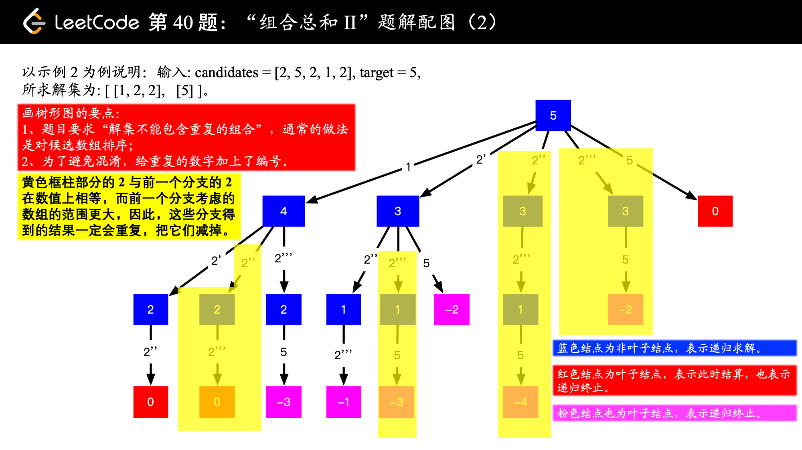

[toc]

# 深度优先搜索刷题总结

### [46. 全排列](https://leetcode-cn.com/problems/permutations/)

给定一个 没有重复 数字的序列，返回其所有可能的全排列。

输入: `[1,2,3]`
输出:`[[1,2,3],[1,3,2],[2,1,3],[2,3,1],[3,1,2],[3,2,1]]`

```java

public List<List<Integer>> findSubsequences(int[] nums) {
    List<List<Integer>> res = new ArrayList<>();
	List<Integer> path = new ArrayList<>();
    boolean[] visited = new boolean[nums.length];
    dfs(res,path,nums,visited);
    return res;
}

void dfs(List<List<Integer>> res,List<Integer> path,int[] nums, boolean[] visited){
    //终止条件
    if(path.size() == nums.length) {/*终止条件成立*/
        /* 可以选择进一步判断这条路径上的结果是否满足题意 */
        res.add(new ArrayList<>(path));
        return;
    }
    //选取候选者【却决于题目 几个分叉】
    for(int i = 0; i < arr.length; i++){
        int curr = arr[i];
        if(!visited[i]){ //如果没有走过
            visited[i] = true; // 表示走过了
            path.add(curr); //加入path
            dfs(res,path,nums,visited); //递归到下一层
            path.remove(path.size()-1); //还原现场
            visited[i] = false; 
        }
    }
}
```

我们可以看看回溯的这个过程：

```java
 递归之前 => [1] 递归之前 => [1, 2] 递归之前 => [1, 2, 3]
 递归之后 => [1, 2] 递归之后 => [1] 
 递归之前 => [1, 3] 递归之前 => [1, 3, 2]
 递归之后 => [1, 3] 递归之后 => [1] 递归之后 => []
 递归之前 => [2] 递归之前 => [2, 1] 递归之前 => [2, 1, 3]
 递归之后 => [2, 1] 递归之后 => [2]
 递归之前 => [2, 3] 递归之前 => [2, 3, 1]
 递归之后 => [2, 3] 递归之后 => [2] 递归之后 => []
 递归之前 => [3] 递归之前 => [3, 1] 递归之前 => [3, 1, 2]
 递归之后 => [3, 1] 递归之后 => [3]
 递归之前 => [3, 2] 递归之前 => [3, 2, 1]
 递归之后 => [3, 2] 递归之后 => [3] 递归之后 => []
```

> 图片来源：[https://leetcode-cn.com/problems/permutations/solution/hui-su-suan-fa-python-dai-ma-java-dai-ma-by-liweiw/](https://leetcode-cn.com/problems/permutations/solution/hui-su-suan-fa-python-dai-ma-java-dai-ma-by-liweiw/)


## 终止条件：

终止条件满足，该层递归就必须要返回，随便举几个例子：

- 假设n代表每次遍历数组的下标位置，每层递归都需要n+1，那么终止条件就是`n == nums.length`，因为代表刚好越过数组的最后一个元素，此时就需要返回。
- 假设需要搜索到叶子节点的路径，那么当`root.left == null && root.right == null`时，就需要返回。

另外，有些时候，完整的一条路径并不能满足题意，就需要进行筛选。

- 假设我们需要从数组m中每次选择n个数，且和为s，一条路径的终止条件时`res.length == n`，但此时的和不一定为s，对吧，这时就需要跳过这条路径，不管他。

## 候选者：

就是总共有几种选择？如全排列，每一层递归都会减少一次选择数的机会，因为上一层选过的数，我们可以使用一个visited[]数组来标记。

## 路径：

有时候路径的表示是字符串，有时候路径的表示是一个数组，需要注意的一点是：**还原现场**，这也是回溯的体现。

假设是一个ArrayList，每一次递归，将当前的候选人加入列表，由于是变量地址值传递，我们需要注意在一层递归结束之后，保证回退到之前的状态：【同样的在数组中加入，使用StringBuilder拼接】都需要同样的操作。

!【重要】：我的理解是，只要保证每次递归之后的结果不要影响上一层递归就可以了，要不要回溯取决于在进入下一层递归的时候，是否使用的同一份：

- 如果是，则回溯。
- 如果是创建了一份新的，则不需要回溯。

当然，后者将会在每次递归的时候都创建一份，空间消耗比较大。

```java
visited[i] = true; // 表示走过了
path.add(curr); //加入path
dfs(res,path,nums,visited); //递归到下一层
path.remove(path.size()-1); //还原现场
visited[i] = false; 
```

当然，我们必须注意到一个问题，就是最后一步的`res.add(new ArrayList<>(path));`如果改成`res.add(path);`，输出结果将会是：`[[],[],[],[],[],[]]`。

原因在于：path指向的列表在DFS的过程中只有一份，DFS之后，回到了根节点，成为了空列表，因此我们需要做一次拷贝。

## 剪枝：

### [47. 全排列 II](https://leetcode-cn.com/problems/permutations-ii/)

给定一个可包含重复数字的序列，返回所有不重复的全排列。

示例:

输入: `[1,1,2]`
输出:`[[1,1,2],[1,2,1],[2,1,1]]`

在全排列的基础上，我们需要加入剪枝条件，具体的解释可以看一下liweiwei老师的视频讲解：[https://leetcode-cn.com/problems/permutations-ii/solution/hui-su-suan-fa-python-dai-ma-java-dai-ma-by-liwe-2/](https://leetcode-cn.com/problems/permutations-ii/solution/hui-su-suan-fa-python-dai-ma-java-dai-ma-by-liwe-2/)


我们需要明确，在这个DFS的过程中，哪里出现了重复？在这个图中，已经十分明显地看到：

- 这次搜索的起点和上次的起点相同 , visited[i - 1] == visited[i]。
- 且上一次的数已经被撤销，visited[i-1] ==false。

为保证i-1不越界，加上i>0的条件：

```java
if (i > 0 && nums[i] == nums[i - 1] && !visited[i - 1]) {
    continue;
}
```

```java
    List<List<Integer>> res = new ArrayList<>();
    List<Integer> path = new ArrayList<>();
    boolean[] visited;
    public List<List<Integer>> permuteUnique(int[] nums) {
        visited = new boolean[nums.length];
        Arrays.sort(nums); //保证数组的有序性
        dfs(nums);
        return res;
    }
    
    void dfs(int[]nums){
        if(path.size() == nums.length) {
            res.add(new ArrayList<>(path));
            return;
        }
        for(int i = 0; i < nums.length ; i++){
            if( visited[i]) continue;
            if( i > 0 && nums[i] == nums[i - 1]  && !visited[i - 1]) continue; //此处剪枝
            visited[i] = true;
            path.add(nums[i]);
            dfs(nums);
            visited[i] = false;
            path.remove(path.size()-1);
        }
    }
```

## 候选人的起点选择：

### [39. 组合总和](https://leetcode-cn.com/problems/combination-sum/)

给定一个**无重复元素**的数组 `candidates` 和一个目标数 `target` ，找出 `candidates` 中所有可以使数字和为 `target` 的组合。

`candidates` 中的数字可以无限制重复被选取。

**说明：**

- 所有数字（包括 `target`）都是正整数。
- 解集不能包含重复的组合。 


按照树形图的思路，我们每次选取一个数，t相应减去这个数，一旦t<=0，表示终止条件，且t == 0的时候，加入结果，但是这样做会有一个问题，我们可以看到有四个符合条件的结果：`[[2, 2, 3], [2, 3, 2], [3, 2, 2], [7]]`

因为第一次选了223之后，当选到23之后，理应不能再回过头选2了，选了就重复了对吧。

我们又如何保证不重复呢？其实思路很好理解，首先将数组排序，保证数组的升序排序，**每一次搜索的时候设置下一轮搜索的起点**就可以了。


```java
    public List<List<Integer>> combinationSum(int[] arr, int t) {
        List<List<Integer>> res = new ArrayList<>();
        List<Integer> path = new ArrayList<>();
        Arrays.sort(arr);//排序是剪枝的前提
        dfs(res,path,0,arr,t);
        return res;
    }
    
    void dfs(List<List<Integer>> res,List<Integer> path,int s,int[] arr, int t){
        if(t <= 0){
            if(t == 0){
                res.add(new ArrayList<>(path));
            }
            return;
        }
        for(int i = s; i < arr.length; i++){
            if(arr[i] > t){ //由于数组已经有序，当前这个数应该小于等于剩余数t
                break;
            }
            path.add(arr[i]);
            dfs(res,path,i,arr,t-arr[i]); //因为
            path.remove(path.size()-1);
        }  
    }
```

### [40. 组合总和 II](https://leetcode-cn.com/problems/combination-sum-ii/)

给定一个数组 `candidates` 和一个目标数 `target` ，找出 `candidates` 中所有可以使数字和为 `target` 的组合。

`candidates` 中的**每个数字在每个组合中只能使用一次**。

**说明：**

- 所有数字（包括目标数）都是正整数。
- 解集不能包含重复的组合。 

两道题目的不同点在于：

- 每个数字可以重复使用
- 每个数字只能使用一次。

我们的思路大致是差不多的，先对数组进行排序，然后每次让下一层起点坐标是下一位即可，`dfs(res,path,i+1,arr,t-arr[i]); `，但这样同样也会出现重复的问题。

参考[https://leetcode-cn.com/problems/combination-sum-ii/solution/hui-su-suan-fa-jian-zhi-python-dai-ma-java-dai-m-3/](https://leetcode-cn.com/problems/combination-sum-ii/solution/hui-su-suan-fa-jian-zhi-python-dai-ma-java-dai-m-3/) 评论区Allen同学的题解：

避免重复的本质做法就是如何保证**递归树的同一个层级不出现相同的元素**。

按照之前的思想，我们在数组有序的前提下，一旦arr[i - 1] == arr[i]，就跳过该元素就可以，但是如果是这样，那么两个相同元素在上下不同层的情况也会被忽略掉，比如这样肯定是不行的。

**我们需要额外的条件，如何不同层的元素被过滤呢？**

我们可以设每一层的状态是s，下一层的状态是i，那么每递归一层i = i +1 ，那么只要 i > s，就表示不在同一层了，也就是下面代码的由来：`if(i > s && arr[i] == arr[i - 1]) continue;`。




```java
    public List<List<Integer>> combinationSum2(int[] arr, int t) {
        List<List<Integer>> res = new ArrayList<>();
        List<Integer> path = new ArrayList<>();
        Arrays.sort(arr);//排序是剪枝的前提
        dfs(res,path,0,arr,t);
        return res;
    }
	// s 可以看成层数， i可以看成这一层从第几个开始
    void dfs(List<List<Integer>> res,List<Integer> path,int s,int[] arr, int t){
        if(t <= 0){
            if(t == 0){
                res.add(new ArrayList<>(path));
            }
            return;
        }
        for(int i = s; i < arr.length; i++){ 
            
            if(arr[i] > t){ //由于数组已经有序，当前这个数应该小于等于剩余数t
                break;
            }
            if(i > s && arr[i] == arr[i - 1]) continue;
            path.add(arr[i]);
            dfs(res,path,i+1,arr,t-arr[i]); 
            path.remove(path.size()-1);
        }  
    }
```

### [78. 子集](https://leetcode-cn.com/problems/subsets/)

给定一组**不含重复元素**的整数数组 *nums*，返回该数组所有可能的子集（幂集）。

**说明：**解集不能包含重复的子集。

```java
输入: nums = [1,2,3]
输出:
[[3],[1],[2],[1,2,3],[1,3],[2,3],[1,2],[]]
```

本题不包含重复元素，故不需要考虑同一层元素重复的问题。

```java
    List<Integer> chain = new ArrayList<>();
    List<List<Integer>> res = new ArrayList<>();

    public List<List<Integer>> subsets(int[] nums) {

        Arrays.sort(nums);
        dfs(nums,0);
        return res;
    }

	//s可以看成层数，i可以看成从哪个位置开始
    void dfs(int[] nums ,int s){
        res.add(new ArrayList<>(chain));
        for(int i = s; i < nums.length ; i++){
        chain.add(nums[i]);
            dfs(nums,i+1);
            chain.remove(chain.size()-1); 
        }
    }
```

返回的结果是：`[[],[1],[1,2],[1,2,3],[1,3],[2],[2,3],[3]]`


### [90. 子集 II](https://leetcode-cn.com/problems/subsets-ii/)

给定一个可能包含重复元素的整数数组 ***nums***，返回该数组所有可能的子集（幂集）。

**说明：**解集不能包含重复的子集。

**示例:**

```
输入: [1,2,2]
输出:
[[2],[1],[1,2,2],[2,2],[1,2],[]]
```

这题和上一题的区别在于，同一层的元素可能会重复，和上面40题的思路相同，我们需要排除同一层的元素相同的情况，也就是跳过：`if(i > s && nums[i] == nums[i - 1]) continue;`，当然这要建立在数组排序的前提下。

## 候选人的终点选择：

除了候选人的起点可以剪枝外，候选人的终点其实也可以进行筛选过滤，来看看下面这道题：

### [77. 组合](https://leetcode-cn.com/problems/combinations/)

给定两个整数 *n* 和 *k*，返回 1 ... *n* 中所有可能的 *k* 个数的组合。

**示例:**

```
输入: n = 4, k = 2
输出:
[
  [2,4],
  [3,4],
  [2,3],
  [1,2],
  [1,3],
  [1,4],
]
```


很明显，每一层的起点，都是从上一层的起点+1开始，这里我们规定了候选者的起点，很快就可以写出如下代码：

```java
class Solution {
    Deque<Integer> path = new ArrayDeque<>();
    List<List<Integer>> res = new ArrayList<>();

    public List<List<Integer>> combine(int n, int k) {
        if(k <= 0 || n < k) return res;
        dfs(1,n,k); //起点从1开始
        return res;
    }
    void dfs(int u, int n, int k){ //每一层k--,k==0时结束递归

        if(k == 0){
            res.add(new ArrayList<>(path));
            return;
        }
        for(int i = u; i <= n; i++){
            path.addLast(i);
            dfs(i+1,n,k-1); //搜索起点++，层数k--
            path.removeLast();
        }
    }
}
```

这一节我们讨论候选者的终点选择，也就是`for(int i = u; i <= n; i++)`中的n其实是可以剪枝的，以提高效率。为什么这么说呢，因为假设此时$n = 7, k = 4$，最后一个组合其实是$[4,5,6,7]$，从5开始就不能够凑足k个数字，也就没有必要再进行搜索了。

假设搜索的起点为$u$，剩余个数为$k$，则可以知道满足条件的组合数一定需要满足$u + k - 1 \leq n$，也就是说：当$u > n - k + 1$时就应该结束递归。

```java
    void dfs(int u, int n , int k){

        if(k == 0){
            res.add(new ArrayList<>(path));
            return;
        }
        if(u > n - k + 1) return;//处理上界
        for(int i = u; i <= n; i++){
            path.addLast(i);
            dfs(i+1,n,k-1);
            path.removeLast();
        }
    }
```

