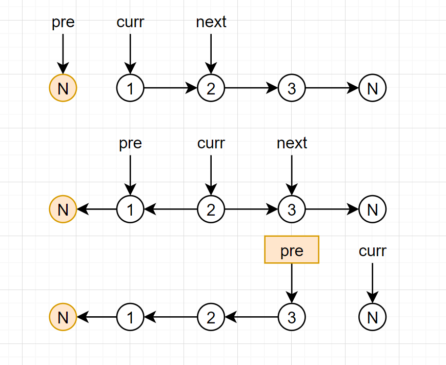

## 206. 反转链表

### 题目描述

[206. 反转链表](https://leetcode-cn.com/problems/reverse-linked-list/)

反转一个单链表。

**示例:**

```
输入: 1->2->3->4->5->NULL
输出: 5->4->3->2->1->NULL
```

**进阶:**
你可以迭代或递归地反转链表。你能否用两种方法解决这道题？

### 迭代做法

我们的目标就是：让最开始的节点指向空，第二个节点指向第一个节点……最后一个节点指向倒数第二个节点，最后返回最后一个节点。

如何实现呢，其实思路很简单：

- 我们需要每次用两个指针拿出两个两个节点【当然最开始的两个节点我们把它看成null和1】，我们用pre表示第一个节点，用curr表示第二个节点，翻转 关系表示为：`curr.next = pre`；
- 我们每次将指针同时向后移动，表示处理下一对节点，pre向后移动表示为：`pre = curr`，但curr怎么向后移呢，此时curr的next指针已经指向pre，也就是说第一步的时候，curr的next指针已经丢失，这样是显然不行的。
- 这时，我们就需要用到链表中一个非常常用的手段，将curr.next指针暂存起来，`ListNode next = curr.next`，curr向后移动就可以表示为：`curr = next`；
- 终止条件是什么呢，其实链表的题目画一画图基本就出来了，当curr指向null的时候，pre正好指向最后一个节点，也就是本题需要的新头，返回pre即可。



```java
class Solution {
    public ListNode reverseList(ListNode head) {
        ListNode pre = null, curr = head, next = null;
        while( curr!=null){
            next = curr.next;
            curr.next = pre;
            pre = curr;
            curr = next;

        }
        return pre;
    }
}
```

【第二个迭代做法】

思路大致差不多，不解释了，直接画图。


```java
    public ListNode reverseList(ListNode head) {
        if(head == null) return null;
        ListNode p = head, q = p.next;
        while(q!=null){
            ListNode n = q.next;
            q.next = p;
            p = q;
            q = n;
        }
        head.next = null;
        return p;
    }
```

