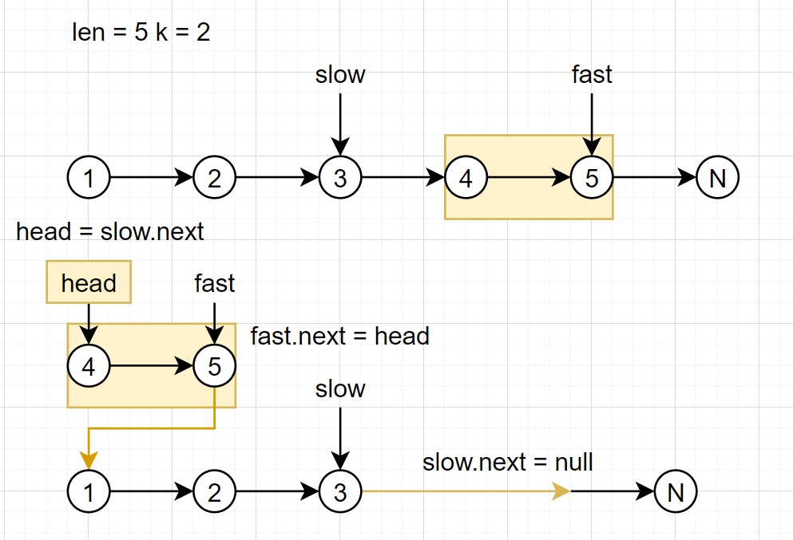

[61. 旋转链表](https://leetcode-cn.com/problems/rotate-list/)

难度中等328

给定一个链表，旋转链表，将链表每个节点向右移动 *k* 个位置，其中 *k* 是非负数。

**示例 1:**

```
输入: 1->2->3->4->5->NULL, k = 2
输出: 4->5->1->2->3->NULL
解释:
向右旋转 1 步: 5->1->2->3->4->NULL
向右旋转 2 步: 4->5->1->2->3->NULL
```

**示例 2:**

```
输入: 0->1->2->NULL, k = 4
输出: 2->0->1->NULL
解释:
向右旋转 1 步: 2->0->1->NULL
向右旋转 2 步: 1->2->0->NULL
向右旋转 3 步: 0->1->2->NULL
向右旋转 4 步: 2->0->1->NULL
```

思考：

- k%链表长度
- 双指针找到倒数第k+1的位置。
- 最后一个节点指向第一个节点，倒数第k+1个节点指向null，head指向倒数第k个点。



```java
class Solution {
    public ListNode rotateRight(ListNode head, int k) {
        if(head == null) return null;
        int n = 0;
        for(ListNode p = head; p != null; p = p.next) n++; //链表总结点数
        k %= n; //每次要移动尾部的k个数到头部
        ListNode slow = head, fast = head;
        while(k -- > 0) fast = fast.next; 
        while(fast.next!= null){
            fast = fast.next;
            slow = slow.next;
        }//双指针找到倒数第k+1的位置
        fast.next = head;
        head = slow.next;
        slow.next = null;
        return head;
    }
}
```

