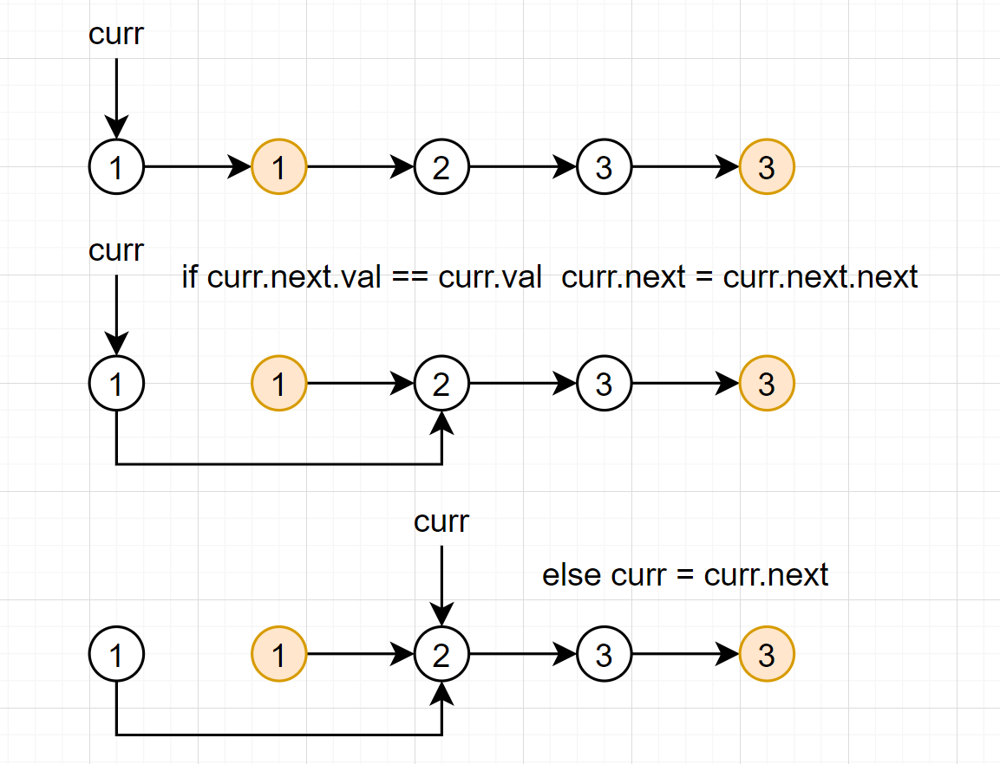

## 83. 删除排序链表中的重复元素

[83. 删除排序链表中的重复元素](https://leetcode-cn.com/problems/remove-duplicates-from-sorted-list/)

给定一个排序链表，删除所有重复的元素，使得每个元素只出现一次。

**示例 1:**

```
输入: 1->1->2
输出: 1->2
```

**示例 2:**

```
输入: 1->1->2->3->3
输出: 1->2->3
```

思考：

- 加入链表本身为空，返回，做一个特判。
- 假设保留第一个节点，让curr指向head。
- 判断下一个节点的取值和curr取值的关系：
  - 如果相等，就删除下一个节点，即`curr.next = curr.next.next`
  - 如果不相等，则让curr向后移一位，即`curr = curr.next`
- 终止条件是`curr.next==null`。



```java
class Solution {
    public ListNode deleteDuplicates(ListNode head) {
        if(head == null) return null;
        ListNode curr = head;
        while(curr.next !=null){
            if(curr.next.val == curr.val){
                curr.next = curr.next.next;
            }else{
                curr = curr.next;
            }
        }
        return head;
    }
}
```

