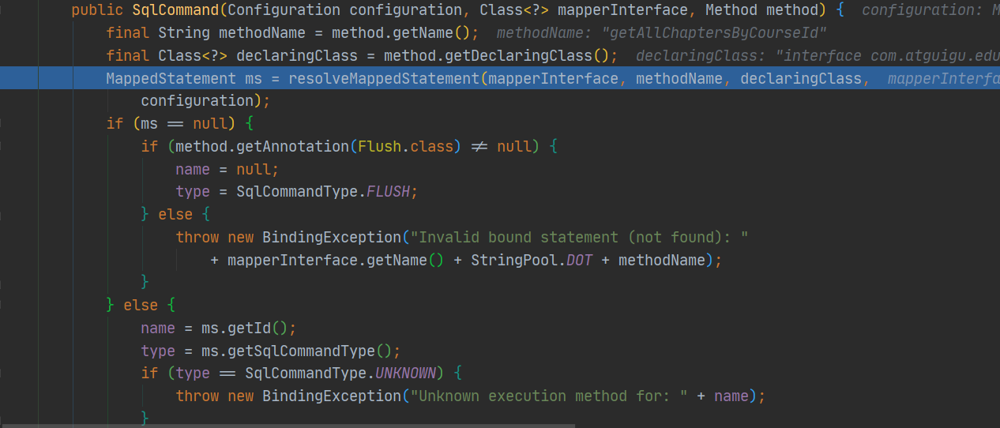

# org.apache.ibatis.binding.BindingException: Invalid bound statement (not found)

## 出错分析

Mapper接口存在的路径是`com\atguigu\eduService\mapper\EduChapterMapper.java`，且指定了一个根据courseId查询章节对象和小节对象封装的List。

```java
public interface EduChapterMapper extends BaseMapper<EduChapter> {
    
    List<Chapter> getAllChaptersByCourseId(@Param("courseId") String courseId);
}
```

章节和小节存在一对多的关系，且同属于一个课程，因此定义封装对象：

```java
@Data
public class Chapter {
    private String id;
    private String title;
    private List<Chapter> children = new ArrayList<>();
}
```

xml文件存在的路径是`com\atguigu\eduService\mapper\xml\EduChapterMapper.xml`

```xml
<?xml version="1.0" encoding="UTF-8"?>
<!DOCTYPE mapper PUBLIC "-//mybatis.org//DTD Mapper 3.0//EN" "http://mybatis.org/dtd/mybatis-3-mapper.dtd">
<mapper namespace="com.atguigu.eduService.mapper.EduChapterMapper">
    <resultMap id="ChapterMap" type="com.atguigu.eduService.entity.chapter.Chapter">
        <id property="id" column="c_id"/>
        <result property="title" column="c_title"/>
        <collection property="children" ofType="com.atguigu.eduService.entity.chapter.Chapter">
            <id property="id" column="v_id"/>
            <result property="title" column="v_title"/>
        </collection>
    </resultMap>
    <select id="getAllChaptersByCourseId" parameterType="java.lang.String" resultMap="ChapterMap">
                select c.id c_id,c.title c_title,v.id v_id,v.title v_title
        from edu_chapter c inner join edu_video v on c.course_id = v.course_id where v.course_id = #{courseId} and v.chapter_id = c.id

    </select>
</mapper>
```

刚看到错误的时候，十分不能理解，怎么会这样呢？明明我的namespace+id是可以和Mapper的方法名对应的呀。

虽然xml文件的规则比较生疏，但是我一直就不觉得是我得语句写错了，于是我猜想是不是没有没有扫描到xml呢。

## 尝试解决

于是，我觉得开始打个断点，一步一步调试，看到底是哪一步出了差错，一路畅通无阻，直到这一步：


也就是说在执行SqlCommand方法的时候出了异常，而此时mapper方法相关的信息其实是可以读取到的，大致就能猜到是xml的问题了。



继续跟进之后，就能够看到抛出的异常信息：Invalid bound statement (not found)，也就是ms==null成立了。那么原因就是出在这里面了。


此时statementId也就是`com.atguigu.eduService.mapper.EduChapterMapper.getAllChaptersByCourseId`是可以读取到的，这时mybatis其实就会去configuration对象的mappedStatements中去寻找到对应的statement。（我是用的是Mybatis_plus，底层已经封装了一百多个statement）

而这里的`configuration.hasStatement(statementId)`执行结果为false，也就是说根本找不到！那么最终确信确实是一开始扫描xml的时候没有扫描到。

发现问题之后，我便开始有针对性地查找资料，最终通过配置mappersLocation和pom.xml解决：

```yml
mybatis-plus:
  mapper-locations:
    - classpath*:com/atguigu/**/mapper/xml/*.xml
```

```xml
    <build>
        <resources>
            <resource>
                <directory>src/main/resources</directory>
                <filtering>true</filtering>
            </resource>
            <resource>
                <directory>src/main/java</directory>
                <includes>
                    <include>**/*.xml</include>
                </includes>
            </resource>
        </resources>
    </build>
```

这个过程中，还搜索到了这个问题相关的解决方案：https://www.cnblogs.com/yw-ah/p/10197493.html

## 总结

有时候从没遇到过的小问题，网上找不到很好的解决方案的时候，其实可以自己试着去理解问题出错的由来，也就是debug。一步一步调试下来，理清思路，问题也就迎刃而解了，下一次遇到相似的问题的时候，也就驾轻就熟了。