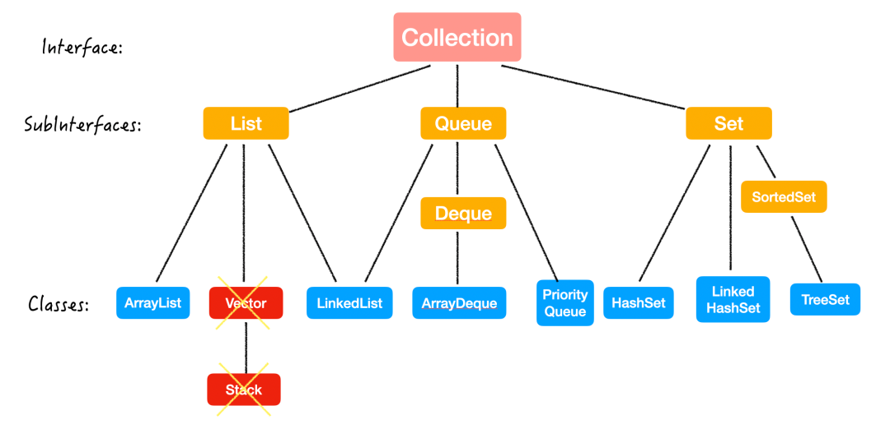

- Collection存放单一元素
- Map存放key-value键值对。

# List：有序，可重复

# Queue：先进先出

- 普通队列，先进先出：LinkedList和ArrayQueue，ArrayQueue效率更高。
  - ArrayDeque 是一个可扩容的数组，LinkedList 是链表结构；
  - ArrayDeque 里不可以存 null 值，但是 LinkedList 可以；
  - ArrayDeque 在操作头尾端的增删操作时更高效，但是 LinkedList 只有在当要移除中间某个元素且已经找到了这个元素后的移除才是 O(1) 的；
  - ArrayDeque 在内存使用方面更高效。
- 优先队列：PriorityQueue
- 栈：ArrayQueue

# Set：后进先出

- Stack类继承了Vector，几乎不推荐使用，如果想要实现栈的语义，可以使用Deque。

# Set：无序，不重复

HashSet：采用HashMap的key存储元素，基本操作o（1），无序。

LinkedHashSet：HashSet+LinkedList结构，既拥有o（1）复杂度，还保留了插入的顺序。

TreeSet：红黑树，可以有序，可以用自然排序或者自定义比较器来排序，但查询速度不如HashSet。

# MAP

一、负载因子默认为0.75：单个hash槽内元素个数为8的概率小于百万分之一，所以将7作为一个分水岭，等于7的时候不转换，大于等于8的时候才进行转换，小于等于6的时候退化为链表。

二、jdk1.7，1.8的区别：

- 数组+链表，变成数组+链表+红黑树。
- 头插法，改为尾插法，再resize的时候保证节点直接引用的正确性，不会再多线程情况下造成链表回环。

三、线程安全问题解决

- 使用Collections.synchronizedMap创建线程安全的map集合。
  - 内部维护了普通对象Map和排斥锁mutex。
  - 如果没传入mutex，对象排斥锁被赋值为this，也就是调用synchronizedMap的对象，就是传入的map
  - 再操作map的时候，就会对对应的方法加锁。
- Hashtable：加锁
  - 线程安全，但效率低下，synchronized。
  - hashtable不允许键或值为null（put控制的时候会直接抛出空指针异常），而hashmap的键值都可以为null。
- ConcurrentHashMap，性能明显更优。

四、hashmap和hashtable的不同点

- hashtable不允许键或值为null（put控制的时候会直接抛出空指针异常），而hashmap的键值都可以为null。
- hashtable线程安全，但效率低，hashmap多线程环境下会存在并发安全问题，效率高。
- hashtable初始容量为11，hashmap初始容量为16，负载因子都是0.75。
- 使用迭代器不同，一个是Enumerator，一个是Iterator，是fail-fast的。
- 扩容机制不同，当前容量大于总容量*负载因子的时候，hashmap翻倍，hashtable为当前容量翻倍+1。
- 实现方式不同，hashtable继承Dictionary，HashMap继承AbstractMap类。

五、fail-fast机制

- 在用迭代器遍历一个集合对象时，如果遍历过程中对集合对象的内容进行了修改，则会抛出ConcurrentModification Exception。
- 迭代器在遍历时直接访问集合中的内容，并且在遍历过程中使用一个modCount变量，遍历期间如果内容发生变化，就会改变modCount的值。
- 每次迭代器使用next()/hasNext()遍历下一个元素之前，都会检测modCount变量是否为expectedModcount值，如果不是，就抛出异常终止遍历。

> **Tip**：这里异常的抛出条件是检测到 modCount！=expectedmodCount 这个条件。如果集合发生变化时修改modCount值刚好又设置为了expectedmodCount值，则异常不会抛出。
>
> 因此，不能依赖于这个异常是否抛出而进行并发操作的编程，这个异常只建议用于检测并发修改的bug。

六、ConcurrentHashMap

