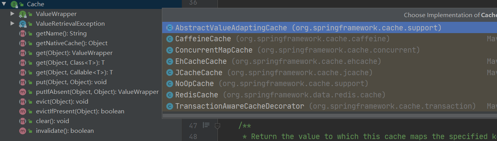

# 缓存的工作流程

先从缓存中读取数据，如果命中则直接返回结果，如果没有再从慢速设备上读取实际的数据，之后数据存入缓存。

我们常把经常读不经常写，且对安全性要求不高的数据存入缓存，让数据离消费者更近。

Spring3.1起，提供了注解Cache的支持，且提供了Cache的抽象。

# 常用接口及注解

## Cache接口

- 统一了缓存的操作，如put，get，evict，clear等。
- Spring也提供了许多缓存的实现，如RedisCache，EhCacheCache，ConcurrentMapCache等。

## CacheManager接口

我们的应用中可能会使用到多种Cache，于是，Spring还提供了缓存管理器，用于管理各种缓存组件。

接口中规定了两个需要实现的方法，一个是`getCache(name)`根据name获取缓存，一个是`getCacheNames()`获取该管理器管理的所有缓存名。

## @EnableCaching

开启基于注解的缓存，一般在redis的配置类上添加即可。

## @Cacheable

查询缓存，缓存命中，即返回。缓存未命中，读取数据库，将返回数据存入缓存，并返回。一般用于查询方法。

## @CachePut

每次都会执行，并将结果存入指定的缓存中，其他方法可以直接从响应的缓存中读取缓存数据，而不需要再去查询数据库，一般用于新增方法。

## @CacheEvit

会清空指定的缓存，一般用于在更新或删除方法上。

## @Caching

用于组合多个注解，可以看到该注解定义了三大注解的数组，如果我们需要多个注解标识方法，必要时我们可以通过自定义注解去简化。

# 注解中的主要参数

| 参数名                                     | 参数解释                                                     | 案例                                                         |
| ------------------------------------------ | ------------------------------------------------------------ | ------------------------------------------------------------ |
| value                                      | 缓存名，指定缓存存放的命名空间                               | @Cacheable(value=”mycache”)                                  |
| key                                        | 可选，需使用SpEL标签自定义缓存的key。                        | @Cacheable (value=”testcache”,key=”#userName”)          |
| condition                                  | 可选，需使用SpEL编写，返回布尔值，在方法前后都会判断         | @Cacheable (value=”testcache”, condition=”#userName.length()>2”) |
| allEntries (@CacheEvit)               | 是否清空所有缓存，默认为false， 如果为true，在方法调用后清空所有缓存 | @CachEvict (value=”testcache”,allEntries=true)          |
| beforeInvocation (@CacheEvit)         | 是否在方法执行前就清空，默认为false， 如果为true，在方法还没执行的时候就清空缓存 | @CachEvict(value=”testcache”， beforeInvocation=true)   |
| unless (@CacheEvit) (@CacheEvit) | 用于否决缓存，不同于condition在方法执行之后判断。            | @Cacheable (value=”testcache”,unless=”#result == null”) |

# Cache SpEL表达式

| **名字**        | **位置**           | **描述**                                                     | **示例**             |
| --------------- | ------------------ | ------------------------------------------------------------ | -------------------- |
| methodName      | root object        | 当前被调用的方法名                                           | #root.methodName     |
| method          | root object        | 当前被调用的方法                                             | #root.method.name    |
| target          | root object        | 当前被调用的目标对象                                         | #root.target         |
| targetClass     | root object        | 当前被调用的目标对象类                                       | #root.targetClass    |
| args            | root object        | 当前被调用的方法的参数列表                                   | #root.args[0]        |
| caches          | root object        | 当前方法调用使用的缓存列表（如@Cacheable(value={"cache1", "cache2"})），则有两个cache | #root.caches[0].name |
| *argument name* | evaluation context | 方法参数的名字. 可以直接 #参数名 ，也可以使用 #p0或#a0 的形式，0代表参数的索引； | #iban 、 #a0 、 #p0  |
| result          | evaluation context | 方法执行后的返回值（仅当方法执行之后的判断有效，如‘unless’，’cache put’的表达式 ’cache evict’的表达式beforeInvocation=false） | #result              |

# 参考文章

[https://www.iteye.com/blog/jinnianshilongnian-2001040](https://www.iteye.com/blog/jinnianshilongnian-2001040)