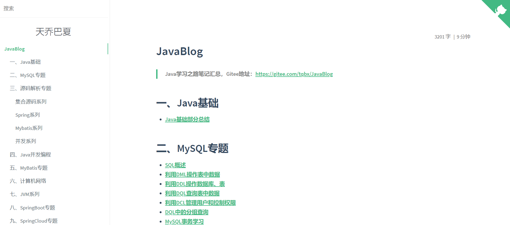
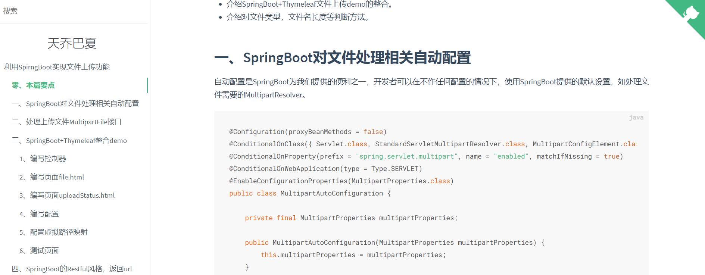
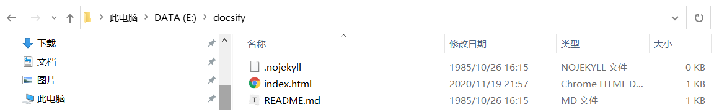
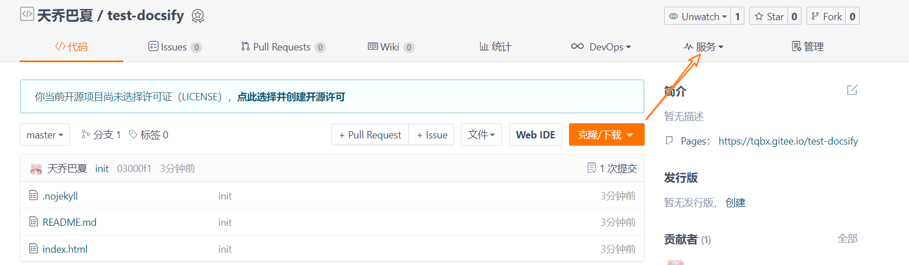
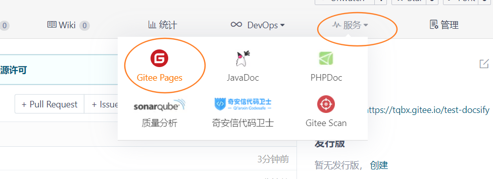

## 效果演示

> 推荐一个非常牛的文档网站生成器：[docsify](https://docsify.js.org/#/zh-cn/?id=docsify)

我通过这个工具，成功将码云上的个人学习笔记发布到GiteePages上，有兴趣的小伙伴可以戳一戳：[https://tqbx.gitee.io/javablog/](https://tqbx.gitee.io/javablog/)

话不多说，直接上图，文档效果如下：

主页`README.md`



文章详情页



咋样，默认风格绿色小清新，给我的体验非常nice。除此之外，它还提供许多非常强大的可定制的内容，最主要的是，你只需要敲几行命令就可以快速启动了！

如果你也想拥有一个这样的文档网站，可以查看官方网站：[https://docsify.js.org/#/zh-cn/quickstart](https://docsify.js.org/#/zh-cn/quickstart)，讲解十分详细，当然，本文也会做一定的记录。ok，让我们开始吧。

## 快速开始

为了演示，我们事先新建一个目录docsify用来存放待会要下载的内容。

进入docsify目录，打开命令行全局安装 `docsify-cli` 工具，可以方便地创建及在本地预览生成的文档。

```shell
$ npm i docsify-cli -g # 前提要安装好npm环境
```

初始化项目，我们直接在当前目录下初始化。

```shell
$ docsify init
```

初始化成功后，我们可以看到docsify目录下多出三个文件：

- `index.html` 入口文件
- `README.md` 会做为主页内容渲染
- `.nojekyll` 用于阻止 GitHub Pages 忽略掉下划线开头的文件



运行如下命令启动本地服务器，实时预览文档效果。

```shell
$ docsify serve # 默认启动当前目录，docsify serve docs表示启动当前目录下的docs目录
```

ok，接着访问：`localhost:3000/`，成功出现以下内容。


## 个性化定制

当然了，运行成功之后，你难免会想方设法去做一些适合自己的定制，比如代码高亮，链接，搜索，字数统计等等功能，你可以按照官网的文档，逐一添加自己喜欢的插件，在刚刚生成的`index.html`中定制。

我稍微做一下演示，抛砖引玉。

比如，假设我想**让我的网站名显示，并且右上角标注github图标**：

```html
  <script>
    window.$docsify = {
      name: '天乔巴夏',
      repo: 'https://github.com/TQBX'
    }
  </script>
```

如果你想要**统计字数并显示**，你可以添加如下插件：

```html
<script src="//unpkg.com/docsify-count/dist/countable.js"></script>
```

并进行如下设置：

```html
window.$docsify = {
  count:{
    countable:true,
    fontsize:'0.9em',
    color:'rgb(90,90,90)',
    language:'chinese'
  }
}
```

更多插件：https://docsify.js.org/#/zh-cn/plugins

如果你想更换主题，你可以更改css引入：

```html
<link rel="stylesheet" href="//cdn.jsdelivr.net/npm/docsify/themes/vue.css">
<link rel="stylesheet" href="//cdn.jsdelivr.net/npm/docsify/themes/buble.css">
<link rel="stylesheet" href="//cdn.jsdelivr.net/npm/docsify/themes/dark.css">
<link rel="stylesheet" href="//cdn.jsdelivr.net/npm/docsify/themes/pure.css">
<link rel="stylesheet" href="//cdn.jsdelivr.net/npm/docsify/themes/dolphin.css">
```

## 部署

部署的方式很多，这里使用Gitee的GiteePages，没啥的，就是国内访问的速度更快一点。

我们创建仓库并上传文件，点击服务，选择GiteePages





强制使用HTTPS，选择部署目录，默认为整个仓库。


接着访问生成的url即可：` https://tqbx.gitee.io/test-docsify`

> 注意，每次上传更新代码，服务不会自动更新，需要手动更新。