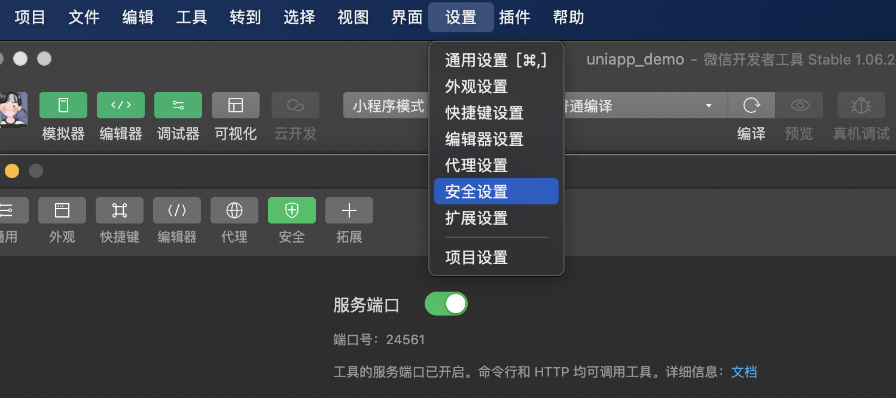

## 微信小程序开发申请

https://mp.weixin.qq.com/wxopen/waregister?action=step1

开发管理 -> appid

## Hbuilder X下载地址

https://www.dcloud.io/hbuilderx.html

## 微信小程序开发工具（官方）下载地址

https://developers.weixin.qq.com/miniprogram/dev/devtools/download.html

## 使用Hbuilder X运行第一个小程序

一、新建 项目 uniapp项目即可

二、Manifest.json 配置appid

三、打开官方工具，扫码登陆，安全设置，开放端口

四、Hbuilder X偏好设置，运行设置

五、运行到小程序模拟器

六、在开发者工具中打开即可

