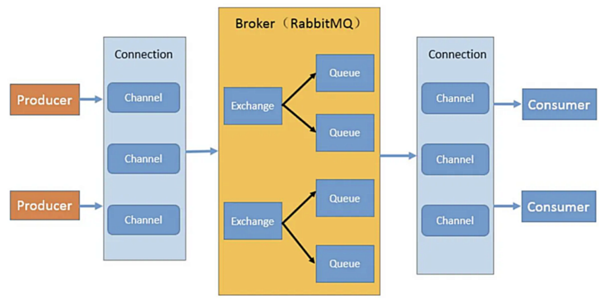

# 消息队列

## 模式

- 点对点：一个具体的消息只能由一个消费者消费
- 发布/订阅：单个消息可以被多个订阅者并发的获取和处理
  - 临时ephemeral订阅：只有在消费者启动并运行时候才存在。消费者退，订阅和没处理的消息就会丢失
  - 持久durable订阅：订阅一致存在，除非主动去删除。消费者退，消息系统维护订阅，后续消息可以继续被处理

## 衡量标准（重要）

消息队列技术选型，需要以下指标衡量：

- 消息顺序：保证消费顺序
- 消息路由：订阅规则
- 消息可靠性：是否会消息丢失
- 消息时序：消息存活时间和延迟/预定的消息
- 消息留存：消息消费成功后，是否还会继续保留在队列
- 容错性：保证消息消费成功的机制
- 伸缩：快速支持扩容和缩容
- 吞吐量：支持的高并发数

# RabbitMQ原理

RabbitMQ 2007年 Erlang语言开发的 开源消息队列系统，基于AMQP协议。

## 重要概念

AMQP：提供统一消息服务的**应用层**标准高级**消息队列协议**，面向消息的中间件设计

- Server、Connection、Channel、Message、Virtual Host、**Exchange**、Binding、RoutingKey、Queue

## 工作原理

AMQP协议模型：生产者Producer、消费者Consumer、服务端Server

1. Producer连接到Server，建立一个连接conn，开启一个信道channel。

2. Producer声明exchange和queue，设置相关属性，通过routing key将两者binding。

3. Consumer也需要建立连接，开启信道等，便于接受信息。
4. Producer发送消息message，发送到服务端的虚拟主机Virtual Host。
5. 虚拟主机中的交换器根据路由键选择路由规则，发送到不同的消息队列中。
6. 订阅了消息队列的消费者就可以获取到消息，进行消费。

## 交换器

RabbitMQ常用的交换器类型有四种

- direct：一对一、点对点
- topic：使用通配符匹配，*（有且仅有一个词）和#（一个或多个词）
- fanout：发布订阅
- headers：不是用路由键匹配的，而是匹配请求头中带的键值

## 消费原理

基本概念：

1. broker
2. 

## 高级特性

### 1. 过期时间

### 2. 消息确认

### 3. 持久化

### 4. 死信队列

### 5. 延迟队列

## 特性分析

# 实战！