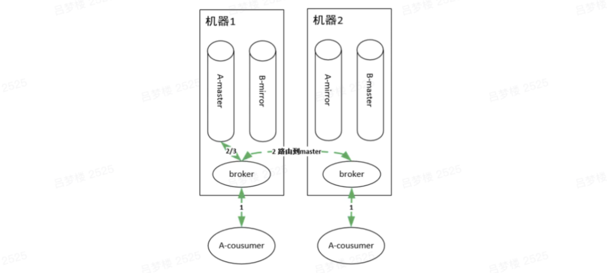

# 消息队列

## 模式

- 点对点：一个具体的消息只能由一个消费者消费
- 发布/订阅：单个消息可以被多个订阅者并发的获取和处理
  - 临时ephemeral订阅：只有在消费者启动并运行时候才存在。消费者退，订阅和没处理的消息就会丢失
  - 持久durable订阅：订阅一致存在，除非主动去删除。消费者退，消息系统维护订阅，后续消息可以继续被处理

## 衡量标准（重要）

消息队列技术选型，需要以下指标衡量：

- 消息顺序：保证消费顺序
- 消息路由：订阅规则
- 消息可靠性：是否会消息丢失
- 消息时序：消息存活时间和延迟/预定的消息
- 消息留存：消息消费成功后，是否还会继续保留在队列
- 容错性：保证消息消费成功的机制
- 伸缩：快速支持扩容和缩容
- 吞吐量：支持的高并发数

# RabbitMQ原理

RabbitMQ 2007年 Erlang语言开发的 开源消息队列系统，基于AMQP协议。

## 重要概念

AMQP：提供统一消息服务的**应用层**标准高级**消息队列协议**，面向消息的中间件设计

- Server、Connection、Channel、Message、Virtual Host、**Exchange**、Binding、RoutingKey、Queue

## 工作原理


AMQP协议模型：生产者Producer、消费者Consumer、服务端Server

1. Producer连接到Server，建立一个连接conn，开启一个信道channel。

2. Producer声明exchange和queue，设置相关属性，通过routing key将两者binding。

3. Consumer也需要建立连接，开启信道等，便于接受信息。
4. Producer发送消息message，发送到服务端的虚拟主机Virtual Host。
5. 虚拟主机中的交换器根据路由键选择路由规则，发送到不同的消息队列中。
6. 订阅了消息队列的消费者就可以获取到消息，进行消费。

## 交换器

RabbitMQ常用的交换器类型有四种

- direct：一对一、点对点
- topic：使用通配符匹配，*（有且仅有一个词）和#（一个或多个词）
- fanout：发布订阅
- headers：不是用路由键匹配的，而是匹配请求头中带的键值

## 消费原理

基本概念：

1. broker：每个节点运行的服务程序
2. master queue和mirror queue：每个队列都分为一个主队列master queue和若干个mirror queue（备份）主挂了，镜像顶上去提升为master

集群中有两个节点，每个节点有一个broker，每个broker负责本机上队列的维护，并且borker之间可以互相通信。



对于消费队列，如下图有两个consumer消费队列A，这两个consumer连在了集群的不同机器上。RabbitMQ集群中的任何一个节点都拥有集群上所有队列的元信息，所以连接到集群中的任何一个节点都可以，主要区别在于有的consumer连在master queue所在节点，有的连在非master queue节点上。

因为mirror queue要和master queue保持一致，故需要同步机制，正因为一致性的限制，导致所有的读写操作都必须都操作在master queue上（想想，为啥读也要从master queue中读？和数据库读写分离是不一样的），然后由master节点同步操作到mirror queue所在的节点。即使consumer连接到了非master queue节点，该consumer的操作也会被路由到master queue所在的节点上，这样才能进行消费。

## 高级特性

### 1. 过期时间

TTL：一条消息在队列中的最大存活时间

RabbitMQ，可以对消息和队列设置TTL，（如果消息进入队列之后，队列到了ttl还没有被消费，消息变成死信dead-letter，自动清除），不设置表示不会过期

### 2. 消息确认

保证消息从队列可靠地到达消费者

消费者订阅队列时，指定autoAck参数为false，rabbit会等到消费消费者回复的确认信号，收到确认信号之后才从内存或者磁盘中删除消息。（如果是true，自动确认模式，rabbitmq只管发，不管有没有真正被消费）

消息确认机制！autoAck = false

### 3. 持久化

持久化 也是保证消息可靠性的， 防止异常情况下丢失数据

rabbitmq的持久化分为三个部分：

1. 交换器持久化：如果不持久化，重启服务后，相关交换器元数据丢失，消息不回发送到这个交换器了。
2. 队列持久化：durable=true，声明队列时，保证其本身的元数据不会因异常情况而丢失，但是不能保证内部所存储的消息不会丢失。
3. 消息持久化：可以将所有消息都持久化，但是影响性能，因为磁盘写入速度比内存写入慢的多

### 4. 死信队列 Dead-Letter Queue

当一个消息在一个队列中变成死信后，能重新发送到另一个交换器中，这个交换器叫死信交换器，和交换器绑定的队列叫死信队列。

消息变成死信的几种情况：

- 消息被拒绝
- 消息过期
- 队列达到最大长度

**死信队列有什么用**？当发生异常的时候，消息不能够被消费者正常消费，被加入到了死信队列中。后续的程序可以根据死信队列中的内容分析当时发生的异常，进而改善和优化系统。

### 5. 延迟队列 Lazy Queue

消费者延迟消费信息，当消息发送后，等待特定时间后，消费者才能拿到这个消息进行消费。

使用场景：延迟消费、延迟重试

## （重要）特性分析

为什么Rabbit支持这些特性：

1. 支持消息路由：不同的交换器支持不同的消息路由
2. 消息时序：支持延迟队列，过期时间ttl
3. 容错处理：交付重试、死信交换器（dlx）处理消息故障
4. 伸缩：master queue和mirror queue
5. 持久化：不太好，因为消费过的消息会被马上删除
6. 高吞吐（一般）：所有请求的执行在master queue，单机性能达不到10w级别

为什么不支持：

1. 消息有序（不支持）：消息消费失败，重新回队列，重新消费
2. 消息回溯（不支持）：消息不支持永久保存

# 实战！

docker compose安装rabbitmq

```yml
# 命令执行 docker-compose -f docker-compose-environment.yml up -d
version: '3.9'
services:
  rabbitmq:
    image: rabbitmq:3.12.9
    container_name: rabbitmq
    restart: always
    ports:
      - "5672:5672" # AMQP 协议端口
      - "15672:15672" # 管理界面端口
    environment:
      RABBITMQ_DEFAULT_USER: admin
      RABBITMQ_DEFAULT_PASS: admin
    command: rabbitmq-server
    volumes:
      - ./rabbitmq/enabled_plugins:/etc/rabbitmq/enabled_plugins
```


