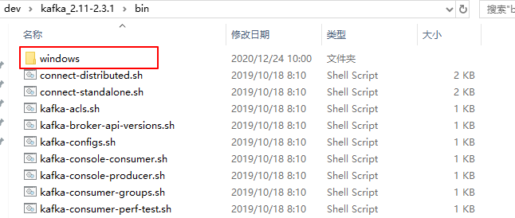
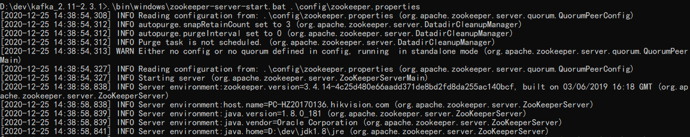
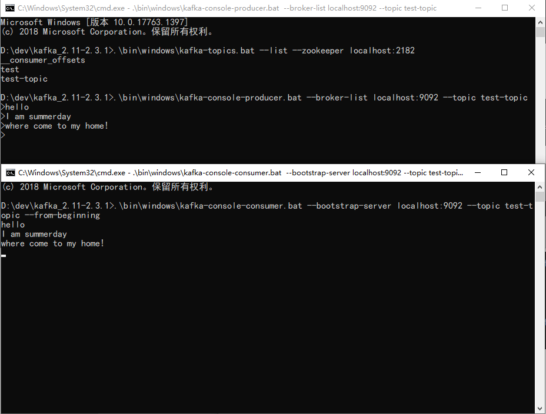

[toc]

> 官方文档：[http://kafka.apache.org/23/documentation.html#introduction](http://kafka.apache.org/23/documentation.html#introduction)
>
> 中文文档：[https://kafka.apachecn.org/](https://kafka.apachecn.org/)

## 本篇要点

1. 介绍kafka的特性、概念、API及专业术语。
2. 介绍Windows环境下kafka的安装配置，启动测试。
3. Java客户端连接kafka的案例演示。

## Kafka介绍

Apache Kafka 是一个分布式流处理平台：`distributed streaming platform`。

### 作为流处理平台的三种特性

1. 可发布和订阅消息（流），这与消息队列或企业消息系统类似。
2. 以容错（故障转移）的方式存储消息（流）。
3. 提供实时的流处理。

### 主要应用

kafka主要应用于两大类应用：

1. 构建实时的流数据通道，可靠地获取系统和应用程序之间的数据。
2. 构建实时流的应用程序，对数据流进行转换或反应。

### 四个核心API

1. Producer API：发布消息到一个或多个topic主题上。
2. Consumer API：订阅一个或多个topic，处理产生的消息。
3. Streams API：流处理器，从一个或多个topic消费输入流，并产生一个输出流到一个或多个输出topic，有效地将输入流转换到输出流。
4. Connector API：可构建或运行可重用地生产者或消费者，将topic连接到现有地应用程序或数据系统。


### 基本术语

Topic：kafka将消息分类，每一类的消息都有一个主题topic。

Producer：生产者，发布消息的对象。

Consumer：消费者，订阅消息的对象。

Broker：代理，已发布的消息保存在一组服务器中，称之为kafka集群，集群中每个服务器都是一个代理(broker)。消费者可以订阅一个或多个主题，并从broker上拉取数据，从而消费这些已发布的消息。

Partition：Topic物理上的分组，**一个Topic可以分为多个partition，每个partition都是一个顺序的、不可变的消息队列，且可以持续添加**。Partition中的每条消息都会被分配一个有序的序列号，称为偏移量（offset），因此每个分区中偏移量都是唯一的。


Consumer Group：每个Consumer属于一个特定的Consumer Group，这是kafka用来实现一个Topic消息的广播【发送给所有的consumer的**发布订阅式**消息模型】和单播【发送给任意一个consumer**队列**消息模型】的手段。一个topic可以有多个consumer group。

- 如果要实现广播，只要每个consumer有独立的consumer group就可以，此时就是发布订阅模型。
- 如果要实现单播，只要所有的consumer在同一个consumer group中就可以，此时就是队列模型。

> **关于Consumer group的补充**：一般来说，我们可以创建一些consumer group作为逻辑上的订阅者，每个组中包含数目不等的consumer，一个组内的多个消费者可以用来扩展性能和容错。
>
> **关于partition分区的补充**：
>
> 1、【负载均衡】处理更多的消息，不受单台服务器的限制。
>
> 2、【顺序保证】kafka不能保证并行的时候消息的有序性，但是可以保证一个partition分区之中，消息只能由消费者组中的唯一一个消费者处理，以保证一个分区的消息先后顺序。
>
> 如下图：2个kafka集群托管4个分区(p0-p3)，2个消费者组，组A有2个消费者实例，组B有4个消费者实例。


> 关于偏移量的补充：kafka集群将会保持所有的消息，直到他们过期，无论他们是否被消费。当消费者消费消息时，偏移量offset将会线性增加，但是**消费者其实可以控制实际的偏移量，可以重置偏移量为更早的位置，意为着重新读取消息**，且不会影响其他消费者对此log的处理。


## 快速开始

### 安装配置Zookeeper

Kafka的安装配置启动需要依赖于Zookeeper，Zookeeper的安装配置可以参考我的前一篇文章。

当然，其实你下载kafka之后，就自动已经集成了Zookeeper，你可以通过修改配置，启动内置的zookeeper。

> 关于使用内置的Zookeeper还是自己安装的Zookeeper的区别，可以看看这篇文章：[https://segmentfault.com/q/1010000021110446](https://segmentfault.com/q/1010000021110446)

### 下载kafka

下载地址：[http://kafka.apache.org/downloads](http://kafka.apache.org/downloads)

下载二进制版本【Binary downloads】，下载完成之后，解压到合适的目录下。

笔者目录为：`D:\dev\kafka_2.11-2.3.1`。

### 配置文件

进入`config`目录下，找到`server.properties`文件并修改如下：

```properties
log.dirs=D:\\dev\\kafka_2.11-2.3.1\\config\\kafka-logs
zookeeper.connect=localhost:2182 # 默认端口是2181，这里修改为2182
```

找到`zookeeper.properties`文件，修改如下：

```properties
dataDir=D:\\softs\\zookeeper-3.4.13\\datas 
dataLogDir=D:\\softs\\zookeeper-3.4.13\\logs
clientPort=2182
```

### Windows的命令

在bin目录下存放着所有可以使用的命令行指令，Linux和Windows的存放目录需要注意：




### 启动Zookeeper

```shell
D:\dev\kafka_2.11-2.3.1> .\bin\windows\zookeeper-server-start.bat .\config\zookeeper.properties
```




### 启动Kafka

```shell
D:\dev\kafka_2.11-2.3.1> .\bin\windows\kafka-server-start.bat .\config\server.properties
```


## 进行测试

### 创建topic

创建1个分区1个副本，topic为test-topic

```shell
D:\dev\kafka_2.11-2.3.1>.\bin\windows\kafka-topics.bat --create --zookeeper localhost:2182 --replication-factor 1 --partitions 1 --topic test-topic
Created topic test-topic.
```

### 查看topic

```shell
D:\dev\kafka_2.11-2.3.1>.\bin\windows\kafka-topics.bat --list --zookeeper localhost:2182
test-topic
```

### 生产者

```shell
D:\dev\kafka_2.11-2.3.1>.\bin\windows\kafka-console-producer.bat --broker-list localhost:9092 --topic test-topic
```

### 消费者

```shell
D:\dev\kafka_2.11-2.3.1>.\bin\windows\kafka-console-consumer.bat --bootstrap-server localhost:9092 --topic test-topic --from-beginning
```

### 生产者与消费者消息传递




### 删除topic

如果kafka启动时加载的配置文件中 server.properties 中没有配置delete.topic.enable=true，则此删除非真正删除，而是仅仅将topic标记为marked for deletion

```shell
D:\dev\kafka_2.11-2.3.1>.\bin\windows\kafka-topics.bat --delete --zookeeper localhost:2182 --topic test-topic

Topic test-topic is marked for deletion.
Note: This will have no impact if delete.topic.enable is not set to true.
```

### 登录内置的zookeeper客户端

```shell
D:\dev\kafka_2.11-2.3.1\bin\windows>zookeeper-shell.bat localhost:2182

Connecting to localhost:2182
Welcome to ZooKeeper!
JLine support is disabled
```

### 物理删除topic

```shell
ls /brokers
[ids, topics, seqid]
ls /brokers/topics
[test, test-topic, __consumer_offsets]
rmr /brokers/topics/test-topic # 物理删除 test-topic 
ls /brokers/topics
[test, __consumer_offsets]
```

## Java客户端使用

### 引入依赖

```xml
        <dependency>
            <groupId>org.apache.kafka</groupId>
            <artifactId>kafka-clients</artifactId>
            <version>2.6.0</version>
        </dependency>
```

### 生产者

```java
public class ProducerExample {

    public static void main(String[] args) {
        Map<String, Object> props = new HashMap<>();
        props.put("zk.connect", "localhost:2182");
        props.put("bootstrap.servers", "localhost:9092");
        props.put("acks", "all"); 
        props.put("retries", 0);
        props.put("batch.size", 16384);
        props.put("linger.ms", 1);
        props.put("buffer.memory", 33554432);
        props.put("key.serializer", "org.apache.kafka.common.serialization.StringSerializer");
        props.put("value.serializer", "org.apache.kafka.common.serialization.StringSerializer");
        Producer<String, String> producer = new KafkaProducer<>(props);
        String topic = "test";
        for (int i = 1; i <= 100; i++) {
            // send方法是异步的 ， 返回Future对象，如果调用get()，将阻塞，直到相关请求完成并返回消息的metadata或抛出异常
            producer.send(new ProducerRecord<>(topic, "key" + i, "msg" + i * 100));
        }
        // 生产者的传冲空间池保留尚未发送到服务器的消息，后台I/O线程负责将这些消息转换程请求发送到集群
        // 如果使用后不关闭生产者，将会丢失这些消息。
        producer.close();
    }

}
```

- zk.connect：设置zookeeper的地址。
- bootstrap.servers：用于建立与 kafka 集群连接的 host/port 组。
- acks：判断是不是成功发送，指定`all`将会阻塞消息，这种设置性能最低，但是是最可靠的。
- retries：如果请求失败，生产者会自动重试，我们指定是0次，如果启用重试，则会有重复消息的可能性。

- batch.size：(生产者)缓存每个分区未发送的消息。缓存的大小是通过 `batch.size` 配置指定的。值较大的话将会产生更大的批。并需要更多的内存（因为每个“活跃”的分区都有1个缓冲区）。
- linger.ms：默认缓冲可立即发送，即便缓冲空间还没有满，但是，如果你想减少请求的数量，可以设置linger.ms大于0。这将指示生产者发送请求之前等待一段时间，希望更多的消息填补到未满的批中。这类似于TCP的算法，例如上面的代码段，可能100条消息在一个请求发送，因为我们设置了linger(逗留)时间为1毫秒，然后，如果我们没有填满缓冲区，这个设置将增加1毫秒的延迟请求以等待更多的消息。需要注意的是，在高负载下，相近的时间一般也会组成批，即使是 `linger.ms=0`。在不处于高负载的情况下，如果设置比0大，以少量的延迟代价换取更少的，更有效的请求。
- buffer.memory：控制生产者可用的缓存总量，如果消息发送速度比其传输到服务器的快，将会耗尽这个缓存空间。当缓存空间耗尽，其他发送调用将被阻塞，阻塞时间的阈值通过`max.block.ms`设定，之后它将抛出一个TimeoutException。
- key.serializer：用于序列化。
- value.serializer：用于序列化。

### 消费者

```java
public class ConsumerSample {

    public static void main(String[] args) {
        String topic = "test";// topic name

        Properties props = new Properties();
        props.put("bootstrap.servers", "localhost:9092");
        props.put("group.id", "testGroup1");
        props.put("enable.auto.commit", "true");
        props.put("auto.commit.interval.ms", "1000"); 
        props.put("key.deserializer", "org.apache.kafka.common.serialization.StringDeserializer");
        props.put("value.deserializer", "org.apache.kafka.common.serialization.StringDeserializer");
        Consumer<String, String> consumer = new KafkaConsumer(props);
        // 订阅多个主题
        consumer.subscribe(Arrays.asList(topic));
        while (true) {
            // 订阅一组topic之后，调用poll时，消费者将自动加入到组中。
            // 只要持续调用poll，消费者将一直保持可用，并继续从分配的分区中接收消息。
            // 消费者向服务器定时发送心跳，如果在session.timeout.ms配置的时间内无法发送心跳，被视为死亡，分区将重新分配
            ConsumerRecords<String, String> records = consumer.poll(100);
            for (ConsumerRecord<String, String> record : records)
                System.out.printf("*****************partition = %d, offset = %d, key = %s, value = %s%n", record.partition(), record.offset(), record.key(), record.value());
        }
    }
}
```

- bootstrap.servers：用于建立与 kafka 集群连接的 host/port 组。
- group.id：消费者的组名，组名相同的消费者被视为同一个消费组。
- enable.auto.commit：设置Consumer 的 offset 是否自动提交。
- auto.commit.interval.ms：上面属性设置为true，由本属性设置自动提交 offset 到 zookeeper 的时间间隔，时间是毫秒
- key.deserializer：用于反序列化。
- value.deserializer：用于反序列化。

Kafka通过进程池瓜分消息并处理消息，这些进程可以在同一台机器运行，也可以分布到多台机器上，以增加可扩展型和容错性，相同的`group.id`的消费者将视为同一个消费者组。

组中的每个消费者都通过`subscribe API`动态的订阅一个topic列表。kafka将已订阅topic的消息发送到每个消费者组中。并通过平衡分区在消费者分组中所有成员之间来达到平均。因此每个分区恰好地分配1个消费者（一个消费者组中）。所有如果一个topic有4个分区，并且一个消费者分组有只有2个消费者。那么每个消费者将消费2个分区。

消费者组的成员是动态维护的：如果一个消费者故障。分配给它的分区将重新分配给同一个分组中其他的消费者。同样的，如果一个新的消费者加入到分组，将从现有消费者中移一个给它。这被称为`重新平衡分组`。

### 启动Zookeeper和kafka

创建topic

```shell
D:\dev\kafka_2.11-2.3.1>.\bin\windows\kafka-topics.bat --create --zookeeper localhost:2182 --replication-factor 1 --partitions 1 --topic test
```

启动zookeeper

```shell
D:\dev\kafka_2.11-2.3.1>.\bin\windows\zookeeper-server-start.bat .\config\zookeeper.properties
```

启动kafka

```shell
D:\dev\kafka_2.11-2.3.1>.\bin\windows\kafka-server-start.bat .\config\server.properties
```

### 测试

先启动消费者ConsumerExample，再启动生产者ProducerExample，观察控制台。

## 总结

- kafka作为一个消息系统，它设计了partition分区，提供了负载均衡能力，保证了消息分区内的顺序。
- kafka拥有消费者组的概念，很好地实现发布订阅和队列式的消息模型。
- kafka作为一个存储系统，高性能，低延迟。
- kafka能够提供实时的流处理，提供强大的StreamsAPI，而不是简单的读写和存储。


## 参考阅读

- [http://kafka.apache.org/23/documentation.html#introduction](http://kafka.apache.org/23/documentation.html#introduction)
- [https://kafka.apachecn.org/](https://kafka.apachecn.org/)
- [芋道源码：消息队列kafka](http://www.iocoder.cn/Kafka/yuliu/doc/)
- [無名：kafka生产者Java客户端](https://www.orchome.com/303)
- [半兽人 kafka命令大全](https://www.orchome.com/454)