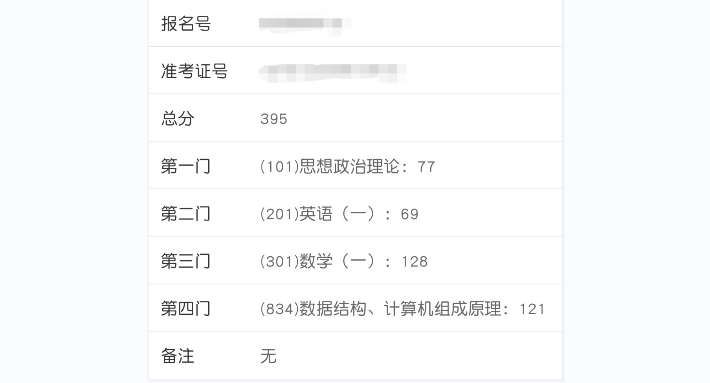

【西电22考研 计科院834】17级毕业生 本科双非通信专业 脱产在家 辞职跨考 一战上岸西安电子科技大学！

接下来我将从以下几个方面简单的介绍一下我自己，希望准备考研的小伙伴呢结合自己的实际，如果有需要的话，可以适当参考一下。

[toc]

- 初试科目及成绩介绍

- 个人情况介绍
- 数学一
- 英语一
- 政治
- 专业课834 数据结构+计组

## 初试科目及成绩介绍

**考研科目：数一英一政治 + 专业课834，目标院校：西安电子科技大学**

**初试成绩：政治77 英语69 数学128 专业课121**

## 个人情况介绍

> **每个人的情况不同，在此先申明我个人的基本情况，如有类似可适当参考。**

本科中国计量大学通信专业，但大学生活有点放飞自我，没有把学习这件事放在心上，绩点低的离谱GPA2.8/5.0。大三时考虑到毕业的事，便开始学习Java开发技术。2020年10月份拿到某厂Java开发的校招offer，实习了将近半年，四月份辞职，五月份决定违约脱产全力备考。

**各个学科的基础**

1. 高数：基本是从零开始，两年前为了参加某数学竞赛学习过一个月，最后考了13分连三等奖都没拿到的水平（但我自认为我的数学底子还行）。 

2. 英语：四级499， 六级考了4次都没过，毕业前那次426过了。

3. 政治：大学政治课都是水过去的，基本也是一片白纸。

4. 专业课：还算有点底气，虽然我是跨考，但是我找工作就是计算机方向的（刷了几百道力扣），所以数据结构不会太生疏。但是有一门部分科班也觉得难的**计算机组成原理**，比较头疼。

我在备考之前也会搜集各种经验贴，主要是看一下有哪些评价比较好的一些老师，有哪些比较值得借鉴的学习方法，再结合自己的实际情况，做一个取舍。我始终觉得，经验贴不能照搬，适合自己的才是最好的。

因此在接下来的分享中呢，我会淡化每天的时间安排，可能尽量地分享一些我用下来比较好的资料，听下来比较好的课程，以及一些小tips。

## 数学一

推荐一个我非常喜欢的up主没咋了，他在不久前刚分享了[23数学复习经验](https://www.bilibili.com/video/BV1fR4y1G7hX)，可以去看看。

接下我说说自己的安排， 我的数学备考 分为 **基础 + 强化** + 冲刺 三个阶段。

- 基础阶段：4月-6月底，主要是跟着张宇基础30讲（高数+线代+概率）+配套的基础300题+高昆仑老师的讲解 + 高数部分额外听了武忠祥老师的课程（相当于又过了一遍基础班讲义）。每听完一节课，我会对着讲义把学过的内容再在纸上梳理一遍，然后再做对应一节的习题，再听讲解，再针对薄弱的地方进行巩固。有时间的话可以自己做一下详细的笔记，回顾起来印象更加深刻一些。

  > - 武老：很细，非常细，比较照顾基础比较薄弱的同学。而且武老师极限部分真的牛逼，变着花样解题，b战上武老师有每日一题，可以每天打个卡。一题多解，yyds。
  > - 张宇网上诟病他不照顾基础薄弱的同学，可能是前几年，但去年开始他开设的基础班课程，是真的非常详细，干货满满。

- 强化阶段：7月-9月底，高数部分全程跟了张宇的强化高数18讲+武忠祥的17堂课（跳着听的），线代部分过了一遍李永乐的强化讲义+张宇的线代强化课，概率部分过了一遍余炳森的强化课+张宇的强化概率课。 习题部分刷了1000题的高数和线代部分 + 880全部 + 660高数部分。

  > - 强化阶段1000题型非常完整，但是做了真题之后会发现有些题非常奇怪，会有点偏。
  > - 个人非常推荐880，李林老师的880选题是真的非常nice。没咋了 有对应的视频解析。
  > - 660的话小题居多，非常符合目前选填大头的形式。
  >
  > 这些题目都需要定期回顾一下错题的，非常值得二刷！

- 冲刺阶段：10月份开始，就是自己总结每一章的题型，刷87年真题到最近一年的真题试卷+李艳芳真题解析。刷各种模拟卷：余炳森五套+李艳芳第一套+李正元前两套+张宇过关版前两套 + **李林6套+李林4套**。对了，还看了武老师的选填技巧班。

  > - 自己有意识的总结题型是非常重要的，能够让自己尽快的有思路，根据题型选择方法。
  >
  > - 真题不要舍不得做，只有做了真题，你才知道考试会怎么考，你才 知道某类题型的难度大概在哪。李艳芳老师的真题解析真的太详细啦，小白都看的懂！
  > - 不要贪恋太多模拟卷，不是说模拟卷做的越多，就能考高分的，模拟的是临场的感觉，以及弥补一些你可能模糊的重点知识点，而不是你完全不知道的难点。 模拟的时候一定要限时，尽量用标准的答题纸来模拟，并且模拟一定要按照考试的心态（用上一些蒙题技巧，先难后易等等，这是要练的）

数学就是学习知识点，刷题，做错了看解析，回顾知识点，接着刷题，循环。

关于数学备考的几个小tips：

1. **不要比进度！不要比进度！不要比进度！**数学知识点就摆在那里，会不会你自己心里清楚，不要骗自己。每天扎扎实实掌握一个知识点，比疯狂跳集看新知识点靠谱的多，心里更有底。
2. **刷题为主**，视频为辅。（我视频看的多，但我都是2倍速搞的，所以刷题时间也相对比较多）
3. 10月份之后的**题型总结**非常重要！有意识地去想，某个知识点该怎么出题。
4. 不要被真题模拟的高分迷惑，那些大多数都是你课上讲过的题目。
5. 不要贪太多的模拟卷，我个人觉得数学靠模拟卷来押题是不靠谱的，模拟卷模拟的是考场状态，比如选择题特殊值法可以适当用一用。（当然如果你基础扎实的话多刷刷见识思路是可以的）
6. **合理评估自己**，不要定太高的目标，拿自己该拿的分。也不要过于消极，因为有100分左右的题基础扎实，不失误是可以拿下的。

也许有些是老生常谈的废话了，但是真的很重要很重要！

## 英语一

虽然英语一考了69，但是我感觉我已经尽力了，毕竟我英语花的时间是最少的。 如果你的英语目标分数比较高，完全可以跳过。如果你基础比较差，那么可以试试我推荐的老师。

> 个人觉得英语各个部分重要程度： 阅读> 作文> 新题型>完型 （单词最重要！贯穿全部！）

我4月份-6月份主要任务就是背单词+长难句，暑假可能隔个两三天做一篇阅读吧，刚开始看的唐迟老师，后来发现没什么提高。后来在b站上看了颉斌斌老师的课程，详见恨晚，苦练颉教招法，终于有一次阅读全对！后来相继看了斌斌老师的新题型和完型等等。作文我开始的晚了，10月份才开始，但是跟着石雷鹏老师的节奏练，后面也有不错的效果。我记得我考试的时候作文写的飞快，虽然分只能打个平均水平，但是留了足够的时间在阅读和新题型的检查上面。

1. 英语最重要的就是**背单词**， 每天都要背！市面上阅读的逻辑，技巧啥的都是建立在你看得懂选项看得懂文章的前提下。且单词 用 app刷就好了， 我使用的墨墨背单词。不建议看视频，太浪费时间。
2. **长难句**可以关注田静老师的公众号，他每天会有阅读真题长难句 剖析，我跟了15天，后面坚持不了了哈哈哈哈（我好怕麻烦），但我觉得还是不错的。

2. 我英语基础较差，我不推荐唐迟老师的**阅读**，他的视频像是开了上帝视角，告诉你这篇文章这句话具体啥意思，然后推选项，现实是真正考试你都不一定读得懂文章（也有可能是我没花太多时间在英语上的原因）。当然，你如果英语基础好的话， 可以跟他， 考的高分跟他也挺多的。我听唐迟老师的课津津有味，自己做依然惨不忍睹。所以我后面跟颉斌斌老师，比较小众， 我觉得他的思维比较牛逼，b战上有视频，我网盘也有他的资源如果需要可以找我。

4. **新题型**，**完型**啥的，网上老师推荐很多，随便找一个就ok，我看的颉斌斌，感觉还ok。

5. 作文是比较重要的， 我当时听的石雷鹏老师，他的句式突出一个朴实无华，但是**听他的课可以让你到最后很轻松地写完一篇文章**，因为无论哪篇作文，都逃不开他的几个固定句式（全是背过的句子，牛犇啊），在别人最后一个月狂背作文的时候，你完全不需要焦虑的那种。我是比较推荐的，因为毕竟英语阅读是第一位的，作文这玩意别卡壳，能流利写完就很不错了。

tips：单词真的不能停的，不然你题目选项看不懂，技巧也用不上。 我考前那段时间紧张地没背单词，导致考前一天练了一篇阅读，一篇错了四个，吓得我狂补2000多个重点单词。（这个属于是错误示范，单词要天天背）

## 政治

我个人觉得吧，政治这门课得选择题得天下，因为最后大题答得好不好完全取决于肖老压不压得到题。

**准备时间**：目前来说政治还不需要发力（发力期在10、11、12月份）政治真的不要着急！专业课和数学课更重要！除非你的专业课和数学课真的已经觉得很稳了，你可以花多点时间在政治上。

**目前**：你只需要买本徐涛老师的那本配套的书，每天数学专业课学累了当放松去看一两个视频就好了。网上很多建议做肖秀荣的1000题的，有时间可以做（做马原部分就可以，其他部分有时间可以做，因为像毛中特这种的考时政，史纲会考和当年的历史事件相关的，每年都会变的）

**9-10月份：**可以适当准备一下马原的原理（因为马原大题，只要原理对了，基本的分数就能够拿到了！ 原理不对， 写的再多也没用！ 而且马原原理需要理解， 看的次数多了， 慢慢就能够理解， 且你前期马原选择题的 案例可以 过一遍）好像腿姐会开一个什么**技巧班**还是啥的 到时候再看看。

**10月份之后：**你的心态会发生变化，其实明明时间够的，但是周围会有很多人制造焦虑， 不要受影响，腿姐好像会出带背还是啥的，还不错，可以跟着梳理一下，配套腿姐的最后精炼版的小册子。

**11月份之后**：慢慢需要投入时间给政治了，这时候各个老师的模拟卷都会出，我当时用的小程序刷选择题，第一次刷50分拿了24分，刷完市面上所有的选择题之后，那时候基本就能够稳定在35+左右了，基础好的甚至45左右。然后必买的肖八 和肖四。 肖八的选择题+肖四选择题+肖四的大题（重要！），最后大家背的也就是肖四大题。 21考研肖爷爷牛皮压中了90%的大题，22年不尽如人意，基本就是靠抄材料，但也不会差太多，毕竟大家背的都是肖四，所以我的建议就是背肖四就够了。到时候会有很多肖四的带背视频，b站上，我当时跟的是空卡和苏一，他的马原部分的口诀还不错，建议到时候结合思维导图的那种背。 

总之 最重要的就是 选择题！大题拉不太开差距！选择题请认准刷题程序，我当时用的苍盾刷题，真的强烈推荐。

## 专业课834 数据结构+计组

我大三下自学java，为了找工作也特意刷了一些数据结构算法的视频，有一定的基础。计算机组成原理是一窍不通（可能会二进制转十进制这样）。应该是七月份左右开始的专业课学习，一般每天花个2到3个小时的亚子。

关于资料：

1. 买招生简章上写明的参考书（注意版本）。

2. 王道或者天勤的资料作为辅助。

3. 有条件的可以购买学校对应的辅导机构的材料。

<u>专业课最重要！最权威的！就是历年真题！</u>

### 数据结构与算法

**备考总结**：我去年是跟着某专业课辅导机构学习的，有些重点考试的内容上课学长反复提了很多次，有些不重要的内容也直接会提醒我们不需要花太多时间。所以跟着一遍下来，大概就对整本书的出题点有了一定的了解。期间，辅以做王道的选择题部分，而不需要过于关注王道的代码部分（有时间你可以看）。数据结构的大题比较固定，大多数是**往年真题**里出现过的题型，熟练掌握基本解法就可以了。有些章节王道是没有涉及的，但是是属于西电出题考点的，需要注意一下，比如广义表。

**习题推荐**：王道的选择题 + 408历年的数据结构题 + **833/834历年真题**

**课程推荐**：辅导班视频 or 王道视频

### 计算机组成原理

**备考总结**：计组是比较难的，有些知识点晦涩难懂，需要反复琢磨，尽量多找找视频去理解着记忆，或者使用编口诀大法。历年真题是比较重要的，有些重要的知识点，每年都会考，就需要重点去关注。近几年，408里的计组题也会被稍微改编一下出在试卷上，也非常建议关注一下。 计组学习的时候，我是自己整理了全书框架，做了详细笔记，反反复复地看了好几遍。背了又忘，忘了又背。专业课考完，我以为考得最好的是专业课，结果不知道咋回事，还没数学考的高。

**习题推荐**：推荐计组的课后习题 + 王道的选择题（但有些差异要自己区分一下）+ **408历年的计组真题** + **833/834历年真题**

> 408历年的计组真题 是真的 被低估了， 近两年都考到了以前的类似的难题， 比较有区分度。

**课程推荐**：车老师视频，如果有需要可以私聊我，联系方式在文末。

## 写在最后

以上呢，都是我个人备考的一些经验，如有需要，可适当参考。

我个人觉得：考研 = 选择 + 努力 + 心态， 而心态是很多人容易忽视的，学习规划什么的需要结合个人实际才合理，否则，只会让你更加焦虑。心态好能够帮助你发挥出尽可能多的实力，考研不是说你有150的实力你就能考150的，做好自己。我一再强调，不要和别人比进度，反反复复，扎扎实实，念念不忘，必有回响。自己掌握多少，只有自己心里清楚。

最后呢，文中提及的视频资料，如果有需要的小伙伴，可以私聊我。

