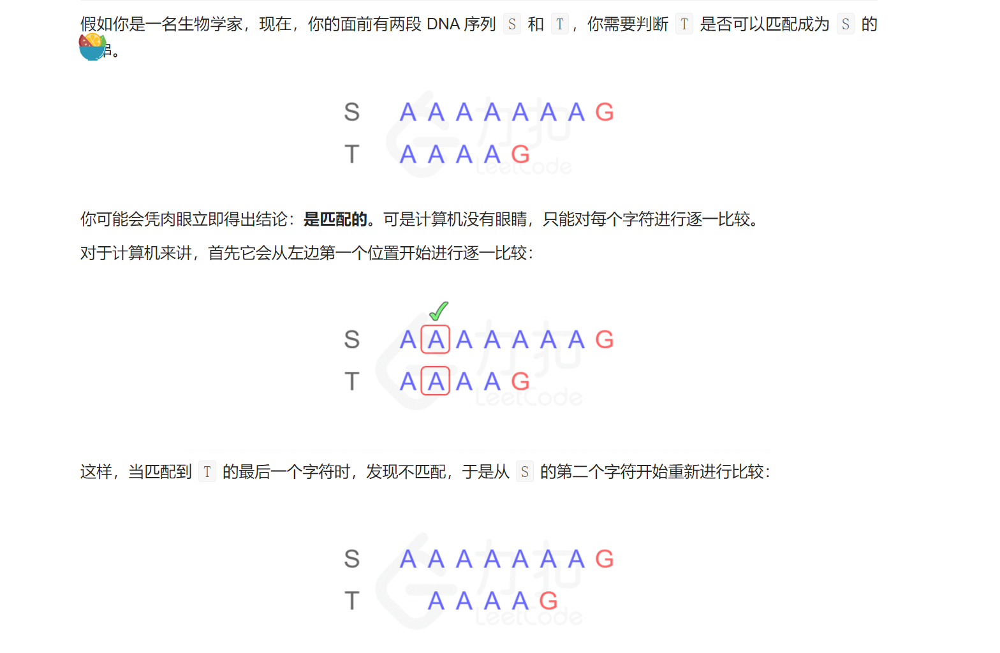
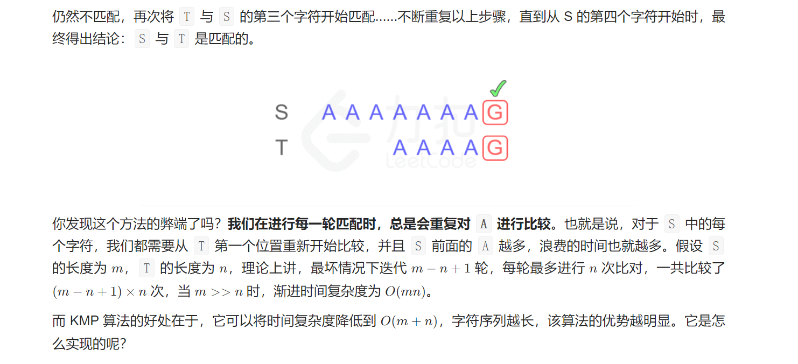
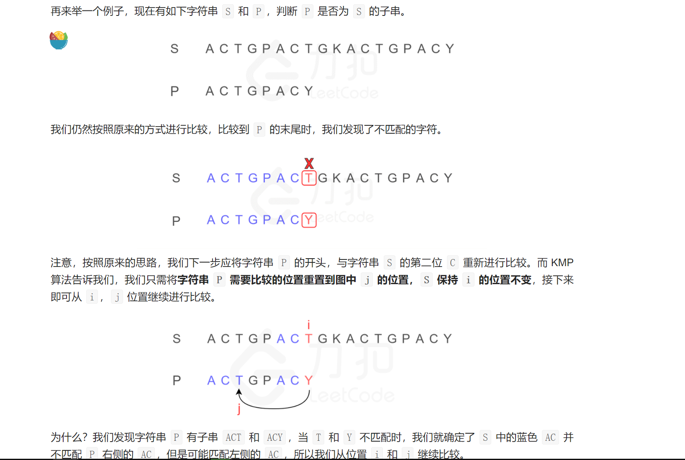
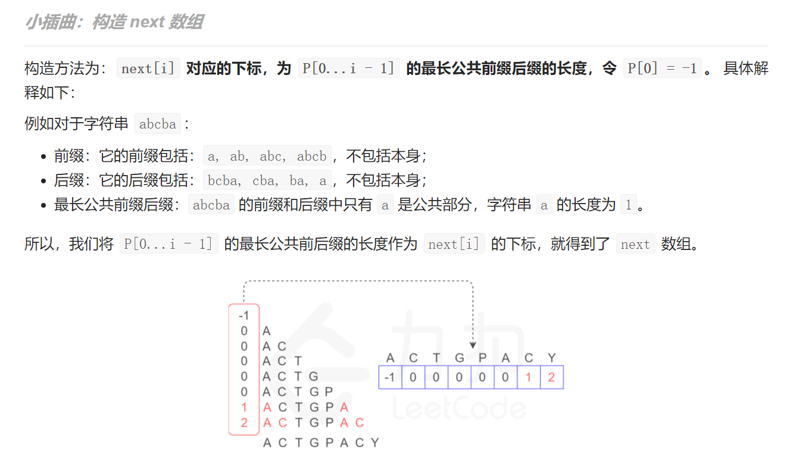
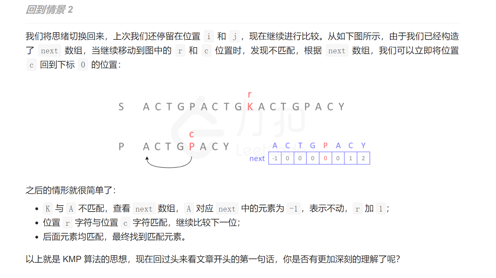

Knuth–Morris–Pratt（KMP）算法是一种改进的字符串匹配算法，它的核心是利用匹配失败后的信息，尽量减少模式串与主串的匹配次数以达到快速匹配的目的。它的时间复杂度是 O(m+n)。










---







```c++
int match (char* P, char* S){ // KMP 算法
    int* next = buildNext(P); // 构造 next 表
    int m = (int) strlen (S), i = 0; // 文本串指针
    int n = (int) strlen(P), j = 0; //模式串指针
    while (j < n && i < m) // 自左向右逐个比对字符
        if (0 > j || S[i] == P[j]) // 若匹配，或 P 已移除最左侧
            {i++; j++;} // 则转到下一字符
        else
            j = next[j]; // 模式串右移（注意：文本串不用回退）
    delete [] next; // 释放 next 表
    return i - j;
}
```

```c++
int* buildNext(char* P) { // 构造模式串 P 的 next 表
    size_t m = strlen(P), j = 0; // “主”串指针
    int* N = new int[m]; // next 表
    int  t = N[0] = -1; // 模式串指针
    while (j < m - 1)
        if ( 0 > t || P[j] == P[t]){ // 匹配
            j++; t++;
            N[j] = t; // 此句可改进为 N[j] = (P[j] != P[t] ? t : N[t]);
        }else // 失配
        t = N[t];
    return N;

}
```


