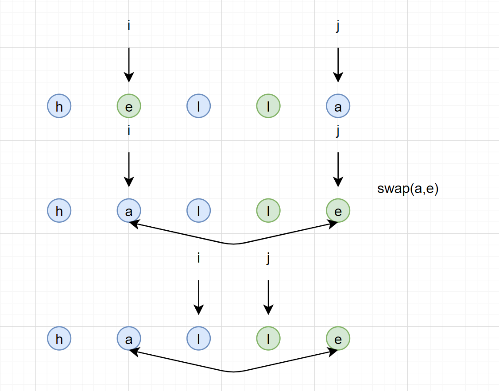

#### [345. 反转字符串中的元音字母](https://leetcode-cn.com/problems/reverse-vowels-of-a-string/)

编写一个函数，以字符串作为输入，反转该字符串中的元音字母。

**示例 1：**

```
输入："hello"
输出："holle"
```

**示例 2：**

```
输入："leetcode"
输出："leotcede"
```

**提示：**

- 元音字母不包含字母 "y" 。



```java
class Solution {
    public String reverseVowels(String s) {
        if(s == null || s.length() == 0) return s;
        char[] chs = s.toCharArray();
        int i = 0, j = chs.length -1;

        while( i < j ){
            while( i < j && !check(chs[i])) i++; //找到不为元音的指针
            while( i < j && !check(chs[j])) j--;
            swap( chs , i , j);
            i++; //左指针向右移
            j--; //右指针向左移
        }
        return new String(chs);
    }

    void swap(char[] chs , int i ,int j){ //交换两个字符
        char temp = chs[i];
        chs[i] = chs[j];
        chs[j] = temp;
    }

    boolean check(char c){ //判断是否为元音字母
        return c == 'a' || c == 'e' || c == 'i' || c == 'o' || c == 'u' 
            || c == 'A' || c == 'E' || c == 'I' || c == 'O' || c == 'U';
    }
}
```

