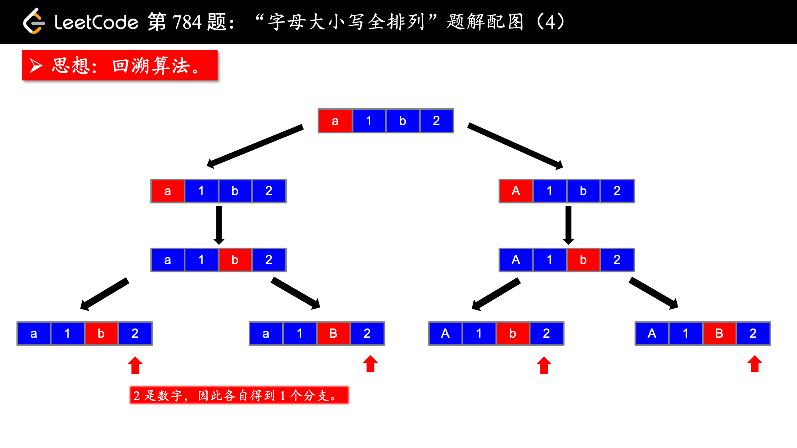

## 题目描述

[784. 字母大小写全排列](https://leetcode-cn.com/problems/letter-case-permutation/)

给定一个字符串`S`，通过将字符串`S`中的每个字母转变大小写，我们可以获得一个新的字符串。返回所有可能得到的字符串集合。

```
示例：
输入：S = "a1b2"
输出：["a1b2", "a1B2", "A1b2", "A1B2"]

输入：S = "3z4"
输出：["3z4", "3Z4"]

输入：S = "12345"
输出：["12345"] 
```

**提示：**

- `S` 的长度不超过`12`。
- `S` 仅由数字和字母组成。

## 思考要点

图文均参考liweiwei老师的讲解：[https://leetcode-cn.com/problems/letter-case-permutation/solution/shen-du-you-xian-bian-li-hui-su-suan-fa-python-dai/](https://leetcode-cn.com/problems/letter-case-permutation/solution/shen-du-you-xian-bian-li-hui-su-suan-fa-python-dai/)



1. 对于数字而言相当于可以直接跳过，直接`dfs(chs,u+1)`。
2. 对于字母而言，每次需要搜索两次，一次是原字母，搜完之后回溯，大小写转换，再搜索一次。
3. 大小写转换可以通过：`U = L^=32`完成，异或是一种不带进位的加法。

```java
    List<String> res = new ArrayList<>();
    public List<String> letterCasePermutation(String s) {
        if(s.length() == 0) return res;
        char[] chs = s.toCharArray();
        dfs(chs,0);
        return res;
    }

    void dfs(char[] chs, int u){
        if(u == chs.length){
            res.add(String.valueOf(chs));
            return;
        }
        char ch = chs[u];
        dfs(chs, u+1); 
        if(ch >= 65 && ch <= 90 || ch >= 97 && ch <= 122){
            chs[u] ^= (1 << 5);
            dfs(chs,u+1);
        }
    }
```

