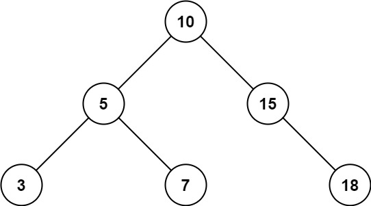

## [779. 第K个语法符号](https://leetcode-cn.com/problems/k-th-symbol-in-grammar/)

>0
>
>0 1
>
>0 1 1 0
>
>0 1 1 0 1 0 0 1
>
>第n行的数量比n - 1行多一倍，并且前半部分是和n - 1行一样， 后半部分是前半部分按位取反得到
>
>第 n 行的个数 1 << n - 1 

基础位运算 ： $$1 << n - 1 =  2 ^{n-1}$$ 

```java
    public int kthGrammar(int n, int k) {
        if(n == 1 || n == 0) return 0;
        int t = 1 << n - 2; //
        if(k <= t) return kthGrammar(n - 1, k);
        else return kthGrammar(n - 1, k - t) ^ 1;
    }
```

## [938. 二叉搜索树的范围和](https://leetcode-cn.com/problems/range-sum-of-bst/)

给定二叉搜索树的根结点 root，返回值位于范围 [low, high] 之间的所有结点的值的和。

 

```
输入：root = [10,5,15,3,7,null,18], low = 7, high = 15
输出：32
```

```java
class Solution {
    int low, high;
    public int rangeSumBST(TreeNode root, int low, int high) {
        this.low = low;
        this.high = high;
        return dfs(root); 
    }

    int dfs(TreeNode root){
        if(root == null) return 0;
		// 当前点的val < low ，从左子树递归
        if(root.val < low) return dfs(root.right);
		// 当前点的val > high ，从右子树递归
        if(root.val > high) return dfs(root.left);
		// 否则当前点的val满足要求，再分别从左右递归
        return root.val + dfs(root.left) + dfs(root.right);
    }
}
```

## [563. 二叉树的坡度](https://leetcode-cn.com/problems/binary-tree-tilt/)

给定一个二叉树，计算 整个树 的坡度 。

一个树的 节点的坡度 定义即为，该节点左子树的节点之和和右子树节点之和的 差的绝对值 。如果没有左子树的话，左子树的节点之和为 0 ；没有右子树的话也是一样。空结点的坡度是 0 。

整个树 的坡度就是其所有节点的坡度之和。

> 输入：root = [1,2,3]
> 输出：1
> 解释：
> 节点 2 的坡度：|0-0| = 0（没有子节点）
> 节点 3 的坡度：|0-0| = 0（没有子节点）
> 节点 1 的坡度：|2-3| = 1（左子树就是左子节点，所以和是 2 ；右子树就是右子节点，所以和是 3 ）
> 坡度总和：0 + 0 + 1 = 1

```java
class Solution {
    int ans = 0;
    public int findTilt(TreeNode root) {
        dfs(root);
        return ans;
    }

    int dfs(TreeNode root){
        if(root == null) return 0;
        int l = dfs(root.left);
        int r = dfs(root.right);
        ans += Math.abs(l - r);
        return root.val + l + r;
    }
}
```

## [剑指 Offer 10- I. 斐波那契数列](https://leetcode-cn.com/problems/fei-bo-na-qi-shu-lie-lcof/)

写一个函数，输入 `n` ，求斐波那契（Fibonacci）数列的第 `n` 项（即 `F(N)`）。斐波那契数列的定义如下：

```
F(0) = 0,   F(1) = 1
F(N) = F(N - 1) + F(N - 2), 其中 N > 1.
```

斐波那契数列由 0 和 1 开始，之后的斐波那契数就是由之前的两数相加而得出。

答案需要取模 1e9+7（1000000007），如计算初始结果为：1000000008，请返回 1。

### 超时递归

```java
class Solution {
    public int fib(int n) {
        int mod = 1000000007;
        if(n == 0 || n == 1) return n;
        else return (fib(n - 1) + fib(n - 2)) % mod;
    }
}
```

### 备忘录

```java
class Solution {
    int[] mem = new int[105]; 
    public int fib(int n) {
        int mod = 1000000007;
        if(mem[n] != 0) return mem[n];
        if(n == 0 || n == 1) return n;
        else {
           mem[n] = (fib(n - 1) + fib(n - 2)) % mod;
           return mem[n];
        }
    }
}
```

### 动态规划

```java
class Solution {
    int[] dp = new int[105]; 
    public int fib(int n) {
        int mod = 1000000007;
        dp[0] = 0;
        dp[1] = 1;
        for(int i = 2;i < dp.length; i ++){
            dp[i] = (dp[i - 1] + dp[i - 2]) % mod;
        }
        return dp[n];
    }
}
```

### 动态规划 空间优化

```java
class Solution {
    int a = 0, b = 1, c;
    public int fib(int n) {
        int mod = 1000000007;
        for(int i = 0;i < n; i ++){
            c = (a + b) % mod;
            a = b;
            b = c;
        }
        return a;
    }
}
```

#### [395. 至少有K个重复字符的最长子串](https://leetcode-cn.com/problems/longest-substring-with-at-least-k-repeating-characters/)

难度中等279

找到给定字符串（由小写字符组成）中的最长子串 ***T\*** ， 要求 ***T\*** 中的每一字符出现次数都不少于 *k* 。输出 ***T\*** 的长度。

**示例 1:**

```
输入:
s = "aaabb", k = 3

输出:
3

最长子串为 "aaa" ，其中 'a' 重复了 3 次。
```

**示例 2:**

```
输入:
s = "ababbc", k = 2

输出:
5

最长子串为 "ababb" ，其中 'a' 重复了 2 次， 'b' 重复了 3 次。
```

```java
class Solution {
    public int longestSubstring(String s, int k) {
        if(s == null || s.length() == 0 || s.length() < k) return 0;
        char[] chs = s.toCharArray();
        return recur(chs, 0, chs.length -1, k);
    }

    int recur(char[] chs, int l , int r, int k){
        if(r - l + 1 < k) return 0;
        int[] cnt = new int[123];
        // 统计出现频次
        for(int i = l; i <= r; i ++) cnt[chs[i]] ++;
        // 如果该字符出现频次小于k，必然不可能出现在结果中， 移动指针
        while(r - l + 1 >= k && cnt[chs[l]] < k) l ++;
        while(r - l + 1 >= k && cnt[chs[r]] < k) r --;

        if(r - l + 1 < k) return 0;

        // 得到临时子串， 递归处理
        for(int i = l; i <= r; i ++){
            // 切分成两段
            if(cnt[chs[i]] < k){
                return Math.max(recur(chs, l, i - 1, k), recur(chs, i + 1, r, k));
            }
        }
        return r - l + 1;
    }
}
```

