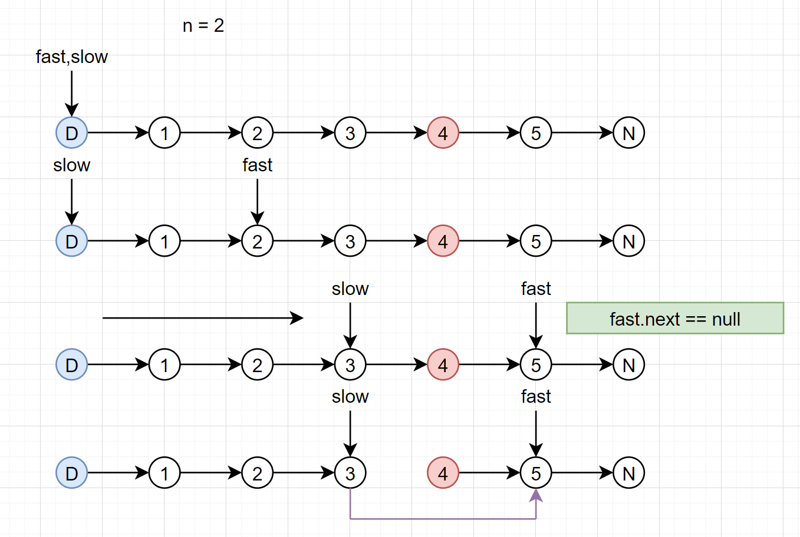

## 19. 删除链表的倒数第N个节点

### 题目描述

[19. 删除链表的倒数第N个节点](https://leetcode-cn.com/problems/remove-nth-node-from-end-of-list/)

给定一个链表，删除链表的倒数第 *n* 个节点，并且返回链表的头结点。

**示例：**

```
给定一个链表: 1->2->3->4->5, 和 n = 2.

当删除了倒数第二个节点后，链表变为 1->2->3->5.
```

**说明：**

给定的 *n* 保证是有效的。

**进阶：**

你能尝试使用一趟扫描实现吗？

### 思考

> 一般来说，单链表的删除操作，需要知道该节点的pre，让pre.next = pre.next.next。

- 可能会删除头部，可以使用虚拟头节点化解。
- 双指针，快指针先走n步，慢指针先不动。
- 两者同时向后走，当快指针指向最后一个节点，慢指针正好走到倒数第N+1个节点。
- 删除慢指针的下一个节点：`slow.next = slow.next.next;`。

### 虚拟头节点

>  头节点head将会发生变化的时候，头节点将会派上用场。

一、普通创建一个节点即可。`ListNode dummy = new ListNode(-1);`

二、注意让虚拟头节点和真实头节点产生联系。`dummy.next = head;`

三、最后返回的值是虚拟头节点的next，因为头节点可能存在被删除的情况：`return dummy.next;`



```java
class Solution {
    public ListNode removeNthFromEnd(ListNode head, int n) {

        ListNode dummy = new ListNode(-1);
        dummy.next = head;		//虚拟节点和head联系起来
        ListNode slow = dummy, fast = dummy; //快慢指针同时指向虚拟头
        while( n-- > 0){
            fast = fast.next; //快指针先走n步
        }
        while(fast.next != null){ //同时向后移动
            fast = fast.next;
            slow = slow.next;
        }
        slow.next = slow.next.next; //删除目标节点
        return dummy.next;       //返回dummy.next
    }
}
```

