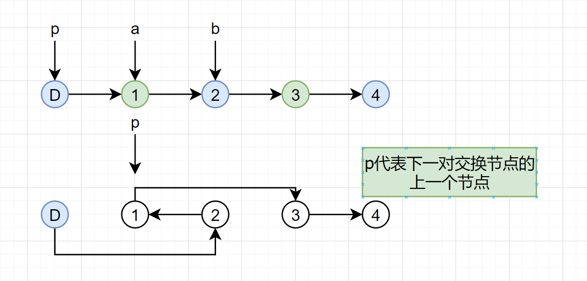

## 24. 两两交换链表中的节点

[24. 两两交换链表中的节点](https://leetcode-cn.com/problems/swap-nodes-in-pairs/)

给定一个链表，两两交换其中相邻的节点，并返回交换后的链表。

**你不能只是单纯的改变节点内部的值**，而是需要实际的进行节点交换。

**示例:**

```
给定 1->2->3->4, 你应该返回 2->1->4->3.
```



```java
class Solution {
    public ListNode swapPairs(ListNode head) {
        ListNode dummy = new ListNode(-1);
        dummy.next = head;

        for(ListNode p = dummy; p.next != null && p.next.next != null;){
            ListNode a = p.next,b = a.next;
            p.next = b;
            a.next = b.next;
            b.next = a;
            p = a;
        }
        return dummy.next;
    }
}
```


