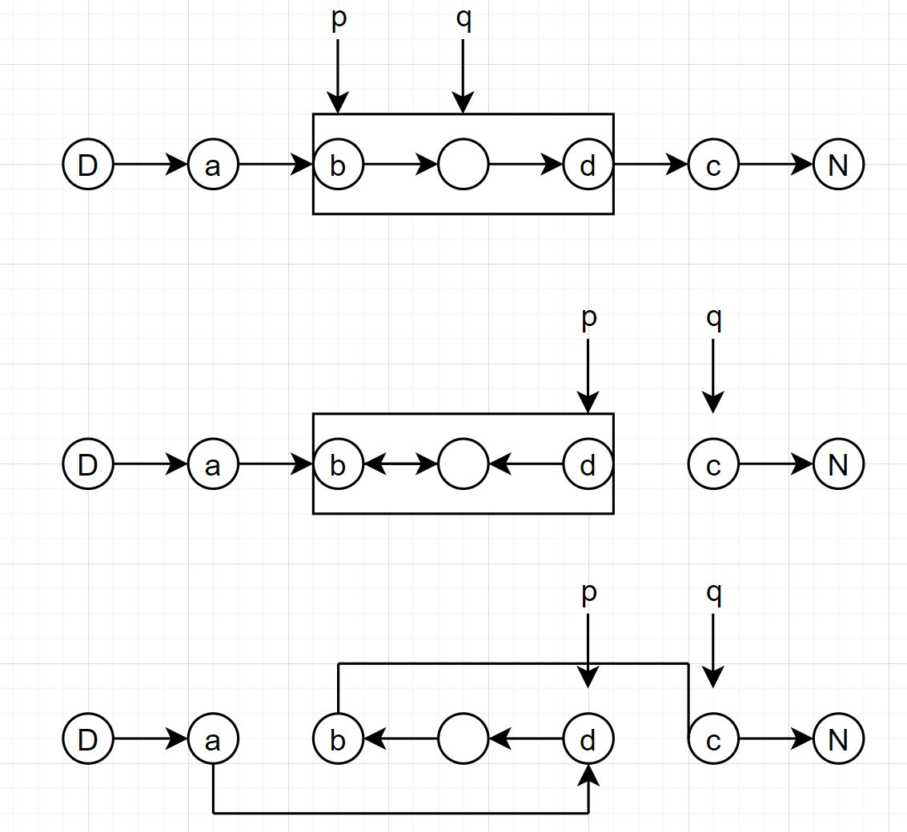

## 反转链表 II

### 题目描述

[92. 反转链表 II](https://leetcode-cn.com/problems/reverse-linked-list-ii/)

该题解参考自Acwing yxc：[https://www.acwing.com/solution/content/174/](https://www.acwing.com/solution/content/174/)

反转从位置 *m* 到 *n* 的链表。请使用一趟扫描完成反转。

**说明:**
1 ≤ *m* ≤ *n* ≤ 链表长度。

**示例:**

```
输入: 1->2->3->4->5->NULL, m = 2, n = 4
输出: 1->4->3->2->5->NULL
```

### 思考

1. 特判：如果m == n，表示无需反转，直接return head即可。

2. 这个反转过程中，头节点可能会被改变，我们使用虚拟头节点化解即可。

3. 反转的过程如何？

   - 确定我们需要的节点位置
     - 设反转段为[b,d]，反转段的迁移节点为a，反转段的后一节点为c。
     - a就是从虚拟节点走m-1步的位置，d就是从虚拟节点走n步的位置。
     - 那么相应的，`b = a.next; c = d.next`。
   - 反转[b,d]，如何实现呢？这个问题转化为将head为b的链表，以d为结尾的链表的反转问题，参考之前的做法，我们可以如下做：
     - 双指针每次取出两个节点，p和q，`p = b，q = p.next`。
     - 使用临时节点o存储q的下一个位置，保存一下。`o = q.next;`
     - 让q的next指向p。`q.next = p;`
     - p和q同时向后移。`p = q; q = o;`
     - 终止条件在于：q这个节点是不是已经到头了，是不是走到了c的位置。

   - 此时链表其实已经被分为三段，我们需要拼接这三段就可以。
     - `b.next = c;`
     - `a.next = d;`



```java
class Solution {
    public ListNode reverseBetween(ListNode head, int m, int n) {
        if(m == n) return head;
        ListNode dummy = new ListNode(-1);
        dummy.next = head;
        ListNode a = dummy, d = dummy;
        for(int i = 0; i < m - 1; i++) a = a.next;
        for(int i = 0; i < n ; i ++) d = d.next;

        ListNode b = a.next;
        ListNode c = d.next;

        for(ListNode p = b, q = p.next; q!=c;){
            ListNode o = q.next;
            q.next = p;
            p = q;
            q = o;
        }
        b.next = c;
        a.next = d;
        return dummy.next;
    }
}
```

