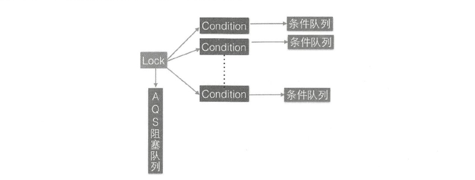

[toc]
## AQS是啥？

AQS即`AbstractQueuedSynchronizer`，队列同步器，他是构建众多同步组件的基础框架，如`ReentrantLock`、`ReentrantReadWriteLock`等，是J.U.C并发包的核心基础组件。

## Node节点

```java
    /**
     * Wait queue node class.
     *
     * <p>The wait queue is a variant of a "CLH" (Craig, Landin, and
     * Hagersten) lock queue. CLH locks are normally used for
     * spinlocks.  We instead use them for blocking synchronizers, but
     * use the same basic tactic of holding some of the control
     * information about a thread in the predecessor of its node.  A
     * "status" field in each node keeps track of whether a thread
     * should block.  A node is signalled when its predecessor
     * releases.  Each node of the queue otherwise serves as a
     * specific-notification-style monitor holding a single waiting
     * thread. The status field does NOT control whether threads are
     * granted locks etc though.  A thread may try to acquire if it is
     * first in the queue. But being first does not guarantee success;
     * it only gives the right to contend.  So the currently released
     * contender thread may need to rewait.
     *
     * <p>To enqueue into a CLH lock, you atomically splice it in as new
     * tail. To dequeue, you just set the head field.
     * <pre>
     *      +------+  prev +-----+       +-----+
     * head |      | <---- |     | <---- |     |  tail
     *      +------+       +-----+       +-----+
     * </pre>
     *
     * <p>Insertion into a CLH queue requires only a single atomic
     * operation on "tail", so there is a simple atomic point of
     * demarcation from unqueued to queued. Similarly, dequeuing
     * involves only updating the "head". However, it takes a bit
     * more work for nodes to determine who their successors are,
     * in part to deal with possible cancellation due to timeouts
     * and interrupts.
     *
     * <p>The "prev" links (not used in original CLH locks), are mainly
     * needed to handle cancellation. If a node is cancelled, its
     * successor is (normally) relinked to a non-cancelled
     * predecessor. For explanation of similar mechanics in the case
     * of spin locks, see the papers by Scott and Scherer at
     * http://www.cs.rochester.edu/u/scott/synchronization/
     *
     * <p>We also use "next" links to implement blocking mechanics.
     * The thread id for each node is kept in its own node, so a
     * predecessor signals the next node to wake up by traversing
     * next link to determine which thread it is.  Determination of
     * successor must avoid races with newly queued nodes to set
     * the "next" fields of their predecessors.  This is solved
     * when necessary by checking backwards from the atomically
     * updated "tail" when a node's successor appears to be null.
     * (Or, said differently, the next-links are an optimization
     * so that we don't usually need a backward scan.)
     *
     * <p>Cancellation introduces some conservatism to the basic
     * algorithms.  Since we must poll for cancellation of other
     * nodes, we can miss noticing whether a cancelled node is
     * ahead or behind us. This is dealt with by always unparking
     * successors upon cancellation, allowing them to stabilize on
     * a new predecessor, unless we can identify an uncancelled
     * predecessor who will carry this responsibility.
     *
     * <p>CLH queues need a dummy header node to get started. But
     * we don't create them on construction, because it would be wasted
     * effort if there is never contention. Instead, the node
     * is constructed and head and tail pointers are set upon first
     * contention.
     *
     * <p>Threads waiting on Conditions use the same nodes, but
     * use an additional link. Conditions only need to link nodes
     * in simple (non-concurrent) linked queues because they are
     * only accessed when exclusively held.  Upon await, a node is
     * inserted into a condition queue.  Upon signal, the node is
     * transferred to the main queue.  A special value of status
     * field is used to mark which queue a node is on.
     *
     * <p>Thanks go to Dave Dice, Mark Moir, Victor Luchangco, Bill
     * Scherer and Michael Scott, along with members of JSR-166
     * expert group, for helpful ideas, discussions, and critiques
     * on the design of this class.
     */
    static final class Node {
        /** 标记该线程是获取共享资源时被阻塞挂起后放入AQS队列的 */
        static final Node SHARED = new Node();
        /** 标记线程是获取独占资源时被挂起后放入AQS队列的 */
        static final Node EXCLUSIVE = null;

        /** 等待状态之一：线程被取消 */
        static final int CANCELLED =  1;
        /** 等待状态之一：线程需要被唤醒 */
        static final int SIGNAL    = -1;
        /** 等待状态之一：线程在条件队列中等待 */
        static final int CONDITION = -2;
        /**
         * 等待状态之一：释放共享资源时需要通知其他节点
         */
        static final int PROPAGATE = -3;

        /**
         * 记录当前线程的等待状态
         *   SIGNAL:     The successor of this node is (or will soon be)
         *               blocked (via park), so the current node must
         *               unpark its successor when it releases or
         *               cancels. To avoid races, acquire methods must
         *               first indicate they need a signal,
         *               then retry the atomic acquire, and then,
         *               on failure, block.
         *   CANCELLED:  This node is cancelled due to timeout or interrupt.
         *               Nodes never leave this state. In particular,
         *               a thread with cancelled node never again blocks.
         *   CONDITION:  This node is currently on a condition queue.
         *               It will not be used as a sync queue node
         *               until transferred, at which time the status
         *               will be set to 0. (Use of this value here has
         *               nothing to do with the other uses of the
         *               field, but simplifies mechanics.)
         *   PROPAGATE:  A releaseShared should be propagated to other
         *               nodes. This is set (for head node only) in
         *               doReleaseShared to ensure propagation
         *               continues, even if other operations have
         *               since intervened.
         *   0:          None of the above
         *
         * The values are arranged numerically to simplify use.
         * Non-negative values mean that a node doesn't need to
         * signal. So, most code doesn't need to check for particular
         * values, just for sign.
         *
         * The field is initialized to 0 for normal sync nodes, and
         * CONDITION for condition nodes.  It is modified using CAS
         * (or when possible, unconditional volatile writes).
         */
        volatile int waitStatus;

        // 前驱节点
        volatile Node prev;

        // 后继节点
        volatile Node next;

        /**
         * The thread that enqueued this node.  Initialized on
         * construction and nulled out after use.
         */
        volatile Thread thread;

        Node nextWaiter;

        /**
         * Returns true if node is waiting in shared mode.
         */
        final boolean isShared() {
            return nextWaiter == SHARED;
        }

        /**
         * Returns previous node, or throws NullPointerException if null.
         * Use when predecessor cannot be null.  The null check could
         * be elided, but is present to help the VM.
         *
         * @return the predecessor of this node
         */
        final Node predecessor() throws NullPointerException {
            Node p = prev;
            if (p == null)
                throw new NullPointerException();
            else
                return p;
        }

        Node() {    // Used to establish initial head or SHARED marker
        }

        Node(Thread thread, Node mode) {     // Used by addWaiter
            this.nextWaiter = mode;
            this.thread = thread;
        }

        Node(Thread thread, int waitStatus) { // Used by Condition
            this.waitStatus = waitStatus;
            this.thread = thread;
        }
    }
```

AQS是一个FIFO的双向队列，内部通过节点head和tail记录队首和队尾元素，队列元素类型为Node。

## AQS构成

```java
public abstract class AbstractQueuedSynchronizer
    extends AbstractOwnableSynchronizer
    implements java.io.Serializable {

    private static final long serialVersionUID = 7373984972572414691L;

    /**
     * Creates a new {@code AbstractQueuedSynchronizer} instance
     * with initial synchronization state of zero.
     */
    protected AbstractQueuedSynchronizer() { }

    static final class Node {
        //...省略
    }

    /**
     * Head of the wait queue, lazily initialized.  Except for
     * initialization, it is modified only via method setHead.  Note:
     * If head exists, its waitStatus is guaranteed not to be
     * CANCELLED.
     */
    private transient volatile Node head;

    /**
     * Tail of the wait queue, lazily initialized.  Modified only via
     * method enq to add new wait node.
     */
    private transient volatile Node tail;

    /**
     * 维护的单一状态信息，可以通过getState，setState，compareAndSetState修改值
     */
    private volatile int state;

    /**
     * Returns the current value of synchronization state.
     * This operation has memory semantics of a {@code volatile} read.
     * @return current state value
     */
    protected final int getState() {
        return state;
    }

    /**
     * Sets the value of synchronization state.
     * This operation has memory semantics of a {@code volatile} write.
     * @param newState the new state value
     */
    protected final void setState(int newState) {
        state = newState;
    }

    /**
     * Atomically sets synchronization state to the given updated
     * value if the current state value equals the expected value.
     * This operation has memory semantics of a {@code volatile} read
     * and write.
     *
     * @param expect the expected value
     * @param update the new value
     * @return {@code true} if successful. False return indicates that the actual
     *         value was not equal to the expected value.
     */
    protected final boolean compareAndSetState(int expect, int update) {
        // See below for intrinsics setup to support this
        return unsafe.compareAndSwapInt(this, stateOffset, expect, update);
    }

    // Queuing utilities

    /**
     * The number of nanoseconds for which it is faster to spin
     * rather than to use timed park. A rough estimate suffices
     * to improve responsiveness with very short timeouts.
     */
    static final long spinForTimeoutThreshold = 1000L;
}
```

AQS维护了一个单一的状态信息state：

- ReentrantLock：state表示当前线程获取锁的可重入次数。
- ReetrantReadWriteLock：state的高16位表示读状态，也就是获取该读锁的次数，低16位表示获取到写锁的线程的可重入次数。
- semaphore：state表示当前可用信号的个数。
- CountDownlatch：state表示计数器当前的值。

### 独占与共享

对于AQS来说，线程同步的关键是对state进行操作，根据state是否属于一个线程，操作state的方式分为独占方式和共享方式。

- 使用独占的方式获取的资源是与具体线程绑定的，如果一个线程获取到了资源，便标记这个线程已经获取到，其他线程再次尝试操作state获取资源时就会发现当前该资源不是自己持有的，就会在获取失败后阻塞。

> 比如独占锁ReentrantLock 的实现， 当一个线程获取了ReerrantLock 的锁后，在AQS 内部会首先使用CA S 操作把state 状态值从0变为1 ，然后设置当前锁的持有者为当前线程，当该线程再次获取锁时发现它就是锁的持有者，则会把状态值从l 变为2 ，也就是设置可重入次数，而当另外一个线程获取锁时发现自己并不是该锁的持有者就会被放入AQS 阻塞队列后挂起。

```java
// 独占
    public final void acquire(int arg) {
        // 首先调用 tryAcquire尝试获取资源，本质就是设置state的值，获取成功就直接返回
        if (!tryAcquire(arg) &&
            // 获取失败，就将当前线程封装成类型为Node.EXCLUSIVE的Node节点，并插入AQS阻塞队列尾部
            // 并调用LockSupport.park(this);阻塞
            acquireQueued(addWaiter(Node.EXCLUSIVE), arg))
            selfInterrupt();
    }

	// 表示对中断进行响应
    public final void acquireInterruptibly(int arg)
            throws InterruptedException {
        if (Thread.interrupted())
            throw new InterruptedException();
        if (!tryAcquire(arg))
            doAcquireInterruptibly(arg);
    }

    public final boolean tryAcquireNanos(int arg, long nanosTimeout)
            throws InterruptedException {
        if (Thread.interrupted())
            throw new InterruptedException();
        return tryAcquire(arg) ||
            doAcquireNanos(arg, nanosTimeout);
    }

    public final boolean release(int arg) {
        // 尝试使用tryRelease释放资源，本质也是设置state的值
        if (tryRelease(arg)) {
            Node h = head;
            if (h != null && h.waitStatus != 0)
                // LockSupport.unpark(thread) 激活AQS里面被阻塞的一个线程
                // 被激活的线程则使用tryAcquire 尝试，看当前状态变量state的值是否能满足自己的需要，
                //满足则该线程被激活，然后继续向下运行，否则还是会被放入AQS队列并被挂起。
                unparkSuccessor(h);
            return true;
        }
        return false;
    }
```

需要注意：tryRelease和tryAcquire方法并没有在AQS中给出实现，实现的任务交给了具体的子类，子类根据具体的场景需求实现，通过CAS算法，设置修改state的值。

- 对应共享方式的资源与具体线程是不相关的，当多个线程去请求资源时通过CAS 方式竞争获取资源，当一个线程获取到了资源后，另外一个线程再次去获取时如果当前资源还能满足它的需要，则当前线程只需要使用CAS 方式进行获取即可。

> 比如Semaphore 信号量， 当一个线程通过acquire（） 方法获取信号量时，会首先看当前信号量个数是否满足需要， 不满足则把当前线程放入阻塞队列，如果满足则通过自旋CAS 获取信号量。

```java
    public final void acquireShared(int arg) {
        if (tryAcquireShared(arg) < 0)
            // 尝试获取资源，如果成功则直接返回
            // 如果失败，则将当前线程封装为类型为Node.SHARED的Node节点并插入AQS阻塞队列尾部
            // 并使用LockSupport.park(this)挂起自己
            doAcquireShared(arg);
    }
	// 表示对中断进行响应
    public final void acquireSharedInterruptibly(int arg)
            throws InterruptedException {
        if (Thread.interrupted())
            throw new InterruptedException();
        if (tryAcquireShared(arg) < 0)
            doAcquireSharedInterruptibly(arg);
    }

    public final boolean tryAcquireSharedNanos(int arg, long nanosTimeout)
            throws InterruptedException {
        if (Thread.interrupted())
            throw new InterruptedException();
        return tryAcquireShared(arg) >= 0 ||
            doAcquireSharedNanos(arg, nanosTimeout);
    }

    public final boolean releaseShared(int arg) {
        // 尝试释放资源
        if (tryReleaseShared(arg)) {
            // 调用LockSupport.unpark(thread)激活AQS队列里被阻塞的一个线程。
            // 被激活的线程使用tryReleaseShared查看当前状态变量state是否能满足自己的需要。
            // 如果满足需要，则线程被激活继续向下运行，否则还是放入AQS队列并被挂起
            doReleaseShared();
            return true;
        }
        return false;
    }
```

Interruptibly的方法表示对中断需要进行响应，线程在调用带Interruptibly关键字的方法获取资源时或者获取资源失败被挂起，其他线程中断了该线程，那么该线程会抛出`InterruptedException`异常而返回。

## ConditionObject内部类

ConditionObject用来结合锁实现线程同步，ConditionObject 可以直接访问AQS 对象内部的变量，比如state 状态值和AQS队列。ConditionObject 是条件变量， 每个条件变量对应一个条件队列（单向链表队列），其用来存放调用条件变量的await 方法后被阻塞的线程，如类图所示， 这个条件队列的头、尾元素分别为自firstWaiter 和last Waiter 。

## AQS如何维护队列

当一个线程获取锁失败后，该线程会被转换为Node节点，并通过enq方法入队。

```java
    private Node enq(final Node node) {
        for (;;) {
            // 指向tail
            Node t = tail;
            // 第一次，通过CAS设置head为哨兵节点，如果设置成功，tail也指向哨兵节点
            if (t == null) { // Must initialize
                if (compareAndSetHead(new Node()))
                    tail = head;
            } else {
                // 入队，将新节点的prev指向tail
                node.prev = t;
                // CAS设置node为尾部节点
                if (compareAndSetTail(t, node)) {
                    //原来的tail的next指向node
                    t.next = node;
                    return t;
                }
            }
        }
    }
```

## AQS条件变量的支持

```java
// 基于AQS实现
ReentrantLock lock = new ReentrantLock();
// 创建lock对象的condition条件变量  AQS中的ConditionObject内部类,可以访问内部的state,每个条件变量内部维护了一个条件队列
Condition condition = lock.newCondition();
```

AQS实现内部类ConditionObject就是这里Condition接口的实现，AQS的newCondition方法需要其子类自主定义。

### await

```java
        public final void await() throws InterruptedException {
            if (Thread.interrupted())
                throw new InterruptedException();
            // 创建新的node节点，并插入到条件队列末尾
            Node node = addConditionWaiter();
            // 释放当前线程的锁
            int savedState = fullyRelease(node);
            int interruptMode = 0;
            // 调用park方法阻塞挂起当前线程
            while (!isOnSyncQueue(node)) {
                LockSupport.park(this);
                if ((interruptMode = checkInterruptWhileWaiting(node)) != 0)
                    break;
            }
            if (acquireQueued(node, savedState) && interruptMode != THROW_IE)
                interruptMode = REINTERRUPT;
            if (node.nextWaiter != null) // clean up if cancelled
                unlinkCancelledWaiters();
            if (interruptMode != 0)
                reportInterruptAfterWait(interruptMode);
        }
```

### signal

当另外一个线程调用条件变量的signal方法时，必须先调用锁的lock()方法获取锁，在内部会把条件队列里面队头的一个线程节点从条件队列里面移除并放入AQS的阻塞队列里面，然后激活这个线程。

```java
        public final void signal() {
            if (!isHeldExclusively())
                throw new IllegalMonitorStateException();
            Node first = firstWaiter;
            // 将条件队列头元素移动到AQS队列
            if (first != null)
                doSignal(first);
        }
```

### addConditionWaiter

```java
        private Node addConditionWaiter() {
            Node t = lastWaiter;
            if (t != null && t.waitStatus != Node.CONDITION) {
                unlinkCancelledWaiters();
                t = lastWaiter;
            }
            // 根据当前线程创建一个类型为Node.CONDITION的节点
            Node node = new Node(Thread.currentThread(), Node.CONDITION);
            // 向单向条件队列尾部插入一个元素
            if (t == null)
                firstWaiter = node;
            else
                t.nextWaiter = node;
            lastWaiter = node;
            return node;
        }
```

当多个线程同时调用lock.lock()方法获取锁时，只有一个线程获取到了锁，其他线程会被转换为Node节点插入到lock锁对应的AQS阻塞队列里面，并做自旋CAS尝试获取锁。

如果获取到锁的线程又调用了对应的条件变量的await()方法，则该线程会释放获取到的锁，并被转换为Node节点插入到条件变量对应的条件队列里卖弄。

这时候因为调用lock.lock方法被阻塞到AQS 队列里面的一个线程会获取到被释放的锁，如果该线程也调用了条件变量的await方法则该线程也会被放入条件变量的条件队列里面。
当另外一个线程调用条件变量的signal或者signal方法时， 会把条件队列里面的一个或者全部Node 节点移动到AQS 的阻塞队列里面， 等待时机获取锁。




一个锁对应一个AQS阻塞队列，对应多个条件变量，每个条件变量有自己的一个条件队列。