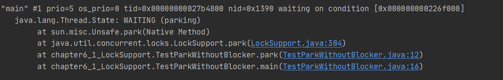
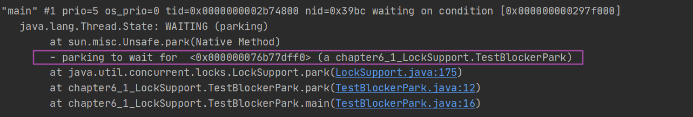

## LockSupport概述

LockSupport工具类定义了一组**公共的静态方法**，提供了最基本的**线程阻塞和唤醒**功能，是创建锁和其他同步类的基础，你会发现，AQS中阻塞线程和唤醒线程的地方，就是使用LockSupport提供的park和unpark方法，比如下面这段：

```java
    // 挂起线程
	private final boolean parkAndCheckInterrupt() {
        LockSupport.park(this);
        return Thread.interrupted();
    }
	// 唤醒线程
    private void unparkSuccessor(Node node) {
		//...
        if (s != null)
            LockSupport.unpark(s.thread);
    }
```

## park与unpark相关方法

LockSupport提供了一组park开头的方法来阻塞当前线程【省略static】：

- `void park()`：阻塞当前线程，如果调用unpark(Thread thread)方法或者当前线程被中断，才能从park()方法返回。
- `void parkNanos(long nanos)`：阻塞当前线程，最长不超过nanos纳秒，返回条件在park()的基础上增加了超时返回。
- `void parkUntil(long deadline)`：阻塞当前线程，直到deadline【从1970年开始到deadline时间的毫秒数】时间。
- `void unpark(Thread thread)`：唤醒处于阻塞状态的线程thread。

JDK1.6中，增加了带有blocker参数的几个方法，blocker参数用来标识当前线程在等待的对象，用于问题排查和系统监控。

下面演示park()方法和unpark()方法的使用：

> 在thread线程中调用park()方法，默认情况下该线程是不持有许可证的，因此将会被阻塞挂起。
>
> unpark(thread)方法将会让thread线程获得许可证，才能从park()方法返回。

```java
    public static void main(String[] args) throws InterruptedException {

        Thread thread = new Thread(() ->{
            String name = Thread.currentThread().getName();
            System.out.println(name + " begin park");
            LockSupport.park();// 如果调用park的线程已经获得了关联的许可证,就会立即返回
            System.out.println(name + " end park");
        },"A");
        thread.start(); // 默认情况下，thread不持有许可证，会被阻塞挂起

        Thread.sleep(1000); 

        System.out.println(thread.getName() + " begin unpark");

        LockSupport.unpark(thread);//让thread获得许可证

    }
```

```java
// 结果如下
A begin park
A begin unpark
A end park
```

你需要理解，许可证在这里的作用，我们也可以事**先给线程一个许可证，接着在park的时候就不会被阻塞**了。

```java
    public static void main(String[] args) {
        System.out.println("begin park");
        // 使当前线程获得许可证
        LockSupport.unpark(Thread.currentThread());
        // 再次调用park方法,因为已经有许可证了，不会被阻塞
        LockSupport.park();
        System.out.println("end park");
    }
```

```java
// 结果如下
begin park
end park
```

## 中断演示

线程被中断的时候，park方法不会抛出异常，因此需要park退出之后，对中断状态进行处理。

```java
    public static void main(String[] args) throws InterruptedException {
        Thread thread = new Thread(() -> {
            String name = Thread.currentThread().getName();
            System.out.println(name + " begin park");
            // 一直挂起自己,只有被中断,才会推出循环
            while (!Thread.currentThread().isInterrupted()) {
                LockSupport.park();
            }
            System.out.println(name + " end park");
        }, "A");
        thread.start();
        Thread.sleep(1000);
        System.out.println("主线程准备中断线程" + thread.getName());
        // 中断thread
        thread.interrupt();
    }

```

```java
// 结果如下
A begin park
主线程准备中断线程A
A end park
```

## blocker的作用

JDK1.6开始，一系列park方法开始支持传入blocker参数，标识当前线程在等待的对象，当线程在没有持有许可证的情况下调用park方法而被阻塞挂起时，这个blocker对象会被记录到该线程内部。

```java
    public static void park(Object blocker) {
        Thread t = Thread.currentThread();
        setBlocker(t, blocker); // 设置blocker
        UNSAFE.park(false, 0L);
        setBlocker(t, null); // 清除blocker
    }
```

Thread类里有个`volatile Object parkBlocker`变量，用来存放park方法传递的blocker对象，也就是把blocker变量存放到了调用park方法的线程的成员变量中。

接下来我们通过两个例子感受一下：

### 测试无blocker

```java
public class TestParkWithoutBlocker {
    public void park(){
        LockSupport.park();
    }

    public static void main(String[] args) throws InterruptedException {
        new TestParkWithoutBlocker().park();
        Thread.sleep(3000);
    }
}
```

使用jps命令，列出当前运行的进程`4412 TestPark`，接着使用`jstack 4412`命令查看线程堆栈：



### 测试带blocker

```java
public class TestBlockerPark {

    public void park(){
        LockSupport.park(this); // 传入blocker = this
    }

    public static void main(String[] args) throws InterruptedException {
        new TestBlockerPark().park();
        Thread.sleep(3000);
    }
}
```



明显的差别就在于，使用带blocker 参数的park方法，能够通过jstack看到具体阻塞对象的信息：

```java
- parking to wait for  <0x000000076b77dff0> (a chapter6_1_LockSupport.TestBlockerPark)
```

诊断工具可以调用getBlocker(Thread)方法来获取blocker对象，JDK推荐我们使用带有blocker参数的park方法，并且设置blocker为this，这样当在打印线程堆栈排查问题的时候就能够知道那个类被阻塞了。

## JDK提供的demo

老传统了，摘一段JavaDoc上的使用案例：

```java
/**
 * 先进先出的锁,只有队列的首元素可以获取锁
 */
class FIFOMutex {
    private final AtomicBoolean locked = new AtomicBoolean(false);
    private final Queue<Thread> waiters
            = new ConcurrentLinkedQueue<Thread>();

    public void lock() {
        // 中断标志
        boolean wasInterrupted = false; 
        Thread current = Thread.currentThread();
        waiters.add(current);

        // 不是队首线程 或 当前锁已经被其他线程获取,则调用park方法挂起自己
        while (waiters.peek() != current ||
                !locked.compareAndSet(false, true)) {
            LockSupport.park(this);
            // 如果park方法是因为被中断而返回,则忽略中断,并且重置中断标志
            // 接着再次进入循环
            if (Thread.interrupted()) // ignore interrupts while waiting
                wasInterrupted = true;
        }
        
        waiters.remove();
        // 如果标记为true,则中断线程
        // [虽然我对中断信号不感兴趣,忽略它,但是不代表其他线程对该标志不感兴趣,因此恢复一下.]
        if (wasInterrupted)          // reassert interrupt status on exit
            current.interrupt();
    }

    public void unlock() {
        locked.set(false);
        LockSupport.unpark(waiters.peek());
    }
}
```

## 总结

- LockSupport提供了有关线程挂起park和唤醒unpark的静态方法。
- JDK1.6之后允许传入blocker阻塞对象，便于问题监控和排查。
- 如果park的线程被中断，不会抛出异常，需要自行对中断状态进行处理。

## 参考阅读

- 翟陆续 薛冰田 《Java并发编程之美》
- 方腾飞 《Java并发编程的艺术》
- [【J.U.C】LockSupport](http://cmsblogs.com/?p=11051)