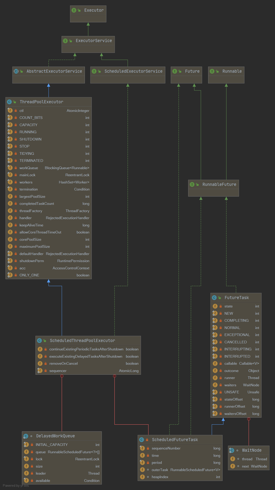

## ScheduledThreadPoolExecutor概述



- 可以通过Executors工具类创建,也可以通过构造方法创建。

```java
    //Executors.java
	public static ScheduledExecutorService newScheduledThreadPool(int corePoolSize) {
        return new ScheduledThreadPoolExecutor(corePoolSize);
    }
	//ScheduledThreadPoolExecutor.java
    public ScheduledThreadPoolExecutor(int corePoolSize) {
        super(corePoolSize, Integer.MAX_VALUE, 0, NANOSECONDS,
              new DelayedWorkQueue());
    }
```

- ScheduledThreadPoolExecutor继承了ThreadPoolExecutor并实现了ScheduledExecutorService接口。
- 线程池队列使用DelayedWorkQueue，和DelayedQueue类似，是延迟队列。
- ScheduledFutureTask是一个具有返回值的任务，继承自FutureTask。

## ScheduledFutureTask

```java
    private class ScheduledFutureTask<V>
            extends FutureTask<V> implements RunnableScheduledFuture<V> {

        /** Sequence number to break ties FIFO */
        private final long sequenceNumber;

        /** The time the task is enabled to execute in nanoTime units */
        private long time;

        /**
         * period == 0  当前任务是一次性的， 执行完毕后就退出
         * period > 0   当前任务是fixed-delay任务，是固定延迟的定时可重复执行任务
         * period < 0   当前任务是fixed-rate任务，是固定频率的定时可重复执行任务
         */
        private final long period;

        /** The actual task to be re-enqueued by reExecutePeriodic */
        RunnableScheduledFuture<V> outerTask = this;

        /**
         * Index into delay queue, to support faster cancellation.
         */
        int heapIndex;

        /**
         * Creates a one-shot action with given nanoTime-based trigger time.
         */
        ScheduledFutureTask(Runnable r, V result, long ns) {
            super(r, result);
            this.time = ns;
            this.period = 0;
            this.sequenceNumber = sequencer.getAndIncrement();
        }

        /**
         * Creates a periodic action with given nano time and period.
         */
        ScheduledFutureTask(Runnable r, V result, long ns, long period) {
            super(r, result);
            this.time = ns;
            this.period = period;
            this.sequenceNumber = sequencer.getAndIncrement();
        }

        /**
         * Creates a one-shot action with given nanoTime-based trigger time.
         */
        ScheduledFutureTask(Callable<V> callable, long ns) {
            super(callable);
            this.time = ns;
            this.period = 0;
            this.sequenceNumber = sequencer.getAndIncrement();
        }

        public long getDelay(TimeUnit unit) {
            return unit.convert(time - now(), NANOSECONDS);
        }

        public int compareTo(Delayed other) {
            if (other == this) // compare zero if same object
                return 0;
            if (other instanceof ScheduledFutureTask) {
                ScheduledFutureTask<?> x = (ScheduledFutureTask<?>)other;
                long diff = time - x.time;
                if (diff < 0)
                    return -1;
                else if (diff > 0)
                    return 1;
                else if (sequenceNumber < x.sequenceNumber)
                    return -1;
                else
                    return 1;
            }
            long diff = getDelay(NANOSECONDS) - other.getDelay(NANOSECONDS);
            return (diff < 0) ? -1 : (diff > 0) ? 1 : 0;
        }

        /**
         * Returns {@code true} if this is a periodic (not a one-shot) action.
         *
         * @return {@code true} if periodic
         */
        public boolean isPeriodic() {
            return period != 0;
        }

        /**
         * Sets the next time to run for a periodic task.
         */
        private void setNextRunTime() {
            long p = period;
            if (p > 0)
                time += p;
            else
                time = triggerTime(-p);
        }

        public boolean cancel(boolean mayInterruptIfRunning) {
            boolean cancelled = super.cancel(mayInterruptIfRunning);
            if (cancelled && removeOnCancel && heapIndex >= 0)
                remove(this);
            return cancelled;
        }

        /**
         * Overrides FutureTask version so as to reset/requeue if periodic.
         */
        public void run() {
            boolean periodic = isPeriodic();
            if (!canRunInCurrentRunState(periodic))
                cancel(false);
            else if (!periodic)
                ScheduledFutureTask.super.run();
            else if (ScheduledFutureTask.super.runAndReset()) {
                setNextRunTime();
                reExecutePeriodic(outerTask);
            }
        }
    }
```

## FutureTask

```java
public class FutureTask<V> implements RunnableFuture<V> {

    /**
     *
     * Possible state transitions:
     * NEW -> COMPLETING -> NORMAL
     * NEW -> COMPLETING -> EXCEPTIONAL
     * NEW -> CANCELLED
     * NEW -> INTERRUPTING -> INTERRUPTED
     */
    private volatile int state;
    private static final int NEW          = 0; // 初始状态
    private static final int COMPLETING   = 1; // 执行中
    private static final int NORMAL       = 2; // 正常运行结束
    private static final int EXCEPTIONAL  = 3; // 运行中异常
    private static final int CANCELLED    = 4; // 任务被取消
    private static final int INTERRUPTING = 5; // 任务正在被中断
    private static final int INTERRUPTED  = 6; // 任务已经被中断
    
}
```

## ScheduledFuture<?> schedule(command,delay,unit)

提交一个延迟执行的任务，任务从提交时间算起延迟单位为unit的delay时间后开始执行。

如果提交的任务不是周期性的任务，任务只会执行一次。                     

```java
    public ScheduledFuture<?> schedule(Runnable command,
                                       long delay,
                                       TimeUnit unit) {
        // 参数校验
        if (command == null || unit == null)
            throw new NullPointerException();
        // 任务转换： 把command任务转换为ScheduledFutureTask
        RunnableScheduledFuture<?> t = decorateTask(command,
            new ScheduledFutureTask<Void>(command, null,
                                          triggerTime(delay, unit)));
        // 添加任务到延迟队列
        delayedExecute(t);
        return t;
    }
```

分段啊额的