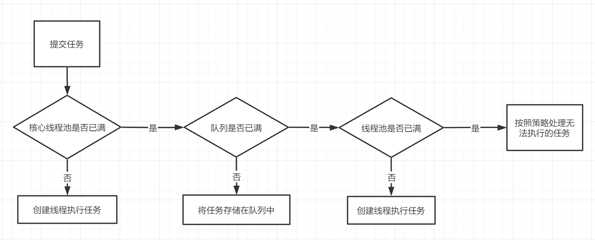
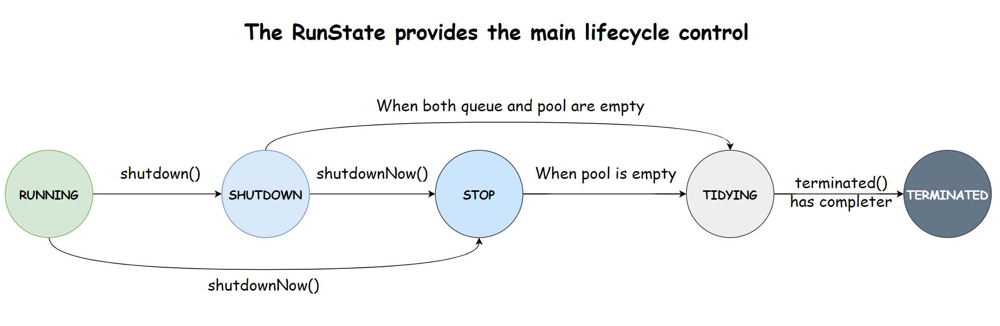

[toc]

## ThreadPoolExecutor概述

### 线程池解决的问题

1. 当执行大量异步任务时线程池能够提供较好的性能，因为线程池中的线程是可复用的，不需要每次执行异步任务时都创建和销毁线程。
2. 提供资源限制和管理的手段，比如可以限制线程的个数，动态新增线程等等。

### 线程池处理流程

ThreadPoolExecutor执行execute时，流程如下：



1. 如果当前运行的线程少于corePoolSize，则创建新线程来执行任务，这里需要加全局锁。
2. 如果运行的线程数>=corePoolSize，则将任务加入BlockingQueue。
3. 如果此时BlockingQueue已满，则创建新的线程来处理任务，这里也需要加全局锁。
4. 如果创建新线程将使当前运行的线程超出maximumPoolSize，则按照拒绝策略拒绝任务。

当然啦，这篇文章意在从源码角度学习线程池这些核心步骤的具体实现啦，线程池概念性的东西，可以参考一些其他的博客：

- [【Java并发编程】线程池相关知识点整理](https://tqbx.gitee.io/javablog/#/%E9%9D%A2%E8%AF%95%E7%9B%B8%E5%85%B3/%E5%B9%B6%E5%8F%91/%E7%BA%BF%E7%A8%8B%E6%B1%A0%E7%9A%84%E7%9F%A5%E8%AF%86%E7%82%B9)
- [闪客sun : 图解 | 原来这就是线程池](https://www.cnblogs.com/flashsun/p/14368520.html)

### 创建线程池

创建线程池有几种方法，一种是使用Executors工具类快速创建内置的几种线程池，也可以自定义。

一、通过Executor框架的工具类Executors可以创建三种类型的ThreadPoolExecutor。

二、使用ThreadPoolExecutor的各种构造方法。

《阿里巴巴 Java 开发手册》中：**强制线程池不允许使用 Executors 去创建，而是通过 ThreadPoolExecutor 的方式**，这样的处理方式让写的同学更加明确线程池的运行规则，规避资源耗尽的风险

> Executors 返回线程池对象的弊端如下：
>
> - **FixedThreadPool 和 SingleThreadExecutor** ： 允许请求的队列长度为 Integer.MAX_VALUE ，可能堆积大量的请求，从而导致 OOM。
> - **CachedThreadPool 和 ScheduledThreadPool** ： 允许创建的线程数量为 Integer.MAX_VALUE ，可能会创建大量线程，从而导致 OOM。

本篇的重点就是这个ThreadPoolExecutor。

## 重要常量及字段

```java
public class ThreadPoolExecutor extends AbstractExecutorService {
	// 原子的Integer变量ctl，用于记录线程池状态【高3位】和线程池中线程个数【低29位】，这里假设Integer是32位的
    private final AtomicInteger ctl = new AtomicInteger(ctlOf(RUNNING, 0));
    // 其实并不是每个平台的Integer二进制都是32位的，实际上是，二进制位-3代表线程个数
    private static final int COUNT_BITS = Integer.SIZE - 3;
    // 线程最大个数【约5亿】 低COUNT_BITS都是1  000 11111111111111111111111111111
    private static final int CAPACITY   = (1 << COUNT_BITS) - 1;

    // runState is stored in the high-order bits
    // 111 00000000000000000000000000000 高3位是 111
    private static final int RUNNING    = -1 << COUNT_BITS;
    // 000 00000000000000000000000000000 高3位是 000
    private static final int SHUTDOWN   =  0 << COUNT_BITS;
    // 001 00000000000000000000000000000 高3位是 001
    private static final int STOP       =  1 << COUNT_BITS;
    // 010 00000000000000000000000000000 高3位是 110
    private static final int TIDYING    =  2 << COUNT_BITS;
    // 011 00000000000000000000000000000 高3位是 011
    private static final int TERMINATED =  3 << COUNT_BITS;
    
    // Packing and unpacking ctl
    // 获取高3位的运行状态
    private static int runStateOf(int c)     { return c & ~CAPACITY; }
    // 获取低29位的线程个数
    private static int workerCountOf(int c)  { return c & CAPACITY; }
    // 通过RunState和WorkCount计算ctl的值
    private static int ctlOf(int rs, int wc) { return rs | wc; }
    
    // 线程池状态变换是单调递增的
    private static boolean runStateLessThan(int c, int s) {
        return c < s;
    }

    private static boolean runStateAtLeast(int c, int s) {
        return c >= s;
    }
	// 只有RUNNING 是小于SHUTDOWN的
    private static boolean isRunning(int c) {
        return c < SHUTDOWN;
    }
    
    // ...
    
    // 阻塞队列
    private final BlockingQueue<Runnable> workQueue;
    // 独占锁 同步保证
    private final ReentrantLock mainLock = new ReentrantLock();
    // 存放 线程池中的工作线程
    private final HashSet<Worker> workers = new HashSet<Worker>();
    // 条件队列，线程调用awaitTermination时存放阻塞的线程
    private final Condition termination = mainLock.newCondition();

	// ...
    
    // 继承AQS和Runnable，任务线程
    private final class Worker
        extends AbstractQueuedSynchronizer
        implements Runnable
    { /*.. */}
}
```

- ThreadPoolExecutor通过AtomicInteger类的变量ctl记录**线程池状态**和**线程池中线程个数**，这里以Integer为32为例。
- 高3位表示线程池的状态，低29位表示线程个数，分别通过`runStateOf`和`workerCountOf`计算。

## 线程池的五种状态及转换

- **线程池的状态**有五种，他们提供了线程池声明周期的控制：
  - RUNNING：能够接收新任务，并且处理阻塞队列里的任务。
  - SHUTDOWN：拒绝新任务，但会处理阻塞队列里的任务。
  - STOP：拒绝新任务，并且抛弃阻塞队列里的任务，同时会中断正在处理的任务。
  - TIDYING：所有任务都执行完后当前线程池workerCount为0，将调用terminated()这个钩子方法。
  - TERMINATED：终止状态。terminated方法调用完成。
- 线程池的状态是有规律的，保证单调递增，但是不一定每个状态都会经历，比如有以下几种转换：
  - RUNNING -> SHUTDOWN：可能是显式调用了`shutdown()`方法，也可能在`finalize()`里隐式调用。
  - RUNNING或SHUTDOWN -> STOP：调用了`shutdownNow()`方法。
  - SHUTDOWN -> TIDYING：队列和线程池都为空的时候。
  - STOP -> TIDYING：线程池为空的时候。
  - TIDYING -> TERMINATED：钩子方法`terminated()`调用完成的时候。

> 由于awaitTermination()方法而阻塞在条件队列中的线程将会在线程池TERMINATED的时候返回。



## ThreadPoolExecutor构造参数及参数意义

ThreadPoolExecutor方法的构造参数有很多，我们看看最长的那个就可以了：

```java
    public ThreadPoolExecutor(int corePoolSize,
                              int maximumPoolSize,
                              long keepAliveTime,
                              TimeUnit unit,
                              BlockingQueue<Runnable> workQueue,
                              ThreadFactory threadFactory,
                              RejectedExecutionHandler handler) {
        if (corePoolSize < 0 ||
            maximumPoolSize <= 0 ||
            maximumPoolSize < corePoolSize ||
            keepAliveTime < 0)
            throw new IllegalArgumentException();
        if (workQueue == null || threadFactory == null || handler == null)
            throw new NullPointerException();
        this.acc = System.getSecurityManager() == null ?
                null :
                AccessController.getContext();
        this.corePoolSize = corePoolSize;
        this.maximumPoolSize = maximumPoolSize;
        this.workQueue = workQueue;
        this.keepAliveTime = unit.toNanos(keepAliveTime);
        this.threadFactory = threadFactory;
        this.handler = handler;
    }
```

- `corePoolSize`：核心线程数定义了**最小可以同时运行的线程数量**。
- `maximumPoolSize`：**当队列中存放的任务达到队列容量的时候**，当前可以同时运行的线程数量变为**最大线程数**。【如果使用的无界队列，这个参数就没啥效果】
- `workQueue`: 阻塞队列，当新任务来的时候会先判断当前运行的线程数量是否达到核心线程数，**如果达到核心线程数的话，新任务就会被存放在队列中**。
- `keepAliveTime`:当线程池中的线程数量大于 `corePoolSize` 的时候，如果这时没有新的任务提交，核心线程外的线程不会立即销毁，而是会等待，直到等待的时间超过了 `keepAliveTime`才会被回收销毁。
- `unit`：`keepAliveTime` 的时间单位。
- `threadFactory`：用于设置创建线程的工厂，可以通过线程工厂给每个创建出来的线程设置更有意义的名字，默认使用Executors的静态内部类`DefaultThreadFactory`。
- `handler`：饱和策略，当前同时运行的线程数量达到最大线程数量【`maximumPoolSize`】并且队列也已经被放满时，执行饱和策略。

关于各个参数的意义，强烈推荐这篇博客：[闪客sun : 图解 | 原来这就是线程池](https://www.cnblogs.com/flashsun/p/14368520.html)

## Work类

```java
    private final class Worker
        extends AbstractQueuedSynchronizer
        implements Runnable
    {
        private static final long serialVersionUID = 6138294804551838833L;

        /** 具体执行任务的线程 */
        final Thread thread;
        /** 执行的第一个任务 */
        Runnable firstTask;
        /** Per-thread task counter */
        volatile long completedTasks;

        Worker(Runnable firstTask) {
            setState(-1); // inhibit interrupts until runWorker
            this.firstTask = firstTask;
            this.thread = getThreadFactory().newThread(this);
        }

        /** 线程启动时，执行runWorker方法 */
        public void run() {
            runWorker(this);
        }

        // Lock methods
        //
        // The value 0 represents the unlocked state.
        // The value 1 represents the locked state.

        protected boolean isHeldExclusively() {
            return getState() != 0;
        }
		// 不可重入的，state = 1表示已获取
        protected boolean tryAcquire(int unused) {
            if (compareAndSetState(0, 1)) {
                setExclusiveOwnerThread(Thread.currentThread());
                return true;
            }
            return false;
        }
		// state = 0 表示锁未被获取
        protected boolean tryRelease(int unused) {
            setExclusiveOwnerThread(null);
            setState(0);
            return true;
        }

        public void lock()        { acquire(1); }
        public boolean tryLock()  { return tryAcquire(1); }
        public void unlock()      { release(1); }
        public boolean isLocked() { return isHeldExclusively(); }

        // 如果线程启动，则中断线程 state只有初始化的时候才是-1，其他的时间都是满足>=0的
        void interruptIfStarted() {
            Thread t;
            if (getState() >= 0 && (t = thread) != null && !t.isInterrupted()) {
                try {
                    t.interrupt();
                } catch (SecurityException ignore) {
                }
            }
        }
    }
```

Worker继承了AQS和Runnable接口，是具体承载任务的对象。

基于AQS，Worker实现了不可重入的独占锁，state == 0 表示锁未被获取，state == 1表示锁已经被获取， state == -1为初始状态。

firstTask记录该工作线程执行的第一个任务，thread是执行任务的线程。

`interruptIfStarted()`方法会在shutdownNow中调用，意在中断Worker线程，state初始化为-1，是不满足getState条件的。

## void execute(Runnable command) 

execute方法就是向线程池提交一个command任务进行执行。

```java
    public void execute(Runnable command) {
        // 提交任务为null， 抛出空指针异常
        if (command == null)
            throw new NullPointerException();
		// 获取当前ctl的值 ： 线程池状态 + 线程个数
        int c = ctl.get();
        // 如果当前线程池中线程个数小于核心线程数corePoolSize
        if (workerCountOf(c) < corePoolSize) {
            // 通过addWorker新建一个线程，然后，启动该线程从而执行任务
            if (addWorker(command, true))
                return;
            c = ctl.get();
        }
        // 如果线程池处于RUNNING状态，则添加任务到阻塞队列
        if (isRunning(c) && workQueue.offer(command)) {
            // double-check
            int recheck = ctl.get();
            // 如果线程池不是处于RUNNING， 则从队列中移除任务
            if (! isRunning(recheck) && remove(command))
                // 并执行拒绝策略
                reject(command);
            // 如果当前线程个数为0， 则添加一个线程
            else if (workerCountOf(recheck) == 0)
                addWorker(null, false);
        }
        // 如果队列满，则新增线程，新增失败则执行拒绝策略
        else if (!addWorker(command, false))
            reject(command);
    }
```

1. 如果线程池当前线程数小于corePoolSize，则调用addWorker创建新线程执行任务，成功则直接返回。
2. 如果线程池处于RUNNING状态，则添加任务到阻塞队列，如果添加成功，进行double-check，检测出当前不是RUNNING，则进行移除操作，并执行拒绝策略。否则添加一个线程，确保有线程可以执行。
3. 如果线程池不是处于RUNNING或加入阻塞队列失败，并采取拒绝策略。

## boolean addWorker(firstTask, core)

```java
    private boolean addWorker(Runnable firstTask, boolean core) {
        retry:
        for (;;) {
            int c = ctl.get();
            int rs = runStateOf(c);

            // 检测队列是否只在必要时为空
            
            // 等价为：下面几种情况返回false
            /* if (rs >= SHUTDOWN &&     rs 为STOP TIDYING TERMINATED时返回false
                 (rs != SHUTDOWN ||      rs不为SHUTDOWN
                   firstTask != null ||  rs为SHUTDOWN 但 已经有了第一个任务
                   workQueue.isEmpty())) rs为SHUTDOWN 并且任务队列为空
                   */
    
            if (rs >= SHUTDOWN &&  // 
                ! (rs == SHUTDOWN &&  // 
                   firstTask == null &&
                   ! workQueue.isEmpty()))
                return false;
			// 循环， 通过CAS操作来增加线程个数
            for (;;) {
                int wc = workerCountOf(c);
                // 线程个数如果超过限制，返回false
                if (wc >= CAPACITY ||
                    wc >= (core ? corePoolSize : maximumPoolSize))
                    return false;
                // CAS增加线程个数，操作成功跳出循环break
                if (compareAndIncrementWorkerCount(c))
                    break retry;
                // CAS失败，检测线程状态是否发生了变化，如果发生变化，则跳到retry外层循环重新尝试
                // 否则在内层循环重新CAS
                c = ctl.get();  // Re-read ctl
                if (runStateOf(c) != rs)
                    continue retry;
                // else CAS failed due to workerCount change; retry inner loop
            }
        }
		// 走到这代表CAS操作已经成功
        boolean workerStarted = false;
        boolean workerAdded = false;
        Worker w = null;
        try {
            // 创建worker
            w = new Worker(firstTask);
            final Thread t = w.thread;
            if (t != null) {
                // 独占锁保证同步
                final ReentrantLock mainLock = this.mainLock;
                mainLock.lock();
                try {
                    // 重新检查线程池状态，以避免在获取锁前调用了shutdown接口
                    int rs = runStateOf(ctl.get());
					// 1. 线程池处于RUNNING
                    // 2. 线程池处于SHUTDOWN 并且firstTask为null
                    if (rs < SHUTDOWN ||
                        (rs == SHUTDOWN && firstTask == null)) {
                        // 如果t已经启动
                        if (t.isAlive()) // precheck that t is startable
                            throw new IllegalThreadStateException();
                        // 添加任务
                        workers.add(w);
                        int s = workers.size();
                        if (s > largestPoolSize)
                            largestPoolSize = s;
                        workerAdded = true;
                    }
                } finally {
                    mainLock.unlock();
                }
                // 添加任务成功后， 执行任务
                if (workerAdded) {
                    t.start(); // 执行
                    workerStarted = true;
                }
            }
        } finally {
            // 任务未执行成功
            if (! workerStarted)
                addWorkerFailed(w);
        }
        return workerStarted;
    }

```

主要分为两步：

1. 双重循环通过CAS操作增加线程数。
2. 使用全局的独占锁来控制：将并发安全的任务添加到works里，并启动。

## final void runWorker(Worker w)

用户线程提交任务到线程池后，由Worker执行，通过while循环不断地从工作队列里获取任务执行。

```java
    private final class Worker
        extends AbstractQueuedSynchronizer
        implements Runnable
    {
        // Worker启动执行runWorker
        public void run() {
            runWorker(this);
        }
        
    }

	final void runWorker(Worker w) {
        Thread wt = Thread.currentThread();
        Runnable task = w.firstTask;
        w.firstTask = null;
        w.unlock(); // state设置为0， 允许中断
        boolean completedAbruptly = true;
        try {
            // 如果task不为null 或者 task为null 但是 getTask从任务队列获取的任务不为null
            while (task != null || (task = getTask()) != null) {
                w.lock();
                // If pool is stopping, ensure thread is interrupted;
                // if not, ensure thread is not interrupted.  This
                // requires a recheck in second case to deal with
                // shutdownNow race while clearing interrupt
                // 如果线程池当前STOP，则确保线程是中断状态
                // 如果不是STOP，确保线程没有被中断
                if ((runStateAtLeast(ctl.get(), STOP) ||
                     (Thread.interrupted() &&
                      runStateAtLeast(ctl.get(), STOP))) &&
                    !wt.isInterrupted())
                    wt.interrupt();
                try {
                    // 任务执行之前的hook方法
                    beforeExecute(wt, task);
                    Throwable thrown = null;
                    try {
                        task.run(); // 执行任务
                    } catch (RuntimeException x) {
                        thrown = x; throw x;
                    } catch (Error x) {
                        thrown = x; throw x;
                    } catch (Throwable x) {
                        thrown = x; throw new Error(x);
                    } finally {
                        // 任务执行之后的hook方法
                        afterExecute(task, thrown);
                    }
                } finally {
                    task = null;
                    // 统计当前的Worker完成的任务数量
                    w.completedTasks++;
                    w.unlock();
                }
            }
            completedAbruptly = false;
        } finally {
            // 清理工作
            processWorkerExit(w, completedAbruptly);
        }
    }
```

### Runnable getTask()

```java

    private Runnable getTask() {
        boolean timedOut = false; // Did the last poll() time out?
		// 循环
        for (;;) {
            int c = ctl.get();
            int rs = runStateOf(c);

            // 1. 线程池状态 >= SHUTDOWN && 工作队列为空
            // 2. 线程池状态 >= STOP
            // 两种情况，都直接数量 -1 ， 返回null
            if (rs >= SHUTDOWN && (rs >= STOP || workQueue.isEmpty())) {
                decrementWorkerCount();
                return null;
            }
			// 工作线程的数量
            int wc = workerCountOf(c);

            // 需否需要超时控制
            boolean timed = allowCoreThreadTimeOut || wc > corePoolSize;

            //1. 工作线程的数量超过了maximumPoolSize 或者 需要超时控制，且poll出为null，就是没拿到
            //2. 工作线程数量 > 1 或者 工作队列为空
            // 两者都满足， 则数量 -1 ， 返回null
            if ((wc > maximumPoolSize || (timed && timedOut))
                && (wc > 1 || workQueue.isEmpty())) {
                if (compareAndDecrementWorkerCount(c))
                    return null;
                continue;
            }

            try {
                // 从工作队列里取出任务
                Runnable r = timed ?
                    // keepAliveTime时间内还没有获取到任务， 继续循环
                    workQueue.poll(keepAliveTime, TimeUnit.NANOSECONDS) :
                    workQueue.take();
                if (r != null)
                    return r;
                timedOut = true;
            } catch (InterruptedException retry) {
                timedOut = false;
            }
        }
    }
```

### void processWorkerExit(w, completedAbruptly)

```java
    private void processWorkerExit(Worker w, boolean completedAbruptly) {
        // completedAbruptly 为true表示用户线程运行异常，需要wc - 1
        // 否则是不需要处理的，在getTask中已经处理过了
        if (completedAbruptly) // If abrupt, then workerCount wasn't adjusted
            decrementWorkerCount();

        final ReentrantLock mainLock = this.mainLock;
        mainLock.lock();
        // 统计线程池完成的任务个数， 从workers中移除当前worker
        try {
            completedTaskCount += w.completedTasks;
            workers.remove(w);
        } finally {
            mainLock.unlock();
        }
		//如果当前线程池状态为SHUTDOWN且工作队列为空，
        //或者STOP状态但线程池里没有活动线程，则设置线程池状态为TERMINATED。
        tryTerminate();

        int c = ctl.get();
        // 如果线程池为 RUNNING 或SHUTDOWN 表示，tryTerminate()没有成功
        // 判断是否需要新增一个线程，如果workerCountOf(c) < min 新增一个线程
        if (runStateLessThan(c, STOP)) {
            // 表示正常退出
            if (!completedAbruptly) {
                // min 默认是corePoolSize
                int min = allowCoreThreadTimeOut ? 0 : corePoolSize;
                if (min == 0 && ! workQueue.isEmpty())
                    min = 1;
                if (workerCountOf(c) >= min)
                    return; // replacement not needed
            }
            // 如果workerCountOf(c) < min 新增一个线程
            addWorker(null, false);
        }
    }
```

## void shutdown()

> SHUTDOWN : 拒绝新任务但是处理阻塞队列里的任务。

调用该方法之后，线程池不再接收新任务，但是工作队列里的任务还需要处理。

```java
    public void shutdown() {
        final ReentrantLock mainLock = this.mainLock;
        mainLock.lock();
        try {
            // 检查权限，判断当前调用shutdown的线程是否拥有关闭线程的权限
            checkShutdownAccess();
            // 设置线程池状态为SHUTDOWN
            advanceRunState(SHUTDOWN);
            // 设置中断标志
            interruptIdleWorkers();
            // 钩子方法
            onShutdown(); // hook for ScheduledThreadPoolExecutor
        } finally {
            mainLock.unlock();
        }
        // 尝试设置线程池状态为TERMINATED
        tryTerminate();
    }
```

### void advanceRunState(int targetState)

```java
	// 设置线程池状态为SHUTDOWN
    private void advanceRunState(int targetState) {
        for (;;) {
            int c = ctl.get();
            // 当前的状态已经是SHUTDOWN了就直接break返回，如果不是就CAS设置一下
            if (runStateAtLeast(c, targetState) ||
                ctl.compareAndSet(c, ctlOf(targetState, workerCountOf(c))))
                break;
        }
    }
```

### void interruptIdleWorkers()

```java
	
    private void interruptIdleWorkers() {
        interruptIdleWorkers(false);
    }

	// onlyOne如果不传，默认为false
    private void interruptIdleWorkers(boolean onlyOne) {
        final ReentrantLock mainLock = this.mainLock;
        mainLock.lock();
        try {
            // 遍历所有的Worker
            for (Worker w : workers) {
                Thread t = w.thread;
                // 如果工作线程没有被中断 且 获取Worker的锁成功，则设置中断标志
                // 这里：获取锁成功代表，设置的是没有在执行任务的线程，因为
                // 正在执行任务的线程是已经获取了锁的，你tryLock不会成功的
                if (!t.isInterrupted() && w.tryLock()) {
                    try {
                        t.interrupt();
                    } catch (SecurityException ignore) {
                    } finally {
                        w.unlock();
                    }
                }
                // 只用设置一个
                if (onlyOne)
                    break;
            }
        } finally {
            mainLock.unlock();
        }
    }
```

### final void tryTerminate()

如果当前线程池状态为SHUTDOWN且工作队列为空，或者STOP状态但线程池里没有活动线程，则设置线程池状态为TERMINATED。

```java
    final void tryTerminate() {
        // 循环
        for (;;) {
            int c = ctl.get();
            // 如果RUNNING  TIDYING TERMINATED 
            // 如果SHUTDOWN 且任务队列不为空，还需要处理queue里的任务
            // 就不需要下面的操作了， 直接返回好了
            if (isRunning(c) ||
                runStateAtLeast(c, TIDYING) ||
                (runStateOf(c) == SHUTDOWN && ! workQueue.isEmpty()))
                return;
            
            // STOP 但 线程池里还有活动线程
            if (workerCountOf(c) != 0) { // Eligible to terminate
                interruptIdleWorkers(ONLY_ONE);
                return;
            }

            final ReentrantLock mainLock = this.mainLock;
            mainLock.lock();
            try {
                // CAS设置rs为TIDYING，且wc为0
                if (ctl.compareAndSet(c, ctlOf(TIDYING, 0))) {
                    try {
                        // 钩子方法
                        terminated();
                    } finally {
                        // terminated() 完成之后， 就设置为TERMINATED
                        ctl.set(ctlOf(TERMINATED, 0));
                        // 激活所有因为await等待的线程
                        termination.signalAll();
                    }
                    return;
                }
            } finally {
                mainLock.unlock();
            }
            // else retry on failed CAS
        }
    }
```

## List(Runnable) shutdownNow()

> STOP：拒绝新任务并且抛弃任务队列里的任务，同时会中断正在处理的任务。

调用该方法后，将线程池状态设置为STOP，拒绝新任务并且抛弃任务队列里的任务，同时会中断正在处理的任务，返回队列里被丢弃的任务列表。

```java
    public List<Runnable> shutdownNow() {
        List<Runnable> tasks;
        final ReentrantLock mainLock = this.mainLock;
        mainLock.lock();
        try {
            // 检查权限
            checkShutdownAccess();
            // 设置为STOP
            advanceRunState(STOP);
            // 设置中断标志
            interruptWorkers();
            // 将队列任务移到tasks中
            tasks = drainQueue();
        } finally {
            mainLock.unlock();
        }
        tryTerminate();
        return tasks;
    }
```

### void interruptWorkers()

```java
    private void interruptWorkers() {
        final ReentrantLock mainLock = this.mainLock;
        mainLock.lock();
        try {
            for (Worker w : workers)
                // 如果线程启动，则中断线程【正在执行 + 空闲的所有线程都会被中断】
                w.interruptIfStarted();
        } finally {
            mainLock.unlock();
        }
    }
```

## boolean awaitTermination(timeout, unit)

当该方法被调用时，当前线程会被阻塞，直到超时时间到了，返回false。或者线程池状态为TERMINATED时，返回true。

```java
    public boolean awaitTermination(long timeout, TimeUnit unit)
        throws InterruptedException {
        long nanos = unit.toNanos(timeout);
        final ReentrantLock mainLock = this.mainLock;
        mainLock.lock();
        try {
            for (;;) {
                // 线程池状态为TERMINATED 返回true
                if (runStateAtLeast(ctl.get(), TERMINATED))
                    return true;
                // 超时了， 返回false
                if (nanos <= 0)
                    return false;
                nanos = termination.awaitNanos(nanos);
            }
        } finally {
            mainLock.unlock();
        }
    }
```

## 参考阅读

- 《Java并发编程之美》
- 《Java并发编程的艺术》

- [【Java并发编程】线程池相关知识点整理](https://tqbx.gitee.io/javablog/#/%E9%9D%A2%E8%AF%95%E7%9B%B8%E5%85%B3/%E5%B9%B6%E5%8F%91/%E7%BA%BF%E7%A8%8B%E6%B1%A0%E7%9A%84%E7%9F%A5%E8%AF%86%E7%82%B9)
- [闪客sun : 图解 | 原来这就是线程池](https://www.cnblogs.com/flashsun/p/14368520.html)