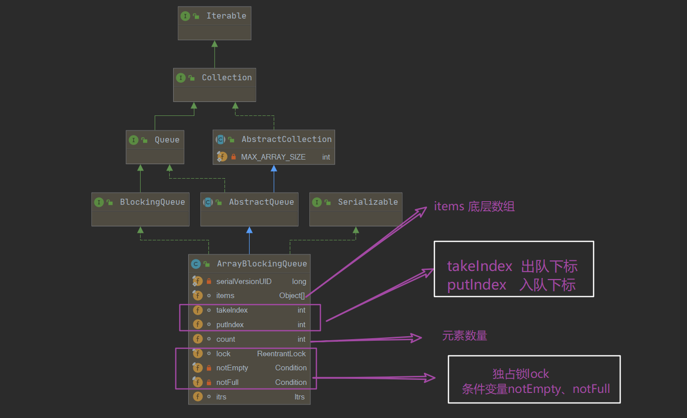

[toc]

## ArrayBlockingQueue概述

ArrayBlockingQueue是由**数组**构成的有界阻塞队列，支持FIFO的次序对元素进行排序。

这是一个典型的有界缓冲结构，可指定大小存储元素，供生产线程插入，供消费线程获取，但注意，容量一旦指定，便不可修改。

队列空时尝试take操作和队列满时尝试put操作都会阻塞执行操作的线程。

该类还支持可供选择的**公平性策略**，`ReentrantLock`可重入锁实现，默认采用非公平策略，当队列可用时，阻塞的线程都可以争夺访问队列的资格。

> 阻塞队列通过`ReentrantLock` + `Condition`实现并发环境下的等待通知机制：读操作和写操作都需要获取到AQS独占锁才能进行操作，如果队列为空，则读操作线程将会被包装为条件节点扔到读线程等待条件队列中，等待写线程写入新的元素，同时读线程将会被唤醒，反之亦然。

## 类图结构及重要字段



```java
public class ArrayBlockingQueue<E> extends AbstractQueue<E>
        implements BlockingQueue<E>, java.io.Serializable {
    // 序列号， 用于序列化
    private static final long serialVersionUID = -817911632652898426L;
    // 底层存储数据的定长数组
    final Object[] items;
    // 移除操作的index，可以理解为队头位置
    int takeIndex;
    // 添加操作的index，可以理解为队尾位置
    int putIndex;
    // 元素个数
    int count;
    // 独占重入锁
    final ReentrantLock lock;
    // 等待takes的条件对象
    private final Condition notEmpty;
    // 等待puts的条件对象
    private final Condition notFull;
    // Itrs表示队列和迭代器之间的共享数据，其实用来存储多个迭代器实例的
    transient Itrs itrs = null;
}
```

## 构造器

使用ArrayBlockingQueue的时候，必须指定一个capacity阻塞队列的容量。可以传入可选的fair值，以采取不同公平性策略，默认使用非公平的策略。另外，可以传入集合对象，直接构造阻塞队列。

```java
    // 必须指定容量， 默认采用非公平策略
	public ArrayBlockingQueue(int capacity) {
        this(capacity, false);
    }
	// 另外，可指定公平性策略
    public ArrayBlockingQueue(int capacity, boolean fair) {
        // 对容量进行简单校验
        if (capacity <= 0)
            throw new IllegalArgumentException();
        this.items = new Object[capacity]; // 初始化底层数组
        lock = new ReentrantLock(fair); // 初始化lock
        notEmpty = lock.newCondition(); // 初始化条件变量notEmpty
        notFull =  lock.newCondition(); // 初始化条件变量notFull
    }
	// 另外，可指定传入集合直接构造
    public ArrayBlockingQueue(int capacity, boolean fair,
                              Collection<? extends E> c) {
        this(capacity, fair);
		// 加锁只是为了可见性， 而不是为了互斥特性
        final ReentrantLock lock = this.lock;
        lock.lock(); // Lock only for visibility, not mutual exclusion
        try {
            int i = 0;
            try {
                for (E e : c) { // 遍历赋值
                    checkNotNull(e);
                    items[i++] = e;
                }
            } catch (ArrayIndexOutOfBoundsException ex) {
                throw new IllegalArgumentException();
            }
            count = i;
            putIndex = (i == capacity) ? 0 : i;
        } finally {
            lock.unlock();
        }
    }
```

## 出队和入队操作

队列的操作最核心的部分莫过于入队和出队了，后面分析的方法基本上都基于这两个工具方法。

### 入队enqueue

```java
    private void enqueue(E x) {
        // assert lock.getHoldCount() == 1;
        // assert items[putIndex] == null;
        final Object[] items = this.items;
        // 把元素x放入数组
        items[putIndex] = x;
        // 下一个元素应该存放的下标位置
        if (++putIndex == items.length)
            putIndex = 0;
        count++;
        // 激活notEmpty的条件队列因调用take操作而被阻塞的一个线程
        notEmpty.signal();
    }
```

1. 将元素x置入数组中。
2. 计算下一个元素应该存放的下标位置。
3. 元素个数器递增，这里count前加了锁，值都是从主内存中获取，不会存在内存不可见问题，并且更新也会直接刷新回主内存中。
4. 最后激活notEmpty的条件队列因调用take操作而被阻塞的一个线程。

### 出队dequeue

```java
    private E dequeue() {
        // assert lock.getHoldCount() == 1;
        // assert items[takeIndex] != null;
        final Object[] items = this.items;
        @SuppressWarnings("unchecked")
        // 获取元素
        E x = (E) items[takeIndex];
        // 置null
        items[takeIndex] = null;
        // 重新设置对头下标
        if (++takeIndex == items.length)
            takeIndex = 0;
        // 更新元素计数器
        count--;
        // 更新迭代器中的元素数据，itrs只用在使用迭代器的时候才实例化哦
        if (itrs != null)
            itrs.elementDequeued();
        // 激活notFull的条件队列因调用put操作而被阻塞的一个线程
        notFull.signal();
        return x;
    }
```

1. 获取元素，并将当前位置置null。
2. 重新设置队头下标。
3. 元素计数器递减。
4. 更新迭代器中的元素数据，itrs默认情况下都是为null的，只有使用迭代器的时候才会实例化Itrs。
5. 激活notFull的条件队列因调用put操作而被阻塞的一个线程。

## 阻塞式操作

### E take() 阻塞式获取

take操作将会获取当前队列头部元素并移除，如果队列为空则阻塞当前线程直到队列不为空，退出阻塞时返回获取的元素。

> 那，线程阻塞至何时如何知道呢，其实当前线程将会因`notEmpty.await()`被包装成等待节点置入notEmpty的条件队列中，一旦enqueue操作成功触发，也就是入队成功，将会执行`notEmpty.signal()`唤醒条件队列中等待的线程，被转移到AQS队列中参与锁的争夺。

如果线程在阻塞时被其他线程设置了中断标志，则抛出InterruptedException异常并返回。

```java
    public E take() throws InterruptedException {
        final ReentrantLock lock = this.lock;
        // 可响应中断式地获取锁
        lock.lockInterruptibly();
        try {
            // 如果队列为空，则将当前线程包装为等待节点置入notEmpty的条件队列中
            while (count == 0)
                notEmpty.await();
            // 非空，则执行入队操作，入队时唤醒notFull的条件队列中的第一个线程
            return dequeue();
        } finally {
            lock.unlock();
        }
    }
```

### void put(E e) 阻塞式插入

put操作将向队尾插入元素，如果队列未满则插入，如果队列已满，则阻塞当前线程直到队列不满。

如果线程在阻塞时被其他线程设置了中断标志，则抛出InterruptedException异常并返回。

```java
    public void put(E e) throws InterruptedException {
        checkNotNull(e);
        final ReentrantLock lock = this.lock;
        lock.lockInterruptibly();
        try {
            // 如果队列满，则将当前线程包装为等待节点置入notFull的条件队列中
            while (count == items.length)
                notFull.await();
            // 非满，则执行入队操作，入队时唤醒notEmpty的条件队列中的第一个线程
            enqueue(e);
        } finally {
            lock.unlock();
        }
    }
```

### E poll(timeout, unit) 阻塞式超时获取

在take阻塞式获取方法的基础上额外增加超时功能，传入一个timeout，获取不到而阻塞的时候，如果时间到了，即使还获取不到，也只能立即返回null。

```java
    public E poll(long timeout, TimeUnit unit) throws InterruptedException {
        long nanos = unit.toNanos(timeout);
        final ReentrantLock lock = this.lock;
        lock.lockInterruptibly();
        try {
            while (count == 0) {
                // 队列仍为空，但是时间到了，必须返回了
                if (nanos <= 0)
                    return null;
                // 在条件队列里等着，但是需要更新时间
                nanos = notEmpty.awaitNanos(nanos);
            }
            return dequeue();
        } finally {
            lock.unlock();
        }
    }
```

### boolean offer(e, timeout, unit) 阻塞式超时插入

在put阻塞式插入方法的基础上额外增加超时功能，传入一个timeout，获取不到而阻塞的时候，如果时间到了，即使还获取不到，也只能立即返回null。

```java
    public boolean offer(E e, long timeout, TimeUnit unit)
        throws InterruptedException {

        checkNotNull(e);
        long nanos = unit.toNanos(timeout);
        final ReentrantLock lock = this.lock;
        lock.lockInterruptibly();
        try {
            while (count == items.length) {
                if (nanos <= 0)
                    return false;
                nanos = notFull.awaitNanos(nanos);
            }
            enqueue(e);
            return true;
        } finally {
            lock.unlock();
        }
    }
```

## 其他常规操作

### boolean offer(E e)

offer(E e)是非阻塞的方法，向队尾插入一个元素，如果队列未满，则插入成功并返回true；如果队列已满则丢弃当前元素，并返回false。

```java
    public boolean offer(E e) {
        checkNotNull(e); // 如果插入元素为null，则抛出NullPointerException异常
        // 获取独占锁
        final ReentrantLock lock = this.lock; 
        lock.lock();
        try {
            // 如果队列满， 则返回false
            if (count == items.length)
                return false;
            else {
                // 否则则入队
                enqueue(e);
                return true;
            }
        } finally {
            lock.unlock();
        }
    }
```

### E poll()

从队列头部获取并移除第一个元素，如果队列为空则返回null。

```java
    public E poll() {
        final ReentrantLock lock = this.lock;
        lock.lock();
        try {
            // 如果为空，返回null， 否则执行出队操作
            return (count == 0) ? null : dequeue();
        } finally {
            lock.unlock();
        }
    }
```

### Boolean remove(Object o)

移除队列中与元素o相等【指的是equals方法判定相同】的元素，移除成功返回true，如果队列为空或没有匹配元素，则返回false。

```java
    public boolean remove(Object o) {
        if (o == null) return false;
        final Object[] items = this.items;
        final ReentrantLock lock = this.lock;
        lock.lock();
        try {
            
            if (count > 0) {
                // 获取当前队尾位置
                final int putIndex = this.putIndex;
                // 从队头开始遍历
                int i = takeIndex;
                do {
                    // 找到了对应的元素的位置，removeAt删除该位置的元素
                    if (o.equals(items[i])) {
                        removeAt(i);
                        return true;
                    }
                    if (++i == items.length)
                        i = 0;
                } while (i != putIndex);
            }
            return false;
        } finally {
            lock.unlock();
        }
    }
	// 移除removeIndex位置的元素
    void removeAt(final int removeIndex) {
        // assert lock.getHoldCount() == 1;
        // assert items[removeIndex] != null;
        // assert removeIndex >= 0 && removeIndex < items.length;
        final Object[] items = this.items;
        // 如果要移除元素的位置正好就是 队头位置，和之前出队操作一样
        if (removeIndex == takeIndex) {
            // removing front item; just advance
            items[takeIndex] = null;
            if (++takeIndex == items.length)
                takeIndex = 0;
            count--;
            if (itrs != null)
                itrs.elementDequeued();
        } else {
            // an "interior" remove

            // slide over all others up through putIndex.
            final int putIndex = this.putIndex;
            // 移除的不是队头，那就要对应将后面的元素补充上来，并更新putIndex的位置
            for (int i = removeIndex;;) {
                int next = i + 1;
                if (next == items.length)
                    next = 0;
                // 移除的不是队尾，后面的元素补充上来
                if (next != putIndex) {
                    items[i] = items[next];
                    i = next;
                } else {
                    // 移除的是队尾元素
                    items[i] = null;
                    this.putIndex = i;
                    break;
                }
            }
            count--;
            if (itrs != null)
                itrs.removedAt(removeIndex);
        }
        notFull.signal();
    }
```

## 总结

- ArrayBlockingQueue基于数组的有界阻塞队列，必须指定容量大小，及队列中最多允许的元素个数。

- 提供了take和put两个阻塞式的操作，还提供了阻塞式+超时机制的操作。

- 阻塞队列通过`ReentrantLock` + `Condition`实现并发环境下的**等待通知**机制：读操作和写操作都需要获取到AQS独占锁才能进行操作，如果队列为空，则读操作线程将会被包装为条件节点扔到读线程等待条件队列中阻塞，等待写线程写入新的元素，并唤醒等待中的读线程，反之亦然。

本篇重点看了出队入队相关方法，其余部分如迭代器相关不是本文重点，如果想了解学习可以参看：[ArrayBlockingQueue 迭代器](https://blog.csdn.net/qfanmingyiq/article/details/109367230)

## 参考阅读

- 《Java并发编程之美》
- 《Java并发编程的艺术》