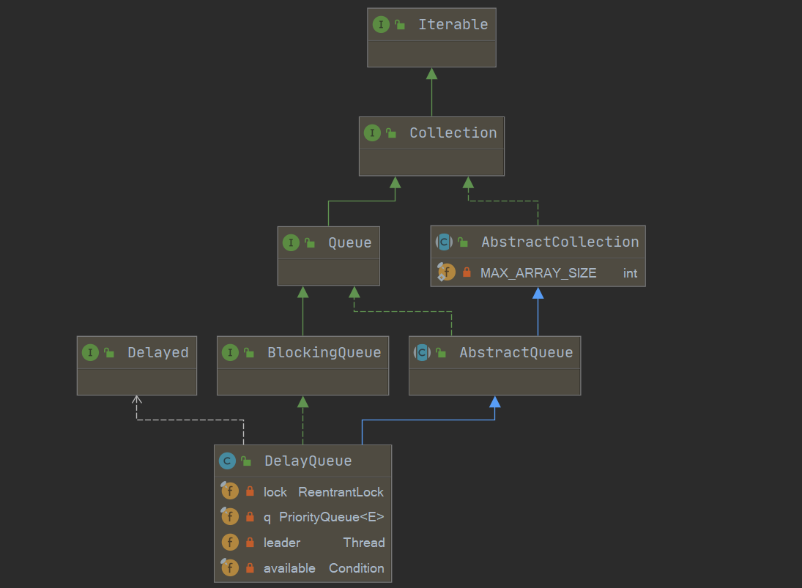

 

[toc]

系列传送门：

- [Java并发包源码学习系列：AbstractQueuedSynchronizer](https://blog.csdn.net/Sky_QiaoBa_Sum/article/details/112254373)
- [Java并发包源码学习系列：CLH同步队列及同步资源获取与释放](https://blog.csdn.net/Sky_QiaoBa_Sum/article/details/112301359)
- [Java并发包源码学习系列：AQS共享式与独占式获取与释放资源的区别](https://blog.csdn.net/Sky_QiaoBa_Sum/article/details/112386838)
- [Java并发包源码学习系列：ReentrantLock可重入独占锁详解](https://blog.csdn.net/Sky_QiaoBa_Sum/article/details/112454874)
- [Java并发包源码学习系列：ReentrantReadWriteLock读写锁解析](https://blog.csdn.net/Sky_QiaoBa_Sum/article/details/112689635)
- [Java并发包源码学习系列：详解Condition条件队列、signal和await](https://blog.csdn.net/Sky_QiaoBa_Sum/article/details/112727669)
- [Java并发包源码学习系列：挂起与唤醒线程LockSupport工具类](https://blog.csdn.net/Sky_QiaoBa_Sum/article/details/112757098)
- [Java并发包源码学习系列：JDK1.8的ConcurrentHashMap源码解析](https://blog.csdn.net/Sky_QiaoBa_Sum/article/details/113059783)
- [Java并发包源码学习系列：阻塞队列BlockingQueue及实现原理分析](https://blog.csdn.net/Sky_QiaoBa_Sum/article/details/113186979)
- [Java并发包源码学习系列：阻塞队列实现之ArrayBlockingQueue源码解析](https://blog.csdn.net/Sky_QiaoBa_Sum/article/details/113252384)
- [Java并发包源码学习系列：阻塞队列实现之LinkedBlockingQueue源码解析](https://blog.csdn.net/Sky_QiaoBa_Sum/article/details/113329416)
- [Java并发包源码学习系列：阻塞队列实现之PriorityBlockingQueue源码解析](https://blog.csdn.net/Sky_QiaoBa_Sum/article/details/113358710)

## DelayQueue概述

DelayQueue是一个**支持延时获取元素**的无界阻塞队列，使用PriorityQueue来存储元素。

队中的元素必须实现`Delayed`接口【Delay接口又继承了Comparable，需要实现compareTo方法】，每个元素都需要指明过期时间，通过`getDelay(unit)`获取元素剩余时间【剩余时间 = 到期时间 - 当前时间】，每次向优先队列中添加元素时根据compareTo方法作为排序规则。

当从队列获取元素时，只有过期的元素才会出队列。

使用场景: 缓存系统设计、定时任务调度等。

## 类图及重要字段



```java
public class DelayQueue<E extends Delayed> extends AbstractQueue<E>
    implements BlockingQueue<E> {
    // 独占锁实现同步
    private final transient ReentrantLock lock = new ReentrantLock();
    // 优先队列存放数据
    private final PriorityQueue<E> q = new PriorityQueue<E>();

    /**
     * 基于Leader-Follower模式的变体,用于尽量减少不必要的线程等待
     */
    private Thread leader = null;

    /**
     * 与lock对应的条件变量
     */
    private final Condition available = lock.newCondition();    
}
```

1. 使用ReentrantLock独占锁实现线程同步，使用Condition实现等待通知机制。
2. 基于Leader-Follower模式的变体，减少不必要的线程等待。
3. 内部使用PriorityQueue优先级队列存储元素，且队列中元素必须实现Delayed接口。

## Delayed接口

队中的元素必须实现`Delayed`接口【Delay接口又继承了Comparable，需要实现compareTo方法】，每个元素都需要指明过期时间，通过`getDelay(unit)`获取元素剩余时间【剩余时间 = 到期时间 - 当前时间】。

每次向优先队列中添加元素时根据compareTo方法作为排序规则，当然我们约定一下，默认q.peek()出来的就是最先过期的元素。

```java
public interface Delayed extends Comparable<Delayed> {
    // 返回剩余时间
    long getDelay(TimeUnit unit);
}

public interface Comparable<T> {
	// 定义比较方法
    public int compareTo(T o);
}
```

## Delayed元素案例

学习了Delayed接口之后，我们看一个实际的案例，加深印象，源于：《Java并发编程之美》。

```java
    static class DelayedElement implements Delayed {

        private final long delayTime; // 延迟时间
        private final long expire; // 到期时间
        private final String taskName; // 任务名称

        public DelayedElement (long delayTime, String taskName) {
            this.delayTime = delayTime;
            this.taskName = taskName;
            expire = now() + delayTime;
        }

        final long now () {
            return System.currentTimeMillis();
        }

        // 剩余时间 = 到期时间 - 当前时间
        @Override
        public long getDelay (TimeUnit unit) {
            return unit.convert(expire - now(), TimeUnit.MILLISECONDS);
        }

        @Override
        public int compareTo (Delayed o) {
            return (int) (getDelay(TimeUnit.MILLISECONDS) - o.getDelay(TimeUnit.MILLISECONDS));
        }

        @Override
        public String toString () {
            final StringBuilder res = new StringBuilder("DelayedElement [ ");
            res.append("delay = ").append(delayTime);
            res.append(", expire = ").append(expire);
            res.append(", taskName = '").append(taskName).append('\'');
            res.append(" ] ");
            return res.toString();
        }
    }


    public static void main (String[] args) {
        // 创建delayQueue队列
        DelayQueue<DelayedElement> delayQueue = new DelayQueue<>();

        // 创建延迟任务
        Random random = new Random();
        for (int i = 0; i < 10; i++) {
            DelayedElement element = new DelayedElement(random.nextInt(500), "task: " + i);
            delayQueue.offer(element);
        }

        // 依次取出任务并打印
        DelayedElement ele = null;
        try {
            for (; ; ) {
                while ((ele = delayQueue.take()) != null) {
                    System.out.println(ele);
                }
            }
        } catch (InterruptedException ex) {
            ex.printStackTrace();
        }
    }
// 打印结果
DelayedElement [ delay = 2, expire = 1611995426061, taskName = 'task: 4' ] 
DelayedElement [ delay = 52, expire = 1611995426111, taskName = 'task: 2' ] 
DelayedElement [ delay = 80, expire = 1611995426139, taskName = 'task: 5' ] 
DelayedElement [ delay = 132, expire = 1611995426191, taskName = 'task: 0' ] 
DelayedElement [ delay = 174, expire = 1611995426233, taskName = 'task: 9' ] 
DelayedElement [ delay = 175, expire = 1611995426234, taskName = 'task: 7' ] 
DelayedElement [ delay = 326, expire = 1611995426385, taskName = 'task: 3' ] 
DelayedElement [ delay = 447, expire = 1611995426506, taskName = 'task: 8' ] 
DelayedElement [ delay = 452, expire = 1611995426511, taskName = 'task: 1' ] 
DelayedElement [ delay = 486, expire = 1611995426545, taskName = 'task: 6' ]
```

- 实现了compareTo方法，定义比较规则为越早过期的排在队头。
- 实现了getDelay方法，计算公式为：剩余时间 = 到期时间 - 当前时间。

## 构造器

DelayQueue构造器相比于前几个，就显得非常easy了。

```java
    public DelayQueue() {}

    public DelayQueue(Collection<? extends E> c) {
        this.addAll(c);
    }
```

## void put(E e)

因为DelayQueue是无界队列，不会因为边界问题产生阻塞，因此put操作和offer操作是一样的。

```java
    public void put(E e) {
        offer(e);
    }

    public boolean offer(E e) {
        // 获取独占锁
        final ReentrantLock lock = this.lock;
        lock.lock();
        try {
            // 加入优先队列里
            q.offer(e);
            // 判断堆顶元素是不是刚刚插入的元素
            // 如果判断为true，说明当前这个元素是将最先过期
            if (q.peek() == e) {
                // 重置leader线程为null
                leader = null; 
                // 激活available变量条件队列中的一个线程
                available.signal();
            }
            return true;
        } finally {
            lock.unlock();
        }
    }
```

## E take()

take方法将会**获取并移除队列里面延迟时间过期的元素** ，如果队列里面没有过期元素则陷入等待。

```java
    public E take() throws InterruptedException {
        // 获取独占锁
        final ReentrantLock lock = this.lock;
        lock.lockInterruptibly();
        try {
            for (;;) {
                // 瞅一瞅谁最快过期
                E first = q.peek();
                // 队列为空，则将当前线程置入available的条件队列中，直到里面有元素
                if (first == null)
                    available.await();
                else {
                    // 看下还有多久过期
                    long delay = first.getDelay(NANOSECONDS);
                    // 哇，已经过期了，就移除它并返回
                    if (delay <= 0)
                        return q.poll();
                    first = null; // don't retain ref while waiting
                    // leader不为null表示其他线程也在执行take
                    // 则将当前线程置入available的条件队列中
                    if (leader != null)
                        available.await();
                    else {
                        // 如果leader为null，则选择当前线程作为leader线程
                        Thread thisThread = Thread.currentThread();
                        leader = thisThread;
                        try {
                            // 等待delay时间，时间到之后，会出条件队列，继续竞争锁
                            available.awaitNanos(delay);
                        } finally {
                            if (leader == thisThread)
                                leader = null;
                        }
                    }
                }
            }
        } finally {
            if (leader == null && q.peek() != null)
                available.signal();
            lock.unlock();
        }
    }
```

### first = null 有什么用

如果不设置`first = null`，将会引起内存泄露。

> - 线程A到达，队首元素没有到期，设置leader = 线程A，并且执行`available.awaitNanos(delay);`等待元素过期。
> - 这时线程B来了，因为leader != null，则会`available.await();`阻塞，线程C、D、E同理。
> - 线程A阻塞完毕了，再次循环，获取列首元素成功，出列。
>
> 这个时候列首元素应该会被回收掉，但是问题是它还被线程B、线程C持有着，所以不会回收，如果线程增多，且队首元素无限期的不能回收，就会造成内存泄漏。

## 总结

DelayQueue是一个**支持延时获取元素**的**无界阻塞**队列，使用PriorityQueue来存储元素。

队中的元素必须实现`Delayed`接口【Delay接口又继承了Comparable，需要实现compareTo方法】，每个元素都需要指明过期时间，通过`getDelay(unit)`获取元素剩余时间【剩余时间 = 到期时间 - 当前时间】，每次向优先队列中添加元素时根据compareTo方法作为排序规则。

基于Leader-Follower模式使用leader变量，减少不必要的线程等待。

DelayQueue是无界队列，因此插入操作是非阻塞的。但是take操作从队列获取元素时，是阻塞的，阻塞规则为：

- 当一个线程调用队列的take方法，如果队列为空，则将会调用` available.await()`陷入阻塞。
- 如果队列不为空，则查看队列的队首元素是否过期，根据getDelay的返回值是否小于0判断，如果过期则返回该元素。
- 如果队首元素未过期，则**判断当前线程是否为leader线程**，如果不是，表明有其他线程在执行take操作，就调用`available.await()`陷入阻塞。
- 如果没有其他线程在执行take，就将当前线程设置为leader，并等待队首元素过期，`available.awaitNanos(delay)`。
- leader线程退出take之后，将会调用`available.signal()`唤醒一个follower线程，接着回到开始那步。

## 参考阅读

- 《Java并发编程的艺术》
- 《Java并发编程之美》

- [【死磕Java并发】—–J.U.C之阻塞队列：DelayQueue](http://cmsblogs.com/?p=2413)