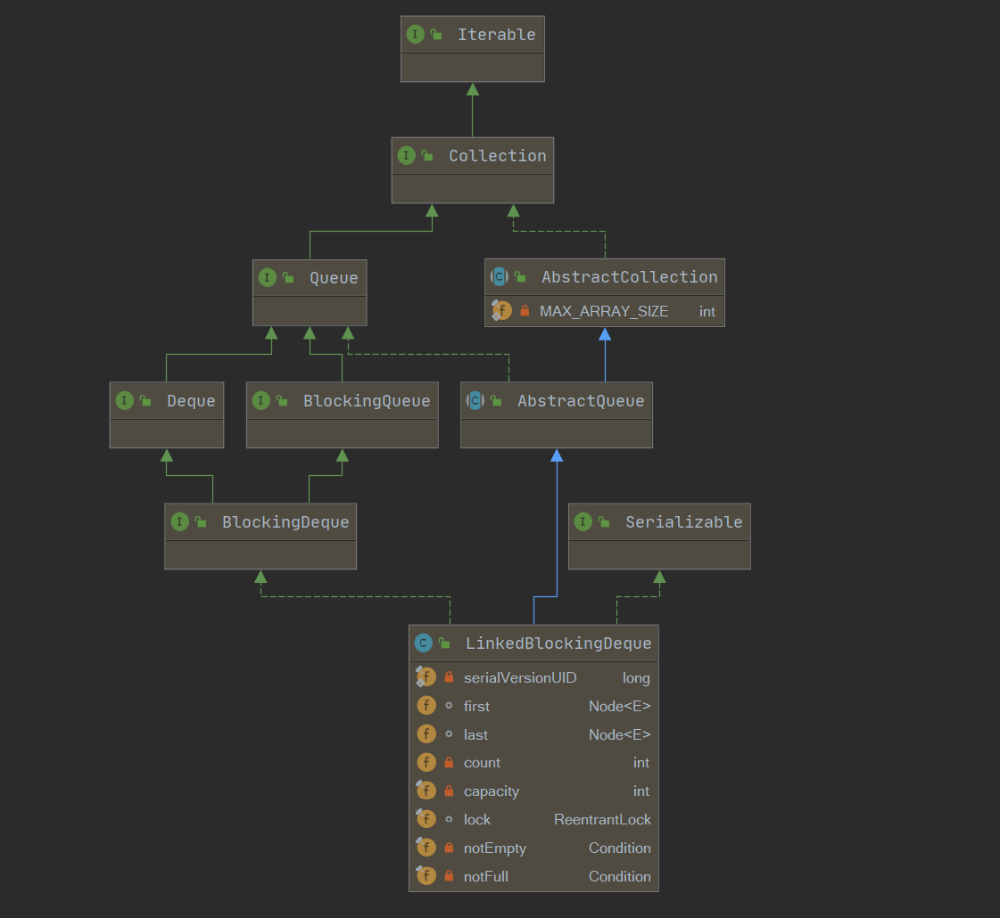
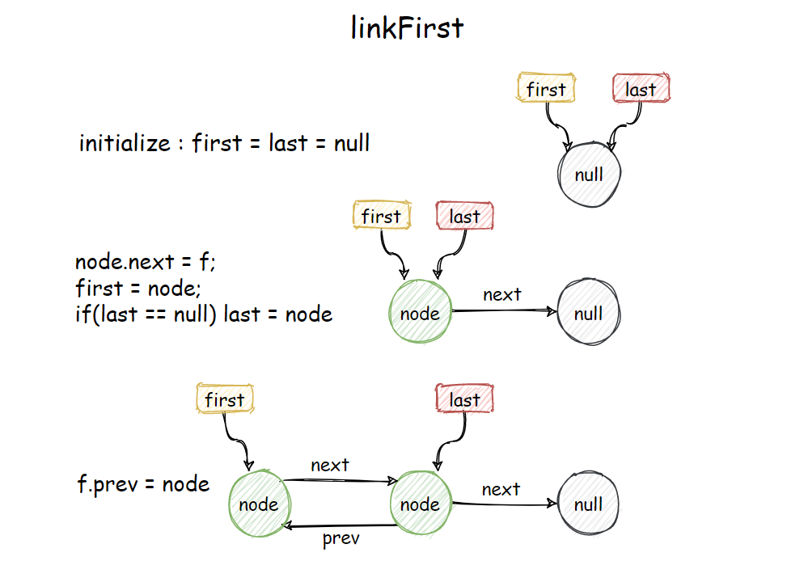
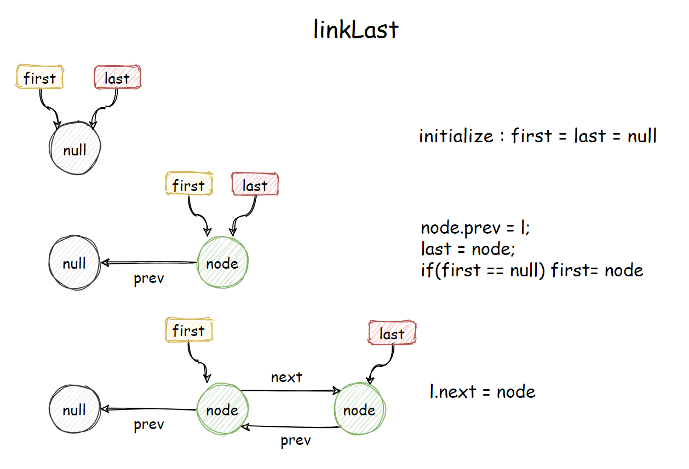
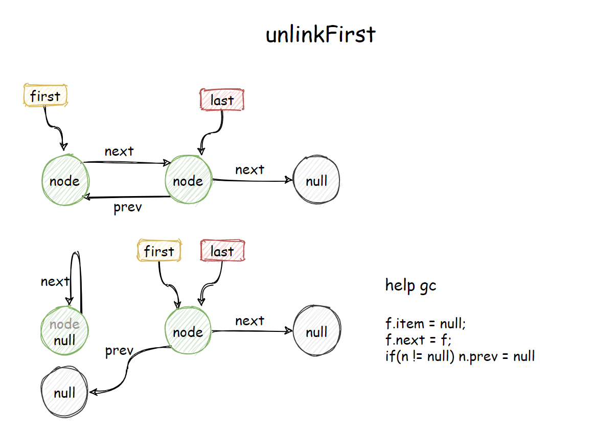
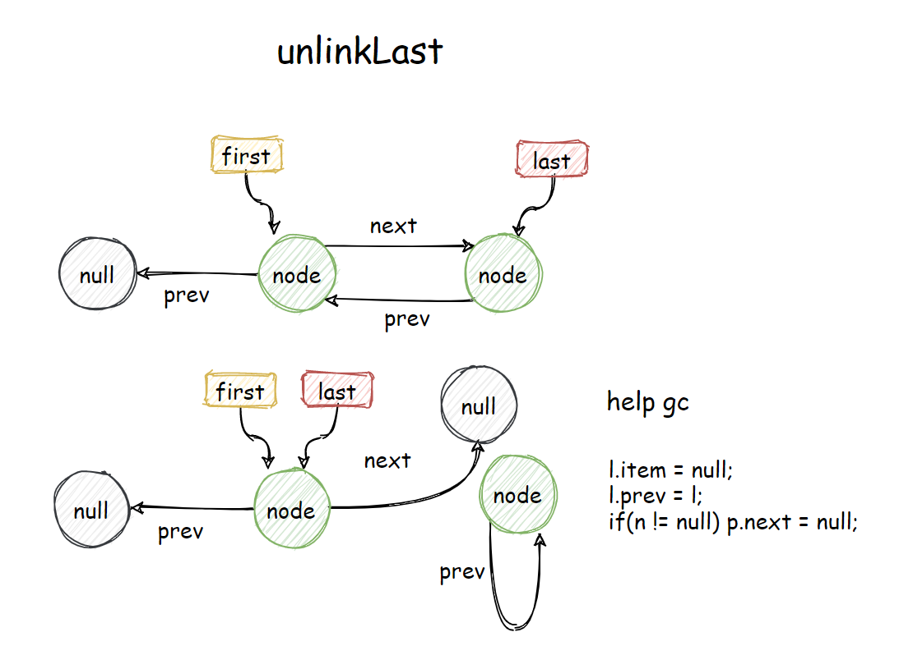
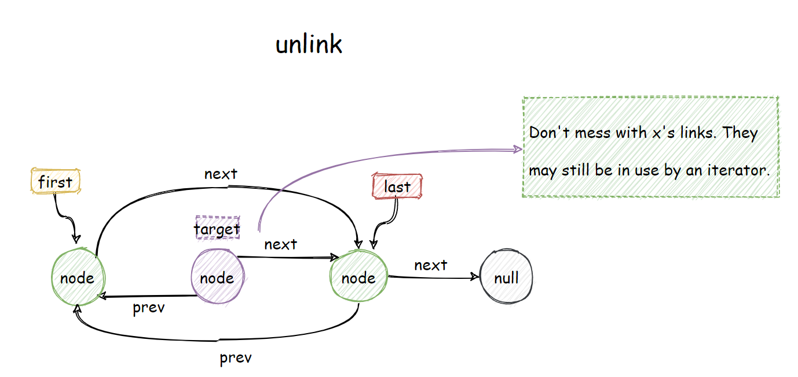

[toc]

系列传送门：

- [Java并发包源码学习系列：AbstractQueuedSynchronizer](https://blog.csdn.net/Sky_QiaoBa_Sum/article/details/112254373)
- [Java并发包源码学习系列：CLH同步队列及同步资源获取与释放](https://blog.csdn.net/Sky_QiaoBa_Sum/article/details/112301359)
- [Java并发包源码学习系列：AQS共享式与独占式获取与释放资源的区别](https://blog.csdn.net/Sky_QiaoBa_Sum/article/details/112386838)
- [Java并发包源码学习系列：ReentrantLock可重入独占锁详解](https://blog.csdn.net/Sky_QiaoBa_Sum/article/details/112454874)
- [Java并发包源码学习系列：ReentrantReadWriteLock读写锁解析](https://blog.csdn.net/Sky_QiaoBa_Sum/article/details/112689635)
- [Java并发包源码学习系列：详解Condition条件队列、signal和await](https://blog.csdn.net/Sky_QiaoBa_Sum/article/details/112727669)
- [Java并发包源码学习系列：挂起与唤醒线程LockSupport工具类](https://blog.csdn.net/Sky_QiaoBa_Sum/article/details/112757098)
- [Java并发包源码学习系列：JDK1.8的ConcurrentHashMap源码解析](https://blog.csdn.net/Sky_QiaoBa_Sum/article/details/113059783)
- [Java并发包源码学习系列：阻塞队列BlockingQueue及实现原理分析](https://blog.csdn.net/Sky_QiaoBa_Sum/article/details/113186979)
- [Java并发包源码学习系列：阻塞队列实现之ArrayBlockingQueue源码解析](https://blog.csdn.net/Sky_QiaoBa_Sum/article/details/113252384)
- [Java并发包源码学习系列：阻塞队列实现之LinkedBlockingQueue源码解析](https://blog.csdn.net/Sky_QiaoBa_Sum/article/details/113329416)
- [Java并发包源码学习系列：阻塞队列实现之PriorityBlockingQueue源码解析](https://blog.csdn.net/Sky_QiaoBa_Sum/article/details/113358710)
- [Java并发包源码学习系列：阻塞队列实现之DelayQueue源码解析](https://blog.csdn.net/Sky_QiaoBa_Sum/article/details/113440013)
- [Java并发包源码学习系列：阻塞队列实现之SynchronousQueue源码解析](https://blog.csdn.net/Sky_QiaoBa_Sum/article/details/113528143)
- [Java并发包源码学习系列：阻塞队列实现之LinkedTransferQueue源码解析](https://blog.csdn.net/Sky_QiaoBa_Sum/article/details/113576816)

## LinkedBlockingDeque概述

LinkedBlockingDeque是由链表构成的界限可选的**双端阻塞队列**，支持O(1)的时间复杂度**从两端插入和移除元素**，如不指定边界，则为`Integer.MAX_VALUE`。

由一个ReentrantLock保证同步，使用conditions来实现等待通知。


## 类图结构及重要字段



```java
public class LinkedBlockingDeque<E>
    extends AbstractQueue<E>
    implements BlockingDeque<E>, java.io.Serializable {

    private static final long serialVersionUID = -387911632671998426L;

    /** 双向链表节点 */
    static final class Node<E> {
        E item;
        Node<E> prev;
        Node<E> next;
        Node(E x) {
            item = x;
        }
    }

    /**
     * 指向第一个节点
     * Invariant: (first == null && last == null) ||
     *            (first.prev == null && first.item != null)
     */
    transient Node<E> first;

    /**
     * 指向最后一个节点
     * Invariant: (first == null && last == null) ||
     *            (last.next == null && last.item != null)
     */
    transient Node<E> last;

    /** 节点数量 */
    private transient int count;

    /** 队列容量 */
    private final int capacity;

    /** 保证同步 */
    final ReentrantLock lock = new ReentrantLock();

    /** take操作发生的条件 */
    private final Condition notEmpty = lock.newCondition();

    /** put操作发生的条件 */
    private final Condition notFull = lock.newCondition();
    
}
```

## linkFirst

尝试将节点加入到first之前，更新first，如果插入之后超出容量，返回false。

```java
    private boolean linkFirst(Node<E> node) {
        // assert lock.isHeldByCurrentThread();
        if (count >= capacity)
            return false;
        Node<E> f = first;
        node.next = f;
        first = node;
        if (last == null)
            last = node;
        else
            f.prev = node;
        ++count;
        notEmpty.signal();
        return true;
    }
```



## linkLast

在last节点后加入节点node，更新last。如果插入之后超出容量，返回false。

```java
    private boolean linkLast(Node<E> node) {
        // assert lock.isHeldByCurrentThread();
        if (count >= capacity)
            return false;
        Node<E> l = last;
        node.prev = l;
        last = node;
        if (first == null)
            first = node;
        else
            l.next = node;
        ++count;
        notEmpty.signal();// 满足notEmpty条件
        return true;
    }
```



## unlinkFirst

移除first节点，并返回其item值，如果队列为空，则返回full。

```java
    private E unlinkFirst() {
        // assert lock.isHeldByCurrentThread();
        Node<E> f = first;
        if (f == null)
            return null;
        Node<E> n = f.next;
        E item = f.item;
        f.item = null;
        f.next = f; // help GC
        first = n;
        if (n == null)
            last = null;
        else
            n.prev = null;
        --count;
        notFull.signal();// 满足notFull条件
        return item;
    }
```



## unlinkLast

移除last节点，并返回其item值，如果队列为空，则返回full。

```java
    private E unlinkLast() {
        // assert lock.isHeldByCurrentThread();
        Node<E> l = last;
        if (l == null)
            return null;
        Node<E> p = l.prev;
        E item = l.item;
        l.item = null;
        l.prev = l; // help GC
        last = p;
        if (p == null)
            first = null;
        else
            p.next = null;
        --count;
        notFull.signal(); // 满足notFull条件
        return item;
    }
```



## unlink

移除任意一个节点，注意这里并没有操作x本身的连接，因为它可能仍被iterator使用着。

```java
    void unlink(Node<E> x) {
        // assert lock.isHeldByCurrentThread();
        Node<E> p = x.prev;
        Node<E> n = x.next;
        // 移除的是first
        if (p == null) {
            unlinkFirst();
        // 移除的是last
        } else if (n == null) {
            unlinkLast();
        } else {
            // 移除的是中间节点
            p.next = n;
            n.prev = p;
            x.item = null;
            // Don't mess with x's links.  They may still be in use by
            // an iterator.
            // 这里x的prev和next指针都没有改变，因为他们可能在被iterator使用
            --count;
            notFull.signal();
        }
    }
```



## 总结

LinkedBlockingDeque是由链表构成的界限可选的**双端阻塞队列**，支持O(1)的时间复杂度**从两端插入和移除元素**，如不指定边界，则为`Integer.MAX_VALUE`。

由一个ReentrantLock保证同步，使用conditions来实现等待通知。

上面介绍的所有操作基本上就是核心方法啦，诸如putFirst、putLast、takeFirst、takeLast等方法都会调用上面的核心方法，而且实现上面也是比较简单的，就是双端链表的基本操作，不懂的可以画画图帮助理解哈。

## 参考阅读

- 《Java并发编程的艺术》

- 《Java并发编程之美》
