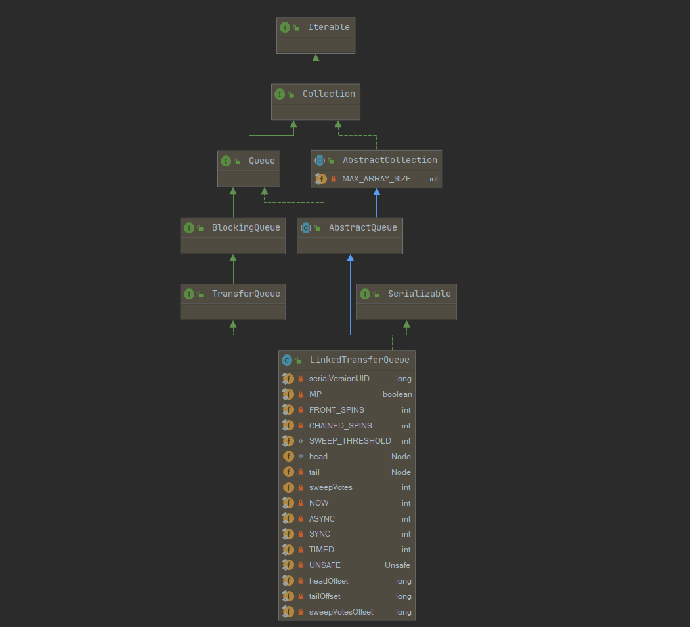
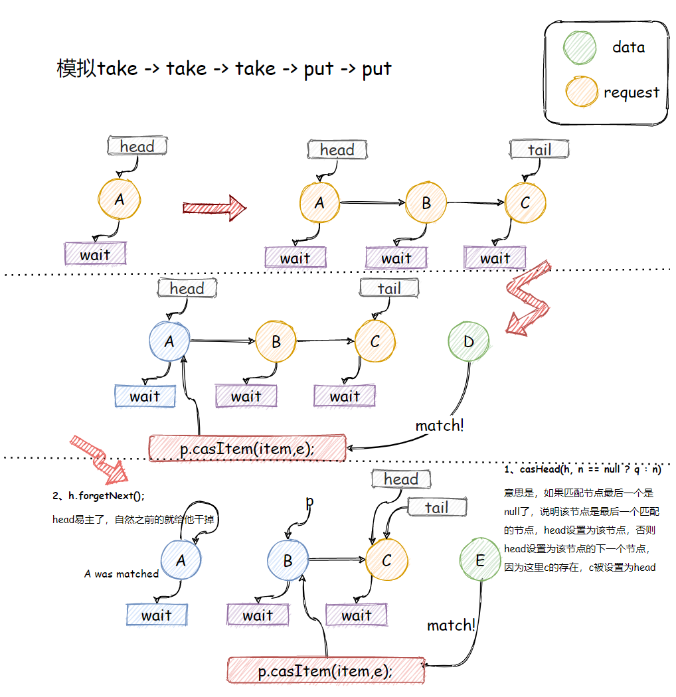

[toc]

系列传送门：

- [Java并发包源码学习系列：AbstractQueuedSynchronizer](https://blog.csdn.net/Sky_QiaoBa_Sum/article/details/112254373)
- [Java并发包源码学习系列：CLH同步队列及同步资源获取与释放](https://blog.csdn.net/Sky_QiaoBa_Sum/article/details/112301359)
- [Java并发包源码学习系列：AQS共享式与独占式获取与释放资源的区别](https://blog.csdn.net/Sky_QiaoBa_Sum/article/details/112386838)
- [Java并发包源码学习系列：ReentrantLock可重入独占锁详解](https://blog.csdn.net/Sky_QiaoBa_Sum/article/details/112454874)
- [Java并发包源码学习系列：ReentrantReadWriteLock读写锁解析](https://blog.csdn.net/Sky_QiaoBa_Sum/article/details/112689635)
- [Java并发包源码学习系列：详解Condition条件队列、signal和await](https://blog.csdn.net/Sky_QiaoBa_Sum/article/details/112727669)
- [Java并发包源码学习系列：挂起与唤醒线程LockSupport工具类](https://blog.csdn.net/Sky_QiaoBa_Sum/article/details/112757098)
- [Java并发包源码学习系列：JDK1.8的ConcurrentHashMap源码解析](https://blog.csdn.net/Sky_QiaoBa_Sum/article/details/113059783)
- [Java并发包源码学习系列：阻塞队列BlockingQueue及实现原理分析](https://blog.csdn.net/Sky_QiaoBa_Sum/article/details/113186979)
- [Java并发包源码学习系列：阻塞队列实现之ArrayBlockingQueue源码解析](https://blog.csdn.net/Sky_QiaoBa_Sum/article/details/113252384)
- [Java并发包源码学习系列：阻塞队列实现之LinkedBlockingQueue源码解析](https://blog.csdn.net/Sky_QiaoBa_Sum/article/details/113329416)
- [Java并发包源码学习系列：阻塞队列实现之PriorityBlockingQueue源码解析](https://blog.csdn.net/Sky_QiaoBa_Sum/article/details/113358710)
- [Java并发包源码学习系列：阻塞队列实现之DelayQueue源码解析](https://blog.csdn.net/Sky_QiaoBa_Sum/article/details/113440013)
- [Java并发包源码学习系列：阻塞队列实现之SynchronousQueue源码解析](https://blog.csdn.net/Sky_QiaoBa_Sum/article/details/113528143)

## LinkedTransferQueue概述

LinkedTransferQueue在JDK1.7版本诞生，是由链表组成的无界**TransferQueue**，相对于其他阻塞队列，多了tryTransfer和transfer方法。

TransferQueue：<u>生产者会一直阻塞直到所添加到队列的元素被某一个消费者所消费（不仅仅是添加到队列里就完事）。</u>新添加的transfer方法用来实现这种约束。顾名思义，阻塞就是发生在元素从一个线程transfer到另一个线程的过程中，它有效地实现了元素在线程之间的传递（以建立Java内存模型中的happens-before关系的方式）。

> [http://cs.oswego.edu/pipermail/concurrency-interest/2009-February/005888.html](http://cs.oswego.edu/pipermail/concurrency-interest/2009-February/005888.html)
>
> Doug Lea评价TransferQueue是ConcurrentLinkedQueue、SynchronousQueue（在公平模式下）、无界的LinkedBlockingQueue等的超集，功能十分强大，最重要的是，它的实现也更加的高效。
>
> 总结：基于**无锁CAS**方式实现的**无界FIFO队列**。

## TransferQueue

```java
public class LinkedTransferQueue<E> extends AbstractQueue<E>
    implements TransferQueue<E>, java.io.Serializable {
    //...
}
```

LinkedTransferQueue不同于其他的阻塞队列，它实现了TransferQueue接口，这一定是核心所在，我们直接来看看接口定义的方法规范：

```java
// 继承了BlockingQueue接口，并增加若干新方法
public interface TransferQueue<E> extends BlockingQueue<E> {
    /**
     * 将元素 传给等待的消费者【如果有的话】， 返回true， 如果不存在，返回false，不入队。
     */
    boolean tryTransfer(E e);

    /**
     * 将元素传递给等待的消费者【如果有的话】， 如果没有，则将e插入队列尾部，
     * 会一直等待，直到它被消费者接收
     */
    void transfer(E e) throws InterruptedException;

    /**
     * 在transfer的基础上，增加了超时操作，时间到了还没有被消费的话，返回false，并移除元素
     */
    boolean tryTransfer(E e, long timeout, TimeUnit unit)
        throws InterruptedException;

    /**
     * 如果存在消费者线程，返回true
     */
    boolean hasWaitingConsumer();

    /**
     * 得到等待获取元素的消费者线程的数量
     */
    int getWaitingConsumerCount();
}
```

## 类图结构及重要字段



```java
public class LinkedTransferQueue<E> extends AbstractQueue<E>
    implements TransferQueue<E>, java.io.Serializable {
    private static final long serialVersionUID = -3223113410248163686L;

    /** 是否为多核处理器 */
    private static final boolean MP =
        Runtime.getRuntime().availableProcessors() > 1;

    /**
     * 当一个节点目前是队列的第一个waiter时，阻塞前的自旋次数
     */
    private static final int FRONT_SPINS   = 1 << 7;

    /**
     * 前驱节点正在处理，当前节点需要自旋的次数
     */
    private static final int CHAINED_SPINS = FRONT_SPINS >>> 1;

    /**
     * 
     */
    static final int SWEEP_THRESHOLD = 32;
    
    // 队列中的节点
    static final class Node {...}
    
    // 头节点
    transient volatile Node head;

    /** 尾指针，注意可能不是最后一个节点，初始化为null */
    private transient volatile Node tail;

    /** 删除节点失败的次数 */
    private transient volatile int sweepVotes;
    
    /*
     * xfer方法中使用，定义how，解释很清楚了，每个变量对应不同的方法
     */
    private static final int NOW   = 0; // for untimed poll, tryTransfer
    private static final int ASYNC = 1; // for offer, put, add
    private static final int SYNC  = 2; // for transfer, take
    private static final int TIMED = 3; // for timed poll, tryTransfer
```

> 有耐心的同学其实可以看一下javadoc的介绍，LinkedTransferQueue使用的队列结构其实是这样的：是`slack dual queue`，他和普通的`M&S dual queue`的区别在于，它不会每次操作的时候都更新head或tail，而是保持有针对性的slack懈怠，所以它的结构可能是下面这样，tail指针指向的节点未必就是最后一个节点。
>
> ```
>        head           tail
>          |              |
>          v              v
>          M -> M -> U -> U -> U -> U
> ```

## Node节点

Node节点的结构其实和SynchronousQueue公平模式差不太多，这一次看起来就比较清晰了，这边再总结一下，主要包含几个部分：几个重要字段，以及一些CAS方法。

```java
    static final class Node {
        final boolean isData;   // isData == true表示存数据，否则为获取数据
        volatile Object item;   // 存数据，item非null， 获取数据，匹配后，item为null
        volatile Node next; // next域
        volatile Thread waiter; // 等待线程

        // CAS操作next域 如果next为cmp，则变为val
        final boolean casNext(Node cmp, Node val) {
            return UNSAFE.compareAndSwapObject(this, nextOffset, cmp, val);
        }
		// CAS操作item域，如果item为cmp，变为val
        final boolean casItem(Object cmp, Object val) {
            // assert cmp == null || cmp.getClass() != Node.class;
            return UNSAFE.compareAndSwapObject(this, itemOffset, cmp, val);
        }

        // 构造器
        Node(Object item, boolean isData) {
            UNSAFE.putObject(this, itemOffset, item); // relaxed write
            this.isData = isData;
        }

        // 将next指向自身this
        final void forgetNext() {
            UNSAFE.putObject(this, nextOffset, this);
        }
		// 匹配或取消节点调用
        final void forgetContents() {
            UNSAFE.putObject(this, itemOffset, this);
            UNSAFE.putObject(this, waiterOffset, null);
        }

        /**
         * 判断节点是否已经匹配，匹配取消也为true
         */ 
        final boolean isMatched() {
            Object x = item;
            return (x == this) || ((x == null) == isData);
        }

        /**
         * 是否为一个未匹配的请求 item为null表示未匹配
         */
        final boolean isUnmatchedRequest() {
            return !isData && item == null;
        }

        /**
         * 如果给定的节点不能挂到当前节点后面，则返回true
         */
        final boolean cannotPrecede(boolean haveData) {
            boolean d = isData;
            Object x;
            return d != haveData && (x = item) != this && (x != null) == d;
        }

        /**
         * 尝试去匹配一个数据节点
         */
        final boolean tryMatchData() {
            // assert isData;
            Object x = item;
            if (x != null && x != this && casItem(x, null)) {
                LockSupport.unpark(waiter);
                return true;
            }
            return false;
        }

        private static final long serialVersionUID = -3375979862319811754L;

        // Unsafe mechanics
        private static final sun.misc.Unsafe UNSAFE;
        private static final long itemOffset;
        private static final long nextOffset;
        private static final long waiterOffset;
        static {
            try {
                UNSAFE = sun.misc.Unsafe.getUnsafe();
                Class<?> k = Node.class;
                itemOffset = UNSAFE.objectFieldOffset
                    (k.getDeclaredField("item"));
                nextOffset = UNSAFE.objectFieldOffset
                    (k.getDeclaredField("next"));
                waiterOffset = UNSAFE.objectFieldOffset
                    (k.getDeclaredField("waiter"));
            } catch (Exception e) {
                throw new Error(e);
            }
        }
    }
```

## 前置：xfer方法的定义

我们接下来将会介绍LinkedTransferQueue提供的各种操作，他们都会调用一个方法：xfer。

这里我们暂且不谈具体的实现，我们只需要知道一下这个方法的四个入参分别是什么意思。

```java
    /**
     * xfer方法实现了所有的队列方法
     *
     * @param e take操作传入null， 否则传入具体元素
     * @param haveData put操作为true， take操作为false
     * @param how NOW, ASYNC, SYNC, or TIMED  不同字段，先从名称上猜测一下他们的大意
     * @param nanos 如果是TIMED模式，也就是具有超时机制的方法啦，具体超时的时间
     * @return an item if matched, else e  返回匹配的元素，否则返回e
     * @throws NullPointerException 插入null值抛出空指针异常： haveData==true && e == null
     */
    private E xfer(E e, boolean haveData, int how, long nanos) {
    	//     
    }
```

接下来我们将分几类来分别看一下各种操作的定义。

## 队列操作三大类

### 插入元素put、add、offer

LinkedTransferQueue是无界的，下面三个插入方法不会阻塞，他们都调用了xfer方法，传入元素e，havaData为true，how字段类型都为`SYNC`。

```java
    public void put(E e) {
        xfer(e, true, ASYNC, 0);
    }

    public boolean offer(E e, long timeout, TimeUnit unit) {
        xfer(e, true, ASYNC, 0);
        return true;
    }

    public boolean offer(E e) {
        xfer(e, true, ASYNC, 0);
        return true;
    }

    public boolean add(E e) {
        xfer(e, true, ASYNC, 0);
        return true;
    }
```

### 获取元素take、poll

```java
    // take
	public E take() throws InterruptedException {
        E e = xfer(null, false, SYNC, 0);
        if (e != null)
            return e;
        Thread.interrupted();
        throw new InterruptedException();
    }

	// timed poll
    public E poll(long timeout, TimeUnit unit) throws InterruptedException {
        E e = xfer(null, false, TIMED, unit.toNanos(timeout));
        if (e != null || !Thread.interrupted())
            return e;
        throw new InterruptedException();
    }

	// untimed poll
    public E poll() {
        return xfer(null, false, NOW, 0);
    }
```

同样的，获取元素的方法也都调用了xfer方法，他们都传入null，havaData都为false，但是传入的how字段类型不同：

- take方法传入SYNC。
- 超时机制的poll传入TIMED，因此需要设置nanos。
- 普通的poll传入NOW。

### transfer、tryTransfer

```java
    public boolean tryTransfer(E e) {
        return xfer(e, true, NOW, 0) == null;
    }

    public void transfer(E e) throws InterruptedException {
        if (xfer(e, true, SYNC, 0) != null) {
            Thread.interrupted(); // failure possible only due to interrupt
            throw new InterruptedException();
        }
    }

    public boolean tryTransfer(E e, long timeout, TimeUnit unit)
        throws InterruptedException {
        if (xfer(e, true, TIMED, unit.toNanos(timeout)) == null)
            return true;
        if (!Thread.interrupted())
            return false;
        throw new InterruptedException();
    }
```

## xfer三大流程

xfer方法的实现，作者已经在注释中说的十分清楚啦，这边简单看下三个核心步骤，细节部分下面会学习。

> 1、Try to match an existing node 尝试去匹配一个节点
>
> 2、Try to append a new node (method tryAppend) 尝试将一个节点入队，对应tryAppend方法
>
> 3、Await match or cancellation (method awaitMatch) 阻塞等待一个节点被匹配或取消，对应awaitMatch方法

### xfer

这个方法必然是核心方法了，毕竟它可以实现队列中提供的所有操作。

```java
    private E xfer(E e, boolean haveData, int how, long nanos) {
        // 如果 是插入的数据为null， 则NPE
        if (haveData && (e == null))
            throw new NullPointerException();
        Node s = null;                        // the node to append, if needed

        retry:
        for (;;) {                            // restart on append race
			// 第一次插入数据的时候，不会进入这个循环，因为p == null
            // 否则进入这个循环，从head首节点开始
            for (Node h = head, p = h; p != null;) { // find & match first node
                boolean isData = p.isData;
                Object item = p.item;
                // 找到还未匹配的节点：  isData的item应该是为非null， 如果是null表明用过了
                if (item != p && (item != null) == isData) { // unmatched
                    // 节点类型和当前类型一致，无法匹配
                    if (isData == haveData)   // can't match
                        break;
                    // 将参数加入到item域，
                    if (p.casItem(item, e)) { // match
                        // 下面这个for循环，是匹配item之后进行的额外操作，
                        // 比如将head更新为当前这个点
                        for (Node q = p; q != h;) {
                            Node n = q.next;  // update by 2 unless singleton
                            if (head == h && casHead(h, n == null ? q : n)) {
                                h.forgetNext();
                                break;
                            }                 // advance and retry
                            if ((h = head)   == null ||
                                (q = h.next) == null || !q.isMatched())
                                break;        // unless slack < 2
                        }
                        // 阻塞线程
                        LockSupport.unpark(p.waiter);
                        // 返回item值
                        return LinkedTransferQueue.<E>cast(item);
                    }
                }
                // 如果节点已经匹配过了，向后
                Node n = p.next;
                // p != n的情况很简单，将p移到n的位置， p==n表示什么呢？
                // 其实如果p.next == p 说明p节点已经被其他线程处理，那么p就从head开始
                p = (p != n) ? n : (h = head); // Use head if p offlist
            }
			// 还没有找到可以匹配的点的话，会走到这
            // 这里 如果 how 字段传入为 NOW ，便不会走里面的逻辑，
            // 也就是说untimed poll、 tryTransfer 不需要将元素入队
            if (how != NOW) {                 // No matches available
                // 这里构造一个节点
                if (s == null)
                    s = new Node(e, haveData);
                // 初始化之后，调用tryAppend入队， 返回前驱节点
                Node pred = tryAppend(s, haveData);
                // pred == null表示竞争失败，返回到retry的地方
                if (pred == null)
                    continue retry;           // lost race vs opposite mode
                // 如果是ASYNC会跳过这里，立刻返回e，不需要阻塞
                if (how != ASYNC)
                    return awaitMatch(s, pred, e, (how == TIMED), nanos);
            }
            return e; // not waiting
        }
    }
```

核心流程：

1. 从头开始往后找，**跳过已经匹配过的节点，直到找到mode相反的节点，进行匹配并返回**。如果需要的话，可以额外改变head的指向。
2. 如果没有找到可以匹配的点呢？ 那就判断是不是NOW，**如果是NOW的话，直接返回**【untimed poll, tryTransfer】。
3. 如果不是NOW，那就构建一个节点，入队，如果**是ASYNC就直接返回**【offer, put, add】，其他情况需要阻塞等待匹配。

直接上图吧：



### tryAppend

tryAppend包含入队的逻辑，返回前驱节点。代码充分考虑到并发情况，还是比较难懂的，如果要看明白，可以在图上画一画节点的变化。

```java
    private Node tryAppend(Node s, boolean haveData) {
        for (Node t = tail, p = t;;) {        // move p to last node and append
            Node n, u;                        // temps for reads of next & tail
            // p == null && head == null  表示此时队头还未初始化
            if (p == null && (p = head) == null) {
                // cas设置s为队头
                if (casHead(null, s))
                    return s;                 // initialize
            }
            // 这里检测到异常情况，返回null，之后会continue retry；
            else if (p.cannotPrecede(haveData))
                return null;                  // lost race vs opposite mode
            // 这里就是p一直找到tail的位置，
            else if ((n = p.next) != null)    // not last; keep traversing
                // 这段... 吐槽一下
                p = p != t && t != (u = tail) ? (t = u) : // stale tail
                    (p != n) ? n : null;      // restart if off list
            // 尝试将s插到队尾，如果失败，说明其他线程先插了，那么p向后移，从新开始
            else if (!p.casNext(null, s))
                p = p.next;                   // re-read on CAS failure
            else {
                if (p != t) {                 // update if slack now >= 2
                    // 这里会设置s为tail，如果成功的话，就退出循环了，
                    // 如果失败的话，会进行后面的判断，一开始tail其实都是null的
                    // 
                    while ((tail != t || !casTail(t, s)) &&
                           (t = tail)   != null &&
                           (s = t.next) != null && // advance and retry
                           (s = s.next) != null && s != t);
                }
                // 返回加入节点的前驱节点
                return p;
            }
        }
    }
```

该方法从当前的tail开始，找到实际的最后一个节点【前面说了，tail可能不是最后一个节点】，并尝试追加一个新的节点【如果head为null，则建立第一个节点】。

成功追加后，如果how为ASYNC，则返回。

注意：仅当它的前面节点都已经匹配或mode相同时，才可以追加节点。如果检测到其他的情况，我们需要直接返回null，重新启动retry。

### awaitMatch

awaitMatch方法其实和SynchronousQueue的awaitFulfill逻辑差不多，线程会有三种情况：`spins/yield/blocks`，直到node s被匹配或取消。

> On multiprocessors, we use **front-of-queue** spinning: If a node appears to be the first unmatched node in the queue, it spins a bit before blocking.

如果一个节点可能会优先被匹配呢，它会优先选择自旋而不是阻塞，自旋次数到了才阻塞，主要是考虑到阻塞、唤醒需要消耗更多的资源。这边简单过一下：

```java
    private E awaitMatch(Node s, Node pred, E e, boolean timed, long nanos) {
        final long deadline = timed ? System.nanoTime() + nanos : 0L;
        Thread w = Thread.currentThread();
        // 自旋次数
        int spins = -1; // initialized after first item and cancel checks
        // 这里是线程安全的Random
        ThreadLocalRandom randomYields = null; // bound if needed

        for (;;) {
            Object item = s.item;
            // 
            if (item != e) {                  // matched
                // assert item != s;
                s.forgetContents();           // avoid garbage
                return LinkedTransferQueue.<E>cast(item);
            }
            // 如果中断或超时 ，就cas设置s的item为e
            if ((w.isInterrupted() || (timed && nanos <= 0)) &&
                    s.casItem(e, s)) {        // cancel
                // 断开
                unsplice(pred, s);
                return e;
            }
			// 计算自旋次数
            if (spins < 0) {                  // establish spins at/near front
                if ((spins = spinsFor(pred, s.isData)) > 0)
                    randomYields = ThreadLocalRandom.current();
            }
            else if (spins > 0) {             // spin
                --spins;
                // 这里作者提示：虽然偶尔执行yield的收益不是很明显
                // 但仍限制了 自旋对busy system 的影响
                if (randomYields.nextInt(CHAINED_SPINS) == 0)
                    Thread.yield();           // occasionally yield
            }
            // 设置一下waiter线程，标记一下谁在等
            else if (s.waiter == null) {
                s.waiter = w;                 // request unpark then recheck
            }
            // 超时阻塞
            else if (timed) {
                nanos = deadline - System.nanoTime();
                if (nanos > 0L)
                    LockSupport.parkNanos(this, nanos);
            }
            // 自旋完还是没有匹配，就park住
            else {
                LockSupport.park(this);
            }
        }
    }
```

## LinkedTransferQueue使用案例

最后，来看个简单的案例吧。

```java
/**
 * @author Summerday
 */
public class TestTransferQueue {

    // 无锁算法 无界队列
    static TransferQueue<Integer> queue = new LinkedTransferQueue<>();

    public static void main (String[] args) {

        for (int i = 1; i <= 10; i++) {
            new Thread(() -> {
                try {
                    System.out.println(Thread.currentThread().getName() + "消费 id - " + queue.take());
                    System.out.println("---------------------------------------------");
                } catch (InterruptedException e) {
                    e.printStackTrace();
                }
            }, "consumer" + i).start();
        }

        Thread producer = new Thread(() -> {
            while (true) {
                System.out.println("当前队列中等待的线程" + queue.getWaitingConsumerCount());
                // 如果队列中有等待的消费者
                if (queue.hasWaitingConsumer()) {
                    int product = new Random().nextInt(500);
                    try {
                        System.out.println(Thread.currentThread().getName() + "生产 id - " + product);
                        queue.tryTransfer(product);
                        TimeUnit.MILLISECONDS.sleep(100); // 等待消费
                    } catch (InterruptedException e) {
                        e.printStackTrace();
                    }
                }
            }
        }, "producer");
        producer.setDaemon(true);
        producer.start();
    }
}
// 打印结果：
当前队列中等待的线程10
producer生产 id - 266
consumer1消费 id - 266
---------------------------------------------
当前队列中等待的线程9
producer生产 id - 189
consumer2消费 id - 189
---------------------------------------------
//... 省略
```

## 总结

LinkedTransferQueue在JDK1.7版本诞生，是由链表组成的无界**TransferQueue**，相对于其他阻塞队列，不仅多了tryTransfer和transfer方法，而且性能方面也有巨大的提升。

LinkedTransferQueue使用的队列结构是`slack dual queue`，不会每次操作的时候都更新head或tail，而是保持有针对性的slack懈怠。

LinkedTransferQueue的所有队列操作都基于xfer方法，具体情况根据传入的how字段决定：NOW节点不入队，ASYNC节点入队但会立即返回，SYNC节点入队且阻塞，TIMED对应超时机制。

xfer的实现分为三个流程：

1. Try to match an existing node 尝试去匹配一个未匹配过的节点。
2. Try to append a new node (method tryAppend) 尝试将一个节点入队，对应tryAppend方法。
3. Await match or cancellation (method awaitMatch) 阻塞等待一个节点被匹配或取消，对应awaitMatch方法。

> 最后：具体步骤可以查看上面的解析，如有不足，望评论区指教。

## 参考阅读

- 《Java并发编程的艺术》

- 《Java并发编程之美》

- [【死磕Java并发】—–第二十九篇J.U.C之阻塞队列：LinkedTransferQueue](http://cmsblogs.com/?p=2433)

- [http://people.csail.mit.edu/edya/publications/OptimisticFIFOQueue-journal.pdf](http://people.csail.mit.edu/edya/publications/OptimisticFIFOQueue-journal.pdf)