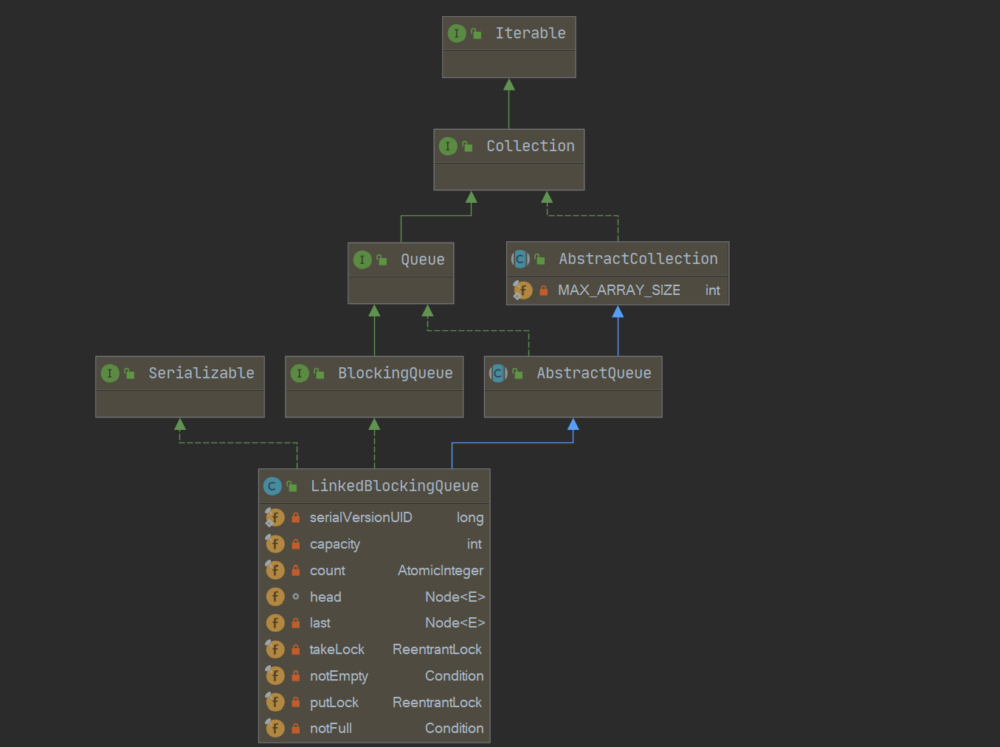

[toc]

系列传送门：

- [Java并发包源码学习系列：AbstractQueuedSynchronizer](https://blog.csdn.net/Sky_QiaoBa_Sum/article/details/112254373)
- [Java并发包源码学习系列：CLH同步队列及同步资源获取与释放](https://blog.csdn.net/Sky_QiaoBa_Sum/article/details/112301359)
- [Java并发包源码学习系列：AQS共享式与独占式获取与释放资源的区别](https://blog.csdn.net/Sky_QiaoBa_Sum/article/details/112386838)
- [Java并发包源码学习系列：ReentrantLock可重入独占锁详解](https://blog.csdn.net/Sky_QiaoBa_Sum/article/details/112454874)
- [Java并发包源码学习系列：ReentrantReadWriteLock读写锁解析](https://blog.csdn.net/Sky_QiaoBa_Sum/article/details/112689635)
- [Java并发包源码学习系列：详解Condition条件队列、signal和await](https://blog.csdn.net/Sky_QiaoBa_Sum/article/details/112727669)
- [Java并发包源码学习系列：挂起与唤醒线程LockSupport工具类](https://blog.csdn.net/Sky_QiaoBa_Sum/article/details/112757098)
- [Java并发包源码学习系列：JDK1.8的ConcurrentHashMap源码解析](https://blog.csdn.net/Sky_QiaoBa_Sum/article/details/113059783)
- [Java并发包源码学习系列：阻塞队列BlockingQueue及实现原理分析](https://blog.csdn.net/Sky_QiaoBa_Sum/article/details/113186979)
- [Java并发包源码学习系列：阻塞队列实现之ArrayBlockingQueue源码解析](https://blog.csdn.net/Sky_QiaoBa_Sum/article/details/113252384)

## LinkedBlockingQueue概述

LinkedBlockingQueue是由单链表构成的**界限可选**的阻塞队列，如不指定边界，则为`Integer.MAX_VALUE`,因此如不指定边界，一般来说，插入的时候都会成功。

LinkedBlockingQueue支持FIFO先进先出的次序对元素进行排序。

## 类图结构及重要字段



```java
public class LinkedBlockingQueue<E> extends AbstractQueue<E>
        implements BlockingQueue<E>, java.io.Serializable {
    private static final long serialVersionUID = -6903933977591709194L;
    // 单链表节点
    static class Node<E> {
        E item;
        
        Node<E> next;

        Node(E x) { item = x; }
    }

    /** 容量，如果不指定就是Integer.MAX_VALUE */
    private final int capacity;

    /** 原子变量，记录元素个数 */
    private final AtomicInteger count = new AtomicInteger();

    /**
     * 哨兵头节点，head.next才是队列的第一个元素
     */
    transient Node<E> head;

    /**
     * 指向最后一个元素
     */
    private transient Node<E> last;

    /** 用来控制同时只有一个线程可以从队头获取元素 */
    private final ReentrantLock takeLock = new ReentrantLock();

    /** 条件队列，队列为空时，执行出队take操作的线程将会被置入该条件队列 */
    private final Condition notEmpty = takeLock.newCondition();

    /** 用来控制同时只有一个线程可以从队尾插入元素 */
    private final ReentrantLock putLock = new ReentrantLock();

    /** 条件队列，队列满时，执行入队操作put的线程将会被置入该条件队列 */
    private final Condition notFull = putLock.newCondition();
}
```

- 单向链表实现，维护head和last两个Node节点，head是哨兵节点，head.next是第一个真正的元素，last指向队尾节点。
- 队列中的元素通过AtomicInteger类型的原子变量count记录。
- 维护两把锁：takeLock保证同时只有一个线程可以从对头获取元素，putLock保证只有一个线程可以在队尾插入元素。
- 维护两个条件变量：notEmpty和notFull，维护条件队列，用以存放入队出队阻塞的线程。

> 如果希望获取一个元素，需要先获取takeLock锁，且notEmpty条件成立。
>
> 如果希望插入一个元素，需要先获取putLock锁，且notFull条件成立。

## 构造器

使用LinkedBlockingQueue的时候，可以指定容量，也可以使用默认的Integer.MAX_VALUE，几乎就是无界的了，当然，也可以传入集合对象，直接构造。

```java
	// 如果不指定容量，默认容量为Integer.MAX_VALUE  (1 << 30) - 1
    public LinkedBlockingQueue() {
        this(Integer.MAX_VALUE);
    }

	// 传入指定的容量
    public LinkedBlockingQueue(int capacity) {
        if (capacity <= 0) throw new IllegalArgumentException();
        this.capacity = capacity;
        // 初始化last 和 head指针
        last = head = new Node<E>(null);
    }

	// 传入指定集合对象，容量视为Integer.MAX_VALUE，直接构造queue
    public LinkedBlockingQueue(Collection<? extends E> c) {
        this(Integer.MAX_VALUE);
        // 获取写锁
        final ReentrantLock putLock = this.putLock; 
        putLock.lock(); // Never contended, but necessary for visibility
        try {
            int n = 0;
            for (E e : c) {
                if (e == null)
                    throw new NullPointerException();
                if (n == capacity)
                    throw new IllegalStateException("Queue full");
                enqueue(new Node<E>(e));
                ++n;
            }
            count.set(n);
        } finally {
            putLock.unlock();
        }
    }
```

## 出队和入队操作

队列的操作最核心的部分莫过于入队和出队了，后面分析的方法基本上都基于这两个工具方法。

LinkedBlockingQueue的出队和入队相对ArrayBlockingQueue来说就简单很多啦：

### 入队enqueue

```java
    private void enqueue(Node<E> node) {
        // assert putLock.isHeldByCurrentThread();
        // assert last.next == null;
        last = last.next = node;
    }
```

1. 将node连接到last的后面。
2. 更新last指针的位置，指向node。

### 出队dequeue

```java
    private E dequeue() {
        // assert takeLock.isHeldByCurrentThread();
        // assert head.item == null;
        Node<E> h = head;
        Node<E> first = h.next;
        h.next = h; // help GC
        head = first; // head向后移一位
        E x = first.item;
        first.item = null;
        return x;
    }
```

队列中的元素实际上是从head.first开始的，那么移除队头，其实就是将head指向head.next即可。

## 阻塞式操作

### E take() 阻塞式获取

take操作将会获取当前队列头部元素并移除，如果队列为空则阻塞当前线程直到队列不为空，退出阻塞时返回获取的元素。

如果线程在阻塞时被其他线程设置了中断标志，则抛出InterruptedException异常并返回。

```java
    public E take() throws InterruptedException {
        E x;
        int c = -1;
        final AtomicInteger count = this.count;
        // 首先要获取takeLock
        final ReentrantLock takeLock = this.takeLock;
        takeLock.lockInterruptibly();
        try {
            // 如果队列为空， notEmpty不满足，就等着
            while (count.get() == 0) {
                notEmpty.await();
            }
            // 出队
            x = dequeue();
            // c先赋值为count的值， count 减 1
            c = count.getAndDecrement();
            // 这次出队后至少还有一个元素，唤醒notEmpty中的读线程
            if (c > 1)
                notEmpty.signal();
        } finally {
            takeLock.unlock();
        }
        // c == capacity 表示在该元素出队之前，队列是满的
        if (c == capacity)
            // 因为在这之前队列是满的，可能会有写线程在等着，这里做个唤醒
            signalNotFull();
        return x;
    }

	// 用于唤醒写线程
    private void signalNotFull() {
        final ReentrantLock putLock = this.putLock;
        // 获取putLock
        putLock.lock();
        try {
            notFull.signal();
        } finally {
            putLock.unlock();
        }
    }
```

### void put(E e) 阻塞式插入

put操作将向队尾插入元素，如果队列未满则插入，如果队列已满，则阻塞当前线程直到队列不满。

如果线程在阻塞时被其他线程设置了中断标志，则抛出InterruptedException异常并返回。

```java
    public void put(E e) throws InterruptedException {
        if (e == null) throw new NullPointerException();
        // 所有的插入操作 都约定 本地变量c 作为是否失败的标识
        int c = -1;
        Node<E> node = new Node<E>(e);
        final ReentrantLock putLock = this.putLock;
        final AtomicInteger count = this.count;
        // 插入操作获取 putLock
        putLock.lockInterruptibly();
        try {
            // 队列满，这时notFull条件不满足，await
            while (count.get() == capacity) {
                notFull.await();
            }
            enqueue(node);
            // c先返回count的值 ， 原子变量 + 1 ，
            c = count.getAndIncrement();
            // 至少还有一个空位可以插入，notFull条件是满足的，唤醒它
            if (c + 1 < capacity)
                notFull.signal();
        } finally {
            putLock.unlock();
        }
        // c == 0 表示在该元素入队之前，队列是空的
        if (c == 0)
            // 因为在这之前队列是空的，可能会有读线程在等着，这里做个唤醒
            signalNotEmpty();
    }

	// 用于唤醒读线程
    private void signalNotEmpty() {
        final ReentrantLock takeLock = this.takeLock;
        // 获取takeLock
        takeLock.lock();
        try {
            // 唤醒
            notEmpty.signal();
        } finally {
            takeLock.unlock();
        }
    }
```

### E poll(timeout, unit) 阻塞式超时获取

在take阻塞式获取方法的基础上额外增加超时功能，传入一个timeout，获取不到而阻塞的时候，如果时间到了，即使还获取不到，也只能立即返回null。

```java
    public E poll(long timeout, TimeUnit unit) throws InterruptedException {
        E x = null;
        int c = -1;
        long nanos = unit.toNanos(timeout);
        final AtomicInteger count = this.count;
        final ReentrantLock takeLock = this.takeLock;
        takeLock.lockInterruptibly();
        try {
            // 这里就是超时机制的逻辑所在
            while (count.get() == 0) {
                if (nanos <= 0)
                    return null;
                nanos = notEmpty.awaitNanos(nanos);
            }
            x = dequeue();
            c = count.getAndDecrement();
            if (c > 1)
                notEmpty.signal();
        } finally {
            takeLock.unlock();
        }
        if (c == capacity)
            signalNotFull();
        return x;
    }
```

### boolean offer(e, timeout, unit) 阻塞式超时插入

在put阻塞式插入方法的基础上额外增加超时功能，传入一个timeout，获取不到而阻塞的时候，如果时间到了，即使还获取不到，也只能立即返回null。

```java
    public boolean offer(E e, long timeout, TimeUnit unit)
        throws InterruptedException {

        if (e == null) throw new NullPointerException();
        long nanos = unit.toNanos(timeout);
        int c = -1;
        final ReentrantLock putLock = this.putLock;
        final AtomicInteger count = this.count;
        putLock.lockInterruptibly();
        try {
            while (count.get() == capacity) {
                if (nanos <= 0)
                    return false;
                nanos = notFull.awaitNanos(nanos);
            }
            enqueue(new Node<E>(e));
            c = count.getAndIncrement();
            if (c + 1 < capacity)
                notFull.signal();
        } finally {
            putLock.unlock();
        }
        if (c == 0)
            signalNotEmpty();
        return true;
    }
```

## 其他常规操作

### boolean offer(E e)

offer(E e)是非阻塞的方法，向队尾插入一个元素，如果队列未满，则插入成功并返回true；如果队列已满则丢弃当前元素，并返回false。

```java
    public boolean offer(E e) {
        if (e == null) throw new NullPointerException();
        final AtomicInteger count = this.count;
        // 此时队列已满，直接返回false
        if (count.get() == capacity)
            return false;
        int c = -1;
        Node<E> node = new Node<E>(e);
        // 插入操作 获取putLock
        final ReentrantLock putLock = this.putLock;
        putLock.lock();
        try {
            // 加锁后再校验一次
            if (count.get() < capacity) {
                enqueue(node);
                c = count.getAndIncrement();
                if (c + 1 < capacity)
                    notFull.signal();
            }
        } finally {
            putLock.unlock();
        }
        if (c == 0)
            signalNotEmpty();
        return c >= 0; // 只要不是-1，就代表成功~
    }
```

### E poll()

从队列头部获取并移除第一个元素，如果队列为空则返回null。

```java
    public E poll() {
        final AtomicInteger count = this.count;
        if (count.get() == 0)
            return null;
        E x = null;
        int c = -1;
        final ReentrantLock takeLock = this.takeLock;
        takeLock.lock();
        try {
            // 如果队列不为空，则出队， 并递减计数
            if (count.get() > 0) {
                x = dequeue();
                c = count.getAndDecrement();
                if (c > 1)
                    notEmpty.signal();
            }
        } finally {
            takeLock.unlock();
        }
        if (c == capacity)
            signalNotFull();
        return x;
    }
```

### E peek()

瞅一瞅队头的元素是啥，如果队列为空，则返回null。

```java
    public E peek() {
        if (count.get() == 0)
            return null;
        final ReentrantLock takeLock = this.takeLock;
        takeLock.lock();
        try {
            // 实际上第一个元素是head.next
            Node<E> first = head.next;
            if (first == null)
                return null;
            else
                return first.item;
        } finally {
            takeLock.unlock();
        }
    }
```

### Boolean remove(Object o)

移除队列中与元素o相等【指的是equals方法判定相同】的元素，移除成功返回true，如果队列为空或没有匹配元素，则返回false。

```java
    public boolean remove(Object o) {
        if (o == null) return false;
        fullyLock();
        try {
            // trail 和 p 同时向后遍历， 如果p匹配了，就让trail.next = p.next代表移除p
            for (Node<E> trail = head, p = trail.next;
                 p != null;
                 trail = p, p = p.next) {
                if (o.equals(p.item)) {
                    unlink(p, trail);
                    return true;
                }
            }
            return false;
        } finally {
            fullyUnlock();
        }
    }

	// trail为p的前驱， 希望移除p节点
    void unlink(Node<E> p, Node<E> trail) {
        // assert isFullyLocked();
        // p.next is not changed, to allow iterators that are
        // traversing p to maintain their weak-consistency guarantee.
        p.item = null;
        trail.next = p.next;// 移除p
        // 如果p已经是最后一个节点了，就更新一下last
        if (last == p)
            last = trail;
        // 移除一个节点之后，队列从满到未满， 唤醒notFull
        if (count.getAndDecrement() == capacity)
            notFull.signal();
    }
	//----- 多个锁 获取和释放的顺序是 相反的

	// 同时上锁
    void fullyLock() {
        putLock.lock();
        takeLock.lock();
    }
	// 同时解锁
    void fullyUnlock() {
        takeLock.unlock();
        putLock.unlock();
    }

```

## 总结

- LinkedBlockingQueue是由单链表构成的**界限可选**的阻塞队列，如不指定边界，则为`Integer.MAX_VALUE`,因此如不指定边界，一般来说，插入的时候都会成功。
- 维护两把锁：takeLock保证同时只有一个线程可以从对头获取元素，putLock保证只有一个线程可以在队尾插入元素。
- 维护两个条件变量：notEmpty和notFull，维护条件队列，用以存放入队出队阻塞的线程。

> 如果希望获取一个元素，需要先获取takeLock锁，且notEmpty条件成立。
>
> 如果希望插入一个元素，需要先获取putLock锁，且notFull条件成立。

## 参考阅读

- 《Java并发编程之美》
- 《Java并发编程的艺术》