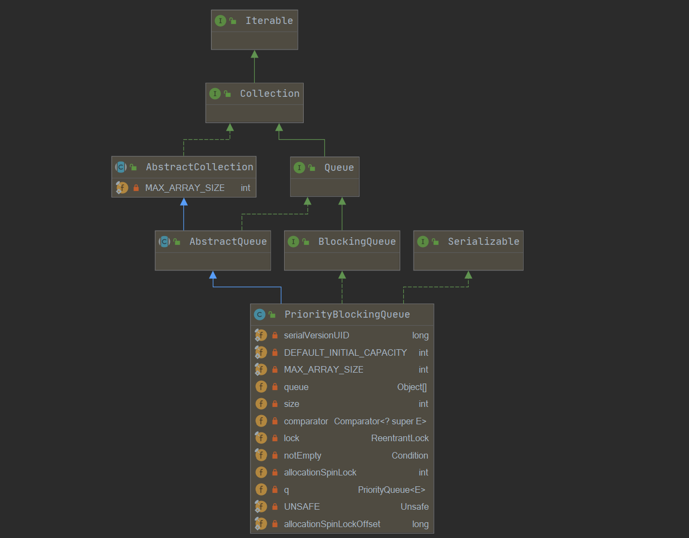
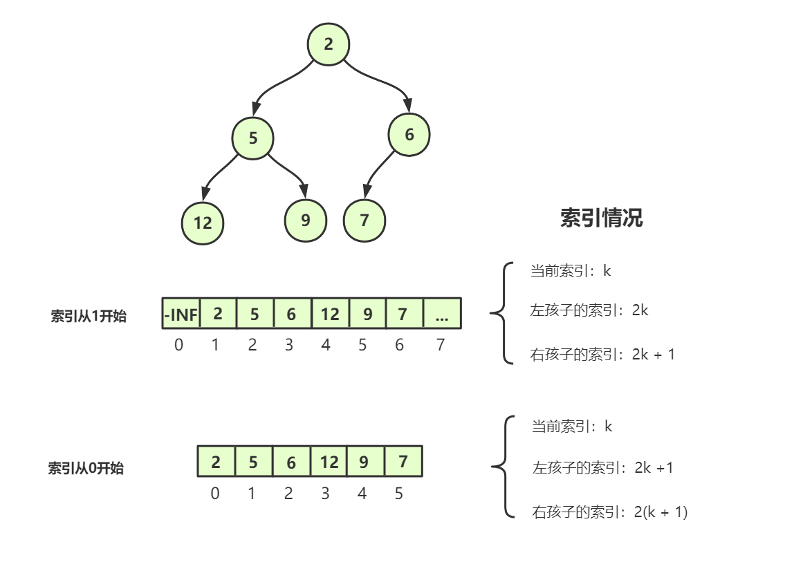

## PriorityBlockingQueue概述

PriorityBlockingQueue是一个**支持优先级的无界阻塞队列**，基于数组的二叉堆，其实就是线程安全的`PriorityQueue`。

默认情况下元素采取自然顺序升序排列，也可以自定义类实现`compareTo()`方法来指定元素排序规则，或者初始化PriorityBlockingQueue时，指定构造参数Comparator来对元素进行排序。

需要注意的是如果两个对象的优先级相同（`compare` 方法返回 0），此队列并不保证它们之间的顺序。

PriorityBlocking可以传入一个初始容量，其实也就是底层数组的最小容量，之后会使用tryGrow扩容。

## 类图结构及重要字段



```java
public class PriorityBlockingQueue<E> extends AbstractQueue<E>
    implements BlockingQueue<E>, java.io.Serializable {
    private static final long serialVersionUID = 5595510919245408276L;
    
    /**
     * 默认的容量为 11 
     */
    private static final int DEFAULT_INITIAL_CAPACITY = 11;

    /**
     * 数组的最大容量
     */
    private static final int MAX_ARRAY_SIZE = Integer.MAX_VALUE - 8;

    /**
     * 平衡二叉堆 实现 优先级队列， 底层用数组结构存储二叉堆 
     * 假设一个n为数组中的索引，数组是从索引0开始存储元素的，因此
     * queue[n]的左儿子存在queue[2*n+1]位置，右儿子存在queue[2*(n+1)]位置
     * 
     * 根据比较器排序，如果没有指定比较器，则按照元素自然顺序排序。
     * 默认是小根堆，第一个元素是堆中最小元素
     *
     */
    private transient Object[] queue;

    /**
     * 优先级队列中元素个数
     */
    private transient int size;

    /**
     * 比较器，如果按照自然序排序，那么此属性可设置为 null
     */
    private transient Comparator<? super E> comparator;

    /**
     * 所有需要保证线程安全的操作都要先获取这把锁
     */
    private final ReentrantLock lock;

    /**
     * 队列空的时候，条件队列存放阻塞线程
     */
    private final Condition notEmpty;

    /**
     * 用于CAS操作
     */
    private transient volatile int allocationSpinLock;

    /**
     * 只用于序列化和反序列化
     */
    private PriorityQueue<E> q;
    
}
```

## 什么是二叉堆

> [数据结构可视化网站](https://www.cs.usfca.edu/~galles/visualization/Heap.html)

二叉堆是完全二叉树，除了最后一层，其他节点都是满的，且最后一层节点从左到右排列，如下：



二叉堆分为大根堆和小根堆，一般来说都是小根堆，任意一个节点都小于它的左右子节点的值，根节点就是堆中的最小的值。

堆可以使用数组存储，数组的下标可以从0开始，也可以从1开始，各有好处，当然JDK中堆的实现是从0开始的哦。

- 如果从索引为1的位置开始存储元素，第k个节点的左右子节点的下标：(2k, 2k + 1)，父节点的坐标可以很容易求：`floor(k / 2)`，floor表示下取整。
- 如果从0开始，第k个节点的左右子节点的下标：(2k + 1, 2k + 2)，父节点的坐标也可以很容易求：`floor((k - 1) / 2)`，floor表示下取整。

> 我之前手写堆的时候，都是使用的第一种方式，我就提一嘴第一种的思路，使用第一种思路介绍一下小根堆的几个基本操作，之后我们会详细分析JDK中的实现，也就是第二种。

## 堆的基本操作

堆中最重要核心的两个操作便是如何将元素向上调整or向下调整。

### 向上调整void up(int u)

我们需要知道的是，当我们插入节点的时候，我们需要在数组的最后一个位置二话不说直接插上，接着再一一向上层比较，最终只要满足父节点比任意一个子节点小就可以了。

我们想，如果我们每次插入数据的时候，都做一次向上调整的操作，我们一定能够保证，每次都是在一个符合条件的二叉堆上插入数，对吧。

那这样的话，我们只需要**比较当前这个数是不是比它的父节点小**，如果比它大，就不需要满足条件不需要交换，**如果比他小，就交换**，依旧满足条件。

```java
    // 向上调整 u 是当前的索引
    private void up (int u) {
        // 如果发现当前的节点比父节点小
        while (u / 2 > 0 && h[u / 2] > h[u]) {
            // 就和父节点交换一下
            heap_swap(u / 2, u);
            u /= 2;
        }
    }
```

### 向下调整void down(int u)

为什么需要向下调整呢，我们知道，要在数组头部删除一个元素且保证后面元素的顺序是比较麻烦的，我们通常在遇到删除堆顶的时候，直接将数组的最后一个元素heap[size--]将heap[0]覆盖，接着执行down(0)，自上而下地执行调整操作。

调整的规则也比较简单，其实就是判断当前元素和左右孩子的大小关系，和最小的那个交换，递归地去调整，直到无法交换为止。

```java
    // 向下调整
    private void down (int u) {
        int t = u;
        if (u * 2 <= size && h[u * 2] < h[t]) t = u * 2; // 判断左儿子是否存在, 且如果左儿子比它小,就更新坐标
        if (u * 2 + 1 <= size && h[u * 2 + 1] < h[t]) t = u * 2 + 1; // 同理
        if (u != t) { // 如果需要交换
            heap_swap(u, t);// 交换一下
            down(t); // 继续做这个操作
        }
    }
```

## 构造器

```java
    // 使用默认的容量11
	public PriorityBlockingQueue() {
        this(DEFAULT_INITIAL_CAPACITY, null);
    }

	// 指定容量大小
    public PriorityBlockingQueue(int initialCapacity) {
        this(initialCapacity, null);
    }
	
	// 指定容量和比较器
    public PriorityBlockingQueue(int initialCapacity,
                                 Comparator<? super E> comparator) {
        if (initialCapacity < 1)
            throw new IllegalArgumentException();
        this.lock = new ReentrantLock();
        this.notEmpty = lock.newCondition();
        this.comparator = comparator;
        this.queue = new Object[initialCapacity];
    }

    // 传入集合
    public PriorityBlockingQueue(Collection<? extends E> c) {
        this.lock = new ReentrantLock();
        this.notEmpty = lock.newCondition();
        boolean heapify = true; // true if not known to be in heap order
        boolean screen = true;  // true if must screen for nulls
        if (c instanceof SortedSet<?>) {
            SortedSet<? extends E> ss = (SortedSet<? extends E>) c;
            this.comparator = (Comparator<? super E>) ss.comparator();
            heapify = false;
        }
        else if (c instanceof PriorityBlockingQueue<?>) {
            PriorityBlockingQueue<? extends E> pq =
                (PriorityBlockingQueue<? extends E>) c;
            this.comparator = (Comparator<? super E>) pq.comparator();
            screen = false;
            if (pq.getClass() == PriorityBlockingQueue.class) // exact match
                heapify = false;
        }
        Object[] a = c.toArray();
        int n = a.length;
        // If c.toArray incorrectly doesn't return Object[], copy it.
        if (a.getClass() != Object[].class)
            a = Arrays.copyOf(a, n, Object[].class);
        if (screen && (n == 1 || this.comparator != null)) {
            for (int i = 0; i < n; ++i)
                if (a[i] == null)
                    throw new NullPointerException();
        }
        this.queue = a;
        this.size = n;
        // 需要堆化
        if (heapify)
            heapify();
    }

    private void heapify() {
        Object[] array = queue;
        int n = size;
        int half = (n >>> 1) - 1;
        Comparator<? super E> cmp = comparator;
        if (cmp == null) {
            // 从中间开始，减少时间复杂度，每次都在一颗二叉堆上进行调整
            for (int i = half; i >= 0; i--)
                siftDownComparable(i, (E) array[i], array, n);
        }
        else {
            for (int i = half; i >= 0; i--)
                siftDownUsingComparator(i, (E) array[i], array, n, cmp);
        }
    }
```

> 接下来我将会把一些核心组件方法都拎出来分析一下，他们很有可能会在后面的操作方法中被频繁调用，所以接下来很重要哦。

## 扩容方法tryGrow

我们说了，PriorityBlockingQueue是无界的队列，传入的capacity也不是最终的容量，它和我们之前学习的许多集合一样，有**动态扩容**的机制，我们先来瞅一瞅：

```java
    private void tryGrow(Object[] array, int oldCap) {
        // 释放锁的操作
        lock.unlock(); // must release and then re-acquire main lock
        Object[] newArray = null;
        // CAS 操作将allocationSpinLock变为1， 如果已经是1了，就跳到下面
        if (allocationSpinLock == 0 &&
            UNSAFE.compareAndSwapInt(this, allocationSpinLockOffset,
                                     0, 1)) {
            try {
                // 节点个数<64  new = old + old + 2
                // 节点个数>=64 new = old + old / 2
                int newCap = oldCap + ((oldCap < 64) ?
                                       (oldCap + 2) : // 希望节点数较小的时候，增长快一点
                                       (oldCap >> 1));
                // 扩容之后越界了
                if (newCap - MAX_ARRAY_SIZE > 0) {    // possible overflow
                    int minCap = oldCap + 1;
                    if (minCap < 0 || minCap > MAX_ARRAY_SIZE)
                        throw new OutOfMemoryError();
                    newCap = MAX_ARRAY_SIZE;
                }
                //queue != array 的情况 其他线程已经为queue分配了其他的空间
                if (newCap > oldCap && queue == array)
                    // 分配一个加大容量的数组
                    newArray = new Object[newCap];
            } finally {
                allocationSpinLock = 0;
            }
        }
        // 可能是其他线程在进行扩容操作
        if (newArray == null) // back off if another thread is allocating
            Thread.yield();
        // 重新获取锁
        lock.lock();
        // 复制元素
        if (newArray != null && queue == array) {
            queue = newArray;
            System.arraycopy(array, 0, newArray, 0, oldCap);
        }
    }
```

可以发现的是，在动态扩容之前，将lock释放，表明这个方法一定是在获取锁之后才被调用的。并且，扩容操作和读操作可以同时进行，提高吞吐量。

## 源码中向上调整和向下调整实现

准确地说，源码中应该是`调整 + 插入`，不断调整，找到插入的位置，给该位置赋值。但，如果你理解了前面的调整思想，相信你会很快理解源码中的实现。

### siftUpComparable

将x插入到堆中，注意这里是不断和父节点比较，最终找到插入位置。

```java
// 将x插入到堆中，注意这里是不断和父节点比较，最终找到插入位置
private static <T> void siftUpComparable(int k, T x, Object[] array) {
    Comparable<? super T> key = (Comparable<? super T>) x;
    while (k > 0) {
        //a[k]的父节点位置
        int parent = (k - 1) >>> 1;
        Object e = array[parent];
        // 如果比父节点大就不用交换了
        if (key.compareTo((T) e) >= 0)
            break;
        // 将父元素移下来
        array[k] = e;
        // k向上移
        k = parent;
    }
    // 退出循环后，k的位置就是待插入的位置
    array[k] = key;
}
```

### siftDownComparable

移除k位置的元素，并调整二叉堆，具体思想就是，一般通过向下调整找到覆盖位置，用x覆盖即可，x一般可以从队尾获取。

```java
    // 这里的k就是当前空缺的位置，x就是覆盖元素比如我们之前说的队尾元素
	private static <T> void siftDownComparable(int k, T x, Object[] array,
                                               int n) {
        if (n > 0) {
            Comparable<? super T> key = (Comparable<? super T>)x;
            // 二叉堆有一个性质，最后一层叶子最多 占 1 / 2
            int half = n >>> 1;           // loop while a non-leaf
            // 循环非叶子节点
            while (k < half) {
                // 左孩子
                int child = (k << 1) + 1; // assume left child is least
                Object c = array[child];
                // 右孩子
                int right = child + 1;
                // 始终用左孩子c表示最小的数
                if (right < n &&
                    ((Comparable<? super T>) c).compareTo((T) array[right]) > 0)
                    // 这里如果右孩子小，更新child = right
                    c = array[child = right];
                // 如果当前的k比左孩子还要小，那就不必交换了，待在那正好！
                if (key.compareTo((T) c) <= 0)
                    break;
                // 小的数向上移，k向下更新
                array[k] = c;
                k = child;
            }
            // 退出循环时，一定找到了x覆盖的位置，覆盖即可
            array[k] = key;
        }
    }
```

你看看，理解了调整的思想之后，看起代码来是不是就相对轻松很多啦？

## put

```java
    public void put(E e) {
        offer(e); // 无界队列，插入操作不需要阻塞哦
    }

    public boolean offer(E e) {
        if (e == null)
            throw new NullPointerException();
        final ReentrantLock lock = this.lock;
        lock.lock();
        int n, cap;
        Object[] array;
        // 当前队列中的元素个数 >= 数组的容量
        while ((n = size) >= (cap = (array = queue).length))
            // 动态扩容
            tryGrow(array, cap);
        try {
            Comparator<? super E> cmp = comparator;
            // 下面这个if else根据是否传入比较器选择对应的方法，大差不差
            if (cmp == null)
                siftUpComparable(n, e, array);
            else
                siftUpUsingComparator(n, e, array, cmp);
            size = n + 1;
            // 唤醒正在阻塞的读线程
            notEmpty.signal();
        } finally {
            lock.unlock();
        }
        return true;
    }
```

## take


