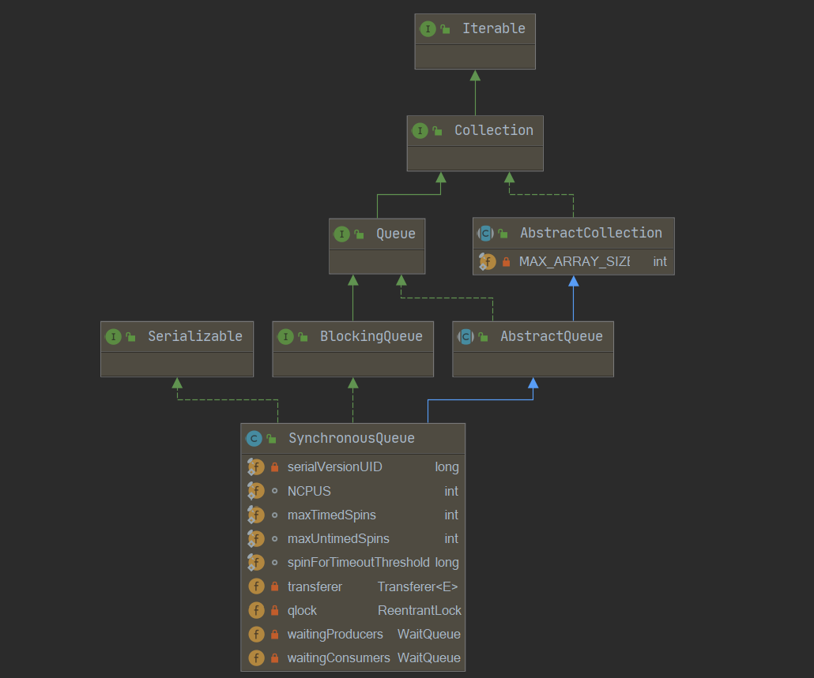
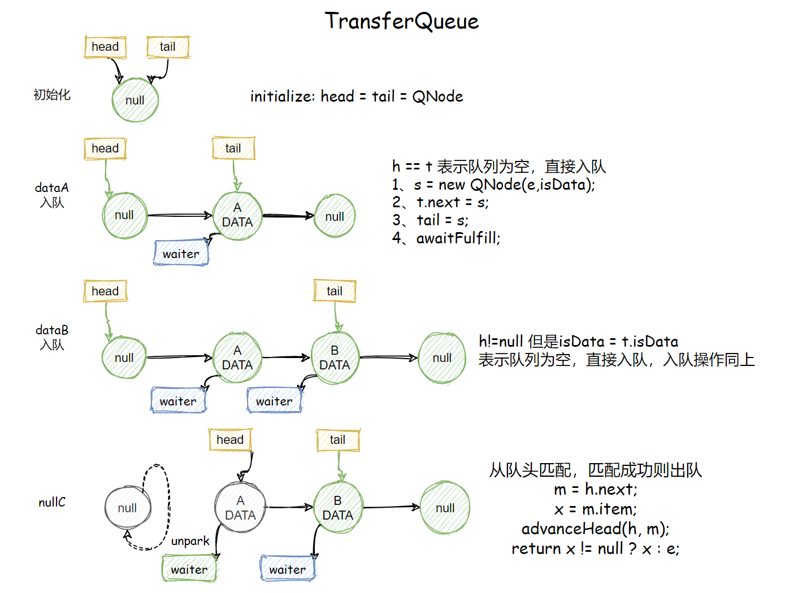
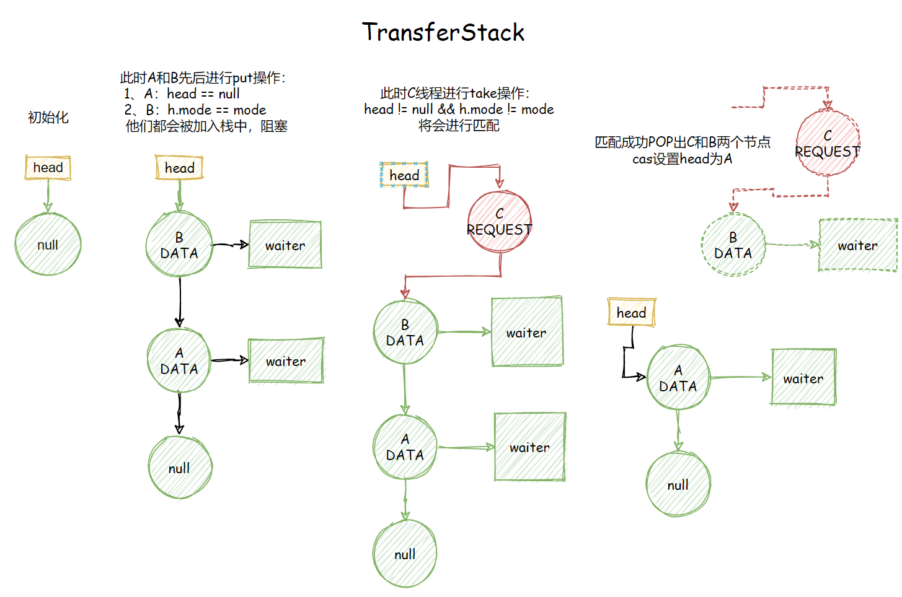

 

[toc]

系列传送门：

- [Java并发包源码学习系列：AbstractQueuedSynchronizer](https://blog.csdn.net/Sky_QiaoBa_Sum/article/details/112254373)
- [Java并发包源码学习系列：CLH同步队列及同步资源获取与释放](https://blog.csdn.net/Sky_QiaoBa_Sum/article/details/112301359)
- [Java并发包源码学习系列：AQS共享式与独占式获取与释放资源的区别](https://blog.csdn.net/Sky_QiaoBa_Sum/article/details/112386838)
- [Java并发包源码学习系列：ReentrantLock可重入独占锁详解](https://blog.csdn.net/Sky_QiaoBa_Sum/article/details/112454874)
- [Java并发包源码学习系列：ReentrantReadWriteLock读写锁解析](https://blog.csdn.net/Sky_QiaoBa_Sum/article/details/112689635)
- [Java并发包源码学习系列：详解Condition条件队列、signal和await](https://blog.csdn.net/Sky_QiaoBa_Sum/article/details/112727669)
- [Java并发包源码学习系列：挂起与唤醒线程LockSupport工具类](https://blog.csdn.net/Sky_QiaoBa_Sum/article/details/112757098)
- [Java并发包源码学习系列：JDK1.8的ConcurrentHashMap源码解析](https://blog.csdn.net/Sky_QiaoBa_Sum/article/details/113059783)
- [Java并发包源码学习系列：阻塞队列BlockingQueue及实现原理分析](https://blog.csdn.net/Sky_QiaoBa_Sum/article/details/113186979)
- [Java并发包源码学习系列：阻塞队列实现之ArrayBlockingQueue源码解析](https://blog.csdn.net/Sky_QiaoBa_Sum/article/details/113252384)
- [Java并发包源码学习系列：阻塞队列实现之LinkedBlockingQueue源码解析](https://blog.csdn.net/Sky_QiaoBa_Sum/article/details/113329416)
- [Java并发包源码学习系列：阻塞队列实现之PriorityBlockingQueue源码解析](https://blog.csdn.net/Sky_QiaoBa_Sum/article/details/113358710)
- [Java并发包源码学习系列：阻塞队列实现之DelayQueue源码解析](https://blog.csdn.net/Sky_QiaoBa_Sum/article/details/113440013)

## SynchronousQueue概述

SynchronousQueue是一个**不存储元素**的阻塞队列，**每个插入的操作必须等待另一个线程进行相应的删除操作**，反之亦然，因此这里的Synchronous指的是读线程和写线程需要同步，一个读线程匹配一个写线程。

你不能在该队列中使用peek方法，因为peek是只读取不移除，不符合该队列特性，该队列不存储任何元素，数据必须从某个写线程交给某个读线程，而不是在队列中等待倍消费,非常适合传递性场景。

SynchronousQueue的吞吐量高于LinkedBlockingQueue和ArrayBlockingQueue。

该类还支持可供选择的**公平性策略**，默认采用非公平策略，当队列可用时，阻塞的线程都可以争夺访问队列的资格。

## 使用案例

```java
public class TestSync {

    public static void main (String[] args) {
        SynchronousQueue<Integer> queue = new SynchronousQueue<>(true);
        Producer producer = new Producer(queue);
        Customer customer = new Customer(queue);
        producer.start();
        customer.start();
    }
}

class Producer extends Thread{
    SynchronousQueue<Integer> queue;
    Producer(SynchronousQueue<Integer> queue){
        this.queue = queue;
    }

    @SneakyThrows
    @Override
    public void run () {

        while(true){
            int product = new Random().nextInt(500);
            System.out.println("生产产品, id : " + product);
            System.out.println("等待3s后给消费者消费...");
            TimeUnit.SECONDS.sleep(3);
            queue.put(product);
            TimeUnit.MILLISECONDS.sleep(100);

        }
    }
}

class Customer extends Thread{
    SynchronousQueue<Integer> queue;
    Customer(SynchronousQueue<Integer> queue){
        this.queue = queue;
    }

    @SneakyThrows
    @Override
    public void run () {

        while(true){
            Integer product = queue.take();
            System.out.println("消费产品, id : " + product);
            System.out.println();
        }
    }
}

// 打印结果

生产产品, id : 194
等待3s后给消费者消费...
消费产品, id : 194

生产产品, id : 140
等待3s后给消费者消费...
消费产品, id : 140

生产产品, id : 40
等待3s后给消费者消费...
消费产品, id : 40
```

## 类图结构



## put与take方法

### void put(E e)

```java
    public void put(E e) throws InterruptedException {
        if (e == null) throw new NullPointerException();
        // put方法 ： e是生产者传递给消费者的元素
        if (transferer.transfer(e, false, 0) == null) {
            Thread.interrupted();
            throw new InterruptedException();
        }
    }
```

### E take()

```java
    public E take() throws InterruptedException {
        // take方法： 表示消费者等待生产者提供元素
        E e = transferer.transfer(null, false, 0);
        if (e != null)
            return e;
        Thread.interrupted();
        throw new InterruptedException();
    }
```

put方法和take方法都调用了transferer的transfer方法，他们的区别在哪呢？我们可以发现:

- 当调用put方法，也就是生产者将数据传递给消费者时，传递的参数为e，是一个非null的元素。
- 而调用take方法，也就是消费者希望生产者提供元素时，传递的参数为null。

这一点必须明确，transfer是根据这一点来判断读or写线程，接着决定是否匹配等，直接来看下Transfer类吧。

## Transfer

```java
public class SynchronousQueue<E> extends AbstractQueue<E>
    implements BlockingQueue<E>, java.io.Serializable {

    private transient volatile Transferer<E> transferer;
}
```

SynchronousQueue内部维护了volatile修饰的Transferer变量，它的核心操作都将委托给transferer。

```java
    abstract static class Transferer<E> {
        /**
         * Performs a put or take.
         */
        abstract E transfer(E e, boolean timed, long nanos);
    }
```

Transferer类中定义了抽象方法transfer，该方法用于转移元素，是最最核心的方法，我们先大概了解一下定义：

- 参数e如果不为null，表示将该元素从生产者转移给消费者。如果为null，则表示消费者等待生产者提供元素，返回值E就是得到的元素。
- 参数timed表示是否设置超时，如果设置超时，nanos就是需要设置的超时时间。
- 该方法的返回值可以非null，就是消费者从生产者那得到的值，可以为null，代表超时或者中断，具体需要通过检测中断状态得到。

```java
    // 默认使用非公平策略
	public SynchronousQueue() {
        this(false);
    }

    /**
     *  指定公平策略,
     */
    public SynchronousQueue(boolean fair) {
        transferer = fair ? new TransferQueue<E>() : new TransferStack<E>();
    }
```

可以发现，在构造SynchronousQueue的时候，可以传入fair参数指定公平策略，有下面两种选择：

1. 公平策略：实例化TransferQueue。
2. 非公平策略：实例化TransferStack，默认就是非公平模式。

他俩便是Transfer类的实现，SynchronousQueue相关操作也都是基于这俩类的，我们接下来将会重点分析这俩的实现。

## 公平模式TransferQueue

```java
    static final class TransferQueue<E> extends Transferer<E> {
        static final class QNode{...}
        transient volatile QNode head;    
        transient volatile QNode tail;
        transient volatile QNode cleanMe;
        TransferQueue() {
            QNode h = new QNode(null, false); // 初始化虚拟头节点
            head = h;
            tail = h;
        }
```

### QNode

QNode定义了队列中存放的节点：

- next指向下一个节点。
- item用于存放数据，数据修改通过CAS操作完成。
- waiter标记在该节点上等待的线程。
- isData用来标识该节点的类型，传递参数e不为null，则isData为true。

```java
        static final class QNode {
            volatile QNode next;          // next域
            volatile Object item;         // 存放数据，用CAS设置
            volatile Thread waiter;       // 标记在该节点上等待的线程是哪个
            final boolean isData;		  // isData == true表示写线程节点

            QNode(Object item, boolean isData) {
                this.item = item;
                this.isData = isData;
            }
			// ...省略一系列CAS方法
        }
```

### transfer

```java
        E transfer(E e, boolean timed, long nanos) {

            QNode s = null; // constructed/reused as needed
            // 判断当前节点的模式
            boolean isData = (e != null); 
			// 循环
            for (;;) {
                QNode t = tail;
                QNode h = head;
                if (t == null || h == null)         // saw uninitialized value
                    continue;                       // spin

                // 队列为空 或 当前节点和队列尾节点类型相同，则将节点入队
                if (h == t || t.isData == isData) { // empty or same-mode
                    QNode tn = t.next;
                    // 说明有其他节点入队，导致读到的tail不一致，continue
                    if (t != tail)                  // inconsistent read
                        continue;
                    // 有其他节点入队，但是tail是一致的，尝试将tn设置为尾节点，continue
                    if (tn != null) {               // lagging tail
                        advanceTail(t, tn); // 如果tail为t，设置为tn
                        continue;
                    }
                    // timed == true 并且超时了， 直接返回null
                    if (timed && nanos <= 0)        // can't wait
                        return null;
                    // 构建一个新节点
                    if (s == null)
                        s = new QNode(e, isData);
                    // 将当前节点插入到tail之后，如不成功，则continue
                    if (!t.casNext(null, s))        // failed to link in
                        continue;
					// 将当前节点设置为新的tail
                    advanceTail(t, s);              // swing tail and wait
                    // 这个方法下面会分析：自旋或阻塞线程，直到满足s.item != e
                    Object x = awaitFulfill(s, e, timed, nanos);
                    // x == s 表示节点被取消、中断或超时
                    if (x == s) {                   // wait was cancelled
                        clean(t, s);
                        return null;
                    }
					//  isOffList用于判断节点是否已经出队 next == this
                    if (!s.isOffList()) {           // not already unlinked
                        // 尝试将s节点设置为head
                        advanceHead(t, s);          // unlink if head
                        if (x != null)              // and forget fields
                            s.item = s;
                        s.waiter = null;
                    }
                    return (x != null) ? (E)x : e;

                // 队列不为空 且节点类型不同，一个读一个写，就可以匹配了
                } else {                            // complementary-mode
                    // 队头节点
                    QNode m = h.next;               // node to fulfill
                    // 这里如果其他线程对队列进行了操作，就重新再来
                    if (t != tail || m == null || h != head)
                        continue;                   // inconsistent read
					// 下面是出队的代码
                    Object x = m.item;
                    //isData == (x != null) 判断isData的类型是否和队头节点类型相同  
                    // x == m 表示m被取消了
                    // !m.casItem(x, e))表示将e设置为m的item失败
                    if (isData == (x != null) ||    // m already fulfilled
                        x == m ||                   // m cancelled
                        !m.casItem(x, e)) {         // lost CAS
                        // 上面三种情况，任意一种发生，都进行h的出队操作，m变成head，然后重试
                        advanceHead(h, m);          // dequeue and retry
                        continue;
                    }
					// 匹配成功，将m变为head，虚拟节点
                    advanceHead(h, m);              // successfully fulfilled
                    // 唤醒在m上等待的线程
                    LockSupport.unpark(m.waiter);
                    // 得到数据
                    return (x != null) ? (E)x : e;
                }
            }
        }
```

### awaitFulfill

这个方法将会进行自旋或者阻塞，直到满足某些条件。

```java
        //Spins/blocks until node s is fulfilled.
		Object awaitFulfill(QNode s, E e, boolean timed, long nanos) {
            /* Same idea as TransferStack.awaitFulfill */
            final long deadline = timed ? System.nanoTime() + nanos : 0L;
            Thread w = Thread.currentThread();
            // 计算需要自旋的次数 
            // 如果恰好 s 正好是第一个加入的节点，则会自旋一段时间，避免阻塞，提高效率
            // 因为其他情况是会涉及到 park挂起线程的
            int spins = ((head.next == s) ?
                         (timed ? maxTimedSpins : maxUntimedSpins) : 0);
            for (;;) {
                // w为当前线程，如果被中断了，则取消该节点 
                if (w.isInterrupted())
                    s.tryCancel(e);
                Object x = s.item;
                // 满足这个条件，才会退出循环，也是唯一的出口
                // 如果 线程1、被阻塞，接着唤醒或者2、中断了，x != e 就会成立
                if (x != e)
                    return x;
                // 如果设置了timed，需要判断一下是否超时
                if (timed) {
                    nanos = deadline - System.nanoTime();
                    // 如果超时，取消该节点，continue，下一次在 x!=e时退出循环
                    if (nanos <= 0L) {
                        s.tryCancel(e);
                        continue;
                    }
                }
                // 每次减少自旋次数
                if (spins > 0)
                    --spins;
                // 次数用完了，设置一下s的等待线程为当前线程
                else if (s.waiter == null)
                    s.waiter = w;
                // 没有超时设置的阻塞
                else if (!timed)
                    LockSupport.park(this);
                // 剩余时间小于spinForTimeoutThreshold的时候，自旋性能的效率更高
                else if (nanos > spinForTimeoutThreshold)
                    LockSupport.parkNanos(this, nanos);
            }
        }

```

这边总结一下一些注意点：

1. 为了优化阻塞，先判断当前的节点s是不是head.next，如果是的话，会优先选择自旋而不是阻塞，自旋次数到了才阻塞，主要是考虑到阻塞、唤醒需要消耗更多的资源。
2. 自旋的过程如何退出，也就是何时满足x!=e的条件呢？其实在tryCancel的时候就会导致x!=e，因为该方法会将s的item设置为this。我们看到，线程被中断，超时的时候都会调用这个方法，这些条件下将会退出。

### tryCancel

取消操作其实就是将节点的item设置为this，

```java
void tryCancel(Object cmp) {
    UNSAFE.compareAndSwapObject(this, itemOffset, cmp, this);
}
boolean isCancelled() {
    return item == this;
}
```

也就是说，如果一旦执行了tryCancel操作【中断，取消，超时】，退出awaitFulfill之后，一定满足：

```java
// x == s 表示节点被取消、中断或超时
if (x == s) {                   // wait was cancelled
    clean(t, s);
    return null;
}
```

会执行clean方法清理s节点：

### clean

```java
        void clean(QNode pred, QNode s) {
            s.waiter = null; // 清除thread引用
            /*
             * 无论何时，队列中的最后一个节点都无法删除，因此使用cleanMe保存它的前驱
             */
            while (pred.next == s) { 
                QNode h = head;
                QNode hn = h.next;   // Absorb cancelled first node as head
                // 队头被取消的情况，出队
                if (hn != null && hn.isCancelled()) { 
                    advanceHead(h, hn);
                    continue;
                }
                QNode t = tail;      // Ensure consistent read for tail
                if (t == h) // 队列此时为空，就退出了
                    return;
                QNode tn = t.next;
                if (t != tail) // 队尾并发改变了
                    continue;
                // tn一直定位到为null
                if (tn != null) {
                    advanceTail(t, tn);
                    continue;
                }
                // 这里 s!= t 表示没有到要删除的元素不是最后一个，
                // 那么直接将pred.next = s.next就可以了
                if (s != t) {        // If not tail, try to unsplice
                    QNode sn = s.next;
                    if (sn == s || pred.casNext(s, sn))
                        // 删除完毕，退出
                        return;
                }
                 // 走到这里，说明需要删除的s节点是队尾节点，需要使用cleanMe
                QNode dp = cleanMe;
                if (dp != null) {    // Try unlinking previous cancelled node
                    // d这里指的就是 要删除的节点
                    QNode d = dp.next;
                    QNode dn;
                    if (d == null ||               // d is gone or
                        d == dp ||                 // d is off list or
                        !d.isCancelled() ||        // d not cancelled or
                        (d != t &&                 // d not tail and
                         (dn = d.next) != null &&  //   has successor
                         dn != d &&                //   that is on list
                         dp.casNext(d, dn)))       // d unspliced
                        casCleanMe(dp, null); // 清除cleanMe
                    if (dp == pred)
                        return;      // s is already saved node
                    // 该分支将dp定位到 pred的位置【第一次应该都会走到这】
                } else if (casCleanMe(null, pred))
                    return;          // Postpone cleaning s
            }
        }

```

注意：无论何时, 最后插入的节点不能被删除，因为直接删除会存在并发风险，当节点s是最后一个节点时, 将s.pred保存为cleamMe节点,下次再进行清除操作。

### TransferQueue总结

transfer就是在一个循环中，不断地去做下面这些事情：

1. 当调用transfer方法时，如果队列为空或队尾节点的类型和线程类型相同【t.isData== isData】，将当前线程加入队列，自旋的方式等待匹配。直到被匹配或超时，或中断或取消。
2. 如果队列不为空且队中存在可以匹配当前线程的节点，将匹配的线程出队，重新设置队头，返回数据。

注意：无论是上面哪种情况，都会不断检测是否有其他线程在进行操作，如果有的话，会帮助其他线程执行入队出队操作。




## 非公平模式TransferStack

TransferStack就大致过一下吧：

```java
    static final class TransferStack<E> extends Transferer<E> {
        // 表示一个未匹配的消费者
        static final int REQUEST    = 0;
        // 代表一个未匹配的生产者
        static final int DATA       = 1;
        // 表示匹配另一个生产者或消费者
        static final int FULFILLING = 2;
        // 头节点
        volatile SNode head;
        // SNode节点定义
        static final class SNode {...}
```

### SNode

```java
        static final class SNode {
            volatile SNode next;        // next node in stack
            volatile SNode match;       // the node matched to this
            volatile Thread waiter;     // to control park/unpark
            Object item;                // data; or null for REQUESTs
            int mode;
            // Note: item and mode fields don't need to be volatile
            // since they are always written before, and read after,
            // other volatile/atomic operations.

            SNode(Object item) {
                this.item = item;
            }
        }
```

### transfer

```java
        E transfer(E e, boolean timed, long nanos) {
            SNode s = null; // constructed/reused as needed
            int mode = (e == null) ? REQUEST : DATA; // e为null表示读，非null表示写

            for (;;) {
                SNode h = head;
                // 如果栈为空，或者节点模式和头节点模式相同， 将节点压入栈
                if (h == null || h.mode == mode) {  // empty or same-mode
                    // 处理超时
                    if (timed && nanos <= 0) {      // can't wait
                        if (h != null && h.isCancelled())
                            // 头节点弹出
                            casHead(h, h.next);     // pop cancelled node
                        else
                            return null;
                        //未超时情况，生成snode节点，尝试将s设置为头节点
                    } else if (casHead(h, s = snode(s, e, h, mode))) {
                        // 自旋，等待线程匹配
                        SNode m = awaitFulfill(s, timed, nanos);
                        // 表示节点被取消、或中断、或超时
                        if (m == s) {               // wait was cancelled
                            // 清理节点
                            clean(s);
                            return null;
                        }
                        
                        if ((h = head) != null && h.next == s)
                            casHead(h, s.next);     // help s's fulfiller
                        // 如果是请求数据，则返回匹配的item， 否则返回s的item
                        return (E) ((mode == REQUEST) ? m.item : s.item);
                    }
                    // 栈不为空， 且模式不相等，说明是一对匹配的节点
                    // 尝试用节点s 去满足 h， 这里判断 (m & FULFILLING) == 0会走这个分支
                } else if (!isFulfilling(h.mode)) { // try to fulfill
                    // h已经被取消了
                    if (h.isCancelled())            // already cancelled
                        casHead(h, h.next);         // pop and retry
                    // 将当前节点 标记为FULFILLING， 并设置为head
                    else if (casHead(h, s=snode(s, e, h, FULFILLING|mode))) {
                        for (;;) { // loop until matched or waiters disappear
                            // 这里m是头节点
                            SNode m = s.next;       // m is s's match
                            // 说明被其他线程抢走了，重新设置head
                            if (m == null) {        // all waiters are gone
                                casHead(s, null);   // pop fulfill node
                                s = null;           // use new node next time
                                break;              // restart main loop
                            }
                            // 得到与m匹配的节点
                            SNode mn = m.next;
                            // 尝试去匹配，匹配成功会唤醒等待的线程
                            if (m.tryMatch(s)) {
                                // 匹配成功，两个都弹出
                                casHead(s, mn);     // pop both s and m
                                // 返回数据节点的值 m.item
                                return (E) ((mode == REQUEST) ? m.item : s.item);
                            } else                  // lost match
                                s.casNext(m, mn);   // help unlink
                        }
                    }
                    // 走到这，表示有其他线程在进行配对(m & FULFILLING) != 0
                    // 帮助进行匹配，接着执行出栈操作
                } else {                            // help a fulfiller
                    SNode m = h.next;               // m is h's match
                    if (m == null)                  // waiter is gone
                        casHead(h, null);           // pop fulfilling node
                    else {
                        SNode mn = m.next;
                        if (m.tryMatch(h))          // help match
                            casHead(h, mn);         // pop both h and m
                        else                        // lost match
                            h.casNext(m, mn);       // help unlink
                    }
                }
            }
        }
```

### TransferStack总结

transfer方法其实就是在一个循环中持续地去做下面三件事情：

1. 当调用transfer时，如果栈是空的，或者当前线程类型和head节点类型相同，则将当前线程加入栈中，通过自旋的方式等待匹配。最后返回匹配的节点，如果被取消，则返回null。
2. 如果栈不为空，且有节点可以和当前线程进行匹配【读与写表示匹配，mode不相等】，CAS加上`FULFILLING`标记，将当前线程压入栈顶，和栈中的节点进行匹配，匹配成功，出栈这两个节点。
3. 如果栈顶是正在进行匹配的节点`isFulfilling(h.mode)`，则帮助它进行匹配并出栈，再执行后续操作。



## 总结

SynchronousQueue是一个**不存储元素**的阻塞队列，**每个插入的操作必须等待另一个线程进行相应的删除操作**，反之亦然，因此这里的Synchronous指的是读线程和写线程需要同步，一个读线程匹配一个写线程。

该类还支持可供选择的**公平性策略**，针对不同的公平性策略有两种不同的Transfer实现，TransferQueue实现公平模式和TransferStack实现非公平模式。

take和put操作都调用了transfer核心方法，根据传入的参数e是否为null来对应处理。

> 最后：Synchronous好抽象啊，好难懂，有很多地方画了图也是很难理解，如有不足，望评论区指教。

## 参考阅读

- 《Java并发编程的艺术》

- 《Java并发编程之美》

- [面试准备--线程池队列 SynchronousQueue 详解](https://blog.csdn.net/weixin_41622183/article/details/89283085)

- [javadoop: 解读 java 并发队列 BlockingQueue](https://javadoop.com/post/java-concurrent-queue#toc_3)

- [http://cmsblogs.com/?p=2418](http://cmsblogs.com/?p=2418)

  