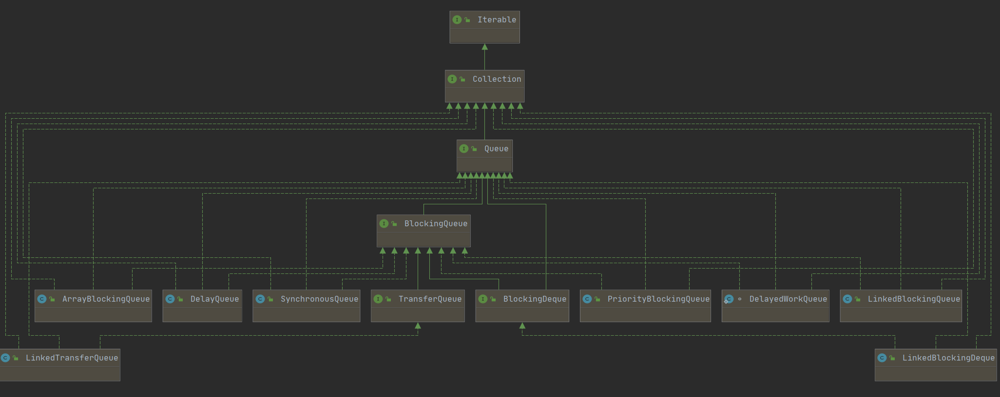
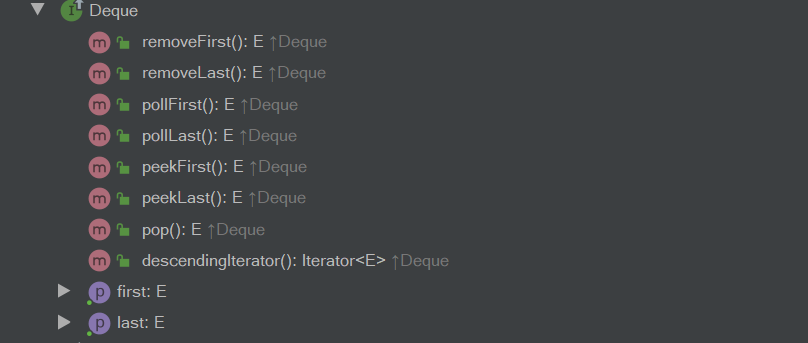

[toc]

系列传送门：

- [Java并发包源码学习系列：AbstractQueuedSynchronizer](https://blog.csdn.net/Sky_QiaoBa_Sum/article/details/112254373)
- [Java并发包源码学习系列：CLH同步队列及同步资源获取与释放](https://blog.csdn.net/Sky_QiaoBa_Sum/article/details/112301359)
- [Java并发包源码学习系列：AQS共享式与独占式获取与释放资源的区别](https://blog.csdn.net/Sky_QiaoBa_Sum/article/details/112386838)
- [Java并发包源码学习系列：ReentrantLock可重入独占锁详解](https://blog.csdn.net/Sky_QiaoBa_Sum/article/details/112454874)
- [Java并发包源码学习系列：ReentrantReadWriteLock读写锁解析](https://blog.csdn.net/Sky_QiaoBa_Sum/article/details/112689635)
- [Java并发包源码学习系列：详解Condition条件队列、signal和await](https://blog.csdn.net/Sky_QiaoBa_Sum/article/details/112727669)
- [Java并发包源码学习系列：挂起与唤醒线程LockSupport工具类](https://blog.csdn.net/Sky_QiaoBa_Sum/article/details/112757098)
- [Java并发包源码学习系列：JDK1.8的ConcurrentHashMap源码解析](https://blog.csdn.net/Sky_QiaoBa_Sum/article/details/113059783)

## 本篇要点

- 介绍阻塞队列的概述：支持阻塞式插入和移除的队列结构。
- 介绍阻塞队列提供的方法。
- 介绍BlockingQueue接口的几大实现类及主要特点。
- 以ArrayBlockingQueue为例介绍等待通知实现阻塞队列的过程。

> 不会涉及到太多源码部分，意在对阻塞队列章节的全局概览进行总结，具体的每种具体实现，之后会一一分析学习。

## 什么是阻塞队列

> 阻塞队列 = 阻塞 + 队列。

- 队列：一种**先进先出**的数据结构，支持尾部添加、首部移除或查看等基础操作。

- 阻塞：除了队列提供的基本操作之外，还提供了支持**阻塞式插入和移除**的方式。

下面这些对BlockingQueue的介绍基本翻译自JavaDoc，非常详细。

1. 阻塞队列的顶级接口是`java.util.concurrent.BlockingQueue`,它继承了Queue，Queue又继承自Collection接口。
2. BlockingQueue 对插入操作、移除操作、获取元素操作提供了四种不同的方法用于不同的场景中使用：1、抛出异常；2、返回特殊值（null 或 true/false，取决于具体的操作）；3、阻塞等待此操作，直到这个操作成功；4、阻塞等待此操作，直到成功或者超时指定时间，第二节会有详细介绍。
3. BlockingQueue不接受null的插入，否则将抛出空指针异常，因为poll失败了会返回null，如果允许插入null值，就无法判断poll是否成功了。
4. BlockingQueue可能是有界的，如果在插入的时候发现队列满了，将会阻塞，而无界队列则有`Integer.MAX_VALUE`大的容量，并不是真的无界。
5. BlockingQueue通常用来作为生产者-消费者的队列的，但是它也支持Collection接口提供的方法，比如使用remove(x)来删除一个元素，但是这类操作并不是很高效，因此尽量在少数情况下使用，如：当一条入队的消息需要被取消的时候。
6. BlockingQueue的实现都是线程安全的，所有队列的操作或使用内置锁或是其他形式的并发控制来保证原子。但是一些批量操作如：`addAll`,`containsAll`, `retainAll`和`removeAll`不一定是原子的。如 addAll(c) 有可能在添加了一些元素后中途抛出异常，此时 BlockingQueue 中已经添加了部分元素。
7. BlockingQueue不支持类似close或shutdown等关闭操作。

> 下面这一段是并发大师 DougLea 写的一段demo，使用BlockingQueue 来保证多生产者和消费者时的线程安全

```java
// Doug Lea： BlockingQueue 可以用来保证多生产者和消费者时的线程安全
class Producer implements Runnable{
    private final BlockingQueue queue;
    Producer(BlockingQueue q){ 
        queue = q; 
    }
    public void run(){
        try{
            while(true) { 
                queue.put(produce()); // 阻塞式插入
            }
        }catch(InterruptedException ex){ ...handle... }
    }
    Object produce() { ... }
}

class Consumer implements Runnable{
    private final BlockingQueue queue;
    Consumer(BlockingQueue q){ 
        queue = q; 
    }
    public void run(){
        try{
            while(true) { 
                consume(queue.take())); // 阻塞式获取
            }
        }catch(InterruptedException ex){ ...handle... }
    }
    void consume(Object x) { ... }
}

class Setup{
    void main(){
        BlockingQueue q = new SomeQueueImplementation();
        Producer p = new Producer(q);
        Consumer c1 = new Consumer(q);
        Consumer c2 = new Consumer(q);
        new Thread(p).start();
        new Thread(c1).start();
        new Thread(c2).start();
    }
}
```

## 阻塞队列提供的方法

BlockingQueue 对插入操作、移除操作、获取元素操作提供了四种不同的方法用于不同的场景中使用：

| 方法类别 | 抛出异常  | 返回特殊值 | 一直阻塞 | 超时退出               |
| -------- | --------- | ---------- | -------- | ---------------------- |
| 插入     | add(e)    | offer(e)   | `put(e)` | `offer(e, time, unit)` |
| 移除     | remove()  | poll()     | `take()` | `poll(time, unit)`     |
| 瞅一瞅   | element() | peek()     |          |                        |

博主在这边大概解释一下，如果队列可用时，上面的几种方法其实效果都差不多，但是当队列空或满时，会表现出部分差异：

1. 抛出异常：当队列满时，如果再往队列里add插入元素e时，会抛出`IllegalStateException: Queue full`的异常，如果队空时，往队列中取出元素【移除或瞅一瞅】会抛出`NoSuchElementException`异常。
2. 返回特殊值：队列满时，offer插入失败返回false。队列空时，poll取出元素失败返回null，而不是抛出异常。
3. 一直阻塞：当队列满时，put试图插入元素，将会一直阻塞插入的生产者线程，同理，队列为空时，如果消费者线程从队列里take获取元素，也会阻塞，知道队列不为空。
4. 超时退出：可以理解为一直阻塞情况的超时版本，线程阻塞一段时间，会自动退出阻塞。

我们本篇的重点是阻塞队列，那么【一直阻塞】和【超时退出】相关的方法是我们分析的重头啦。

## 阻塞队列的七种实现



- ArrayBlockingQueue：由**数组**构成的有界阻塞队列。
- LinkedBlockingQueue：由链表构成的**界限可选**的阻塞队列，如不指定边界，则为`Integer.MAX_VALUE`。
- PriorityBlockingQueue：支持**优先级排序**【类似于PriorityQueue的排序规则】的无界阻塞队列。
- DelayQueue：支持**延迟获取元素**的无界阻塞队列。
- SynchronousQueue：**不存储元素**的阻塞队列，**每个插入的操作必须等待另一个线程进行相应的删除操作**，反之亦然。

另外BlockingQueue有两个继承子接口，分别是：`TransferQueue`和`BlockingDeque`，他们有各自的实现类：

- LinkedTransferQueue：由链表组成的无界**TransferQueue**。
- LinkedBlockingDeque：由链表构成的界限可选的**双端阻塞队列**，如不指定边界，则为`Integer.MAX_VALUE`。

BlockingDeque比较好理解一些，支持双端操作嘛，TransferQueue又是个啥玩意呢？

### TransferQueue和BlockingQueue的区别

BlockingQueue：当生产者向队列添加元素但队列已满时，生产者会被阻塞；当消费者从队列移除元素但队列为空时，消费者会被阻塞。

TransferQueue则更进一步，<u>生产者会一直阻塞直到所添加到队列的元素被某一个消费者所消费（不仅仅是添加到队列里就完事）。</u>新添加的transfer方法用来实现这种约束。顾名思义，阻塞就是发生在元素从一个线程transfer到另一个线程的过程中，它有效地实现了元素在线程之间的传递（以建立Java内存模型中的happens-before关系的方式）。

> [并发编程网： Java 7中的TransferQueue](http://ifeve.com/java-transfer-queue/)

## 1、ArrayBlockingQueue

ArrayBlockingQueue是由**数组**构成的有界阻塞队列，支持FIFO的次序对元素进行排序。

这是一个典型的有界缓冲结构，可指定大小存储元素，供生产线程插入，供消费线程获取，但注意，容量一旦指定，便不可修改。

队列空时尝试take操作和队列满时尝试put操作都会阻塞执行操作的线程。

该类还支持可供选择的**公平性策略**，`ReentrantLock`可重入锁实现，默认采用非公平策略，当队列可用时，阻塞的线程都可以争夺访问队列的资格。

```java
// 创建采取公平策略且规定容量为10 的ArrayBlockingQueue
ArrayBlockingQueue<Integer> queue = new ArrayBlockingQueue<>(10, true); 
```

## 2、LinkedBlockingQueue

LinkedBlockingQueue是由链表构成的**界限可选**的阻塞队列，如不指定边界，则为`Integer.MAX_VALUE`,因此如不指定边界，一般来说，插入的时候都会成功。

LinkedBlockingQueue支持FIFO先进先出的次序对元素进行排序。

```java
    public LinkedBlockingQueue() {
        this(Integer.MAX_VALUE);
    }

    public LinkedBlockingQueue(int capacity) {
        if (capacity <= 0) throw new IllegalArgumentException();
        this.capacity = capacity;
        last = head = new Node<E>(null);
    }
```

## 3、PriorityBlockingQueue 

PriorityBlockingQueue是一个**支持优先级的无界阻塞队列**，基于数组的二叉堆，其实就是线程安全的`PriorityQueue`。

默认情况下元素采取自然顺序升序排列，也可以自定义类实现`compareTo()`方法来指定元素排序规则，或者初始化PriorityBlockingQueue时，指定构造参数Comparator来对元素进行排序。

需要注意的是如果两个对象的优先级相同（`compare` 方法返回 0），此队列并不保证它们之间的顺序。

PriorityBlocking可以传入一个初始容量，其实也就是底层数组的最小容量，之后会使用grow扩容。

```java
        // 这里传入10是初始容量，之后会扩容啊，无界的~ ， 后面参数可以传入比较规则，可以用lambda表达式哦
		PriorityQueue<Integer> priorityQueue = new PriorityQueue<>(10, new Comparator<Integer>() {
            @Override
            public int compare (Integer o1, Integer o2) {
                return 0;
            }
        });
```

## 4、DelayQueue

DelayQueue是一个**支持延时获取元素**的无界阻塞队列，使用PriorityQueue来存储元素。

队中的元素必须实现`Delayed`接口【Delay接口又继承了Comparable，需要实现compareTo方法】，每个元素都需要指明过期时间，通过`getDelay(unit)`获取元素剩余时间【剩余时间 = 到期时间 - 当前时间】。

当从队列获取元素时，只有过期的元素才会出队列。

```java
    static class DelayedElement implements Delayed {

        private final long delayTime; // 延迟时间
        private final long expire; // 到期时间
        private final String taskName; // 任务名称

        public DelayedElement (long delayTime, String taskName) {
            this.delayTime = delayTime;
            this.taskName = taskName;
            expire = now() + delayTime;
        }
		// 获取当前时间
        final long now () {
            return System.currentTimeMillis();
        }
        
        // 剩余时间 = 到期时间 - 当前时间
        @Override
        public long getDelay (TimeUnit unit) {
            return unit.convert(expire - now(), TimeUnit.MILLISECONDS);
        }
		
        // 靠前的元素是最快过期的元素
        @Override
        public int compareTo (Delayed o) {
            return (int) (getDelay(TimeUnit.MILLISECONDS) - o.getDelay(TimeUnit.MILLISECONDS));
        }
    }
```

## 5、SynchronousQueue

SynchronousQueue是一个**不存储元素**的阻塞队列，**每个插入的操作必须等待另一个线程进行相应的删除操作**，反之亦然，因此这里的Synchronous指的是<u>读线程和写线程需要同步，一个读线程匹配一个写线程</u>。

你不能在该队列中使用peek方法，因为peek是只读取不移除，不符合该队列特性，<u>该队列不存储任何元素，数据必须从某个写线程交给某个读线程，而不是在队列中等待倍消费,非常适合传递性场景。</u>

SynchronousQueue的吞吐量高于LinkedBlockingQueue和ArrayBlockingQueue。 

该类还支持可供选择的**公平性策略**，默认采用非公平策略，当队列可用时，阻塞的线程都可以争夺访问队列的资格。

```java
    public SynchronousQueue() {
        this(false);
    }
	// 公平策略使用TransferQueue 实现， 非公平策略使用TransferStack 实现
    public SynchronousQueue(boolean fair) {
        transferer = fair ? new TransferQueue<E>() : new TransferStack<E>();
    }
```

## 6、LinkedTransferQueue

LinkedTransferQueue是由链表组成的无界**TransferQueue**，相对于其他阻塞队列，多了tryTransfer和transfer方法。

TransferQueue：<u>生产者会一直阻塞直到所添加到队列的元素被某一个消费者所消费（不仅仅是添加到队列里就完事）。</u>新添加的transfer方法用来实现这种约束。顾名思义，阻塞就是发生在元素从一个线程transfer到另一个线程的过程中，它有效地实现了元素在线程之间的传递（以建立Java内存模型中的happens-before关系的方式）。

## 7、LinkedBlockingDeque

LinkedBlockingDeque是由链表构成的界限可选的**双端阻塞队列**，支持从两端插入和移除元素，如不指定边界，则为`Integer.MAX_VALUE`。




## 阻塞队列的实现机制

> 本文不会过于详尽地解析每个阻塞队列源码实现，但会总结通用的阻塞队列的实现机制。

以阻塞队列接口BlockingQueue为例，我们以其中新增的阻塞相关的两个方法为主要解析对象，put和take方法。

- put：如果队列已满，生产者线程便一直阻塞，直到队列不满。
- take：如果队列已空，消费者线程便开始阻塞，直到队列非空。

其实我们之前在学习Condition的时候已经透露过一些内容，这里利用ReentrantLock实现锁语义，通过锁关联的condition条件队列来灵活地实现**等待通知**机制。

之前已经详细地学习过：[Java并发包源码学习系列：详解Condition条件队列、signal和await](https://blog.csdn.net/Sky_QiaoBa_Sum/article/details/112727669)

```java
    public ArrayBlockingQueue(int capacity, boolean fair) {
        if (capacity <= 0)
            throw new IllegalArgumentException();
        this.items = new Object[capacity];
        // 初始化ReentrantLock
        lock = new ReentrantLock(fair);
        // 创建条件对象
        notEmpty = lock.newCondition();
        notFull =  lock.newCondition();
    }
```

### put方法

```java
    public void put(E e) throws InterruptedException {
        // 不能加null 啊
        checkNotNull(e);
        final ReentrantLock lock = this.lock;
        // 可响应中断地获取锁
        lock.lockInterruptibly();
        try {
            // 如果队列满了 notFull陷入阻塞，直到signal
            while (count == items.length)
                notFull.await();
            // 如果队列没满，执行入队操作
            enqueue(e);
        } finally {
            // 解锁
            lock.unlock();
        }
    }
	// 入队操作
    private void enqueue(E x) {
        // assert lock.getHoldCount() == 1;
        // assert items[putIndex] == null;
        final Object[] items = this.items;
        items[putIndex] = x;
        if (++putIndex == items.length)
            putIndex = 0;
        count++;
        // 注意这里， 入队操作成功之后，此时队列非空， 则唤醒notEmpty队列中的节点
        notEmpty.signal();
    }
```

### take方法

```java
    public E take() throws InterruptedException {
        final ReentrantLock lock = this.lock;
        // 可响应中断地获取锁
        lock.lockInterruptibly();
        try {
            // 如果队列为空， notWait陷入阻塞，直到被signal
            while (count == 0)
                notEmpty.await();
            // 出队操作
            return dequeue();
        } finally {
            // 解锁
            lock.unlock();
        }
    }
	// 出队操作
    private E dequeue() {
        // assert lock.getHoldCount() == 1;
        // assert items[takeIndex] != null;
        final Object[] items = this.items;
        @SuppressWarnings("unchecked")
        E x = (E) items[takeIndex];
        items[takeIndex] = null;
        if (++takeIndex == items.length)
            takeIndex = 0;
        count--;
        if (itrs != null)
            itrs.elementDequeued();
        // 注意这里， 出队成功之后， 队列非满， 则唤醒notFull中的节点
        notFull.signal();
        return x;
    }
```

Condition的await()方法会**将线程包装为等待节点，加入等待队列中，并将AQS同步队列中的节点移除**，接着不断检查`isOnSyncQueue(Node node)`，如果在等待队列中，就一直等着，如果signal将它移到AQS队列中，则退出循环。

Condition的signal()方法则是先检查当前线程是否获取了锁，接着将等待队列中的节点通过Node的操作**直接**加入AQS队列。线程并不会立即获取到资源，从while循环退出后，会通过acquireQueued方法加入获取同步状态的竞争中。

而上述描述的线程等待or阻塞则是通过`LockSupport`的park和unpark方法具体实现，具体可以参考AQS和LockSupport相关内容：

- [Java并发包源码学习系列：挂起与唤醒线程LockSupport工具类](https://blog.csdn.net/Sky_QiaoBa_Sum/article/details/112757098)

## 参考阅读

- 方腾飞《Java并发编程的艺术》
- 《Java并发编程之美》
- [并发编程网： Java 7中的TransferQueue](http://ifeve.com/java-transfer-queue/)
- [javadoop : 解读 java 并发队列 BlockingQueue](https://javadoop.com/post/java-concurrent-queue)

- [Java并发包源码学习系列：详解Condition条件队列、signal和await](https://blog.csdn.net/Sky_QiaoBa_Sum/article/details/112727669)