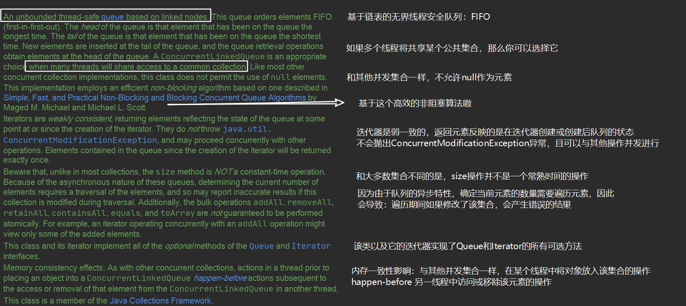
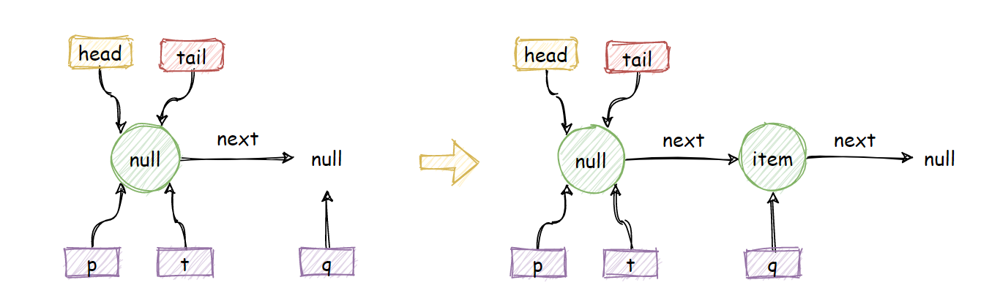
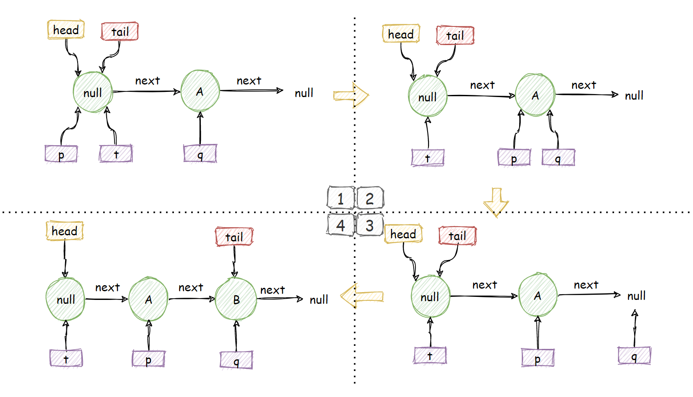

## 非阻塞并发队列ConcurrentLinkedQueue概述

我们之前花了很多时间了解学习BlockingQueue阻塞队列接口下的各种实现，也大概对阻塞队列的实现机制有了一定的了解：阻塞 + 队列嘛。

而且其中绝大部分是完全基于独占锁ReentrantLock和条件机制condition实现的并发同步，但基于独占锁的实现难免会涉及到频繁的线程挂起与线程唤醒，性能上有一定欠缺。比如：`ArrayBlockingQueue`、`LinkedBlockingQueue`等等。

在我们印象中，有几个具有transfer特性的队列为了性能，会优先考虑自旋，采用CAS非阻塞算法，自旋到一定程度呢，才采取阻塞，比如：`SynchronousQueue`、`LinkedTransferQueue`等等。

而我们今天要学习的这个`ConcurrentLinkedQueue`并没有实现BlockingQueue接口，是一个完完全全使用CAS操作实现线程安全的、无界的非阻塞队列。



## 结构组成

```java
public class ConcurrentLinkedQueue<E> extends AbstractQueue<E>
        implements Queue<E>, java.io.Serializable {
    private static final long serialVersionUID = 196745693267521676L;
    
    private static class Node<E> {
        volatile E item; // 值
        volatile Node<E> next; // next域
        Node(E item) {
            // 构造节点，保证线程安全
            UNSAFE.putObject(this, itemOffset, item);
        }
        /* ----- 内部使用UNSafe工具类提供的CAS算法 ----- */
        // 如果item为cmp， 改为val
        boolean casItem(E cmp, E val) {
            return UNSAFE.compareAndSwapObject(this, itemOffset, cmp, val);
        }
		// 将next设置为val
        void lazySetNext(Node<E> val) {
            UNSAFE.putOrderedObject(this, nextOffset, val);
        }
		// 如果next为cmp， 将next改为val
        boolean casNext(Node<E> cmp, Node<E> val) {
            return UNSAFE.compareAndSwapObject(this, nextOffset, cmp, val);
        }

        // Unsafe mechanics

        private static final sun.misc.Unsafe UNSAFE;
        private static final long itemOffset;
        private static final long nextOffset;

        static {
            try {
                UNSAFE = sun.misc.Unsafe.getUnsafe();
                Class<?> k = Node.class;
                itemOffset = UNSAFE.objectFieldOffset
                    (k.getDeclaredField("item"));
                nextOffset = UNSAFE.objectFieldOffset
                    (k.getDeclaredField("next"));
            } catch (Exception e) {
                throw new Error(e);
            }
        }
    }
    private transient volatile Node<E> head;
    private transient volatile Node<E> tail;
    
    // 无参构造，初始化将head和tail指向item为null的哨兵节点
    public ConcurrentLinkedQueue() {
        head = tail = new Node<E>(null);
    }

	// 指定初始容量
    public ConcurrentLinkedQueue(Collection<? extends E> c) {
        Node<E> h = null, t = null;
        for (E e : c) {
            checkNotNull(e);
            Node<E> newNode = new Node<E>(e);
            if (h == null)
                h = t = newNode;
            else {
                t.lazySetNext(newNode);
                t = newNode;
            }
        }
        if (h == null)
            h = t = new Node<E>(null);
        head = h;
        tail = t;
    }
    
}
```

## offer操作

### 源码解析

offer操作将会将元素e【非null】加入到队尾，由于无界队列的特性，这个操作将永远不会返回false。

```java
    public boolean offer(E e) {
        // 检查元素是否为null，为null就抛空指针
        checkNotNull(e); 
        // 构造新节点
        final Node<E> newNode = new Node<E>(e);

        for (Node<E> t = tail, p = t;;) {
            Node<E> q = p.next;
            // q == null 说明是p是尾节点
            if (q == null) {
                // cas将p的next设置为newNode，返回true
                // 如果设置失败，说明有其他线程修改了p.next
                // 那就再次进入循环
                if (p.casNext(null, newNode)) {
                    // Successful CAS is the linearization point
                    // for e to become an element of this queue,
                    // and for newNode to become "live".
                    // 这里tail指针并不是每次插入节点都要更改的，从head开始第奇数个节点会是tail
                    if (p != t) // hop two nodes at a time
                        casTail(t, newNode);  // Failure is OK.
                    return true;
                }
                // Lost CAS race to another thread; re-read next
            }
            else if (p == q)
                // 并发情况下，移除head的时候【比如poll】，将会head.next = head
                // 也就满足p == q 的分支条件， 需要重新找到新的head
                p = (t != (t = tail)) ? t : head;
            else
                // 表明tail指向的已经不是最后一个节点了，更新p的位置
                // 这里其实就是找到最后一个节点的位置
                p = (p != t && t != (t = tail)) ? t : q;
        }
    }
```

### 图解offer操作



上面是模拟的单线程情况下的offer一个元素的操作，可以看到：

1. 初始化head、tail都指向了item为null的哨兵节点，他们的next指向null。
2. 单线程情况下，我们暂时认为CAS操作都是执行成功的，此时q为null，将会走第一个分支，将p的next指向newNode，此时p==t，因此不会执行casTail操作，直接返回true。

多线程情况下，事情就不是这么简单了：



1. 加入线程A希望在队尾插入数据A，线程B希望在队尾插入数据B，他们同时到了分支1的`p.casNext(null, newNode)`这一步，由于`casNext`是原子性的，假设A此时设置成功，且`p == t`，如图1。
2. A成功，自然B线程cas设置next失败，那么将会再次进行for循环，此时`q != null && p != q`，走到分支3，将p移动到q的位置，也就是A的位置，如图2。
3. 再次循环，此时`q==null`，再次进行分支1的设置next操作，此时假设B成功了，如图3。
4. 此时你会发现，tail需要重新设置了，因为`p != t`条件满足，将会执行`casTail(t, newNode)`，将tail指针指向插入的B。

相信一通图解 + 源码分析下来，你会慢慢对整个流程熟悉起来，稍微总结一下：

> offer操作其实就是通过原子CAS操作控制某一时刻只有一个线程能成功在队尾追加元素，CAS失败的线程将会通过循环再次尝试CAS操作，直到成功。
>
> 非阻塞算法就是这样，通过循环CAS的方式利用CPU资源来替代阻塞线程的资源消耗。
>
> 并且，tail指针并不是每次都是指向最后一个节点，由于自身的机制，最后一个节点要么是tail指向的位置，要么就是它的next。因此定位的时候，这里使用p指针定位最后一个节点的位置。

### ps：hops设计意图

在看源码注释的时候，我发现很多处都对hop这个玩意

```java

```


## poll操作

### 源码解析

```java
    public E poll() {
        restartFromHead:
        for (;;) {
            for (Node<E> h = head, p = h, q;;) {
                E item = p.item;

                if (item != null && p.casItem(item, null)) {
                    // Successful CAS is the linearization point
                    // for item to be removed from this queue.
                    if (p != h) // hop two nodes at a time
                        updateHead(h, ((q = p.next) != null) ? q : p);
                    return item;
                }
                else if ((q = p.next) == null) {
                    updateHead(h, p);
                    return null;
                }
                else if (p == q)
                    continue restartFromHead;
                else
                    p = q;
            }
        }
    }
```


### 图解poll操作