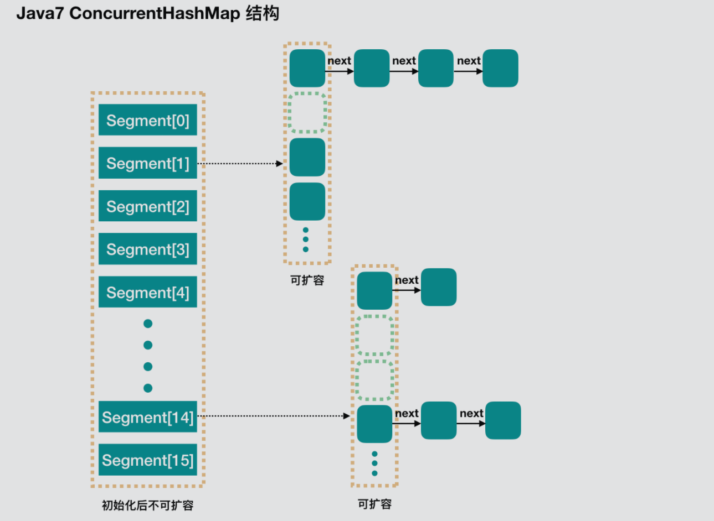
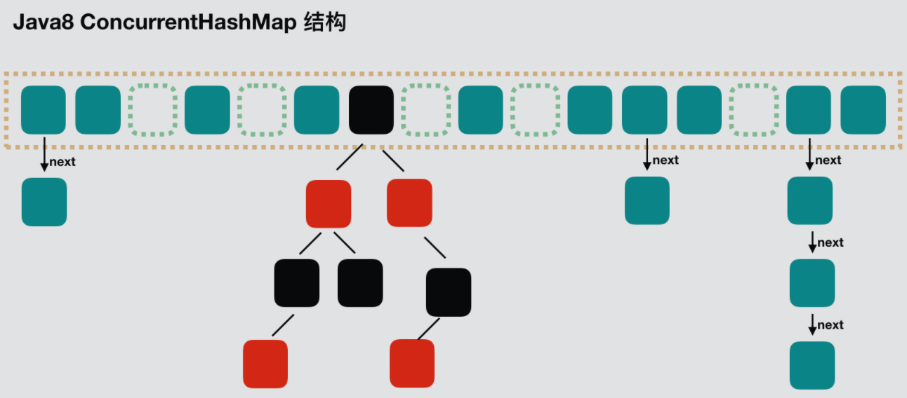
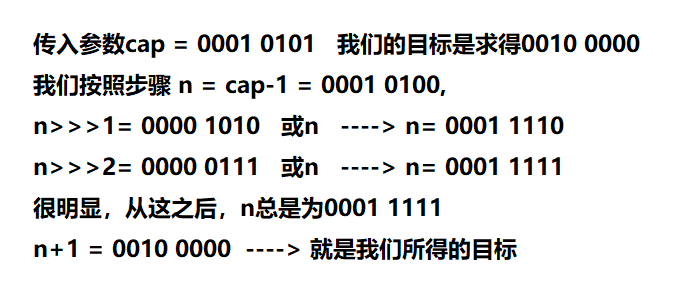

[toc]

系列传送门：

- [Java并发包源码学习系列：AbstractQueuedSynchronizer](https://blog.csdn.net/Sky_QiaoBa_Sum/article/details/112254373)
- [Java并发包源码学习系列：CLH同步队列及同步资源获取与释放](https://blog.csdn.net/Sky_QiaoBa_Sum/article/details/112301359)
- [Java并发包源码学习系列：AQS共享式与独占式获取与释放资源的区别](https://blog.csdn.net/Sky_QiaoBa_Sum/article/details/112386838)
- [Java并发包源码学习系列：ReentrantLock可重入独占锁详解](https://blog.csdn.net/Sky_QiaoBa_Sum/article/details/112454874)
- [Java并发包源码学习系列：ReentrantReadWriteLock读写锁解析](https://blog.csdn.net/Sky_QiaoBa_Sum/article/details/112689635)
- [Java并发包源码学习系列：详解Condition条件队列、signal和await](https://blog.csdn.net/Sky_QiaoBa_Sum/article/details/112727669)
- [Java并发包源码学习系列：挂起与唤醒线程LockSupport工具类](https://blog.csdn.net/Sky_QiaoBa_Sum/article/details/112757098)

注：本篇基于JDK1.8。

## 为什么要使用ConcurrentHashMap?

在思考这个问题之前，我们可以思考：如果不用ConcurrentHashMap的话，有哪些其他的容器供我们选择呢？并且它们的缺陷是什么？

哈希表利用哈希算法能够花费O(1)的时间复杂度高效地根据key找到value值，能够满足这个需求的容器还有HashTable和HashMap。

**HashTable**

HashTable使用synchronized关键字保证了多线程环境下的安全性，但加锁的实现方式是独占式的，所有访问HashTable的线程都必须竞争同一把锁，性能较为低下。

```java
    public synchronized V put(K key, V value) {
        // ...
    }
```

**HashMap**

JDK1.8版本的HashMap在读取hash槽的时候读取的是工作内存中引用指向的对象，在多线程环境下，其他线程修改的值不能被及时读到。

- 关于HashMap的源码解析：[【JDK1.8】Java集合源码学习系列：HashMap源码详解](https://blog.csdn.net/Sky_QiaoBa_Sum/article/details/104095675)

> 这就引发出可能存在的一些问题：
>
> 比如在插入操作的时候，**第一次将会根据key的hash值判断当前的槽内是否被占用，如果没有的话就会插入value**。在并发环境下，如果A线程判断槽未被占用，在执行写入操作的时候正巧时间片耗尽，此时B线程正巧也执行了同样的操作，率先插入了B的value，此时A正巧被CPU重新调度继续执行写入操作，进而将线程B的value覆盖。
>
> 还有一种情况是在同一个hash槽内，HashMap总是保持key唯一，在插入的时候，如果存在key，就会进行value覆盖。并发情况下，如果A线程判断最后一个节点仍未发现重复的key，那么将会执行插入操作，如果B线程在A判断和插入之间执行了同样的操作，也会发生数据的覆盖，也就是数据的丢失。
>
> 当然，像这样的并发问题其实还有一些，这里就不细说了，刚兴趣的小伙伴可以查阅下资料。

## ConcurrentHashMap的结构特点

### Java8之前

在Java8之前，底层采用`Segment+HashEntry`的方式实现。

采用分段锁的概念，底层使用Segment数组，Segment通过继承ReentrantLock来进行加锁，每次需要加锁的操作会锁住一个segment，分段保证每个段是线程安全的。

> 图源：[Java7/8 中的 HashMap 和 ConcurrentHashMap 全解析](https://javadoop.com/post/hashmap)



### Java8之后

JDK1.8之后采用`CAS + Synchronized`的方式来保证并发安全。

采用【Node数组】加【链表】加【红黑树】的结构，与HashMap类似。

> 图源：[Java7/8 中的 HashMap 和 ConcurrentHashMap 全解析](https://javadoop.com/post/hashmap)



## 基本常量

过一遍即可，不用过于纠结，有些字段也许是为了兼容Java8之前的版本。

```java
    /* ---------------- Constants -------------- */

    //  允许的最大容量
    private static final int MAXIMUM_CAPACITY = 1 << 30;

    // 默认初始值16，必须是2的幂
    private static final int DEFAULT_CAPACITY = 16;

    // toArray相关方法可能需要的量
    static final int MAX_ARRAY_SIZE = Integer.MAX_VALUE - 8;

    //为了和Java8之前的分段相关内容兼容，并未使用
    private static final int DEFAULT_CONCURRENCY_LEVEL = 16;

    // 负载因子
    private static final float LOAD_FACTOR = 0.75f;

    // 链表转红黑树阀值> 8 链表转换为红黑树
    static final int TREEIFY_THRESHOLD = 8;

    // 树转链表阀值，小于等于6（tranfer时，lc、hc=0两个计数器分别++记录原bin、新binTreeNode数量，<=UNTREEIFY_THRESHOLD 则untreeify(lo)）
    static final int UNTREEIFY_THRESHOLD = 6;

    // 链表树化的最小容量 treeifyBin的时候，容量如果不足64，会优先选择扩容到64
    static final int MIN_TREEIFY_CAPACITY = 64;

    // 每一步最小重绑定数量
    private static final int MIN_TRANSFER_STRIDE = 16;

    // sizeCtl中用于生成标记的位数
    private static int RESIZE_STAMP_BITS = 16;

    // 2^15-1，help resize的最大线程数
    private static final int MAX_RESIZERS = (1 << (32 - RESIZE_STAMP_BITS)) - 1;

    // 32-16=16，sizeCtl中记录size大小的偏移量
    private static final int RESIZE_STAMP_SHIFT = 32 - RESIZE_STAMP_BITS;

    // forwarding nodes的hash值
    static final int MOVED     = -1;

    // 树根节点的hash值
    static final int TREEBIN   = -2;

    // ReservationNode的hash值
    static final int RESERVED  = -3;

    // 提供给普通node节点hash用
    static final int HASH_BITS = 0x7fffffff;

    // 可用处理器数量
    static final int NCPU = Runtime.getRuntime().availableProcessors();
```

## 重要成员变量

```java
    /* ---------------- Fields -------------- */

	// 就是我们说的底层的Node数组，懒初始化的，在第一次插入的时候才初始化，大小需要是2的幂
    transient volatile Node<K,V>[] table;

    /**
     * 扩容resize的时候用的table
     */
    private transient volatile Node<K,V>[] nextTable;

    /**
     * 基础计数器，是通过CAS来更新的
     */
    private transient volatile long baseCount;

    /**
     * Table initialization and resizing control.  
     * 如果为负数：表示正在初始化或者扩容，具体如下、
     * -1表示初始化，
     * -N，N-1表示正在进行扩容的线程数
     
     * 默认为0，初始化之后，保存下一次扩容的大小
     */
    private transient volatile int sizeCtl;

    /**
     * 扩容时分割table的索引
     */
    private transient volatile int transferIndex;

    /**
     * Spinlock (locked via CAS) used when resizing and/or creating CounterCells.
     */
    private transient volatile int cellsBusy;

    /**
     * Table of counter cells. When non-null, size is a power of 2.
     */
    private transient volatile CounterCell[] counterCells;

    // 视图
    private transient KeySetView<K,V> keySet;
    private transient ValuesView<K,V> values;
    private transient EntrySetView<K,V> entrySet;
```

## 构造方法

和HashMap一样，table数组的初始化是在第一次插入的时候才进行的。

```java
    /**
     * 创建一个新的，空的map，默认大小为16
     */
    public ConcurrentHashMap() {
    }

    /**
     * 指定初始容量
     */
    public ConcurrentHashMap(int initialCapacity) {
        if (initialCapacity < 0)
            throw new IllegalArgumentException();
        int cap = ((initialCapacity >= (MAXIMUM_CAPACITY >>> 1)) ?
                   MAXIMUM_CAPACITY :
					// hashmap中讲过哦，用来返回的是大于等于传入值的最小2的幂次方
                   // https://blog.csdn.net/Sky_QiaoBa_Sum/article/details/104095675#tableSizeFor_105
                   tableSizeFor(initialCapacity + (initialCapacity >>> 1) + 1));
        // sizeCtl 初始化为容量
        this.sizeCtl = cap;
    }

    /**
     * 接收一个map对象
     */
    public ConcurrentHashMap(Map<? extends K, ? extends V> m) {
        this.sizeCtl = DEFAULT_CAPACITY;
        putAll(m);
    }

    /**
     * 指定初始容量和负载因子
     * @since 1.6
     */
    public ConcurrentHashMap(int initialCapacity, float loadFactor) {
        this(initialCapacity, loadFactor, 1);
    }

    /**
     * 最全的：容量、负载因子、并发级别
     */
    public ConcurrentHashMap(int initialCapacity,
                             float loadFactor, int concurrencyLevel) {
        if (!(loadFactor > 0.0f) || initialCapacity < 0 || concurrencyLevel <= 0)
            throw new IllegalArgumentException();
        if (initialCapacity < concurrencyLevel)   // Use at least as many bins
            initialCapacity = concurrencyLevel;   // as estimated threads
        long size = (long)(1.0 + (long)initialCapacity / loadFactor);
        int cap = (size >= (long)MAXIMUM_CAPACITY) ?
            MAXIMUM_CAPACITY : tableSizeFor((int)size);
        this.sizeCtl = cap;
    }
```

这里的tableSizeFor方法在HashMap中有解析过：[https://blog.csdn.net/Sky_QiaoBa_Sum/article/details/104095675#tableSizeFor_105](https://blog.csdn.net/Sky_QiaoBa_Sum/article/details/104095675#tableSizeFor_105)

### tableSizeFor

我们通过注解可以知道，这个方法返回的是大于等于传入值的最小2的幂次方（传入1时，为1）。它到底是怎么实现的呢，我们来看看具体的源码：

```java
    static final int tableSizeFor(int cap) {
        int n = cap - 1;
        n |= n >>> 1;
        n |= n >>> 2;
        n |= n >>> 4;
        n |= n >>> 8;
        n |= n >>> 16;
        return (n < 0) ? 1 : (n >= MAXIMUM_CAPACITY) ? MAXIMUM_CAPACITY : n + 1;
    }
123456789
```

说实话，我再看到这个方法具体实现之后，感叹了一句，数学好牛！我通过代入具体数字，翻阅了许多关于这部分的文章与视频，通过简单的例子，来做一下总结。

- 我们先试想一下，我们想得到比n大的最小2次幂只需要**在最高位的前一位置1，后面全置0**就ok了吧。如0101代表的是5，1000就符合我们的需求为8。
- 我们再传入更大的数，为了写着方便，这里就以8位为例：
  
- 第一步`int n = cap -1`这一步其实是为了防止cap本身为2的幂次的情况，如果没有这一步的话，在一顿操作之后，会出现翻倍的情况。比如传入为8，算出来会是16，所以事先减去1，保证结果。
- 最后n<0的情况的判定，排除了传入容量为0的情况。
- n>=MAXIMUM_CAPACITY的情况的判定，排除了移位和或运算之后全部为1的情况。

## put方法存值

### putVal

```java
    public V put(K key, V value) {
        return putVal(key, value, false);
    }

    /** Implementation for put and putIfAbsent */
    final V putVal(K key, V value, boolean onlyIfAbsent) {
        if (key == null || value == null) throw new NullPointerException();
        // 对key进行散列计算 ： (h ^ (h >>> 16)) & HASH_BITS;
        int hash = spread(key.hashCode()); 
        // 记录链表长度
        int binCount = 0;
        for (Node<K,V>[] tab = table;;) {
            Node<K,V> f; int n, i, fh;
            //第一次put，就是这里进行初始化的
            if (tab == null || (n = tab.length) == 0) 
                tab = initTable();
            // 找该 hash 值对应的数组下标，得到第一个节点 f， 
            // 这里判断f是否为空，就是这个位置上有没有节点占着
            else if ((f = tabAt(tab, i = (n - 1) & hash)) == null) {
                // 如果没有，用CAS尝试将值放入，插入成功，则退出for循环
                // 如果CAS失败，则表示存在并发竞争，再次进入循环
                if (casTabAt(tab, i, null,
                             new Node<K,V>(hash, key, value, null)))
                    break;                   // no lock when adding to empty bin
            }
            // hash是Node节点f的一个属性，等于MOVED的情况表示该节点处于迁移状态
            else if ((fh = f.hash) == MOVED)
                // 帮助迁移【内部其实调用了transfer，后面分析】
                tab = helpTransfer(tab, f);
            else {
                // 进入这个分支表示：根据key计算出的hash，得到的位置上是存在Node的，接着我将遍历链表了
                V oldVal = null;
                // 锁住Node节点
                synchronized (f) {
                    // 加锁后的二次校验，针对tab可能被其他线程修改的情况
                    if (tabAt(tab, i) == f) {
                        if (fh >= 0) { // 头节点的hash属性 >= 0
                            binCount = 1; // 记录链表长度
                            // 链表的遍历操作，你懂的
                            for (Node<K,V> e = f;; ++binCount) {
                                K ek;
                                // 找到一样的key了
                                if (e.hash == hash &&
                                    ((ek = e.key) == key ||
                                     (ek != null && key.equals(ek)))) {
                                    oldVal = e.val;
                                    // onlyIfAbsent为false的话，这里就要覆盖了，默认是覆盖的
                                    if (!onlyIfAbsent)
                                        e.val = value;
                                    // 接着也就结束遍历了
                                    break;
                                }
                                Node<K,V> pred = e;
                                // 遍历到最后了，把Node插入尾部
                                if ((e = e.next) == null) {
                                    pred.next = new Node<K,V>(hash, key,
                                                              value, null);
                                    break;
                                }
                            }
                        }
                        else if (f instanceof TreeBin) { // 红黑树
                            Node<K,V> p;
                            binCount = 2;
                            // 红黑树putTreeVal
                            if ((p = ((TreeBin<K,V>)f).putTreeVal(hash, key,
                                                           value)) != null) {
                                oldVal = p.val;
                                if (!onlyIfAbsent)
                                    p.val = value;
                            }
                        }
                    }
                }
                if (binCount != 0) {
                    // 判断是否需要将链表转换为红黑树 节点数 >= 8的时候
                    if (binCount >= TREEIFY_THRESHOLD)
                        //树化 后面单独分析
                        treeifyBin(tab, i);
                    if (oldVal != null)
                        return oldVal;
                    break;
                }
            }
        }
        addCount(1L, binCount);
        return null;
    }
```

其实你会发现，如果你看过HashMap的源码，理解ConcurrentHashMap的操作其实还是比较清晰的，相信看下来你已经基本了解了。接下来将会具体分析一下几个关键的方法

### initTable

采用延迟初始化，第一次put的时候，调用initTable()初始化Node数组。

```java
    /**
     * Initializes table, using the size recorded in sizeCtl.
     */
    private final Node<K,V>[] initTable() {
        Node<K,V>[] tab; int sc;
        while ((tab = table) == null || tab.length == 0) {
            // 如果小于0，表示已经有其他线程抢着初始化了
            if ((sc = sizeCtl) < 0)
                Thread.yield(); // lost initialization race; just spin
            // 这里就试着cas抢一下，抢到就将sc设置为-1，声明主权，抢不到就再次进入循环
            else if (U.compareAndSwapInt(this, SIZECTL, sc, -1)) {
                try {
                    if ((tab = table) == null || tab.length == 0) {
                        // 设置初始容量
                        int n = (sc > 0) ? sc : DEFAULT_CAPACITY;
                        // 创建容量为n的数组
                        @SuppressWarnings("unchecked")
                        Node<K,V>[] nt = (Node<K,V>[])new Node<?,?>[n];
                        // 赋值给volatile变量table底层数组
                        table = tab = nt;
                        // 这里其实就是 sc = n - n/4 = 0.75 * n
                        sc = n - (n >>> 2);
                    }
                } finally {
                    // 就当12吧
                    sizeCtl = sc;
                }
                break;
            }
        }
        return tab;
    }
```

初始化的并发问题如何解决呢？

通过volatile的sizeCtl变量进行标识，在第一次初始化的时候，如果有多个线程同时进行初始化操作，他们将会判断sizeCtl是否小于0，小于0表示已经有其他线程在进行初始化了。

因为获取到初始化权的线程已经通过cas操作将sizeCtl的值改为-1了，且volatile的特性保证了变量在各个线程之间的可见性。

接着，将会创建合适容量的数组，并将sizeCtl的值设置为`cap*loadFactor`。

### treeifyBin

这部分包含链表转红黑树的逻辑，当然，需要满足一些前提条件：

1. 首先当然是需要链表的节点数量`>=TREEIFY_THRESHOLD`的时候啦，默认是8。

```java
                if (binCount != 0) {
                    // 判断是否需要将链表转换为红黑树 节点数 >= 8的时候
                    if (binCount >= TREEIFY_THRESHOLD)
                        // 树化
                        treeifyBin(tab, i);
                    if (oldVal != null)
                        return oldVal;
                    break;
                }
```

2. 其实还有一个条件，就是：如果数组长度`< MIN_TREEIFY_CAPACITY`的时候,会优先调用`tryPresize`进行数组扩容。

```java
    private final void treeifyBin(Node<K,V>[] tab, int index) {
        Node<K,V> b; int n, sc;
        if (tab != null) {
            // 如果数组长度小于MIN_TREEIFY_CAPACITY 会优先扩容tryPresize
            if ((n = tab.length) < MIN_TREEIFY_CAPACITY)
                tryPresize(n << 1);
            else if ((b = tabAt(tab, index)) != null && b.hash >= 0) {
                // 锁住头节点
                synchronized (b) {
                    if (tabAt(tab, index) == b) {
                        // 遍历链表， 创建红黑树
                        TreeNode<K,V> hd = null, tl = null;
                        for (Node<K,V> e = b; e != null; e = e.next) {
                            TreeNode<K,V> p =
                                new TreeNode<K,V>(e.hash, e.key, e.val,
                                                  null, null);
                            if ((p.prev = tl) == null)
                                hd = p;
                            else
                                tl.next = p;
                            tl = p;
                        }
                        // 将红黑树设置对应的位置上
                        setTabAt(tab, index, new TreeBin<K,V>(hd));
                    }
                }
            }
        }
    }
```

### tryPresize

数组扩容操作一般都是核心，仔细看看。

```java
    private final void tryPresize(int size) {
        int c = (size >= (MAXIMUM_CAPACITY >>> 1)) ? MAXIMUM_CAPACITY :
            tableSizeFor(size + (size >>> 1) + 1);// tableSizeFor(1.5*size)
        int sc;
        while ((sc = sizeCtl) >= 0) {
            Node<K,V>[] tab = table; int n;
            //  这里就是之前说的initTable部分的代码
            if (tab == null || (n = tab.length) == 0) {
                n = (sc > c) ? sc : c;
                if (U.compareAndSwapInt(this, SIZECTL, sc, -1)) {
                    try {
                        if (table == tab) {
                            @SuppressWarnings("unchecked")
                            Node<K,V>[] nt = (Node<K,V>[])new Node<?,?>[n];
                            table = nt;
                            sc = n - (n >>> 2);
                        }
                    } finally {
                        sizeCtl = sc;
                    }
                }
            }
            else if (c <= sc || n >= MAXIMUM_CAPACITY)
                break;
            else if (tab == table) {
                //1 0000 | 0000 0000 0000 0000 1000 0000 0000 0000
                int rs = resizeStamp(n);
                // sc小于0表示已经有线程正在进行扩容操作
                if (sc < 0) {
                    Node<K,V>[] nt;
                    if ((sc >>> RESIZE_STAMP_SHIFT) != rs || sc == rs + 1 ||
                        sc == rs + MAX_RESIZERS || (nt = nextTable) == null ||
                        transferIndex <= 0)
                        break;
                    // cas将sizeCtl加1， 如果成功， 则执行transfer操作
                    if (U.compareAndSwapInt(this, SIZECTL, sc, sc + 1))
                        transfer(tab, nt);
                }
                // 没有线程在扩容，将sizeCtl的值改为(rs << RESIZE_STAMP_SHIFT) + 2)
                else if (U.compareAndSwapInt(this, SIZECTL, sc,
                                             (rs << RESIZE_STAMP_SHIFT) + 2))
                    transfer(tab, null);
            }
        }
    }

    static final int resizeStamp(int n) {
        // Integer.numberOfLeadingZeros(n) 其实是返回n的前导零个数， 每次扩容翻倍，个数会少1
        // 如果n = 16 ， 返回27
        // 1 << (RESIZE_STAMP_BITS - 1) 1 左移15位标识 第16位为1，低15位全为0
        return Integer.numberOfLeadingZeros(n) | (1 << (RESIZE_STAMP_BITS - 1));
    }
```

`resizeStamp(int n)`方法可以参照[https://blog.csdn.net/tp7309/article/details/76532366](https://blog.csdn.net/tp7309/article/details/76532366)的解析。

### transfer

这个方法涉及到数据迁移的操作，支持并发执行，第一个发起数据迁移的线程，nextTab参数传null，之后再调用此方法时，nextTab不会为null。

并发执行实现：使用stride将一次迁移任务拆分成一个个的小任务，第一个发起数据迁移的线程将会将transferIndex指向原数组最后的位置，然后从后向前的stride分任务属于第一个线程，再将transferIndex指向新的位置，再往前的stride个任务属于第二个线程，依次类推。

```java
    private final void transfer(Node<K,V>[] tab, Node<K,V>[] nextTab) {
        int n = tab.length, stride;
        // 多核情况下， stride为 (n >>> 3) / NCPU , 单核情况下，就是数组的容量
        if ((stride = (NCPU > 1) ? (n >>> 3) / NCPU : n) < MIN_TRANSFER_STRIDE)
            // 最小是16
            stride = MIN_TRANSFER_STRIDE; // subdivide range
        // 第一个发起数据迁移的线程，nextTab参数传null
        if (nextTab == null) {            // initiating
            try {
                // n<<1 表示容量翻倍
                @SuppressWarnings("unchecked")
                Node<K,V>[] nt = (Node<K,V>[])new Node<?,?>[n << 1];
                nextTab = nt;
            } catch (Throwable ex) {      // try to cope with OOME
                sizeCtl = Integer.MAX_VALUE;
                return;
            }
            // 为nextTable 和transferIndex赋值，transferIndex从最后一个开始
            nextTable = nextTab;
            transferIndex = n;
        }
        int nextn = nextTab.length;
        // 构造一个hash == MOVED 的节点，标记已经迁移完毕的位置
        ForwardingNode<K,V> fwd = new ForwardingNode<K,V>(nextTab);
        // 这里的advance表示已经做完一个位置的迁移，可以准备下一个位置了
        boolean advance = true;
        boolean finishing = false; // to ensure sweep before committing nextTab
        for (int i = 0, bound = 0;;) {
            Node<K,V> f; int fh;
            // advance为true表示可以准备下一个位置了
            while (advance) {
                
                int nextIndex, nextBound;
                if (--i >= bound || finishing)
                    advance = false;
                // nextIndex会等于transferIndex
                //  transferIndex 一旦小于等于 0，说明原数组的所有位置都有相应的线程去处理了
                else if ((nextIndex = transferIndex) <= 0) {
                    i = -1;
                    advance = false;
                }
                else if (U.compareAndSwapInt
                         (this, TRANSFERINDEX, nextIndex,
                          nextBound = (nextIndex > stride ?
                                       nextIndex - stride : 0))) {
                    // bound 指向了 transferIndex-stride
                    bound = nextBound;
                    // i指向 transferIndex - 1
                    // 从后向前执行迁移任务
                    i = nextIndex - 1;
                    advance = false;
                }
            }
            if (i < 0 || i >= n || i + n >= nextn) {
                int sc;
                // 所有的迁移操作都完成了
                if (finishing) {
                    nextTable = null;
                    table = nextTab; // 将nextTab赋值给table
                    sizeCtl = (n << 1) - (n >>> 1); // 重新计算sizeCtl
                    return;
                }
                // sizeCtl在前设置为 (rs << RESIZE_STAMP_SHIFT) + 2
                // 之后每有一个线程参与迁移就会 将sizeCtl加1
                
                // 这里可以看成逆操作， 每次-1，代表完成了自己的任务
                if (U.compareAndSwapInt(this, SIZECTL, sc = sizeCtl, sc - 1)) {
                    if ((sc - 2) != resizeStamp(n) << RESIZE_STAMP_SHIFT)
                        return;
                    // 走到这里表示(sc - 2) == resizeStamp(n) << RESIZE_STAMP_SHIFT
                    // 所有的任务完成， 下一循环就进入上面的finish分支了
                    finishing = advance = true;
                    i = n; // recheck before commit
                }
            }
            // 下面是具体的迁移操作
            // 如果i位置是null，那就将刚刚初始化hash=MOVED的节点cas放入
            else if ((f = tabAt(tab, i)) == null)
                advance = casTabAt(tab, i, null, fwd);
            // 如果已经是hash==MOVED ，代表这个位置已经迁移过了
            else if ((fh = f.hash) == MOVED)
                advance = true; // already processed
            else {
                // 对这个位置单独加锁，处理该位置的迁移工作
                synchronized (f) {
                    if (tabAt(tab, i) == f) {
                        Node<K,V> ln, hn;
                        // 链表节点
                        if (fh >= 0) {
                            // 将链表一分为二
                            int runBit = fh & n;
                            Node<K,V> lastRun = f;
                            //  下面几步都在寻找lastRun的位置，表示lastRun之后的节点需要放到一起
                            for (Node<K,V> p = f.next; p != null; p = p.next) {
                                int b = p.hash & n;
                                if (b != runBit) {
                                    runBit = b;
                                    lastRun = p;
                                }
                            }
                            if (runBit == 0) {
                                ln = lastRun;
                                hn = null;
                            }
                            else {
                                hn = lastRun;
                                ln = null;
                            }
                            for (Node<K,V> p = f; p != lastRun; p = p.next) {
                                int ph = p.hash; K pk = p.key; V pv = p.val;
                                if ((ph & n) == 0)
                                    ln = new Node<K,V>(ph, pk, pv, ln);
                                else
                                    hn = new Node<K,V>(ph, pk, pv, hn);
                            }
                            // 其中一个链表放在新数组的i位置上
                            setTabAt(nextTab, i, ln);
                            // 另一个链表放在新数组的i + n 位置上
                            setTabAt(nextTab, i + n, hn);
                            // 将原数组的i位置上设置为fwd表示已经处理完毕
                            // 这里的fwd是我们之前创建的ForwardingNode，
                            // 下一进行判断的时候，就会将advance设置为true了
                            setTabAt(tab, i, fwd);
                            // 声明该位置已经迁移完毕了
                            advance = true;
                        }
                        // 下面是红黑树的迁移
                        else if (f instanceof TreeBin) {
                            TreeBin<K,V> t = (TreeBin<K,V>)f;
                            TreeNode<K,V> lo = null, loTail = null;
                            TreeNode<K,V> hi = null, hiTail = null;
                            int lc = 0, hc = 0;
                            for (Node<K,V> e = t.first; e != null; e = e.next) {
                                int h = e.hash;
                                TreeNode<K,V> p = new TreeNode<K,V>
                                    (h, e.key, e.val, null, null);
                                if ((h & n) == 0) {
                                    if ((p.prev = loTail) == null)
                                        lo = p;
                                    else
                                        loTail.next = p;
                                    loTail = p;
                                    ++lc;
                                }
                                else {
                                    if ((p.prev = hiTail) == null)
                                        hi = p;
                                    else
                                        hiTail.next = p;
                                    hiTail = p;
                                    ++hc;
                                }
                            }
                            // 节点数小于6 将红黑树转化为链表untreeify
                            ln = (lc <= UNTREEIFY_THRESHOLD) ? untreeify(lo) :
                                (hc != 0) ? new TreeBin<K,V>(lo) : t;
                            hn = (hc <= UNTREEIFY_THRESHOLD) ? untreeify(hi) :
                                (lc != 0) ? new TreeBin<K,V>(hi) : t;
                            setTabAt(nextTab, i, ln);
                            setTabAt(nextTab, i + n, hn);
                            setTabAt(tab, i, fwd);
                            advance = true;
                        }
                    }
                }
            }
        }
    }
```

## get方法取值

### get

get方法相对来说就简单很多了，根据key计算出的hash值，找到对应的位置，判断头节点是不是要的值，不是的话就从红黑树或者链表里找。

```java
    public V get(Object key) {
        Node<K,V>[] tab; Node<K,V> e, p; int n, eh; K ek;
        // 计算hash值
        int h = spread(key.hashCode());
        // 找到对应的hash桶的位置
        if ((tab = table) != null && (n = tab.length) > 0 &&
            (e = tabAt(tab, (n - 1) & h)) != null) {
            // 正好在头节点上
            if ((eh = e.hash) == h) {
                if ((ek = e.key) == key || (ek != null && key.equals(ek)))
                    return e.val;
            }
            // 树形结构上
            else if (eh < 0)
                return (p = e.find(h, key)) != null ? p.val : null;
            // 在链表上
            while ((e = e.next) != null) {
                if (e.hash == h &&
                    ((ek = e.key) == key || (ek != null && key.equals(ek))))
                    return e.val;
            }
        }
        return null;
    }
```

可以看到get方法是无锁的，通过volatile修饰的next来每次都获取最新的值。

> 再提一下吧：
>
> volatile能够保证变量在线程之间的可见性，能够被多线程同时读且保证不会读到过期的值，因为为根据Java内存模型的happen before原则，对volatile字段的写入操作先于读操作，即使两个线程同时修改和获取volatile变量，get操作也能拿到最新的值。
>
> 但只能被单线程写，【有一种情况可以被多线程写，就是写入的值不依赖于原值】，读操作是不需要加锁的。

## 总结

- ConcurrentHashMap在JDK1.7和JDK1.8的实现思路上发生比较大的变化：
  - JDK1.7采用`Segment+HashEntry`的方式和`分段锁`的概念实现。
  - JDK1.8放弃了锁分段的概念，使用`Node + CAS + Synchronized` 的方式实现并发，使用`数组+链表+红黑树`的结构。
- put操作会进行如下判断：
  - 如果没有初始化，先进行初始化[懒初始化]，默认容量为16，同时设置了SizeCtl。
  - 如果tab数组对应的hash槽位置上没有节点，CAS操作给该位置赋值，成功则跳出循环。
  - 如果当前插槽节点正处于迁移状态即`f.hash == MOVED`，则先帮助节点完成迁移操作。
  - 发生hash冲突，率先使用`synchronized`锁住首节点，接下来判断是链表节点或是红黑树节点，找到合适的位置，插入或覆盖值。
  - **如果节点数量超过树化的阈值8，且数组容量也达到树化的阈值64，进行树化**。
- 当某个桶的位置的节点数量超过8，但是数组容量没有达到64时，会先进行**扩容操作n$\times$2，执行tryPresize**。
- 扩容操作涉及到transfer**数据迁移**，支持并发，通过将数据迁移分为stride个小任务，通过transferIndex和nextBound两个指针来分配任务。
- get操作不需要加锁，根据key计算出的hash值，找到对应的位置，判断头节点是不是要的值，不是的话就从红黑树或者链表里找。

## 参考阅读

- [占小狼： 谈谈ConcurrentHashMap1.7和1.8的不同实现](https://www.jianshu.com/p/e694f1e868ec)
- [jianshu_xw：浅析JDK1.8 下HashMap线程安全性](https://www.jianshu.com/p/06e7e626dcad)
- [javadoop：Java7/8 中的 HashMap 和 ConcurrentHashMap 全解析](https://javadoop.com/post/hashmap)
- [Java3y ConcurrentHashMap基于JDK1.8源码剖析](https://mp.weixin.qq.com/s?__biz=MzI4Njg5MDA5NA==&mid=2247484161&idx=1&sn=6f52fb1f714f3ffd2f96a5ee4ebab146&chksm=ebd74200dca0cb16288db11f566cb53cafc580e08fe1c570e0200058e78676f527c014ffef41&scene=21###wechat_redirect)