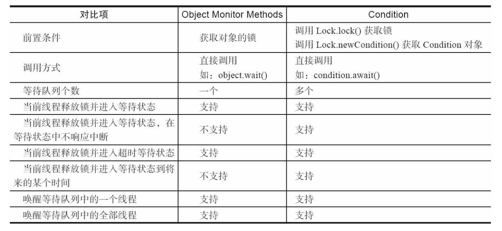
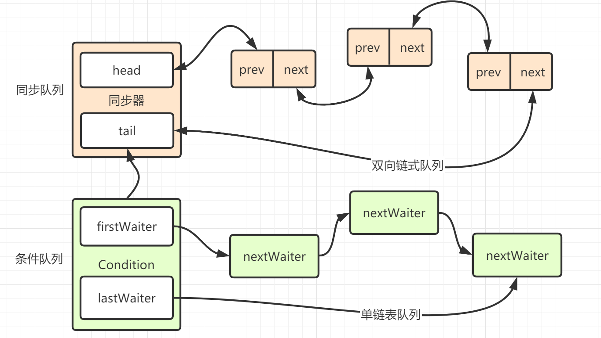
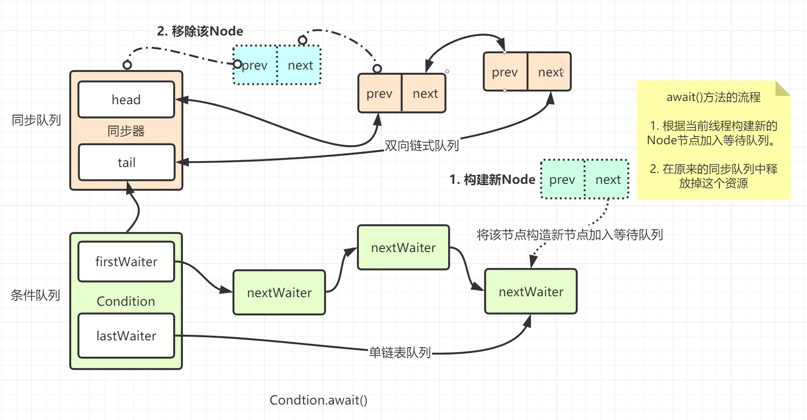
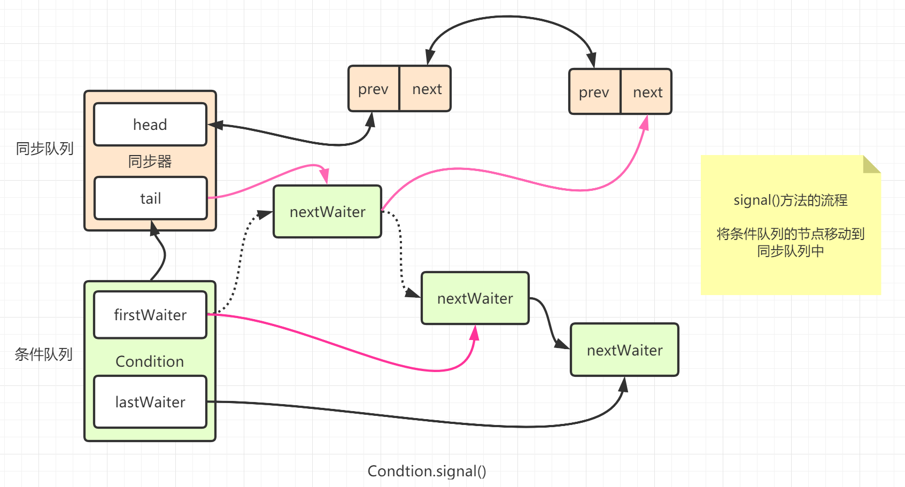

[toc]

系列传送门：

- [Java并发包源码学习系列：AbstractQueuedSynchronizer](https://blog.csdn.net/Sky_QiaoBa_Sum/article/details/112254373)
- [Java并发包源码学习系列：CLH同步队列及同步资源获取与释放](https://blog.csdn.net/Sky_QiaoBa_Sum/article/details/112301359)
- [Java并发包源码学习系列：AQS共享式与独占式获取与释放资源的区别](https://blog.csdn.net/Sky_QiaoBa_Sum/article/details/112386838)
- [Java并发包源码学习系列：ReentrantLock可重入独占锁详解](https://blog.csdn.net/Sky_QiaoBa_Sum/article/details/112454874)
- [Java并发包源码学习系列：ReentrantReadWriteLock读写锁解析](https://blog.csdn.net/Sky_QiaoBa_Sum/article/details/112689635)

## Condition接口

Contition是一种广义上的条件队列，它利用await()和signal()为线程提供了一种**更为灵活的等待/通知模式**。

> 图源：《Java并发编程的艺术》



Condition必须要配合Lock一起使用，因为对共享状态变量的访问发生在多线程环境下。

**一个Condition的实例必须与一个Lock绑定，因此await和signal的调用必须在lock和unlock之间**，**有锁之后，才能使用condition**嘛。以ReentrantLock为例，简单使用如下：

```java
public class ConditionTest {

    public static void main(String[] args) {
        final ReentrantLock lock = new ReentrantLock();
        final Condition condition = lock.newCondition();

        Thread thread1 = new Thread(() -> {
            String name = Thread.currentThread().getName();

            lock.lock();
            System.out.println(name + " <==成功获取到锁" + lock);
            try {
                System.out.println(name + " <==进入条件队列等待");
                condition.await();
            } catch (InterruptedException e) {
                e.printStackTrace();
            }
            System.out.println(name + " <==醒了");
            lock.unlock();
            System.out.println(name + " <==释放锁");
        }, "等待线程");

        thread1.start();

        Thread thread2 = new Thread(() -> {
            String name = Thread.currentThread().getName();

            lock.lock();
            System.out.println(name + " ==>成功获取到锁" + lock);
            try {
                System.out.println("========== 这里演示await中的线程没有被signal的时候会一直等着 ===========");
                Thread.sleep(10000);
            } catch (InterruptedException e) {
                e.printStackTrace();
            }
            System.out.println(name + " ==>通知等待队列的线程");
            condition.signal();
            lock.unlock();
            System.out.println(name + " ==>释放锁");
        }, "通知线程");

        thread2.start();
    }
}
等待线程 <==成功获取到锁java.util.concurrent.locks.ReentrantLock@3642cea8[Locked by thread 等待线程]
等待线程 <==进入条件队列等待
通知线程 ==>成功获取到锁java.util.concurrent.locks.ReentrantLock@3642cea8[Locked by thread 通知线程]
========== 这里演示await中的线程没有被signal的时候会一直等着 ===========
通知线程 ==>通知等待队列的线程
通知线程 ==>释放锁
等待线程 <==醒了
等待线程  <==释放锁
```

接下来我们将从源码的角度分析上面这个流程，理解所谓条件队列的内涵。

## AQS条件变量的支持之ConditionObject内部类

`AQS，Lock,Condition，ConditionObject`之间的关系：

**ConditionObject是AQS的内部类，实现了Condition接口**，Lock中提供newCondition()方法，委托给内部AQS的实现Sync来创建ConditionObject对象，享受AQS对Condition的支持。

```java
    // ReentrantLock#newCondition
	public Condition newCondition() {
        return sync.newCondition();
    }
	// Sync#newCondition
    final ConditionObject newCondition() {
        // 返回Contition的实现，定义在AQS中
        return new ConditionObject();
    }
```

ConditionObject用来结合锁实现线程同步，**ConditionObject可以直接访问AQS对象内部的变量，比如state状态值和AQS队列**。



ConditionObject是条件变量，每个条件变量对应一个**条件队列**（单向链表队列），其用来存放调用条件变量的await方法后被阻塞的线程，ConditionObject维护了首尾节点，没错这里的Node就是我们之前在学习AQS的时候见到的那个Node，我们会在下面回顾：

```java
public class ConditionObject implements Condition, java.io.Serializable {
    private static final long serialVersionUID = 1173984872572414699L;
    /** 条件队列的第一个节点. */
    private transient Node firstWaiter;
    /** 条件队列的最后一个节点. */
    private transient Node lastWaiter;
}
```

看到这里我们需要明确**这里的条件队列和我们之前说的AQS同步队列是不一样**的：

- AQS维护的是当前在等待资源的队列，Condition维护的是在等待signal信号的队列。
- 每个线程会存在上述两个队列中的一个，lock与unlock对应在AQS队列，signal与await对应条件队列，线程节点在他们之间反复横跳。

> 这里着重说明一下，接下来的源码学习部分，我们会将两个队列进行区分，涉及到同步队列和阻塞队列的描述，意味着是AQS的同步队列，而条件队列指的是Condition队列，望读者知晓。

这里我们针对上面的demo来分析一下会更好理解一些：

> 为了简化，接下来我将**用D表示等待线程，用T表示通知线程**。

1. 【D】先调用`lock.lock()`方法，此时无竞争，【D】被加入到AQS同步队列中。
2. 【D】调用`condition.await()`方法，此时【D】被构建为等待节点并加入到condition对应的条件等待队列中，并从AQS同步队列中移除。
3. 【D】陷入等待之后，【T】启动，由于AQS队列中的【D】已经被移除，此时【T】也很快获取到锁，相应的，【T】也被加入到AQS同步队列中。
4. 【T】接着调用`condition.signal()`方法，这时condition对应的条件队列中只有一个节点【D】，于是【D】被取出，并被再次加入AQS的等待队列中。此时【D】并没有被唤醒，只是单纯换了个位置。
5. 接着【T】执行`lock.unlock()`，释放锁锁之后，会唤醒AQS队列中的【D】，此时【D】真正被唤醒且执行。

OK，`lock -> await -> signal -> unlock`这一套流程相信已经大概能够理解，接下来我们试着看看源码吧。

## 回顾AQS中的Node

我们这里再简单回顾一下AQS中Node类与Condition相关的字段：

```java
        // 记录当前线程的等待状态，
        volatile int waitStatus;

        // 前驱节点
        volatile Node prev;

        // 后继节点
        volatile Node next;

        // node存储的线程
        volatile Thread thread;
		
        // 当前节点在Condition中等待队列上的下一个节点
        Node nextWaiter;
```

waitStatus可以取五种状态：

1. 初始化为0，啥也不表示，之后会被置signal。
2. 1表示cancelled，取消当前线程对锁的争夺。
3. -1表示signal，表示当前节点释放锁后需要唤醒后面可被唤醒的节点。
4. -2表示condition，我们这篇的重点，**表示当前节点在条件队列中**。
5. -3表示propagate，表示释放共享资源的时候会向后传播释放其他共享节点。

当然，除了-2这个condition状态，其他的等待状态我们之前都或多或少分析过，今天着重学习condition这个状态的意义。

我们还可以看到一个Node类型的nextWaiter，它表示**条件队列中当前节点的下一个节点**，可以看出用以实现条件队列的单向链表。

## void await()

调用Condition的await()方法，会使当前线程进入等待队列并释放锁，同时线程状态变为等待状态。

其实就是从AQS同步队列的首节点，注意不是head，而是获取了锁的节点，移动到Condition的等待队列中。

> 不好意思，这边作图的时候出现了疏漏，lastWaiter应该指向最后一个nextWaiter，注意箭头的方向。



了解这些之后，我们直接来看看具体方法的源码：

```java
        public final void await() throws InterruptedException {
            // 这个方法是响应中断的
            if (Thread.interrupted())
                throw new InterruptedException();
            // 添加到条件队列中
            Node node = addConditionWaiter();
            // 释放同步资源，也就是释放锁
            int savedState = fullyRelease(node);
            int interruptMode = 0;
            // 如果这个节点的线程不在同步队列中，说明该线程还不具备竞争锁的资格
            while (!isOnSyncQueue(node)) {
                // 挂起线程
                LockSupport.park(this);
                // 如果线程中断，退出
                if ((interruptMode = checkInterruptWhileWaiting(node)) != 0)
                    break;
            }
            // 上面的循环退出有两种情况：
            // 1. isOnSyncQueue(node) 为true，即当前的node已经转移到阻塞队列了
            // 2. checkInterruptWhileWaiting != 0, 表示线程中断
            
            // 退出循环，被唤醒之后，进入阻塞队列，等待获取锁 acquireQueued
            if (acquireQueued(node, savedState) && interruptMode != THROW_IE)
                interruptMode = REINTERRUPT;
            if (node.nextWaiter != null) // clean up if cancelled
                unlinkCancelledWaiters();
            if (interruptMode != 0)
                reportInterruptAfterWait(interruptMode);
        }
```

### 添加到条件队列

#### Node addConditionWaiter()

addConditionWaiter() 是将当前节点加入到条件队列中：

```java
        private Node addConditionWaiter() {
            Node t = lastWaiter;
            // 如果lastWaiter被取消了，将其清除
            if (t != null && t.waitStatus != Node.CONDITION) {
                // 遍历整个条件队列，将已取消的所有节点清除出列
                unlinkCancelledWaiters();
           		// t重新赋值一下，因为last可能改变了
                t = lastWaiter;
            }
            //注意这里，node在初始化的时候，会指定ws为CONDITION
            Node node = new Node(Thread.currentThread(), Node.CONDITION);
            // t == null 表示队列此时为空，初始化firstWaiter
            if (t == null)
                firstWaiter = node;
            else
                t.nextWaiter = node;// 入队尾
            lastWaiter = node;// 将尾指针指向新建的node
            return node;
        }
```

#### void unlinkCancelledWaiters()

unlinkCancelledWaiters用于清除队列中已经取消等待的节点。

```java
        
		private void unlinkCancelledWaiters() {
            Node t = firstWaiter;
            // trail这里表示取消节点的前驱节点
            Node trail = null;
            // t会从头到尾遍历这个单链表
            while (t != null) {
                // next用于保存下一个
                Node next = t.nextWaiter;
                // 如果发现当前这个节点 不是 condition了， 那么考虑移除它
                // 下面是单链表的移除节点操作 简单来说就是 trail.next = t.next
                if (t.waitStatus != Node.CONDITION) {
                    t.nextWaiter = null;
                    // 说明first就是不是condition了
                    if (trail == null)
                        firstWaiter = next;
                    else
                        //trail.next = t.next
                        trail.nextWaiter = next;
                    // trail后面没东西，自然trail就是lastWaiter了
                    if (next == null)
                        lastWaiter = trail;
                }
                // 当前节点是一直跟到不是condition节点的上一个
                else
                    trail = t;
                // 向后遍历 t = t.next
                t = next;
            }
        }
```

总结一下addConditionWaiter的过程：

1. 首先判断条件队列的尾节点是否被取消了，这里用last.ws != CONDITION来判断，如果是的话，就需要从头到尾遍历，消除被不是condition的节点。
2. 接着将当前线程包装为Node，指定ws为CONDITION。

### 完全释放独占锁

将节点加入等待队列中后，就需要完全释放线程拥有的独占锁了，**完全释放**针对重入锁的情况。我们可以拉到await()方法中看看，将会调用：`int savedState = fullyRelease(node);`，这句话有什么内涵呢？

> 我们看到这个方法返回了一个savedState变量，简单的理解就是保存状态。我们知道重入锁的state由重入的次数，如果一个state为N，我们可以认为它持有N把锁。
>
> await()方法必须将state置0，也就是完全释放锁，后面的线程才能获取到这把锁，置0之后，我们需要用个变量标记一下，也就是这里的savedState。
>
> 这样它被重新唤醒的时候，我们就知道，他需要获取savedState把锁。

#### int fullyRelease(Node node)

```java
    final int fullyRelease(Node node) {
        boolean failed = true;
        try {
            // 获取当前的state值，重入次数
            int savedState = getState();
            // 释放N = savedState资源
            if (release(savedState)) {
                failed = false;
                return savedState;
            } else {
                throw new IllegalMonitorStateException();
            }
        } finally {
            // 如果获取失败，将会将节点设置为取消状态，并抛出异常
            if (failed)
                node.waitStatus = Node.CANCELLED;
        }
    }
```

这里其实我们就会明白开头说的：如果某个线程没有获取lock，就直接调用condition的await()方法，结果是什么呢，在release的时候抛出异常，然后节点被取消，之后节点进来的时候，将它清理掉。

### 等待进入阻塞队列

ok，完全释放锁之后，将会来到这几步，如果这个节点的线程不在同步队列中，说明该线程还不具备竞争锁的资格，将被一直挂起，这里的同步队列指的是AQS的阻塞队列。

```java
            int interruptMode = 0;
            // 如果这个节点的线程不在同步队列中，说明该线程还不具备竞争锁的资格，会一直挂起
            while (!isOnSyncQueue(node)) {
                // 挂起线程
                LockSupport.park(this);
                // 如果线程中断，退出
                if ((interruptMode = checkInterruptWhileWaiting(node)) != 0)
                    break;
            }
```

#### boolean isOnSyncQueue(Node node)

下面这个方法会**判断节点是不是已经到阻塞队列中了，如果是的话，就直接返回true**，这个方法的必要性是什么呢？

其实啊，这里需要提前说一下signal()方法，signal的作用和await()方法，将在等待队列中阻塞的节点移动到AQS同步队列中，这个方法就是说判断一下这个节点是不是移过去了。

```java
    final boolean isOnSyncQueue(Node node) {
        // 1. 节点的等待状态还是condition表示还在等待队列中
        // 2. node.prev == null 表示还没移到阻塞队列中[prev和next都是阻塞队列中用的]

        if (node.waitStatus == Node.CONDITION || node.prev == null)
            return false;
     
        // 如果node已经有了后继节点，表示已经在阻塞队列中了
        if (node.next != null) // If has successor, it must be on queue
            return true;
        /*
         * node.prev can be non-null, but not yet on queue because
         * the CAS to place it on queue can fail. So we have to
         * traverse from tail to make sure it actually made it.  It
         * will always be near the tail in calls to this method, and
         * unless the CAS failed (which is unlikely), it will be
         * there, so we hardly ever traverse much.
         */
        // 来到这里的情况：ws != condition && node.prev != null && node.next == null
        
		// 想想：为什么node.prev != null不能作为判断不在阻塞队列的依据呢？
        // CAS首先设置node.prev 指向tail，这个时候node.prev 是不为null的，但CAS可能会失败
        return findNodeFromTail(node);
    }
```

**为什么node.prev != null不能作为判断不在阻塞队列的依据呢？**

官方给出了解答: 因为CAS的入队操作中，首先设置node.prev 指向tail，这个时候node.prev 是不为null的。你能够说他入队成功一定成功吗？不一定，因为CAS可能会失败，所以要findNodeFromTail(node)。

#### boolean findNodeFromTail(Node node)

从阻塞队列的尾部向前遍历，如果找到这个node，表示它已经在了，那就返回true。

```java
    private boolean findNodeFromTail(Node node) {
        Node t = tail;
        for (;;) {
            // 已经有了
            if (t == node)
                return true;
            // 尾都没有，找啥呢，返回false
            if (t == null)
                return false;
            // 一直往前找
            t = t.prev;
        }
    }
```

## void signal()

由于之前节点被加入等待队列将会一直阻塞，为了连贯性，我们来看看唤醒它的signal方法吧：

之前说到，如果这个线程会在等待队列中等待，那么唤醒它的signal方法的流程是怎么样的呢，前面其实已经说了一丢丢了，我们猜测，signal会将isOnSyncQueue方法的循环打破，接下来看看是不是这样子的。

```java
        public final void signal() {
            // 一样的，必须占有当前这个锁才能用signal方法
            if (!isHeldExclusively())
                throw new IllegalMonitorStateException();
            Node first = firstWaiter;
            if (first != null)
                doSignal(first);
        }
```

> 不好意思，这边作图的时候出现了疏漏，lastWaiter应该指向最后一个nextWaiter，注意箭头的方向。



### 唤醒节点

该方法会从头到尾遍历条件队列，找到需要移到同步队列的节点。

#### void doSignal(Node first)

```java
        private void doSignal(Node first) {
            do {
                // firstWaiter 指向first的下一个
                if ( (firstWaiter = first.nextWaiter) == null)
                    // 如果first是最后一个且要被移除了，就将last置null
                    lastWaiter = null;
                // first断绝与条件队列的连接
                first.nextWaiter = null;
                // fisrt转移失败，就看看后面是不是需要的
            } while (!transferForSignal(first) &&
                     (first = firstWaiter) != null);
        }
```

这里的while循环表示，如果first没有转移成功，就接着判断first后面的节点是不是需要转移。

#### boolean transferForSignal(Node node)

该方法将节点从条件队列转移到阻塞队列。

```java
    final boolean transferForSignal(Node node) {
        /*
         * CAS操作尝试将Condition的节点的ws改为0
         * 如果失败，意味着：节点的ws已经不是CONDITION，说明节点已经被取消了
         * 如果成功，则该节点的状态ws被改为0了
         */
        if (!compareAndSetWaitStatus(node, Node.CONDITION, 0))
            return false;

        /*
         * 通过enq方法将node自旋的方式加入同步队列队尾
         * 这里放回的p是node在同步队列的前驱节点
         */
        Node p = enq(node);
        int ws = p.waitStatus;
        // ws大于0 的情况只有 cancenlled，表示node的前驱节点取消了争取锁，那直接唤醒node线程
        // ws <= 0 会使用cas操作将前驱节点的ws置为signal，如果cas失败也会唤醒node
        if (ws > 0 || !compareAndSetWaitStatus(p, ws, Node.SIGNAL))
            LockSupport.unpark(node.thread);
        return true;
    }
	// 自旋的方式入队
    private Node enq(final Node node) {
        for (;;) {
            Node t = tail;
            if (t == null) { // Must initialize
                if (compareAndSetHead(new Node()))
                    tail = head;
            } else {
                node.prev = t;
                if (compareAndSetTail(t, node)) {
                    t.next = node;
                    // 返回的是node的前驱节点
                    return t;
                }
            }
        }
    }
```

### 检查中断状态

ok，一旦signal之后，节点被成功转移到同步队列后，这时下面这个循环就会退出了，继续回到这里：

````java
            int interruptMode = 0;
            // 如果这个节点的线程不在同步队列中，说明该线程还不具备竞争锁的资格，会一直挂起
            while (!isOnSyncQueue(node)) {
                // 挂起线程
                LockSupport.park(this);
                // 如果线程中断，退出
                if ((interruptMode = checkInterruptWhileWaiting(node)) != 0)
                    break;
            }
````

interruptMode可以有以下几种取值：

```java
        /** await 返回的时候，需要重新设置中断状态 */
        private static final int REINTERRUPT =  1;
        /** await 返回的时候，需要抛出 InterruptedException 异常 */
        private static final int THROW_IE    = -1;
		
		/** interruptMode取0的时候表示在await()期间，没有发生中断 */
```

说到这里我们需要明白，`LockSupport.park(this)`挂起的线程是什么时候唤醒的：

1. signal方法将节点转移到同步队列中，且获取到了锁或者对前驱节点的cas操作失败，调用了`LockSupport.unpark(node.thread);`方法。
2. 在park的时候，另外一个线程对挂起的线程进行了中断。

唤醒之后，我们可以看到调用checkInterruptWhileWaiting方法检查等待期间是否发生了中断，如果不为0表示确实在等待期间发生了中断。

但其实这个方法的返回结果用interruptMode变量接收，拥有更加丰富的内涵，它还能够判断中断的时机是否在signal之前。

#### int checkInterruptWhileWaiting(Node node)

该方法用于判断该线程是否在挂起期间发生了中断。

```java
        private int checkInterruptWhileWaiting(Node node) {
            return Thread.interrupted() ?// 如果处于中断状态，返回true，且将重置中断状态
                (transferAfterCancelledWait(node) ? THROW_IE : REINTERRUPT) :// 如果中断了，判断何时中断
                0; // 没有中断， 返回0
        }
```

#### boolean transferAfterCancelledWait(Node node)

该方法判断何时中断，是否在signal之前。

```java
    final boolean transferAfterCancelledWait(Node node) {
        // 尝试使用CAS操作将node 的ws设置为0
        // 如果成功，说明在signal方法之前中断就已经发生：
        // 原因在于：signal如果在此之前发生，必然已经cas操作将ws设置为0了，这里不可能设置成功
        if (compareAndSetWaitStatus(node, Node.CONDITION, 0)) {
            // 就算中断了，也将节点入队
            enq(node);
            return true;
        }
        /*
         * If we lost out to a signal(), then we can't proceed
         * until it finishes its enq().  Cancelling during an
         * incomplete transfer is both rare and transient, so just
         * spin.
         * 这里就是signal之后发生的中断
         * 但是signal可能还在进行转移中，这边自旋等一下它完成
         */
        while (!isOnSyncQueue(node))
            Thread.yield();
        return false;
    }
```

这里的话，我们还是稍微总结一下：

1. await()中的节点中断之后，被唤醒有多种情况：
   - 无中断的情况：signal方法成功将节点移入同步队列且节点成功获取资源，唤醒该线程，此时退出的时候interruptMode为0。
   - 有中断的情况：
     - signal之前中断，interruptMode设置为THROW_IE。
     - signal之后中断，interruptMode设置为REINTERRUPT。
2. 中断时，无论signal之前或之后，节点无论如何都会进入阻塞队列。

### 处理中断状态

接下来三个部分我将一一说明：

```java
            // 第一部分
			if (acquireQueued(node, savedState) && interruptMode != THROW_IE)
                interruptMode = REINTERRUPT;
			// 第二部分
            if (node.nextWaiter != null) // clean up if cancelled
                unlinkCancelledWaiters(); // 清除取消的节点
			// 第三部分
            if (interruptMode != 0)
                reportInterruptAfterWait(interruptMode);
```

**第一部分**

signal唤醒的线程并不会立即获取到资源，从while循环退出后，会通过acquireQueued方法加入获取同步状态的竞争中。

```java
            // 第一部分
			if (acquireQueued(node, savedState) && interruptMode != THROW_IE)
                interruptMode = REINTERRUPT;
```

`acquireQueued(node, savedState)`中node此时已经被加入同步队列了，savedState是之前存储的state。

```java
    final boolean acquireQueued(final Node node, int arg) {
        boolean failed = true;
        try {
            boolean interrupted = false;
            for (;;) {
                final Node p = node.predecessor();
                if (p == head && tryAcquire(arg)) {
                    setHead(node);
                    p.next = null; // help GC
                    failed = false;
                    return interrupted; // 
                }
                if (shouldParkAfterFailedAcquire(p, node) &&
                    parkAndCheckInterrupt())
                    interrupted = true;
            }
        } finally {
            if (failed)
                cancelAcquire(node);
        }
    }
```

acquireQueued方法返回时，表示已经获取到了锁，且返回的是interrupted值，如果返回true，表示已经被中断。

接着判断`interruptMode != THROW_IE`表示是在signal之后发生的中断，需要重新中断当前线程，将interruptMode设置为REINTERRUPT。

**第二部分**

```java
			// 第二部分
            if (node.nextWaiter != null) // clean up if cancelled
                unlinkCancelledWaiters(); // 清除取消的节点
```

前面说了，signal会将节点移到同步队列中，最后一步需要和条件队列断开关系，也就是：`node.nextWaiter = null`，但这是想象中比较正常的情况，如果在signal之前被中断，节点也会被加入同步队列中，这时其实是没有调用这个断开关系的。

因此这边做一点处理，` unlinkCancelledWaiters()`逻辑上面也说过了，可以回过头去看看，主要是清除队列中已经取消等待的节点。

**第三部分**

最后一个部分，就是对两种interruptMode的情况进行处理，看看代码就知道了：

#### void reportInterruptAfterWait(interruptMode)

```java
        private void reportInterruptAfterWait(int interruptMode)
            throws InterruptedException {
            // signal 之前的中断， 需要抛出异常
            if (interruptMode == THROW_IE)
                throw new InterruptedException();
            // signal 之后发生的中断， 需要重新中断
            else if (interruptMode == REINTERRUPT)
                selfInterrupt();
        }
```

## 带超机制的void await()

带超时机制的await()方法有以下几个，简单看下即可：

- long awaitNanos(long nanosTimeout)
- boolean awaitUntil(Date deadline)
- boolean await(long time, TimeUnit unit)

我们选最后一个来看看，主要看看和之前await()方法不一样的地方：

```java
        public final boolean await(long time, TimeUnit unit)
                throws InterruptedException {
            // 计算等待的时间
            long nanosTimeout = unit.toNanos(time);
            if (Thread.interrupted())
                throw new InterruptedException();
            Node node = addConditionWaiter();
            int savedState = fullyRelease(node);
            // 截止时间
            final long deadline = System.nanoTime() + nanosTimeout;
            // 表示是否超时
            boolean timedout = false;
            int interruptMode = 0;
            while (!isOnSyncQueue(node)) {
                // 等待时间到了
                if (nanosTimeout <= 0L) {
                    // 这个方法返回true表示在这个方法内，已经将节点转移到阻塞队列中
                    // 返回false，表示signal已经发生，表示没有超时
                    timedout = transferAfterCancelledWait(node);
                    break;
                }
                //spinForTimeoutThreshold 是AQS中的一个字段，如果超过1ms，使用parkNonos
                if (nanosTimeout >= spinForTimeoutThreshold)
                    LockSupport.parkNanos(this, nanosTimeout);
                if ((interruptMode = checkInterruptWhileWaiting(node)) != 0)
                    break;
                // 更新一下还需要等待多久
                nanosTimeout = deadline - System.nanoTime();
            }
            if (acquireQueued(node, savedState) && interruptMode != THROW_IE)
                interruptMode = REINTERRUPT;
            if (node.nextWaiter != null)
                unlinkCancelledWaiters();
            if (interruptMode != 0)
                reportInterruptAfterWait(interruptMode);
            return !timedout;
        }
```

## 不抛出InterruptedException的await

```java
        public final void awaitUninterruptibly() {
            Node node = addConditionWaiter();
            int savedState = fullyRelease(node);
            boolean interrupted = false;
            while (!isOnSyncQueue(node)) {
                LockSupport.park(this);
                if (Thread.interrupted())
                    interrupted = true;
            }
            // 相比await() 针对中断少了抛出异常的操作，而是直接进行中断
            if (acquireQueued(node, savedState) || interrupted)
                selfInterrupt();
        }
```

## Condition的使用

最后以一个Java doc给的例子结尾吧：

```java
import java.util.concurrent.locks.Condition;
import java.util.concurrent.locks.Lock;
import java.util.concurrent.locks.ReentrantLock;

class BoundedBuffer {
    final Lock lock = new ReentrantLock();
    // condition 依赖于 lock 来产生
    final Condition notFull = lock.newCondition();
    final Condition notEmpty = lock.newCondition();

    final Object[] items = new Object[100];
    int putptr, takeptr, count;

    // 生产
    public void put(Object x) throws InterruptedException {
        lock.lock();
        try {
            while (count == items.length)
                notFull.await();  // 队列已满，等待，直到 not full 才能继续生产
            items[putptr] = x;
            if (++putptr == items.length) putptr = 0;
            ++count;
            notEmpty.signal(); // 生产成功，队列已经 not empty 了，发个通知出去
        } finally {
            lock.unlock();
        }
    }

    // 消费
    public Object take() throws InterruptedException {
        lock.lock();
        try {
            while (count == 0)
                notEmpty.await(); // 队列为空，等待，直到队列 not empty，才能继续消费
            Object x = items[takeptr];
            if (++takeptr == items.length) takeptr = 0;
            --count;
            notFull.signal(); // 被我消费掉一个，队列 not full 了，发个通知出去
            return x;
        } finally {
            lock.unlock();
        }
    }
}
```

其实这个之前也说过，ArrayBlockingQueue就是采用了这种方式实现的生产者-消费者模式，如果你感兴趣，可以看看具体的实现细节哦。

## 总结

- Condition的await()和signal()基于Lock，相比于基于Object的wait()和notify()方法，它提供更加灵活的等待通知的机制。
- 支持丰富的功能如：带超时机制的await()，不响应中断的await()，以及多个等待的条件队列。
- Condition的await()方法会**将线程包装为等待节点，加入等待队列中，并将AQS同步队列中的节点移除**，接着不断检查`isOnSyncQueue(Node node)`，如果在等待队列中，就一直等着，如果signal将它移到AQS队列中，则退出循环。
- Condition的signal()方法则是先检查当前线程是否获取了锁，接着将等待队列中的节点通过Node的操作**直接**加入AQS队列。线程并不会立即获取到资源，从while循环退出后，会通过acquireQueued方法加入获取同步状态的竞争中。

## 参考阅读

- [java Condition源码分析](https://blog.csdn.net/coslay/article/details/45217069)
- [一行一行源码分析清楚 AbstractQueuedSynchronizer (二)](https://javadoop.com/post/AbstractQueuedSynchronizer-2#toc_12)
- [【死磕 Java 并发】—– J.U.C 之 Condition](http://www.iocoder.cn/JUC/sike/Condition/)
- 方腾飞：《Java并发编程的艺术》
- DougLea : 《Java并发编程实战》

