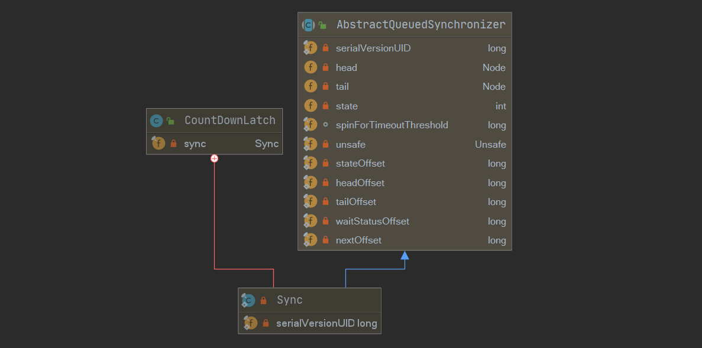

[toc]

## CountDownLatch概述

日常开发中，经常会遇到类似场景：主线程开启多个子线程执行任务，需要等待所有子线程执行完毕后再进行汇总。

在同步组件CountDownLatch出现之前，我们可以使用join方法来完成，简单实现如下：

```java
public class JoinTest {
    public static void main(String[] args) throws InterruptedException {
        Thread A = new Thread(() -> {
            try {
                Thread.sleep(1000);
                System.out.println("A finish!");
            } catch (InterruptedException e) {
                e.printStackTrace();
            }
        });
        Thread B = new Thread(() -> {
            try {
                Thread.sleep(1000);
                System.out.println("B finish!");

            } catch (InterruptedException e) {
                e.printStackTrace();
            }
        });
        System.out.println("main thread wait ..");
        A.start();
        B.start();
        A.join(); // 等待A执行结束
        B.join(); // 等待B执行结束
        System.out.println("all thread finish !");
    }
}
```

但使用join方法并不是很灵活，并不能很好地满足某些场景的需要，而CountDownLatch则能够很好地代替它，并且相比之下，提供了更多灵活的特性：

CountDownLatch相比join方法对线程同步有更灵活的控制，原因如下：

1. 调用子线程的join()方法后，**该线程会一直被阻塞直到子线程运行完毕**，而CountDownLatch使用计数器来允许子线程运行完毕或者运行中递减计数，await方法返回不一定必须等待线程结束。
2. 使用线程池管理线程时，添加Runnable到线程池，没有办法再调用线程的join方法了。

## 使用案例与基本思路

```java
public class TestCountDownLatch {
    
    public static volatile CountDownLatch countDownLatch = new CountDownLatch(2);
    
    public static void main (String[] args) throws InterruptedException {
        ExecutorService executorService = Executors.newFixedThreadPool(2);
        executorService.submit(() -> {
            try {
                Thread.sleep(1000);
                System.out.println("A finish!");

            } catch (InterruptedException e) {
                e.printStackTrace();
            } finally {
                countDownLatch.countDown();
            }
        });
        executorService.submit(() -> {
            try {
                Thread.sleep(1000);
                System.out.println("B finish!");

            } catch (InterruptedException e) {
                e.printStackTrace();
            } finally {
                countDownLatch.countDown();
            }
        });
        System.out.println("main thread wait ..");
        countDownLatch.await();
        System.out.println("all thread finish !");
        executorService.shutdown();
    }
}
// 结果
main thread wait ..
B finish!
A finish!
all thread finish !
```

- 构建CountDownLatch实例，构造参数传参为2，内部计数初始值为2。
- 主线程构建线程池，提交两个任务，接着调用`countDownLatch.await()`陷入阻塞。
- 子线程执行完毕之后调用`countDownLatch.countDown()`，内部计数器减1。
- 所有子线程执行完毕之后，计数为0，此时主线程的await方法返回。

## 类图与基本结构



```java
public class CountDownLatch {
    /**
     * Synchronization control For CountDownLatch.
     * Uses AQS state to represent count.
     */
    private static final class Sync extends AbstractQueuedSynchronizer {
        private static final long serialVersionUID = 4982264981922014374L;

        Sync(int count) {
            setState(count);
        }
        //...
    }

    private final Sync sync;

    public CountDownLatch(int count) {
        if (count < 0) throw new IllegalArgumentException("count < 0");
        this.sync = new Sync(count);
    }

    public void await() throws InterruptedException {
        sync.acquireSharedInterruptibly(1);
    }

    public boolean await(long timeout, TimeUnit unit)
        throws InterruptedException {
        return sync.tryAcquireSharedNanos(1, unit.toNanos(timeout));
    }

    public void countDown() {
        sync.releaseShared(1);
    }

    public long getCount() {
        return sync.getCount();
    }

    public String toString() {
        return super.toString() + "[Count = " + sync.getCount() + "]";
    }
}
```

CountDownLatch基于AQS实现，内部维护一个Sync变量，继承了AQS。

在AQS中，最重要的就是state状态的表示，**在CountDownLatch中使用state表示计数器的值**，在初始化的时候，为state赋值。

几个同步方法实现比较简单，如果你不熟悉AQS，推荐你瞅一眼前置文章：

- [Java并发包源码学习系列：AbstractQueuedSynchronizer](https://blog.csdn.net/Sky_QiaoBa_Sum/article/details/112254373)
- [Java并发包源码学习系列：CLH同步队列及同步资源获取与释放](https://blog.csdn.net/Sky_QiaoBa_Sum/article/details/112301359)
- [Java并发包源码学习系列：AQS共享式与独占式获取与释放资源的区别](https://blog.csdn.net/Sky_QiaoBa_Sum/article/details/112386838)
- [Java并发包源码学习系列：详解Condition条件队列、signal和await](https://blog.csdn.net/Sky_QiaoBa_Sum/article/details/112727669)
- [Java并发包源码学习系列：挂起与唤醒线程LockSupport工具类](https://blog.csdn.net/Sky_QiaoBa_Sum/article/details/112757098)

接下来我们简单看一看实现，主要学习两个方法：await()和countdown()。

## void await()

当线程调用CountDownLatch的await方法后，线程会被阻塞，除非发生下面两种情况：

1. 内部计数器值为0，`getState() == 0`。
2. 被其他线程中断，抛出异常，也就是`currThread.interrupt()`。

```java
    // CountDownLatch.java
	public void await() throws InterruptedException {
        sync.acquireSharedInterruptibly(1);
    }
	// AQS.java
    public final void acquireSharedInterruptibly(int arg)
            throws InterruptedException {
        // 如果线程中断， 则抛出异常
        if (Thread.interrupted())
            throw new InterruptedException();
        // 由子类实现，这里再Sync中实现，计数器为0就可以返回，否则进入AQS队列等待
        if (tryAcquireShared(arg) < 0)
            doAcquireSharedInterruptibly(arg);
    }
	// Sync
	// 计数器为0 返回1， 否则返回-1
    private static final class Sync extends AbstractQueuedSynchronizer {
        protected int tryAcquireShared(int acquires) {
            return (getState() == 0) ? 1 : -1;
        }
    }
```

## boolean await(long timeout, TimeUnit unit)

当线程调用CountDownLatch的await方法后，线程会被阻塞，除非发生下面三种情况：

1. 内部计数器值为0，`getState() == 0`，返回true。
2. 被其他线程中断，抛出异常，也就是`currThread.interrupt()`。
3. 设置的timeout时间到了，超时返回false。

```java
    // CountDownLatch.java
	public boolean await(long timeout, TimeUnit unit)
        throws InterruptedException {
        return sync.tryAcquireSharedNanos(1, unit.toNanos(timeout));
    }
	// AQS.java
    public final boolean tryAcquireSharedNanos(int arg, long nanosTimeout)
            throws InterruptedException {
        if (Thread.interrupted())
            throw new InterruptedException();
        return tryAcquireShared(arg) >= 0 ||
            doAcquireSharedNanos(arg, nanosTimeout);
    }
```

## void countDown()

调用该方法，内部计数值减1，递减后如果计数器值为0，唤醒所有因调用await方法而被阻塞的线程，否则跳过。

```java
    // CountDownLatch.java
	public void countDown() {
        sync.releaseShared(1);
    }
	// AQS.java
    public final boolean releaseShared(int arg) {
        if (tryReleaseShared(arg)) {
            doReleaseShared();
            return true;
        }
        return false;
    }
	// Sync
    private static final class Sync extends AbstractQueuedSynchronizer {
        protected boolean tryReleaseShared(int releases) {
            // 循环进行CAS操作
            for (;;) {
                int c = getState();
                // 一旦为0，就返回false
                if (c == 0)
                    return false;
                int nextc = c-1;
                // CAS尝试将state-1，只有这一步CAS成功且将state变成0的线程才会返回true
                if (compareAndSetState(c, nextc))
                    return nextc == 0;
            }
        }
    }
```

## 总结

- CountDownLatch相比于join方法更加灵活且方便地实现线程间同步，体现在以下几点：
  - 调用子线程的join()方法后，该线程会一直被阻塞直到子线程运行完毕，而CountDownLatch使用计数器来允许子线程运行完毕或者运行中递减计数，await方法返回不一定必须等待线程结束。
  - 使用线程池管理线程时，添加Runnable到线程池，没有办法再调用线程的join方法了。

- CountDownLatch使用state表示内部计数器的值，初始化传入count。
- 线程调用countdown方法将会原子性地递减AQS的state值，线程调用await方法后将会置入AQS阻塞队列中，直到计数器为0，或被打断，或超时等才会返回，计数器为0时，当前线程还需要唤醒由于await()被阻塞的线程。

## 参考阅读

- 《Java并发编程之美》