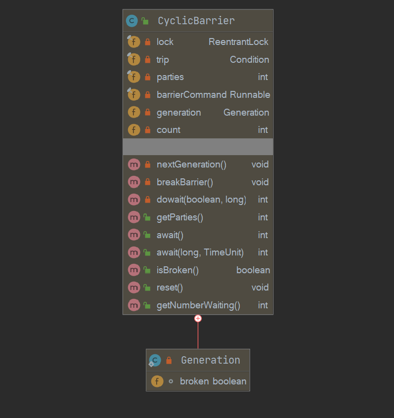

[toc]

## CyclicBarrier概述

CyclicBarrier可以理解为Cyclic + Barrier， 可循环使用 + 屏障嘛。

- 之所以是Cyclic的，是因为当所有等待线程执行完毕，并重置CyclicBarrier的状态后它可以被重用。
- 之所以叫Barrier，是因为线程调用await方法后就会被阻塞，阻塞点就叫做屏障点。

可以让一组线程全部到达一个屏障【同步点】，再全部冲破屏障，继续向下执行。

## 案例学习

```java
public class CycleBarrierTest2 {

    private static final CyclicBarrier cyclicBarrier = new CyclicBarrier(
            2, 				 // 计数器的初始值
            new Runnable() { // 计数器值为0时需要执行的任务
                @Override
                public void run () {
                    System.out.println(Thread.currentThread() + " tripped ~");
                }
            }
    );

    public static void main (String[] args) {

        ExecutorService executorService = Executors.newFixedThreadPool(2);
        executorService.submit(new Runnable() {
            @SneakyThrows
            @Override
            public void run () {
                Thread thread = Thread.currentThread();
                System.out.println(thread + " step 1");
                cyclicBarrier.await();
                System.out.println(thread + " step 2");
                cyclicBarrier.await();
                System.out.println(thread + " step 3");
            }
        });

        executorService.submit(new Runnable() {
            @SneakyThrows
            @Override
            public void run () {
                Thread thread = Thread.currentThread();
                System.out.println(thread + " step 1");
                cyclicBarrier.await();
                System.out.println(thread + " step 2");
                cyclicBarrier.await();
                System.out.println(thread + " step 3");
            }
        });

        executorService.shutdown();
    }

}
```

测试结果如下：

```java
Thread[pool-1-thread-2,5,main] step 1
Thread[pool-1-thread-1,5,main] step 1
Thread[pool-1-thread-1,5,main] tripped ~
Thread[pool-1-thread-1,5,main] step 2
Thread[pool-1-thread-2,5,main] step 2
Thread[pool-1-thread-2,5,main] tripped ~
Thread[pool-1-thread-2,5,main] step 3
Thread[pool-1-thread-1,5,main] step 3
```

- 创建了一个CyclicBarrier，指定parties为2作为初始计数值，指定Runnable任务作为所有线程到达屏障点时需要执行的任务。
- 创建了一个大小为2的线程池，向线程池中提交两个任务，我们根据测试结果来说明这一过程。
- thread2线程率先执行await()，此时计数值减1，并不为0，因此thread2线程到达屏障点，陷入阻塞。
- thread1线程之后执行await()，此时计数值减1后为0，接着执行构造器中指定的任务，打印tripped，执行完后退出屏障点，唤醒thread2。
- 可以看到并不是和CountdownLatch一样是一次性的，而是可重复使用的，退出屏障点后，计数值又被设置为2，之后又重复之前的步骤。

> 多个线程之间是相互等待的，加入当前计数器值为N，之后N-1个线程调用await方法都会达到屏障点而阻塞，只有当第N个线程调用await方法时，计数器值为0，第N个线程才会唤醒之前等待的所有线程，再一起向下执行。
>
> CyclicBarrier是可复用的，所有线程达到屏障点之后，CyclicBarrier会被重置。

## 类图结构及重要字段



```java
public class CyclicBarrier {
    
    private static class Generation {
        boolean broken = false;
    }

    /** 独占锁保证同步 */
    private final ReentrantLock lock = new ReentrantLock();
    /** condition实现等待通知机制 */
    private final Condition trip = lock.newCondition();
    /** 记录线程个数 */
    private final int parties;
    /* 达到屏障点执行的任务 */
    private final Runnable barrierCommand;
    /** The current generation */
    private Generation generation = new Generation();

    /**
     * 记录仍在等待的parties数量， 每一代count都会从初始的parties递减至0
     */
    private int count;
    
    // 指定barrierAction， 在线程达到屏障后，优先执行barrierAction
    public CyclicBarrier(int parties, Runnable barrierAction) {
        if (parties <= 0) throw new IllegalArgumentException();
        this.parties = parties;
        this.count = parties;
        this.barrierCommand = barrierAction;
    }

	// 指定parties， 希望屏障拦截的线程数量
    public CyclicBarrier(int parties) {
        this(parties, null);
    }
}
```

- 基于ReentrantLock独占锁实现同步与等待通知机制，底层基于AQS。
- int类型parties记录线程个数，表示多少线程调用await方法后，所有线程才会冲破屏障继续向下运行。
- int类型count初始化为parties，每当有线程调用await方法就递减1，count为0表示所有线程到达屏障点。

> CyclicBarrier是可复用的，因此使用两个变量记录线程个数，count变为0时，会将parties赋值给count，进行复用。

- barrierCommand是所有线程到达屏障点后执行的任务。
- CyclicBarrier是可复用的，Generation用于标记更新换代，generation内部的broken变量用来记录当前屏障是否被打破。

> 本篇文章阅读需要建立在一定独占锁，Condition条件机制的基础之上，这边推荐几篇前置文章，可以瞅一眼：
>
> - [Java并发包源码学习系列：ReentrantLock可重入独占锁详解](https://blog.csdn.net/Sky_QiaoBa_Sum/article/details/112454874)
> - [Java并发包源码学习系列：详解Condition条件队列、signal和await](https://blog.csdn.net/Sky_QiaoBa_Sum/article/details/112727669)
> - [Java并发包源码学习系列：挂起与唤醒线程LockSupport工具类](https://blog.csdn.net/Sky_QiaoBa_Sum/article/details/112757098)

## 内部类Generation及相关方法

CyclicBarrier是可复用的，Generation用于标记更新换代。

```java
    // 屏障的每一次使用都会生成一个新的Generation实例： 可能是 tripped or reset
	private static class Generation {
        boolean broken = false;
    }
```

### void reset()

更新换代： 首先标记一下当前这代不用了， 然后换一个新的。

```java
    public void reset() {
        final ReentrantLock lock = this.lock;
        lock.lock();
        try {
            breakBarrier();   // break掉当前的
            nextGeneration(); // 开启一个新的
        } finally {
            lock.unlock();
        }
    }
```

### void breakBarrier()

标记一下broken为true，唤醒一下await等待线程，重置count。

```java
    private void breakBarrier() {
        // 标记broken 为true
        generation.broken = true;
        // 重置count
        count = parties;
        // 唤醒因await等待的线程
        trip.signalAll();
    }
```

### void nextGeneration()

唤醒一下await等待线程，重置count，更新为下一代。

```java
    private void nextGeneration() {
        // 唤醒因await等待的线程
        trip.signalAll();
        // 重置count，意味着下一代了
        count = parties;
        // 下一代了
        generation = new Generation();
    }
```

## int await()

当前线程调用await方法时会阻塞，除非遇到以下几种情况：

1. 所有线程都达到了屏障点，也就是parties个线程都调用了await()方法，使count递减至0。
2. 其他线程调用了当前线程的interrupt()方法，中断当前线程，抛出InterruptedException而返回。
3. 与当前屏障关联的Generation中的broken被设置为true，抛出BrokenBarrierException而返回。

它内部调用了`int dowait(boolean timed, long nanos)`，详细解析往下面翻哈。

```java
    public int await() throws InterruptedException, BrokenBarrierException {
        try {
            return dowait(false, 0L);
        } catch (TimeoutException toe) {
            throw new Error(toe); // cannot happen
        }
    }
```

## int await(long timeout, TimeUnit unit)

相比于普通的await()方法，该方法增加了超时的控制，你懂的。

增加了一项：如果超时了，返回false。

```java
    public int await(long timeout, TimeUnit unit)
        throws InterruptedException,
               BrokenBarrierException,
               TimeoutException {
        return dowait(true, unit.toNanos(timeout));
    }
```

## int dowait(boolean timed, long nanos)

- 第一个参数为true，说明需要超时控制。
- 第二个参数设置超时的时间。

```java
    private int dowait(boolean timed, long nanos)
        throws InterruptedException, BrokenBarrierException,
               TimeoutException {
        // 获取独占锁
        final ReentrantLock lock = this.lock;
        lock.lock();
        try {
            // 与当前屏障点关联的Generation
            final Generation g = generation;
			// broken标志为true，则异常
            if (g.broken)
                throw new BrokenBarrierException();
			// 如果被打断，则breakBarrier，并抛出异常
            if (Thread.interrupted()) {
                // 打破： 1 标记broken为true 2 重置count 3 唤醒await等待的线程
                breakBarrier();
                throw new InterruptedException();
            }
            int index = --count;
            // 说明已经到达屏障点了
            if (index == 0) {  // tripped
                boolean ranAction = false;
                try {
                    final Runnable command = barrierCommand;
                    // 执行一下任务
                    if (command != null)
                        command.run();
                    ranAction = true;
                    // 更新： 1 唤醒await等待的线程 2 更新Generation
                    nextGeneration();
                    return 0;
                } finally {
                    // 执行失败了，可能被打断了
                    if (!ranAction)
                        breakBarrier();
                }
            }

            // loop until tripped, broken, interrupted, or timed out
            // 死循环， 结束的情况有：到达屏障点， broken了， 中断， 超时
            for (;;) {
                try {
                    // 超时控制
                    if (!timed)
                        trip.await();
                    else if (nanos > 0L)
                        // awaitNanos阻塞一段时间
                        nanos = trip.awaitNanos(nanos);
                } catch (InterruptedException ie) {
                    if (g == generation && ! g.broken) {
                        // 标记broken为true
                        breakBarrier();
                        throw ie;
                    } else {
                        // We're about to finish waiting even if we had not
                        // been interrupted, so this interrupt is deemed to
                        // "belong" to subsequent execution.
                        Thread.currentThread().interrupt();
                    }
                }
				// 正常被唤醒， 再次检查当前这一代是否已经标记了broken
                if (g.broken)
                    throw new BrokenBarrierException();
				// 最后一个线程在等待线程醒来之前，已经通过nextGeneration将generation更新
                if (g != generation)
                    return index;

                if (timed && nanos <= 0L) {
                    breakBarrier();
                    throw new TimeoutException();
                }
            }
        } finally {
            lock.unlock();
        }
    }
```

> 以parties为N为例，我们来看看这一流程。

- 线程调用dowait方法后，首先会获取独占锁lock。如果是前N-1个线程，由于`index != 0`，会在条件队列中等待`trip.await() or trip.awaitNanos(nanos)`，会相应释放锁。

- 第N个线程调用dowait之后，此时`index == 0`，将会执行命令`command.run()`，然后调用`nextGeneration()`更新换代，同时唤醒所有条件队列中等待的N-1个线程。
- 第N个线程释放锁，后续被唤醒的线程移入AQS队列，陆续获取锁，释放锁。

## CyclicBarrier与CountDownLatch的区别

- CountDownLatch基于AQS，state表示计数器的值，在构造时指定。CyclicBarrier基于ReentrantLock独占锁与Condition条件机制实现屏障逻辑。

- CountDownLatch的计数器只能使用一次，而CyclicBarrier的计数器可以使用reset()方法重置，可复用性能够处理更为复杂【分段任务有序执行】的业务场景。
- CyclicBarrier还提供了其他有用的方法，如`getNumberWaiting`方法可以获得CyclicBarrier阻塞的线程数量。`isBroken()`方法用来了解阻塞的线程是否被中断。

## 总结

- CyclicBarrier = Cyclic + Barrier， 可重用 + 屏障，可以让一组线程全部到达一个屏障【同步点】，再全部冲破屏障，继续向下执行。

- CyclicBarrier基于ReentrantLock独占锁与Condition条件机制实现屏障逻辑。
- CyclicBarrier需要指定parties【N】以及可选的任务，当N - 1个线程调用await的时候，会在条件队列中阻塞，直到第N个线程调用await，执行指定的任务后，唤醒N - 1个等待的线程，并重置Generation，更新count。

## 参考阅读

- 《Java并发编程之美》
- 《Java并发编程的艺术》