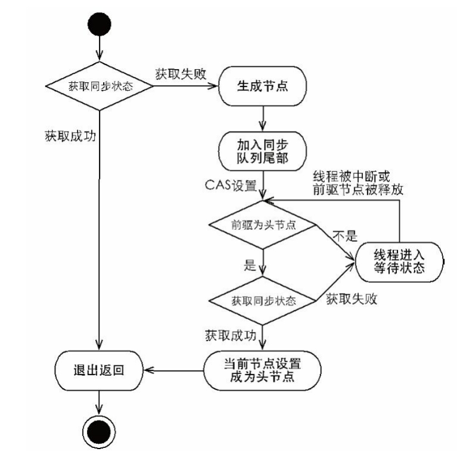

[toc]

# Java并发包源码学习系列：AQS共享模式获取与释放资源

往期回顾：

- [Java并发包源码学习系列：AbstractQueuedSynchronizer](https://www.cnblogs.com/summerday152/p/14238284.html)
- [Java并发包源码学习系列：CLH同步队列及同步资源获取与释放](https://www.cnblogs.com/summerday152/p/14244324.html)

上一篇文章介绍了AQS内置队列节点的出队入队操作，以及独占式获取共享资源与释放资源的详细流程，为了结构完整，本篇继续以AQS的角度介绍另外一种：共享模式获取与释放资源的细节，本篇暂不分析具体子类如ReentrantLock、ReentrantReadWriteLock的实现，之后会陆续补充。

## 独占式获取资源

> 友情提示：本篇文章着重介绍共享模式获取和释放资源的特点，许多代码实现上面和共享式和独占式其实逻辑差不多，为了清晰对比，这边会将独占式的部分核心代码粘贴过来，注意理解共享式和独占式存在差异的地方。详细解析可戳：[Java并发包源码学习系列：CLH同步队列及同步资源获取与释放](https://blog.csdn.net/Sky_QiaoBa_Sum/article/details/112301359)

### void acquire(int arg)

```java
    public final void acquire(int arg) {
        if (!tryAcquire(arg) && // tryAcquire由子类实现，表示获取锁，如果成功，这个方法直接返回了
            acquireQueued(addWaiter(Node.EXCLUSIVE), arg)) // 如果获取失败，执行
            selfInterrupt();
    }
```

### boolean acquireQueued(Node, int)

```java
    // 这个方法如果返回true，代码将进入selfInterrupt()
	final boolean acquireQueued(final Node node, int arg) {
        // 注意默认为true
        boolean failed = true;
        try {
            // 是否中断
            boolean interrupted = false;
            // 自旋，即死循环
            for (;;) {
                // 得到node的前驱节点
                final Node p = node.predecessor();
                // 我们知道head是虚拟的头节点，p==head表示如果node为阻塞队列的第一个真实节点
                // 就执行tryAcquire逻辑，这里tryAcquire也需要由子类实现
                if (p == head && tryAcquire(arg)) {
                    // tryAcquire获取成功走到这，执行setHead出队操作 
                    setHead(node);
                    p.next = null; // help GC
                    failed = false;
                    return interrupted;
                }
                // 走到这有两种情况 1.node不是第一个节点 2.tryAcquire争夺锁失败了
                // 这里就判断 如果当前线程争锁失败，是否需要挂起当前这个线程
                if (shouldParkAfterFailedAcquire(p, node) &&
                    parkAndCheckInterrupt())
                    interrupted = true;
            }
        } finally {
            // 死循环退出，只有tryAcquire获取锁失败的时候failed才为true
            if (failed)
                cancelAcquire(node);
        }
    }
```

## 独占式释放资源

### boolean release(int arg)

```java
    public final boolean release(int arg) {
        if (tryRelease(arg)) { // 子类实现tryRelease方法
            // 获得当前head
            Node h = head;
            // head不为null并且head的等待状态不为0
            if (h != null && h.waitStatus != 0)
                // 唤醒下一个可以被唤醒的线程，不一定是next哦
                unparkSuccessor(h);
            return true;
        }
        return false;
    }
```

### void unparkSuccessor(Node node)

```java
	private void unparkSuccessor(Node node) {
        /*
         * If status is negative (i.e., possibly needing signal) try
         * to clear in anticipation of signalling.  It is OK if this
         * fails or if status is changed by waiting thread.
         */
        int ws = node.waitStatus;
        // 如果node的waitStatus<0为signal，CAS修改为0
        // 将 head 节点的 ws 改成 0，清除信号。表示，他已经释放过了。不能重复释放。
        if (ws < 0)
            compareAndSetWaitStatus(node, ws, 0);

        /*
         * Thread to unpark is held in successor, which is normally
         * just the next node.  But if cancelled or apparently null,
         * traverse backwards from tail to find the actual
         * non-cancelled successor.
         */
        // 唤醒后继节点，但是有可能后继节点取消了等待 即 waitStatus == 1
        Node s = node.next;
        // 如果后继节点为空或者它已经放弃锁了
        if (s == null || s.waitStatus > 0) {
            s = null;
            // 从队尾往前找，找到没有没取消的所有节点排在最前面的【直到t为null或t==node才退出循环嘛】
            for (Node t = tail; t != null && t != node; t = t.prev)
                // 如果>0表示节点被取消了，就一直向前找呗，找到之后不会return，还会一直向前
                if (t.waitStatus <= 0)
                    s = t;
        }
        // 如果后继节点存在且没有被取消，会走到这，直接唤醒后继节点即可
        if (s != null)
            LockSupport.unpark(s.thread);
    }
```

## 共享式获取资源

### void acquireShared(int arg)

```java
    public final void acquireShared(int arg) {
        if (tryAcquireShared(arg) < 0) //子类实现
            doAcquireShared(arg);
    }
```

- `tryAcquireShared(int)`是AQS提供给子类实现的钩子方法，子类可以自定义实现**共享式获取资源**的方式，获取状态失败返回小于0，返回零值表示被独占方式获取，返回正值表示共享方式获取。
- 如果获取失败，则进入`doAcquireShared(arg);`的逻辑。

### void doAcquireShared(int arg)

注意这里和独占式获取资源`acquireQueued`的区别。

```java
    private void doAcquireShared(int arg) {
        // 包装成共享模式的节点，入队
        final Node node = addWaiter(Node.SHARED);
        boolean failed = true;
        try {
            boolean interrupted = false;
            // 自旋
            for (;;) {
                final Node p = node.predecessor();
                if (p == head) {
                    // 尝试获取同步状态，子类实现
                    int r = tryAcquireShared(arg);
                    if (r >= 0) {
                        // 设置新的首节点，并根据条件，唤醒下一个节点
                        setHeadAndPropagate(node, r);
                        p.next = null; // help GC
                        if (interrupted)
                            selfInterrupt();
                        failed = false;
                        return;
                    }
                }
                if (shouldParkAfterFailedAcquire(p, node) &&
                    parkAndCheckInterrupt())
                    interrupted = true;
            }
        } finally {
            if (failed)
                cancelAcquire(node);
        }
    }
```

我们可以看到有几个存在差异的地方：

1. 在共享式获取资源失败的时候，会包装成SHARED模式的节点入队。
2. 如果前驱节点为head，则使用tryAcquireShared方法尝试获取同步状态，这个方法由子类实现。
3. 如果获取成功r>=0，这时调用`setHeadAndPropagate(node, r)`，该方法首先会设置新的首节点，将第一个节点出队，接着会不断唤醒下一个共享模式节点，实现同步状态被多个线程共享获取。

接下来我们着重看下setHeadAndPropagate方法。

### void setHeadAndPropagate(Node node, int propagate)

```java
    private void setHeadAndPropagate(Node node, int propagate) {
        Node h = head; // Record old head for check below
        // 节点出队，设置node为新的head
        setHead(node);
        /*
         * Try to signal next queued node if:
         *   Propagation was indicated by caller,
         *     or was recorded (as h.waitStatus either before
         *     or after setHead) by a previous operation
         *     (note: this uses sign-check of waitStatus because
         *      PROPAGATE status may transition to SIGNAL.)
         * and
         *   The next node is waiting in shared mode,
         *     or we don't know, because it appears null
         *
         * The conservatism in both of these checks may cause
         * unnecessary wake-ups, but only when there are multiple
         * racing acquires/releases, so most need signals now or soon
         * anyway.
         */
        // 这个方法进来的时候propagate>=0
        // propagate>0表示同步状态还可以被后面的节点获取
        // h指向原先的head节点，之后h = head，h表示新的head节点
        // h.waitStatus<0表示该节点后面还有节点需要被唤醒
        if (propagate > 0 || h == null || h.waitStatus < 0 ||
            (h = head) == null || h.waitStatus < 0) {
            // 获取下一个节点
            Node s = node.next;
            // 没有下一个节点或下一个节点为共享式获取状态
            if (s == null || s.isShared())
                // 唤醒后续的共享式获取同步状态的节点
                doReleaseShared();
        }
    }
```

- 先记录一下原来的头节点，然后设置node为新的头节点。
- 原先的头节点或新的头节点等待状态是propagate或signal，可以继续向下唤醒。
- 如果判断下个节点为shared节点，调用共享式释放资源方法唤醒后续节点。

## 共享式释放资源

### boolean releaseShared(int arg)

```java
    public final boolean releaseShared(int arg) {
        if (tryReleaseShared(arg)) { // 子类实现
            doReleaseShared();
            return true;
        }
        return false;
    }
```

### doReleaseShared()

可以发现共享模式下，无论是获取资源还是释放资源都调用了doReleaseShared方法，可见该方法是共享模式释放资源唤醒节点的核心方法，主要功能是**唤醒下一个线程或者设置传播状态**。

后继线程被唤醒后，会尝试获取共享锁，如果成功之后，则又会调用setHeadAndPropagate,将唤醒传播下去。这个方法的作用是保障在acquire和release存在竞争的情况下，保证队列中处于等待状态的节点能够有办法被唤醒。

```java
    private void doReleaseShared() {
        /*
         * Ensure that a release propagates, even if there are other
         * in-progress acquires/releases.  This proceeds in the usual
         * way of trying to unparkSuccessor of head if it needs
         * signal. But if it does not, status is set to PROPAGATE to
         * ensure that upon release, propagation continues.
         * Additionally, we must loop in case a new node is added
         * while we are doing this. Also, unlike other uses of
         * unparkSuccessor, we need to know if CAS to reset status
         * fails, if so rechecking.
         */
        // 自旋
        for (;;) {
            Node h = head;
            // 队列已经初始化且至少有一个节点
            if (h != null && h != tail) {
                int ws = h.waitStatus;
                // 无论是独占还是共享，只有节点的ws为signal的时候，才会在释放的时候，唤醒后面的节点
                if (ws == Node.SIGNAL) {
                    // cas将ws设置为0，设置失败，将会继续从循环开始
                    if (!compareAndSetWaitStatus(h, Node.SIGNAL, 0))
                        continue;            // loop to recheck cases
                    // 唤醒后继节点，unparkSuccessor这个方法上面已经解析过
                    unparkSuccessor(h);
                }
                // 如果ws为0，则更新状态为propagate，
                // 之后setHeadAndPropagate读到ws<0的时候，会继续唤醒后面节点
                else if (ws == 0 &&
                         !compareAndSetWaitStatus(h, 0, Node.PROPAGATE))
                    continue;                // loop on failed CAS
            }
            // 如果head在这个过程中被更改了，会继续自旋
            if (h == head)                   // loop if head changed
                break;
        }
    }
```

该方法在 head 节点存在后继节点的情况下，做了两件事情：

1. 如果 head 节点等待状态为 SIGNAL，则将 head 节点状态设为 0，并唤醒后继未取消节点。

2. 如果 head 节点等待状态为 0，则将 head 节点状态设为 PROPAGATE，保证唤醒能够正常传播下去。

**设置PROPAGATE的作用**：PROPAGATE状态用在[setHeadAndPropagate](#void setHeadAndPropagate(Node node, int propagate)) ,当头节点状态被设为 PROPAGATE 后，后继节点成为新的头结点后。若 `propagate > 0` 条件不成立，则根据条件`h.waitStatus < 0`成立与否，来决定是否唤醒后继节点，即向后传播唤醒动作。

引入PROPAGATE是为了解决什么问题？

[AbstractQueuedSynchronizer源码解读](https://www.cnblogs.com/micrari/p/6937995.html)，强烈建议阅读这篇博客。

## 独占式和共享式的区别总结

> 共享式获取与独占式获取最大的区别就是同一时刻能否有多个线程同时获取到同步状态。
>
> - 共享式访问资源时，同一时刻其他共享式的访问会被允许。
> - 独占式访问资源时，同一时刻其他访问均被阻塞。

AQS都提供了子类实现的钩子方法，独占式的代表方法有：tryAcquire和tryRelease以及isHeldExclusively方法，共享式的代表方法有：tryAcquireShared和tryReleaseShared方法。

AQS中获取操作和释放操作的标准形式：

```java
boolean acquire() throws InterruptedException{
    while( 当前状态不允许获取操作 ){
        if( 需要阻塞获取请求){
            如果当前线程不在队列中，则将其插入队列
            阻塞当前线程
        }else{
            返回失败
        }
    }
    可能更新同步器的状态
    如果线程位于队列中，则将其移除队列
    返回成功
}

void release(){
    更新同步器的状态
    if( 新的状态允许某个被阻塞的线程获取成功 ){
        解除队列中一个或多个线程的阻塞状态
    }
}
```

> 图源：《并发编程的艺术》下图是独占式同步状态获取的流程



当某个线程争夺同步资源失败之后，他们都会将线程包装为节点，并加入CLH同步队列的队尾，并保持自旋，一个是`addWaiter(Node.EXCLUSIVE)`，一个是`addWaiter(Node.EXCLUSIVE)`。

同步队列中的线程在自旋时会判断其前驱节点是否为首节点，如果是首节点`node.predecessor() == head`，他们都会尝试获取同步状态，只不过：

- 独占式获取状态成功后，只会出队一个节点。
- 共享式获取状态成功后，除了出队一个节点，还会唤醒后面的节点。

线程执行完逻辑之后，他们都会释放同步状态，释放之后将会`unparkSuccessor(h)`唤醒其后可被唤醒的某个后继节点。

## 参考阅读

- [【死磕Java并发】—–J.U.C之AQS：同步状态的获取与释放](http://cmsblogs.com/?p=2197)
- [Java并发之AQS详解](https://www.cnblogs.com/waterystone/p/4920797.html)
- [AbstractQueuedSynchronizer源码解读](https://www.cnblogs.com/micrari/p/6937995.html)
- [Java技术之AQS详解](https://www.jianshu.com/p/da9d051dcc3d)
- 《并发编程的艺术》方腾飞
- 《Java并发编程实战》Doug Lea