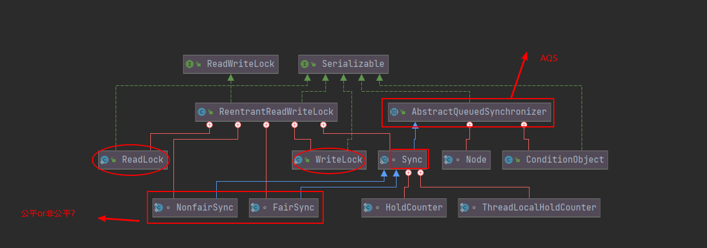

[toc]

## ReadWriteLock读写锁概述

我们之前说到，ReentrantLock是独占锁，某一时刻只有一个线程可以获取该锁，而实际上会存在很多**读多写少**的场景，而读操作本身并不会存在数据竞争问题，如果使用独占锁，可能会导致其中一个读线程使其他的读线程陷入等待，降低性能。

针对这种读多写少的场景，读写锁应运而生。**读写锁允许同一时刻有多个读线程访问，但在写线程访问时，所有的读线程和其他写线程均被阻塞。**我们先来看看Java中的读写锁顶级接口吧，位于：`java.util.concurrent.locks`包下：

```java
public interface ReadWriteLock {
    // 读锁
    Lock readLock();
	// 写锁
    Lock writeLock();
}

```

相信你会一下子就明白，读写锁其实就是维护了一对锁，一个写锁一个读锁，通过读写分离的策略，允许多个线程同时获取读锁，大大提高并发性。

## ReentrantReadWriteLock架构总览

ReentrantReadWriteLock是ReadWriteLock的实现，除了实现了`readLock()`和`writeLock()`两个方法之外，还提供了一些重要方法，我们待会会一一解析。



```java
public class ReentrantReadWriteLock
        implements ReadWriteLock, java.io.Serializable {
    private static final long serialVersionUID = -6992448646407690164L;
    /** 内部维护ReadLock */
    private final ReentrantReadWriteLock.ReadLock readerLock;
    /** 内部维护WriteL */
    private final ReentrantReadWriteLock.WriteLock writerLock;
    /** 读、写锁公用一个AQS的Sync的实例 */
    final Sync sync;
    
	/** 默认使用非公平模式 */
    public ReentrantReadWriteLock() {
        this(false);
    }
    /** 初始化读锁和写锁实例 */
    public ReentrantReadWriteLock(boolean fair) {
        sync = fair ? new FairSync() : new NonfairSync();
        readerLock = new ReadLock(this);
        writerLock = new WriteLock(this);
    }

    public ReentrantReadWriteLock.WriteLock writeLock() { return writerLock; }
    public ReentrantReadWriteLock.ReadLock  readLock()  { return readerLock; }

    /**
     * AQS的实现
     */
    abstract static class Sync extends AbstractQueuedSynchronizer {   
        // ...
    }
    
     /**
     * Sync 非公平版本的实现
     */
    static final class NonfairSync extends Sync {
        private static final long serialVersionUID = -8159625535654395037L;
        final boolean writerShouldBlock() {
            return false; // writers can always barge
        }
        final boolean readerShouldBlock() {
            return apparentlyFirstQueuedIsExclusive();
        }
    }

    /**
     * Sync 公平版本的实现
     */
    static final class FairSync extends Sync {
        private static final long serialVersionUID = -2274990926593161451L;
        final boolean writerShouldBlock() {
            return hasQueuedPredecessors();
        }
        final boolean readerShouldBlock() {
            return hasQueuedPredecessors();
        }
    }

    /**
     * 可以通过ReentrantReadWriteLock#readLock方法得到一个读锁实例
     */
    public static class ReadLock implements Lock, java.io.Serializable {
        private static final long serialVersionUID = -5992448646407690164L;
        private final Sync sync;
        protected ReadLock(ReentrantReadWriteLock lock) {
            sync = lock.sync;
        }
        //...
    }

    /**
     * 可以通过ReentrantReadWriteLock#writeLock方法获得一个写锁实例
     */
    public static class WriteLock implements Lock, java.io.Serializable {
        private static final long serialVersionUID = -4992448646407690164L;
        private final Sync sync;
        protected WriteLock(ReentrantReadWriteLock lock) {
            sync = lock.sync;
        }
        //...
    }
```

我们大概总结一下：

- ReentrantReadWriteLock内部维护了ReadLock和WriteLock两个内部类，他们都委托Sync实现具体功能【Sync是AQS的实现，这个之前讲的非常清楚咯】。
- 与ReentrantLock一样，也提供了公平与非公平两种实现：FairSync和NonfairSync，他们是Sync的实现类。
- ReadLock和WriteLock实例可以通过`readLock()`和`writeLock()`两个方法获得。

## 读写锁案例

JavaDoc文档写的非常详细，给我们举了一个ReentrantReadWriteLock的使用例子，我们直接来看看：

```java

class CachedData {
    Object data;
    volatile boolean cacheValid;
    // 创建读写锁实例
    final ReentrantReadWriteLock rwl = new ReentrantReadWriteLock();

    void processCachedData() {
        // 获取读锁
        rwl.readLock().lock();
        // 缓存失效的情况
        if (!cacheValid) { 
            
            // 释放掉读锁，必须！在获取写锁之前给读锁释放了
            rwl.readLock().unlock();
            // 获取写锁
            rwl.writeLock().lock();

            try {
                // 重新检查状态，因为在等待写锁的过程中，可能前面有其他写线程执行过了
                if (!cacheValid) { 
                    data = ...
                    cacheValid = true;
                }
                // 持有写锁的情况下，获取读锁的，称为 “锁降级”
                rwl.readLock().lock();
            } finally {
                // 释放写锁，此时还剩一个读锁
                rwl.writeLock().unlock(); 
            }
        }

        try {
            use(data);
        } finally {
            // 释放读锁
            rwl.readLock().unlock();
        }
    }
}
```

稍微总结一下，详细的在后面的解析部分：

> ReentrantReadWriteLock读写锁分为读锁和写锁，读锁是共享锁，写锁是独占锁。
>
> 持有写锁的线程可以继续获取读锁，称为锁降级。

## Sync字段表示

读写锁巧妙地利用一个state表示两种状态：高16位表示读状态，也就是获取到读锁的次数，使用低16位标识获取到写锁的线程的可重入次数。

```java
        /*
         * Read vs write count extraction constants and functions.
         * Lock state is logically divided into two unsigned shorts:
         * The lower one representing the exclusive (writer) lock hold count,
         * and the upper the shared (reader) hold count.
         */

        static final int SHARED_SHIFT   = 16;
		// 共享锁状态单位值 65536
        static final int SHARED_UNIT    = (1 << SHARED_SHIFT);
		// 共享锁线程最大个数 65535
        static final int MAX_COUNT      = (1 << SHARED_SHIFT) - 1;
		// 排他锁掩码 65535 二进制表示 15个1
        static final int EXCLUSIVE_MASK = (1 << SHARED_SHIFT) - 1;

        /** 返回读锁线程数  */
        static int sharedCount(int c)    { return c >>> SHARED_SHIFT; }
        /** 返回写锁可重入个数  */
        static int exclusiveCount(int c) { return c & EXCLUSIVE_MASK; }
```

```java
		static final class HoldCounter {
            int count = 0;
            // Use id, not reference, to avoid garbage retention
            final long tid = getThreadId(Thread.currentThread());
        }

        /**
         * ThreadLocal subclass. Easiest to explicitly define for sake
         * of deserialization mechanics.
         */
        static final class ThreadLocalHoldCounter
            extends ThreadLocal<HoldCounter> {
            public HoldCounter initialValue() {
                return new HoldCounter();
            }
        }

		// ThreadLocalHoldCounter继承ThreadLocal
		// 存放除去第一个获取读锁线程外的其他线程获取读锁的可重入次数
        private transient ThreadLocalHoldCounter readHolds;
		// 记录最后一个获取读锁的线程获取读锁的可重入次数
        private transient HoldCounter cachedHoldCounter;
		// 记录第一个获取到读锁的线程
        private transient Thread firstReader = null;
		// 记录第一个获取到读锁的线程获取读锁的可重入次数
        private transient int firstReaderHoldCount;
```

## 写锁的获取与释放

ReentrantReadWriteLock中的写锁通过WriteLock实现。

### void lock()

写锁是独占锁，某一时刻只有一个线程可以获取该锁。

- 如果当前没有线程获取到读锁写锁，则当前线程可以获取到写锁然后返回。
- 如果当前已经有线程获取到到读锁和写锁，当前请求写锁的线程会被阻塞挂起。

写锁是可重入锁，如果当前线程已经获取该锁，再次获取只是简单地把可重入次数+1后直接返回。

```java
    // ReentrantReadWriteLock.WriteLock#lock
	public static class WriteLock implements Lock, java.io.Serializable {
        private final Sync sync;
        public void lock() {
            sync.acquire(1);
        }
    }

	// AQS # acquire
    public final void acquire(int arg) {
        // 调用子类实现的tryAcquire，如果位false，则加入阻塞队列，阻塞
        if (!tryAcquire(arg) &&
            acquireQueued(addWaiter(Node.EXCLUSIVE), arg))
            selfInterrupt();
    }

	// ReentrantReadWriteLock.Sync#tryAcquire
    abstract static class Sync extends AbstractQueuedSynchronizer {
        protected final boolean tryAcquire(int acquires) {
            /*
             * Walkthrough:
             * 1. If read count nonzero or write count nonzero
             *    and owner is a different thread, fail.
             * 2. If count would saturate, fail. (This can only
             *    happen if count is already nonzero.)
             * 3. Otherwise, this thread is eligible for lock if
             *    it is either a reentrant acquire or
             *    queue policy allows it. If so, update state
             *    and set owner.
             */
            Thread current = Thread.currentThread();
            int c = getState();
            int w = exclusiveCount(c);
            // c != 0表示读锁或者写锁已经被某个线程获取了
            if (c != 0) {
                // (Note: if c != 0 and w == 0 then shared count != 0)
                // w == 0表示有线程获取了读锁，share count此时不为0。
                // w != 0并且当前xc不是写锁拥有者，返回false
                if (w == 0 || current != getExclusiveOwnerThread())
                    return false;
                //走到这里说明当前线程就是已经获取写锁的，判断可重入的次数是否超过了最大值
                if (w + exclusiveCount(acquires) > MAX_COUNT)
                    throw new Error("Maximum lock count exceeded");
                // 设置可重入的次数
                setState(c + acquires);
                return true;
            }
            // 走到这，表示c==0，此时为第一个线程获取写锁
            if (writerShouldBlock() ||
                !compareAndSetState(c, c + acquires))
                return false;
            // 经过前面的步骤之后，到这一步，才设置锁的持有者为当前线程
            setExclusiveOwnerThread(current);
            return true;
        }
    }
```

writerShouldBlock方法实现，公平与非公平有差异：

```java
    static final class FairSync extends Sync {
        private static final long serialVersionUID = -2274990926593161451L;
        final boolean writerShouldBlock() {
            // 返回是否存在前驱节点
            return hasQueuedPredecessors();
        }
    }

    static final class NonfairSync extends Sync {
        private static final long serialVersionUID = -8159625535654395037L;
        // 总是返回false
        final boolean writerShouldBlock() {
            return false; // writers can always barge
        }
    }
```

很明显了，对于非公平锁来说，该方法永远返回false，表示一定会走到`compareAndSetState(c, c + acquires)`这一步，通过CAS尝试获取写锁，获取成功就设置状态，之后当前线程会被设置为锁的持有者，失败则返回false。

而对于公平锁来说，如果阻塞队列中，当前线程存在前驱节点，就放弃CAS争夺写锁的过程。

### void lockInterruptibly()

类似于ReentrantLock的lockInterruptibly()方法，当其他线程调用了该线程的interrupt()方法中断了当前线程时，当前线程就会抛出InterruptedException异常。

```java
    public void lockInterruptibly() throws InterruptedException {
        sync.acquireInterruptibly(1);
    }
	//AQS
    public final void acquireInterruptibly(int arg)
            throws InterruptedException {
        if (Thread.interrupted())
            throw new InterruptedException();
        if (!tryAcquire(arg))
            doAcquireInterruptibly(arg);
    }
```

### boolean tryLock()

尝试获取写锁，如果当前没有其他线程持有写锁或读锁，则当前线程获取写锁会成功，返回true。

如果当前已经有其他线程持有写锁或读锁则该方法直接返回false，且当前线程并不会被阻塞。

如果当前线程已经持有了该写锁则简单增加AQS的状态值后直接返回true。

```java
public boolean tryLock( ) {
    return sync.tryWriteLock();
}

// AQS
final boolean tryWriteLock() {
    Thread current = Thread.currentThread();
    int c = getState();
    if (c != 0) {
        int w = exclusiveCount(c);
        if (w == 0 || current != getExclusiveOwnerThread())
            return false;
        if (w == MAX_COUNT)
            throw new Error("Maximum lock count exceeded");
    }
    if (!compareAndSetState(c, c + 1))
        return false;
    setExclusiveOwnerThread(current);
    return true;
}
```

其实和lock方法的逻辑大差不大，只是采用lock方法的非公平锁逻辑。

### boolean tryLock(long timeout,TimeUnit unit)

类似于ReentrantLock的tryLock(long timeout,TimeUnit unit)方法。

尝试获取写锁，如果获取失败会将当前线程挂起指定时间，时间到了之后当前线程被激活，如果还是没有获取到锁，就返回false。

另外，该方法会对中断进行的响应，如果其他线程调用了当前线程的interrupt()方法，响应中断，抛出异常。

### void unlock()

尝试释放锁，如果当前线程持有该锁，调用该方法会让该线程对该线程持有的AQS状态减1，如果减1之后当前状态值为0，则当前线程会释放该锁。

如果当前线程没有持有该锁而调用了该方法，抛出IllegalMonitorStateException异常。

```java
public void lock() {
    sync.acquireShared(1);
}
	// AQS
    public final boolean release(int arg) {
        if (tryRelease(arg)) {
            Node h = head;
            if (h != null && h.waitStatus != 0)
                unparkSuccessor(h);
            return true;
        }
        return false;
    }
	// ReentrantReadWriteLock.Sync#tryAcquire
    abstract static class Sync extends AbstractQueuedSynchronizer {
        protected final boolean tryRelease(int releases) {
            // 当前线程没有持有该锁而调用了该方法
            if (!isHeldExclusively())
                throw new IllegalMonitorStateException();
            int nextc = getState() - releases;
            // 判断一下是不是需要释放锁了
            boolean free = exclusiveCount(nextc) == 0;
            // 清空一下
            if (free)
                setExclusiveOwnerThread(null);
            // state没有到0，仅仅是设置state而已
            setState(nextc);
            return free;
        }
    }

```

## 读锁的获取与释放

ReentrantReadWriteLock中的读锁通过ReadLock实现。

### void lock()

```java
    // ReentrantReadWriteLock.ReadLock#lock
	public static class ReadLock implements Lock, java.io.Serializable {
        private final Sync sync;
        public void lock() {
            sync.acquireShared(1);
        }
    }

	// AQS # acquireShared
    public final void acquireShared(int arg) {
        // 调用子类实现的tryAcquireShared，如果位false，则加入阻塞队列，阻塞
        if (tryAcquireShared(arg) < 0)
            doAcquireShared(arg);
    }

	// ReentrantReadWriteLock.Sync#tryAcquire
    abstract static class Sync extends AbstractQueuedSynchronizer {
        protected final int tryAcquireShared(int unused) {
            /*
             * Walkthrough:
             * 1. If write lock held by another thread, fail.
             * 2. Otherwise, this thread is eligible for
             *    lock wrt state, so ask if it should block
             *    because of queue policy. If not, try
             *    to grant by CASing state and updating count.
             *    Note that step does not check for reentrant
             *    acquires, which is postponed to full version
             *    to avoid having to check hold count in
             *    the more typical non-reentrant case.
             * 3. If step 2 fails either because thread
             *    apparently not eligible or CAS fails or count
             *    saturated, chain to version with full retry loop.
             */
            Thread current = Thread.currentThread();
            // 获取当前状态值
            int c = getState();
            // 判断写锁是否被占用
            if (exclusiveCount(c) != 0 &&
                getExclusiveOwnerThread() != current)
                return -1;
            // 获取读锁计数
            int r = sharedCount(c);
            // 尝试获取锁，多个读线程只有一个会成功，若不成功将会进入fullTryAcquireShared进行重试
            if (!readerShouldBlock() &&
                r < MAX_COUNT &&
                compareAndSetState(c, c + SHARED_UNIT)) {
                // 第一个线程获取读锁
                if (r == 0) {
                    firstReader = current;
                    firstReaderHoldCount = 1;
                // 如果当前线程是第一个获取读锁的线程
                } else if (firstReader == current) {
                    firstReaderHoldCount++;
                } else {
              		// 记录最后一个获取读锁的线程或记录其他线程读锁的可重入数
                    HoldCounter rh = cachedHoldCounter;
                    if (rh == null || rh.tid != getThreadId(current))
                        cachedHoldCounter = rh = readHolds.get();
                    else if (rh.count == 0)
                        readHolds.set(rh);
                    rh.count++;
                }
                return 1;
            }
            // 类似tryAcquireShared，自选获取
            return fullTryAcquireShared(current);
        }
    }
```

readerShouldBlock方法实现，公平与非公平有差异：

```java
    static final class FairSync extends Sync {

        final boolean readerShouldBlock() {
            return hasQueuedPredecessors();
        }
    }

    static final class NonfairSync extends Sync {

        final boolean readerShouldBlock() {
            /* As a heuristic to avoid indefinite writer starvation,
             * block if the thread that momentarily appears to be head
             * of queue, if one exists, is a waiting writer.  This is
             * only a probabilistic effect since a new reader will not
             * block if there is a waiting writer behind other enabled
             * readers that have not yet drained from the queue.
             */
            return apparentlyFirstQueuedIsExclusive();
        }
    }
```

具体看下非公平锁的实现，apparentlyFirstQueuedIsExclusive方法：

```java
    final boolean apparentlyFirstQueuedIsExclusive() {
        Node h, s;
        return (h = head) != null && // 队列是否为空
            (s = h.next)  != null && // 是否存在第一个元素
            !s.isShared()         && // 第一个元素是否正在尝试获取写锁
            s.thread != null;		 // 该元素的线程是否为null
    }
```

联系起来解释：

1. `!readerShouldBlock()`：如果队列里面存在一个元素，判断第一个元素是不是正在尝试获取写锁，如果不是的话，该方法返回false，进入后面判断。
2. `r < MAX_COUNT`：判断当前获取读锁的线程是否达到最大值。
3. `compareAndSetState(c, c + SHARED_UNIT)`：执行CAS操作**将AQS状态值的高16位值增加1**。

> 接下来读锁的几个方法和写锁其实差不太多，源码就不贴了，感兴趣的小伙伴可以自己看看。

### void lockInterruptibly()

类似于lock()方法，区别在于，该方法能够中断响应，当其他线程调用该线程的interrupt()方法中断了当前线程时，当前线程抛出InterruptedException异常。

### boolean tryLock()

尝试读取锁，如果当前没有其他线程持有写锁，则当前线程会获取读锁成功，返回true。

如果当前已经有其他线程持有写锁，则直接返回false，不会阻塞。

如果当前线程已经持有了该读锁，则利用AQS将state的高16位加1，返回true。

### boolean tryLock(long timeout,TimeUnit unit)

类似于tryLock，不同的是，设定了超时时间，超时时间到了，如果没有读取到读锁，直接返回false。

可中断响应，当其他线程调用该线程的interrupt()方法中断了当前线程时，当前线程抛出InterruptedException异常。

### void unlock()

```java
public void unlock() {
    sync.releaseShared(1);
}
// AQS
public final boolean releaseShared(int arg) {
    // 如果tryReleaseShared返回true，释放一个由于获取写锁而被阻塞的线程
    if (tryReleaseShared(arg)) {
        doReleaseShared();
        return true;
    }
    return false;
}
abstract static class Sync extends AbstractQueuedSynchronizer {
    protected final boolean tryReleaseShared(int unused) {
        Thread current = Thread.currentThread();
        if (firstReader == current) {
            // assert firstReaderHoldCount > 0;
            if (firstReaderHoldCount == 1)
                firstReader = null;
            else
                firstReaderHoldCount--;
        } else {
            HoldCounter rh = cachedHoldCounter;
            if (rh == null || rh.tid != getThreadId(current))
                rh = readHolds.get();
            int count = rh.count;
            if (count <= 1) {
                readHolds.remove();
                if (count <= 0)
                    throw unmatchedUnlockException();
            }
            --rh.count;
        }
        // 无限循环，保证CAS操作成功
        for (;;) {
            // 获取状态值
            int c = getState();
            int nextc = c - SHARED_UNIT;
            // CAS  操作更新状态值。CAS操作如果不成功，会一直循环
            if (compareAndSetState(c, nextc))
                // 如果更新成功，查看当前状态值是否为0，如果为0说明已经没有读线程占用读锁
                // 如果不为0，则说明还有其他线程持有读锁，返回false
                return nextc == 0;
        }
    }
}


```

## 总结

ReentrantReadWriteLock底层使用AQS实现，利用AQS的状态值的高16位表示获取到读锁的个数，低16位标识获取到写锁的线程的可重入次数，通过CAS对其进行操作实现读写分离，适用于读多写少的场景。


## 参考阅读

- [Java 读写锁 ReentrantReadWriteLock 源码分析](https://javadoop.com/post/reentrant-read-write-lock)