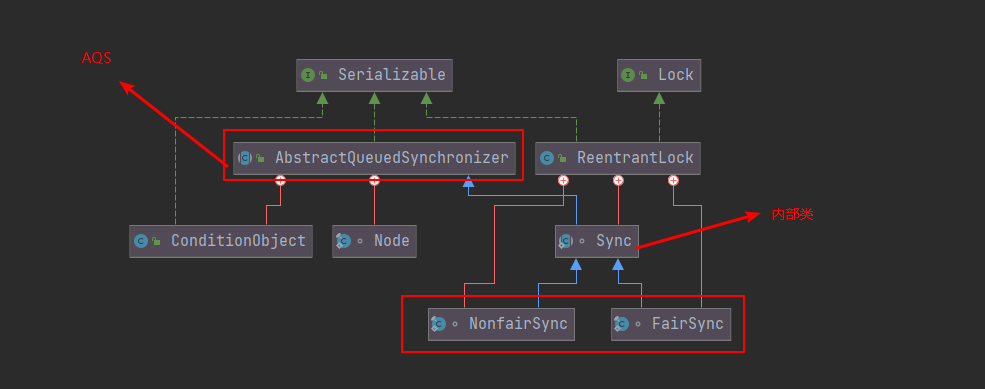

[toc]
系列传送门：

- [Java并发包源码学习系列：AbstractQueuedSynchronizer](https://blog.csdn.net/Sky_QiaoBa_Sum/article/details/112254373)
- [Java并发包源码学习系列：CLH同步队列及同步资源获取与释放](https://blog.csdn.net/Sky_QiaoBa_Sum/article/details/112301359)
- [Java并发包源码学习系列：AQS共享式与独占式获取与释放资源的区别](https://blog.csdn.net/Sky_QiaoBa_Sum/article/details/112386838)

## 基本用法介绍

`ReentrantLock`位于`java.util.concurrent（J.U.C）`包下，是Lock接口的实现类。基本用法与`synchronized`相似，都具备**可重入互斥**的特性，但拥有更强大的且灵活的锁机制。本篇主要从源码角度解析ReentrantLock，一些基本的概念以及Lock接口可以戳这篇：[Java并发读书笔记：Lock与ReentrantLock](https://blog.csdn.net/Sky_QiaoBa_Sum/article/details/104347945)

ReentrantLock推荐用法如下：

```java
class X {
    //定义锁对象
    private final ReentrantLock lock = new ReentrantLock();
    // ...
    //定义需要保证线程安全的方法
    public void m() {
        //加锁
        lock.lock();  
        try{
        // 保证线程安全的代码
        }
        // 使用finally块保证释放锁
        finally {
            lock.unlock()
        }
    }
}

```

## 继承体系




- 实现Lock接口，提供了锁的关键方法，如lock、unlock、tryLock等等，以及newCondition给lock关联条件对象的方法。
- 内部维护了一个Sync，它继承AQS，实现AQS提供的独占式的获取与释放同步资源的方法，提供了可重入的具体实现。
- Sync有两个实现类，是公平锁和非公平锁的两种实现，FairSync与NonfairSync。

> 独占锁表示：同时只能有一个线程可以获取该锁，其他获取该锁的线程会被阻塞而被放入该所的AQS阻塞队列里面。这部分可以查看：[Java并发包源码学习系列：AQS共享式与独占式获取与释放资源的区别](https://blog.csdn.net/Sky_QiaoBa_Sum/article/details/112386838)

## 构造方法

Sync直接继承自AQS，NonfairSync和FairSync继承了Sync，实现了获取锁的公平与非公平策略。

ReentrantLock中的操作都是委托给Sync对象来实际操作的。

```JAVA
    /** Synchronizer providing all implementation mechanics */
    private final Sync sync;
```

默认是使用非公平锁：`NonfairSync`，可以传入参数来指定是否使用公平锁。

```java
	// 默认使用的是 非公平的策略
    public ReentrantLock() {
        sync = new NonfairSync();
    }
	// 通过fair参数指定 策略
    public ReentrantLock(boolean fair) {
        sync = fair ? new FairSync() : new NonfairSync();
    }
```

## state状态表示

在ReentrantLock中，**AQS的state状态值表示线程获取该锁的可重入次数**，在默认情况下：

- state值为0时表示当前锁没有被任何线程持有。
- 当第一个线程第一次获取该锁时会尝试使用CAS设置state的值为1，**如果CAS成功则当前线程获取了该锁，然后记录该锁的持有者为当前线程**。
- 在该线程没有释放锁的情况下第二次获取该锁后，状态值设置为2，为可重入次数。
- 在该线程释放锁时，会尝试使用CAS让state值减1，**如果减1后状态值为0，则当前线程释放该锁**。

## 获取锁

### void lock()方法

ReentrantLock的lock()方法委托给了sync类，根据创建sync的具体实现决定具体的逻辑：

#### NonfairSync

```java
        /**
         * Performs lock.  Try immediate barge, backing up to normal
         * acquire on failure.
         */
        final void lock() {
            // CAS 设置获取state值
            if (compareAndSetState(0, 1))
                // 将当前线程设置为锁的持有者
                setExclusiveOwnerThread(Thread.currentThread());
            else
                // 设置失败， 调用AQS的acquire方法
                acquire(1);
        }
```

state值的初始状态为0，也就是说，第一个线程的CAS操作会成功将0设置为1，表示当前线程获取到了锁，然后通过`setExclusiveOwnerThread`方法将当前线程设置为锁的持有者。

如果这时，其他线程也试图获取该锁，则CAS失败，走到acquire的逻辑。

```java
    // AQS#acquire
	public final void acquire(int arg) {
        // 调用ReentrantLock重写的tryAcquire方法
        if (!tryAcquire(arg) &&
            // tryAcquire方法返回false，则把当前线程放入AQS阻塞队列中
            acquireQueued(addWaiter(Node.EXCLUSIVE), arg))
            selfInterrupt();
    }
```

欸，这个时候我们应该就有感觉了，我们之前在分析AQS的核心方法的时候说到过，AQS是基于模板模式设计的，下面的tryAcquire方法就是留给子类实现的，而NonfairSync中是这样实现的：

```java
        //NonfairSync#tryAcquire
        protected final boolean tryAcquire(int acquires) {
    		// 调用
            return nonfairTryAcquire(acquires);
        }

		final boolean nonfairTryAcquire(int acquires) {
            final Thread current = Thread.currentThread();
            // 获取当前状态值
            int c = getState();
            // 如果当前状态值为0，如果为0表示当前锁空闲
            if (c == 0) {
                if (compareAndSetState(0, acquires)) {
                    setExclusiveOwnerThread(current);
                    return true;
                }
            }
            // 看看当前的线程是不是锁的持有者
            else if (current == getExclusiveOwnerThread()) {
                // 如果是的话 将状态设置为  c + acquires
                int nextc = c + acquires;
                if (nextc < 0) // overflow
                    throw new Error("Maximum lock count exceeded");
                setState(nextc);
                return true;
            }
            return false;
        }
```

还是很好理解的哈，先看看锁的状态值是啥？

- 如果是0，就CAS尝试获取锁，将状态从0变到1，并且设置锁的持有者为当前线程，和之前的逻辑一样啦。
- 如果不是0，表示已经被某个线程持有啦，看看持有锁的人是谁呢？如果是自己，那么好办，重入呗，将state变为nextc【原先state + 传入的acquires】，返回true。这里要注意：nextc<0表示可重入次数溢出。
- 锁已经被别人霸占了，那就返回false咯，等待后续`acquireQueued(addWaiter(Node.EXCLUSIVE), arg))`方法，被置入AQS阻塞队列中。

> 这里非公平体现在获取锁的时候，没有查看当前AQS队列中是否有比自己更早请求该锁的线程存在，而是采取了**抢夺策略**。

#### FairSync

公平锁的tryAcquire实现如下：

```java
        //FairSync#tryAcquire
		protected final boolean tryAcquire(int acquires) {
            final Thread current = Thread.currentThread();
            int c = getState();
            if (c == 0) {
                // 状态值为0的时候，我去看看队列里面在我之前有没有线程在等
                if (!hasQueuedPredecessors() &&
                    compareAndSetState(0, acquires)) {
                    setExclusiveOwnerThread(current);
                    return true;
                }
            }
            // 当前锁已经被当前线程持有
            else if (current == getExclusiveOwnerThread()) {
                int nextc = c + acquires;
                if (nextc < 0)
                    throw new Error("Maximum lock count exceeded");
                setState(nextc);
                return true;
            }
            return false;
        }
```

对比一下两种策略，不必说，`hasQueuedPredecessors`方法一定是实现公平性的核心，我们来瞅瞅：

```java
    // 如果当前线程有前驱节点就返回true。
	public final boolean hasQueuedPredecessors() {
        // The correctness of this depends on head being initialized
        // before tail and on head.next being accurate if the current
        // thread is first in queue.
        Node t = tail; // Read fields in reverse initialization order
        Node h = head;
        Node s;
        return h != t &&
            ((s = h.next) == null || s.thread != Thread.currentThread());
    }
```

该方法：如果当前线程有前驱节点就返回true，那么我们想，不是前驱节点的情况有哪些呢？

1. 队列为空
2. 队列不为空，但当前线程节点是AQS的第一个节点。

知道这些之后，我们就明白最后那串表达式是什么意思了：**队列里面的第一个元素不是当前线程，返回true，说明在你之前还有人排着队呢，你先别抢，先到先得**。

### 公平与非公平策略的差异

我们稍微总结一下：

Reentrant类的构造函数接受一个**可选的公平性参数fair**。这时候就出现两种选择：

- 公平的（fair == true）：**保证等待时间最长的线程优先获取锁，其实就是先入队的先得锁**，即FIFO。
- 非公平的（fair == false）：此锁不保证任何特定的访问顺序。

公平锁往往体现出的总体吞吐量比非公平锁要低，也就是更慢，因为每次都需要看看队列里面有没有在排队的嘛。锁的公平性并不保证线程调度的公平性，但公平锁能够减少"饥饿"发生的概率。

需要注意的是：不定时的tryLock()方法不支持公平性设置。如果锁可用，即使其他线程等待时间比它长，它也会成功获得锁。

### void lockInterruptibly()

该方法与lock方法类似，不同点在于，它能对中断进行相应：当前线程在调用该方法时，如果其他线程调用了当前线程的interrupt()方法，当前线程会抛出InterruptedException异常，然后返回。

```java
    // ReentrantLock#lockInterruptibly
	public void lockInterruptibly() throws InterruptedException {
        sync.acquireInterruptibly(1);
    }
	// AQS#acquireInterruptibly
    public final void acquireInterruptibly(int arg)
            throws InterruptedException {
        // 如果当前线程被中断，则直接抛出异常
        if (Thread.interrupted())
            throw new InterruptedException();
        // 尝试获取资源
        if (!tryAcquire(arg))
            // 调用AQS可被中断的方法
            doAcquireInterruptibly(arg);
    }
```

### boolean tryLock()方法

尝试获取锁，如果当前该锁没有被其他线程持有，则当前线程获取该锁并返回true，否则返回false。

大致逻辑和非公平锁lock方法类似，但该方法会直接返回获取锁的结果，无论true或者false，它不会阻塞。

```java
    // ReentrantLock# tryLock
	public boolean tryLock() {
        return sync.nonfairTryAcquire(1);
    }
	abstract static class Sync extends AbstractQueuedSynchronizer {
		// Sync#nonfairTryAcquire
        final boolean nonfairTryAcquire(int acquires) {
            final Thread current = Thread.currentThread();
            int c = getState();
            if (c == 0) {
                if (compareAndSetState(0, acquires)) {
                    setExclusiveOwnerThread(current);
                    return true;
                }
            }
            else if (current == getExclusiveOwnerThread()) {
                int nextc = c + acquires;
                if (nextc < 0) // overflow
                    throw new Error("Maximum lock count exceeded");
                setState(nextc);
                return true;
            }
            return false;
        }
    }
```

- `tryLock()` **实现**方法，在实现时，希望能**快速的**获得是否能够获得到锁，因此即使在设置为 `fair = true` ( 使用公平锁 )，依然调用 `Sync#nonfairTryAcquire(int acquires)` 方法。
- 如果**真的**希望 `tryLock()` 还是按照是否公平锁的方式来，可以调用 `#tryLock(0, TimeUnit)` 方法来实现。

### boolean tryLock(long timeout, TimeUnit unit)

```java
    // ReentrantLock# tryLock
    public boolean tryLock(long timeout, TimeUnit unit)
            throws InterruptedException {
        return sync.tryAcquireNanos(1, unit.toNanos(timeout));
    }
	// AQS#tryAcquireNanos
    public final boolean tryAcquireNanos(int arg, long nanosTimeout)
            throws InterruptedException {
        if (Thread.interrupted())
            throw new InterruptedException();
        return tryAcquire(arg) ||
            doAcquireNanos(arg, nanosTimeout);
    }
```

尝试获取锁，如果获取失败会将当前线程挂起指定时间，时间到了之后当前线程被激活，如果还是没有获取到锁，就返回false。

另外，该方法会对中断进行的响应，如果其他线程调用了当前线程的interrupt()方法，响应中断，抛出异常。

## 释放锁

### void unlock()方法

```java
    // ReentrantLock#unlock
	public void unlock() {
        sync.release(1);
    }
	//AQS# release
    public final boolean release(int arg) {
        // 子类实现tryRelease
        if (tryRelease(arg)) {
            Node h = head;
            if (h != null && h.waitStatus != 0)
                unparkSuccessor(h);
            return true;
        }
        return false;
    }

	abstract static class Sync extends AbstractQueuedSynchronizer {
		// Sync#tryRelease
        protected final boolean tryRelease(int releases) {
            // 计算解锁后的次数，默认减1
            int c = getState() - releases;
            // 如果想要解锁的人不是当前的锁持有者，直接抛异常
            if (Thread.currentThread() != getExclusiveOwnerThread())
                throw new IllegalMonitorStateException();
            boolean free = false;
            // 可重入次数为0，清空锁持有线程
            if (c == 0) {
                free = true;
                setExclusiveOwnerThread(null);
            }
            // 可重入次数还没到0，只需要改变一下下state就可
            setState(c);
            return free;
        }
    }
```

尝试释放锁，如果当前线程持有该锁，调用该方法默认会让AQS的state减1。

如果减1之后，state为0，当前线程会释放锁。

如果当前线程不是锁持有者而企图调用该方法，则抛出IllegalMonitorStateException异常。

## Condition实现生产者消费者

Condition是用来代替传统Object中的wait()和notify()实现线程间的协作，**Condition的await()和signal()用于处理线程间协作更加安全与高效**。

Condition的使用**必须在lock()与unlock()之间使用**，且只能通过lock.newCondition()获取，实现原理我们之后会专门进行学习。

```java
public class BlockingQueue {

    final Object[] items; // 缓冲数组
    final ReentrantLock lock = new ReentrantLock(); // 非公平独占锁
    final Condition notFull = lock.newCondition(); // 未满条件
    final Condition notEmpty = lock.newCondition(); // 未空条件
    private int putIdx; // 添加操作的指针
    private int takeIdx; // 获取操作的指针
    private int count; // 队列中元素个数

    public BlockingQueue(int capacity) {
        if(capacity < 0) throw new IllegalArgumentException();
        items = new Object[capacity];
    }

    // 插入
    public void put(Object item) throws InterruptedException {
        try {
            lock.lock(); // 上锁
            while (items.length == count) { // 满了
                notFull.await(); // 其他插入线程阻塞起来
            }
            enqueue(item); // 没满就可以入队
        } finally {
            lock.unlock(); // 不要忘记解锁
        }
    }
    private void enqueue(Object item) {
        items[putIdx] = item;
        if (++putIdx == items.length) putIdx = 0; 
        count++;
        notEmpty.signal(); // 叫醒获取的线程
    }

    // 获取
    public Object take() throws InterruptedException {
        lock.lock();
        try {
            while (count == 0) {
                notEmpty.await();// 阻塞其他获取线程
            }
            return dequeue();
        } finally {
            lock.unlock();
        }
    }
    
    private Object dequeue() {
        Object x = items[takeIdx];
        items[takeIdx] = null;
        if (++takeIdx == items.length) takeIdx = 0;
        count--;
        notFull.signal(); // 叫醒其他的插入线程
        return x;
    }
}
```

其实上面就是ArrayBlockingQueue删减版的部分实现，感兴趣的小伙伴可以看看源码的实现，源码上面针对并发还做了更细节的处理。

## 总结

**API层面的独占锁**：ReentrantLock是底层使用AQS实现的**可重入的独占锁**，区别于synchronized原生语法层面实现锁语义，ReetrantLock通过`lock()`和`unlock()`两个方法显式地实现互斥锁。

**state与可重入**：AQS的state为0表示当前锁空闲，大于0表示该锁已经被占用，某一时刻只有一个线程可以获取该锁。可重入性是通过判断持锁线程是不是当前线程，如果是，state+1，释放锁时，state-1，为0时表示彻底释放。

**公平与非公平策略**：ReentrantLock拥有公平和非公平两种策略，区别在于**获取锁的时候是否会去检查阻塞队列中，是否存在当前线程的前驱节点**，默认是非公平锁策略。

**丰富的锁扩展**：提供了响应中断的获取锁方式lockInterruptibly，以及提供了快速响应的tryLock方法，及超时获取等等方法。

**condition**:*TODO*一个ReentrantLock对象**可以通过newCondition()同时绑定多个Condition对象，对线程的等待、唤醒操作更加详细和灵活**，这一点我们之后说到Condition的时候会再回过头说的。

## 参考阅读

- 《Java并发编程之美》
- 《Java并发编程的艺术》方腾飞
- [Java并发读书笔记：Lock与ReentrantLock](https://blog.csdn.net/Sky_QiaoBa_Sum/article/details/104347945)
- [【锁】Condition接口分析](http://cmsblogs.com/?p=11045)