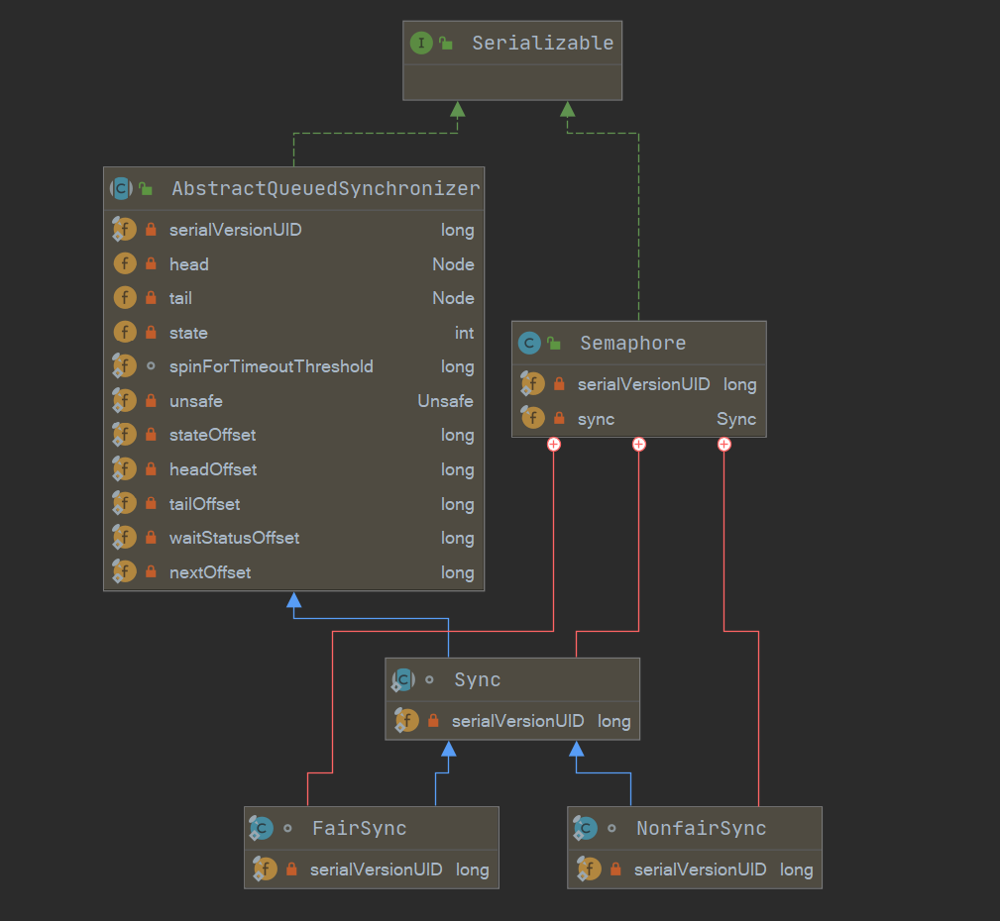

[toc]

## Semaphore概述及案例学习

Semaphore信号量用来**控制同时访问特定资源的线程数量**，它通过协调各个线程，以保证合理地使用公共资源。

```java
public class SemaphoreTest {

    private static final int THREAD_COUNT = 30;
    private static ExecutorService threadPool = Executors.newFixedThreadPool(THREAD_COUNT);

    private static Semaphore s = new Semaphore(10); //10个许可证数量,最大并发数为10

    public static void main(String[] args) {
        for(int i = 0; i < THREAD_COUNT; i ++){ //执行30个线程
            threadPool.execute(new Runnable() {
                @Override
                public void run() {
                    s.tryAcquire(); //尝试获取一个许可证
                    System.out.println("save data");
                    s.release(); //使用完之后归还许可证
                }
            });
        }
        threadPool.shutdown();
    }
}
```

- 创建一个大小为30的线程池，但是信号量规定在10，保证许可证数量为10。
- 每次线程调用`tryAcquire()`或者`acquire()`方法都会原子性的递减许可证的数量，release()会原子性递增许可证数量。

## 类图结构及重要字段



```java
public class Semaphore implements java.io.Serializable {
    private static final long serialVersionUID = -3222578661600680210L;
    /** All mechanics via AbstractQueuedSynchronizer subclass */
    private final Sync sync;
    
    abstract static class Sync extends AbstractQueuedSynchronizer {
        // permits指定初始化信号量个数
        Sync(int permits) {
            setState(permits);
        }
        // ...
    }
    
    static final class NonfairSync extends Sync {...}
    
    static final class FairSync extends Sync {...}
    
    // 默认采用非公平策略
    public Semaphore(int permits) {
        sync = new NonfairSync(permits);
    }
	
    // 可以指定公平策略
    public Semaphore(int permits, boolean fair) {
        sync = fair ? new FairSync(permits) : new NonfairSync(permits);
    }
    
    //...
}
```

- 基于AQS，类似于ReentrantLock，Sync继承自AQS，有公平策略和非公平策略两种实现。
- 类似于CountDownLatch，state在这里也是通过构造器指定，表示初始化信号量的个数。

> 本篇文章阅读需要建立在一定的AQS基础之上，这边推荐几篇前置文章，可以瞅一眼：
>
> - [Java并发包源码学习系列：AbstractQueuedSynchronizer](https://blog.csdn.net/Sky_QiaoBa_Sum/article/details/112254373)
> - [Java并发包源码学习系列：CLH同步队列及同步资源获取与释放](https://blog.csdn.net/Sky_QiaoBa_Sum/article/details/112301359)
> - [Java并发包源码学习系列：AQS共享式与独占式获取与释放资源的区别](https://blog.csdn.net/Sky_QiaoBa_Sum/article/details/112386838)
> - [Java并发包源码学习系列：详解Condition条件队列、signal和await](https://blog.csdn.net/Sky_QiaoBa_Sum/article/details/112727669)
> - [Java并发包源码学习系列：挂起与唤醒线程LockSupport工具类](https://blog.csdn.net/Sky_QiaoBa_Sum/article/details/112757098)

## void acquire()

调用该方法时，表示希望获取一个信号量资源，相当于`acquire(1)`。

如果当前信号量个数大于0，CAS将当前信号量值减1，成功后直接返回。

如果当前信号量个数等于0，则当前线程将被置入AQS的阻塞队列。

该方法是响应中断的，其他线程调用了该线程的`interrupt()`方法，将会抛出中断异常返回。

```java
    // Semaphore.java
	public void acquire() throws InterruptedException {
        // 传递的 arg 为 1 ， 获取1个信号量资源
        sync.acquireSharedInterruptibly(1);
    }
	// AQS.java
    public final void acquireSharedInterruptibly(int arg)
            throws InterruptedException {
        // 线程被 中断， 抛出中断异常
        if (Thread.interrupted())
            throw new InterruptedException();
        // 子类实现， 公平和非公平两种策略
        if (tryAcquireShared(arg) < 0)
            // 如果获取失败， 则置入阻塞队列， 
            // 再次进行尝试， 尝试失败则挂起当前线程
            doAcquireSharedInterruptibly(arg);
    }

```

### 非公平

```java
    static final class NonfairSync extends Sync {
        private static final long serialVersionUID = -2694183684443567898L;

        NonfairSync(int permits) {
            super(permits);
        }

        protected int tryAcquireShared(int acquires) {
            // 这里直接调用Sync定义的 非公平共享模式获取方法
            return nonfairTryAcquireShared(acquires);
        }
    }

    abstract static class Sync extends AbstractQueuedSynchronizer {
        
        final int nonfairTryAcquireShared(int acquires) {
            for (;;) {
                // 获取当前信号量的值
                int available = getState();
                // 减去需要获取的值， 得到剩余的信号量个数
                int remaining = available - acquires;
                // 不剩了，表示当前信号量个数不能满足需求， 返回负数， 线程置入AQS阻塞
                // 还有的剩， CAS设置当前信号量值为剩余值， 并返回剩余值
                if (remaining < 0 ||
                    compareAndSetState(available, remaining))
                    return remaining;
            }
        }
    }
```

你会发现，非公平策略是无法保证【AQS队列中阻塞的线程】和【当前线程】获取的顺序的，当前线程是有可能在排队的线程之前就拿到资源，产生插队现象。

公平策略就不一样了，它会通过`hasQueuedPredecessors()`方法看看队列中是否存在前驱节点，以保证公平性。

### 公平策略

```java
    static final class FairSync extends Sync {
        private static final long serialVersionUID = 2014338818796000944L;

        FairSync(int permits) {
            super(permits);
        }

        protected int tryAcquireShared(int acquires) {
            for (;;) {
                // 如果队列中在此之前已经有线程在排队了，直接放弃获取
                if (hasQueuedPredecessors())
                    return -1;
                int available = getState();
                int remaining = available - acquires;
                if (remaining < 0 ||
                    compareAndSetState(available, remaining))
                    return remaining;
            }
        }
    }
```

## void acquire(int permits)

在acquire()的基础上，指定了获取信号量的数量permits。

```java
    public void acquire(int permits) throws InterruptedException {
        if (permits < 0) throw new IllegalArgumentException();
        sync.acquireSharedInterruptibly(permits);
    }
```

## void acquireUninterruptibly()

该方法与`acquire()`类似，但是不响应中断。

```java
    public void acquireUninterruptibly() {
        sync.acquireShared(1);
    }
	
    public final void acquireShared(int arg) {
        if (tryAcquireShared(arg) < 0)
            doAcquireShared(arg);
    }
```

## void acquireUninterruptibly(int permits)

该方法与`acquire(permits)`类似，但是不响应中断。

```java
    public void acquireUninterruptibly(int permits) {
        if (permits < 0) throw new IllegalArgumentException();
        sync.acquireShared(permits);
    }
```

## boolean tryAcquire()

tryAcquire和acquire非公平策略公用一个逻辑，但是区别在于，如果获取信号量失败，或者CAS失败，将会直接返回false，而不会置入阻塞队列中。

> 一般try开头的方法的特点就是这样，尝试一下，成功是最好，失败也不至于被阻塞，而是立刻返回false。

```java
    public boolean tryAcquire() {
        return sync.nonfairTryAcquireShared(1) >= 0;
    }
    abstract static class Sync extends AbstractQueuedSynchronizer {
        final int nonfairTryAcquireShared(int acquires) {
            for (;;) {
                int available = getState();
                int remaining = available - acquires;
                if (remaining < 0 ||
                    compareAndSetState(available, remaining))
                    return remaining;
            }
        }
    }
```

## boolean tryAcquire(int permits)

相比于普通的`tryAcquire()`，指定了permits的值。

```java
    public boolean tryAcquire(int permits) {
        if (permits < 0) throw new IllegalArgumentException();
        return sync.nonfairTryAcquireShared(permits) >= 0;
    }
```

## boolean tryAcquire(int permits, long timeout, TimeUnit unit)

相比于`tryAcquire(int permits)`，增加了超时控制。

```java
    public boolean tryAcquire(int permits, long timeout, TimeUnit unit)
        throws InterruptedException {
        if (permits < 0) throw new IllegalArgumentException();
        return sync.tryAcquireSharedNanos(permits, unit.toNanos(timeout));
    }
```

## void release()

将信号量值加1，如果有线程因为调用acquire方法而被阻塞在AQS阻塞队列中，将根据公平策略选择一个信号量个数满足需求的线程唤醒，线程唤醒后也会尝试获取新增的信号量。

参考文章：[Java并发包源码学习系列：AQS共享模式获取与释放资源](https://blog.csdn.net/Sky_QiaoBa_Sum/article/details/112386838)

```java
    // Semaphore.java
	public void release() {
        sync.releaseShared(1);
    }
	// AQS.java
    public final boolean releaseShared(int arg) {
        // 尝试释放锁
        if (tryReleaseShared(arg)) {
            // 释放成功， 唤醒AQS队列里面最先挂起的线程
            // https://blog.csdn.net/Sky_QiaoBa_Sum/article/details/112386838
            doReleaseShared();
            return true;
        }
        return false;
    }
	// Semaphore#Sync.java
    abstract static class Sync extends AbstractQueuedSynchronizer {
        protected final boolean tryReleaseShared(int releases) {
            for (;;) {
                // 获取当前信号量
                int current = getState();
                // 期望加上releases
                int next = current + releases;
                if (next < current) // overflow
                    throw new Error("Maximum permit count exceeded");
                // CAS操作，更新
                if (compareAndSetState(current, next))
                    return true;
            }
        }
    }
```

## void release(int permits)

和`release()`相比指定了permits的值。

```java
    public void release(int permits) {
        if (permits < 0) throw new IllegalArgumentException();
        sync.releaseShared(permits);
    }
```

## 其他方法

Semaphore还提供其他一些方法，实现比较简单，这边就简单写一下吧：

```java
    // 返回此信号量中当前可用的许可证数量， 其实就是得到当前的 state值  getState()
	public int availablePermits() {
        return sync.getPermits();
    }

    // 将state更新为0， 返回0
    public int drainPermits() {
        return sync.drainPermits();
    }

	// 减少reduction个许可证
    protected void reducePermits(int reduction) {
        if (reduction < 0) throw new IllegalArgumentException();
        sync.reducePermits(reduction);
    }

    // 判断公平策略
    public boolean isFair() {
        return sync instanceof FairSync;
    }

	// 判断是否有线程证在等待获取许可证
    public final boolean hasQueuedThreads() {
        return sync.hasQueuedThreads();
    }

	// 返回正在等待获取许可证的线程数
    public final int getQueueLength() {
        return sync.getQueueLength();
    }

	// 返回所有等待获取许可证的线程集合
    protected Collection<Thread> getQueuedThreads() {
        return sync.getQueuedThreads();
    }
```

## 总结

Semaphore信号量用来控制同时访问特定资源的线程数量，它通过协调各个线程，以保证合理地使用公共资源。

- 基于AQS，类似于ReentrantLock，Sync继承自AQS，有公平策略和非公平策略两种实现。
- 类似于CountDownLatch，state在这里也是通过构造器指定，表示初始化信号量的个数。

每次线程调用`tryAcquire()`或者`acquire()`方法都会原子性的递减许可证的数量，release()会原子性递增许可证数量，只要有许可证就可以重复使用。

## 参考阅读

- 《Java并发编程之美》
- 《Java并发编程的艺术》